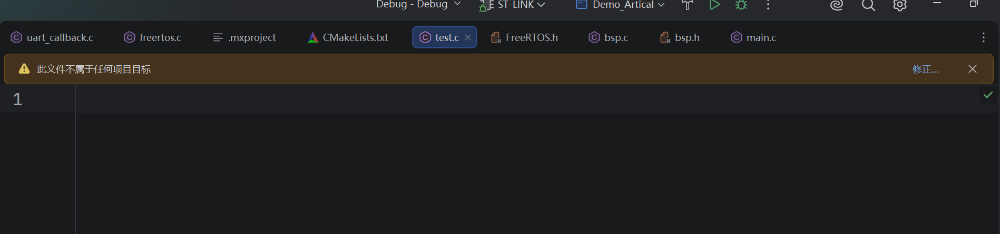
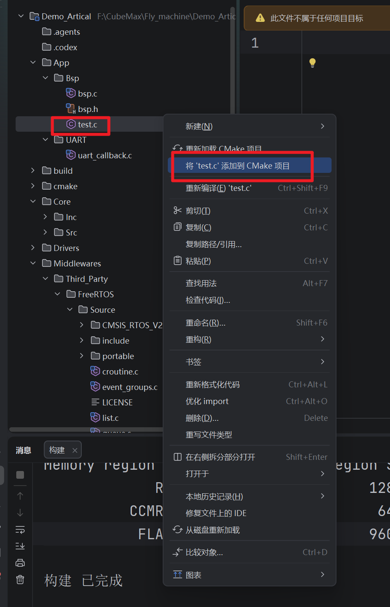
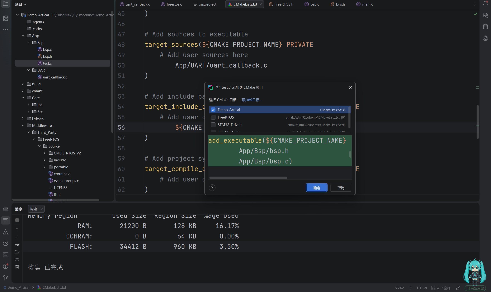

## 简介
在`CLion`的`STM32`项目中我们创建了新的源文件之后还需要添加该源文件的属性信息，`CLion`中添加源文件之后我们可以直接通过右键源文件的方式来将该文件添加到根目录下的`CMakeLists.txt`文件中，这样在一定程度上减少了我们的开发难度，之前在使用`Keil`开发时我们添加一个源文件时需要在软件中进行多步操作最终实现源文件添加操作。但是我们还是需要了解一下应该如何手动添加源文件搜索路径，因为这对于错误排查以及项目优化非常重要，接下来我会介绍如何在`CLion`中添加源文件搜索路径

## 实操

### 自动添加
我们在指定的文件夹中右键创建一个新的源文件之后我们打开它程序中会显示此文件不属于任何项目

这就意味着我们需要添加文件到项目的搜索路径中去
我们右键该文件然后在弹出的弹窗中选择红色方框内的添加选项即可

在点击之后就会弹出对应的添加语句，一般情况下会mo'ren

### 手动添加
