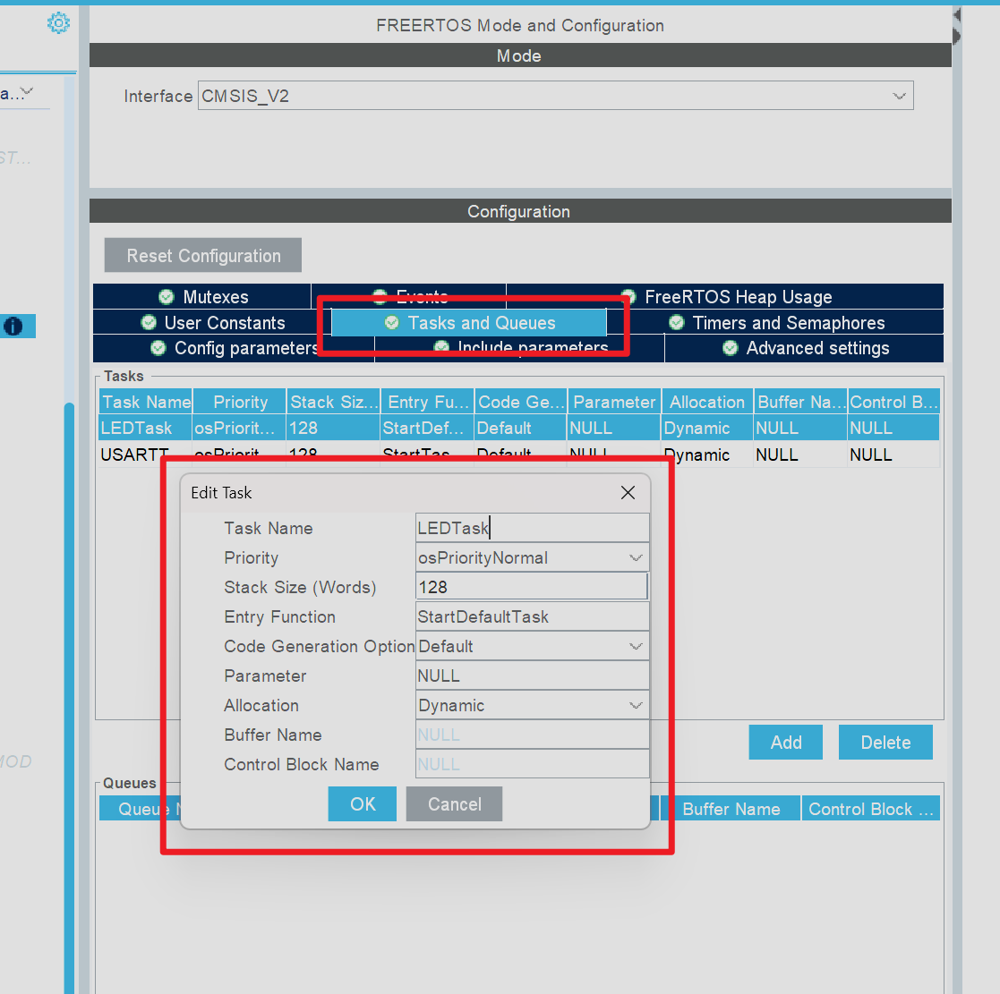
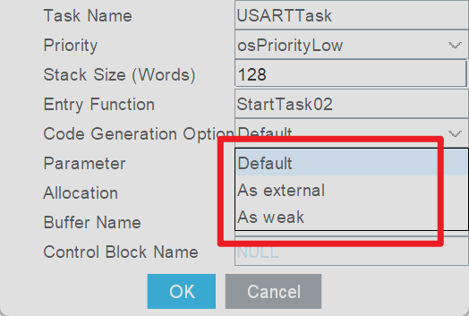
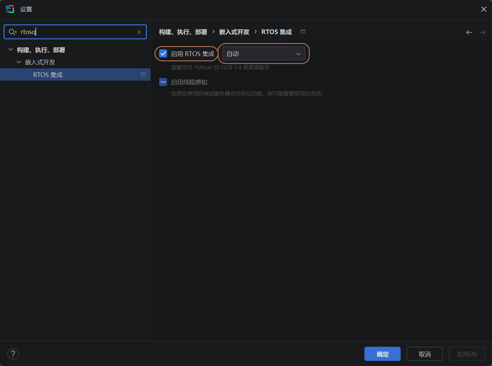
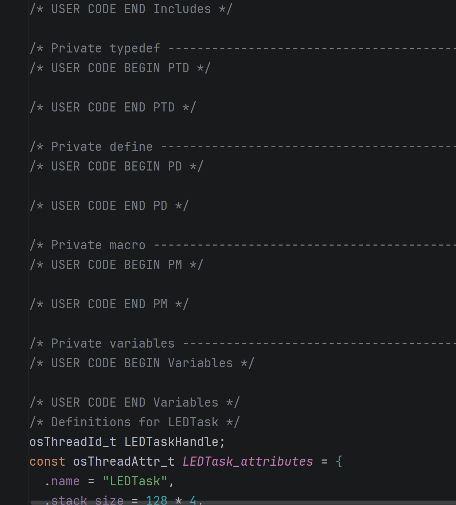
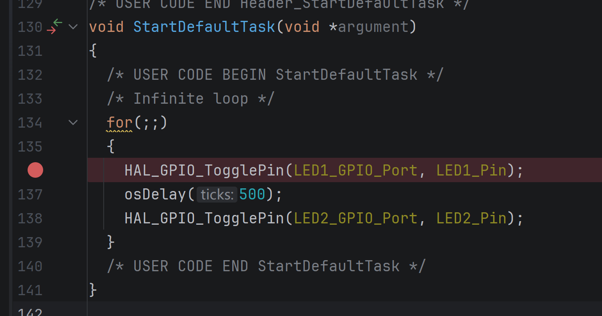
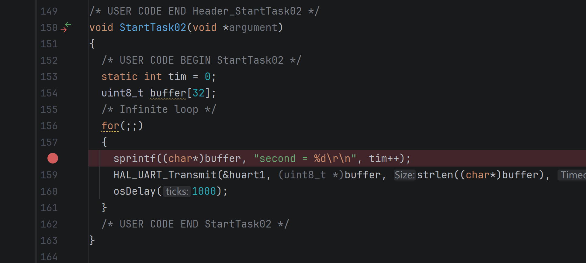
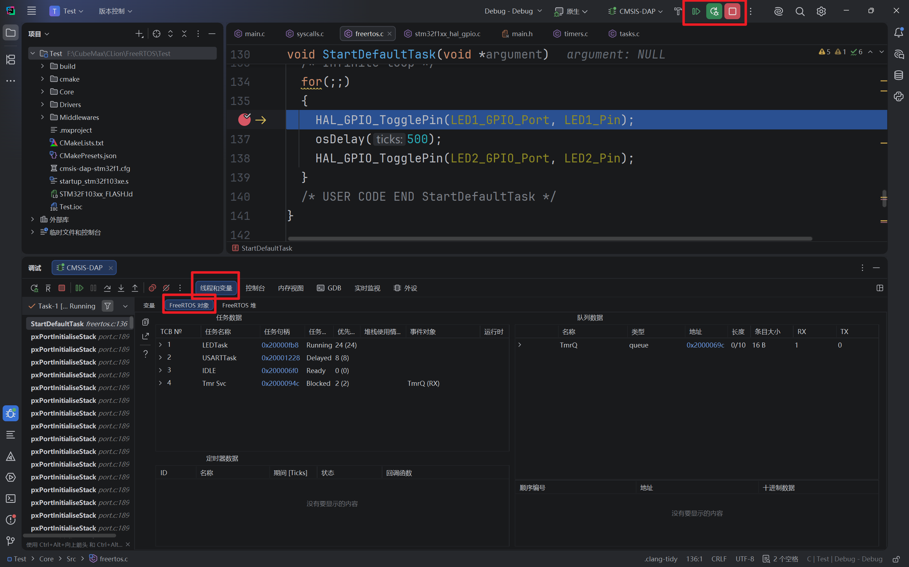
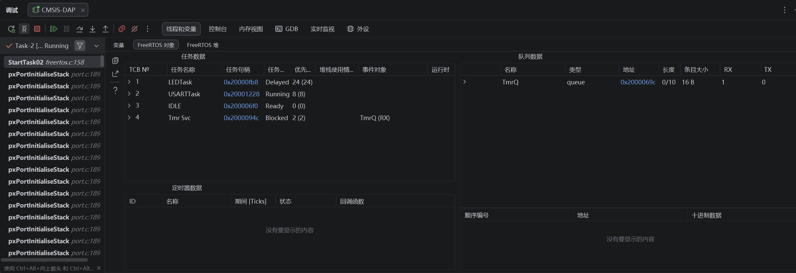

## 简介
上期内容我们讲解了如何配置`CLion`并成功的配置了第一个`Demo`工程，接下来我们就要学会如何去运用`CLion`，尽可能地发挥出它的优势，在接下来的内容中我会展示如何借助`CLion`的调试功能来查看不同任务的执行状态以及资源占用情况，最大限度的发挥`CLion`的优势

## 实操
### 任务参数解析
我们以上次教程中创建的程序为基础，我们这次尝试在`CLion`中使用对应的调试工具来查看不同任务之间的运行状态和系统资源占用情况，在`FREERTOS`配置界面中我们可以创建新任务，也可以双击任务来查看任务的属性

如扇入所示，一个任务有若干选项，它们的作用如下：

- **Task Name (任务名称)**

    - **作用**：为任务分配一个字符串名称。这主要用于调试阶段，FreeRTOS 内核本身不依赖此名称进行调度
    
- **Priority (优先级)**：

    - **作用**：决定该任务在操作系统中的执行优先级。FreeRTOS 是抢占式调度，优先级高的任务会抢占优先级低的任务优先执行
        
- **Stack Size (Words) (堆栈大小 - 字)**：
    
    - **作用**：分配给该任务专属的独立栈空间大小。单位是“字”（Words）。在 32 位微控制器（如 STM32 的 ARM Cortex-M 内核）中，1 个字等于 4 个字节。因此 128 字意味着分配了 512 字节的栈空间。这些空间用于存放任务运行时的局部变量、函数调用上下文和中断返回地址等
        
- **Entry Function (入口函数)**：
    
    - **作用**：指定任务启动时执行的 C 语言函数名称。系统创建该任务后，就会跳转到 `StartTask02` 这个函数中开始执行任务的实际代码（通常是一个包含 `for(;;)` 的死循环）。
        
- **Code Generation Option (代码生成选项)**：
	
	
    - **作用**：控制代码生成工具（如 CubeMX）如何生成该任务的代码骨架。`Default`选项代表改任务的任务函数会直接在`FreeRTOS.c`文档中生成， `As weak`代表着任务函数同样会自动生成在`FreeRTOS.c`中，但是函数前面会有`__weak`选项，熟悉`HAL`库裸机开发的同学对这个关键字肯定不陌生，这意味着该函数可以在其它地方被重写，重写的函数内容会直接覆盖原函数的内容。`As external`选项代表着会将任务函数在其它文件中生成
    
- **Parameter (传递参数)**：
    
    - **作用**：在任务创建时，传递给入口函数的初始参数指针（通常对应 `void *argument`）
    
- **Allocation (内存分配方式)**：`Dynamic`
    
    - **作用**：选择任务控制块和任务堆栈内存的分配方式。`Dynamic` 表示动态分配，即在系统运行时从 FreeRTOS 的堆（Heap）空间中通过 `pvPortMalloc` 自动分配内存。
        
- **Buffer Name & Control Block Name (缓冲区名称与控制块名称)**
    
    - **作用**：这两个选项仅在 **Allocation** 设置为静态时才会激活。静态分配需要用户预先定义好全局数组作为堆栈缓冲区，并定义一个静态的任务控制块变量。由于当前选择了动态分配，系统会自动处理，因此无需填写

我们在本次任务创建时只需要保持默认参数即可，任务创建完成之后点击生成代码即可

### 开启调试选项
项目代码生成之后我们回到`CLion`，然后打开软件设置，在搜索栏中输入`RTOS`，然后就可以看到对应的`RTOS`集成选项

我们点击启动`RTOS`集成，后面可以选择自动或者`FreeRTOS`，选择结束之后我们就可以开始程序的调试了

### 代码介绍
我们在进行调试之前可以先简单看一眼生成的`freertos.c`文件中的内容，我们打开之后发现该文件的排版和`main.c`很像，其中有很多注释，注释内容就是在提醒我们应该如何编写代码，和在`main.c`中一样，如果我们不按照规则去编写代码，那么重新生成代码之后那些不符合规则的代码就会消失

本次不会过多介绍代码部分的内容，我们主要是去使用它的任务调试功能，接下来我们来看一下`FreeRTOS`中的任务函数，我们可以根据之前在`CubeMX`中的配置的任务名称来找对应的任务函数，下图中展示的就是默认任务的任务函数代码，我们现在该函数中不停的翻转`LED`灯的状态

我们在该函数中打了一个断点，然后我们切换到串口发送任务中

在该函数中我们进行了串口发送的操作，我们同样在其中打了一个断点，然后我们可以直接点击右上角的绿色`debug`，然后程序就会开始进行调试，会先运行到第一个断点然后停下来

现在我们可以按照图中的红色方框依次点击按键，最终即可在下面的监控界面中看到当前任务的运行状态和资源占用情况，根据图中的显示的信息我们发现程序中的`LEDTask`任务处于运行态，串口发送任务`USARTTask`处于挂起态空闲任务`IDLE`处于就绪态等待时间片分配
接下来我们按下键盘上的`F9`按键，让程序一直运行到下一个断点

此时我们可以发现当运行到串口发送任务中的断点时，`LEDTask`处于挂起态，而`USARTTask`处于运行态，剩下的两个任务仍旧保持上一个状态