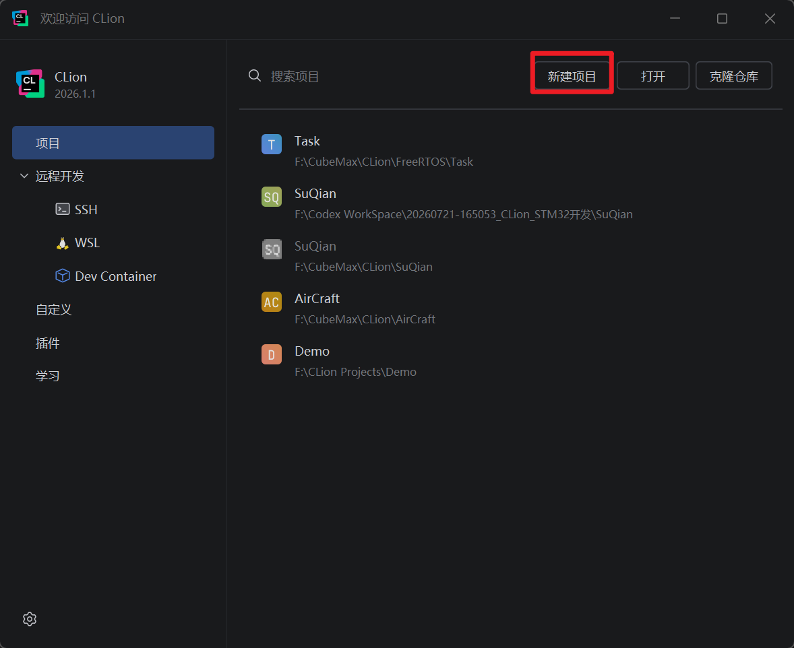
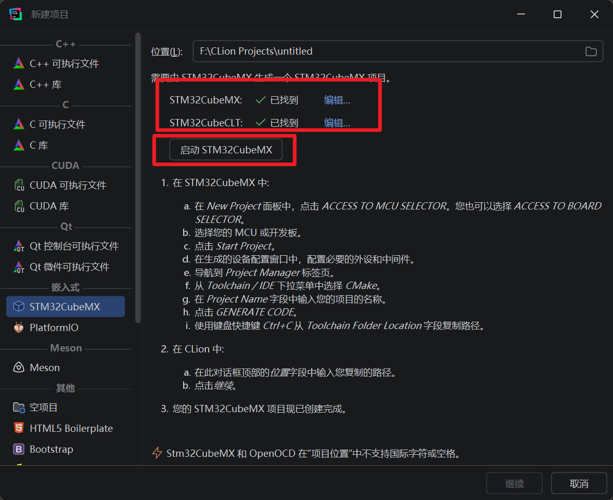
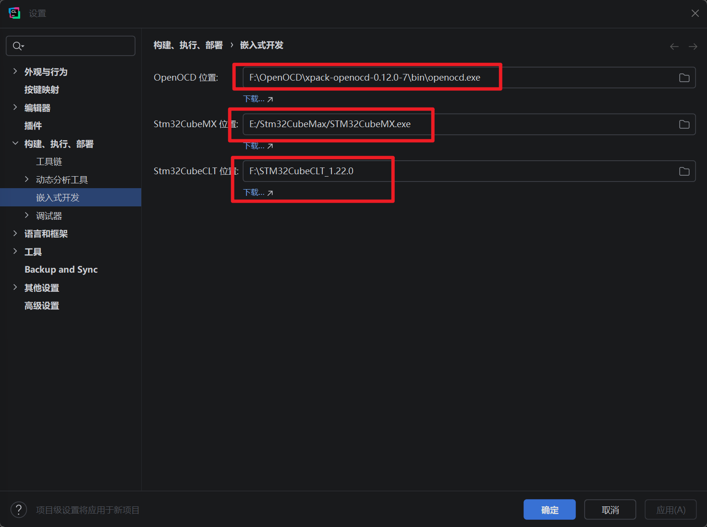

## 简介
在之前的嵌入式开发中我们使用的开发工具都是`Keil`+`Vscode`，这一套组合的优势是`Keil`提供底层的编译环境，然后再利用`Vscode`的`UI`界面，来提高编写代码时的效率。但是这套方式也有着一定的缺陷，例如使用`Vscode`进行程序编译时编译速度会比较慢，而且编译的结果不是很直观，例如我们无法直观的看到系统资源的占用情况，例如`RAM`占用和`FLASH`占用，这对于裸机开发影响不大，因为裸机开发占用的资源相对较少，一般不会出现溢出的现象。但是在`FreeRTOS`中我们设计到多任务的并发处理，且每一个任务都有自己专属的任务栈，且不同的任务需要处理的数据量也不同，极有可能出现栈溢出的情况。且多任务切换时我们也需要在调试时了解到每一个任务之间的切换状态，因此我们需要一个更加现代化的`IDE`，所以在这里我们使用`CLion`进行程序的开发

## 配置流程
我们打开`CLion`然后点击新建项目
然后在新建项目中选择`STM32CubeMX`

在界面中我们关注红色方框内的内容，如果是首次配置那么极有可能显示没有找到或者是红色方框报错，我们可以点击旁边的编辑，然后就可以在新界面中看到更详细的配置信息

之前的教程中我们使用的是`STlink`进行程序的烧录下载调试，但是在实际的程序编写时我们可能会使用其它的调试器，这次我们使用`CMSIS-DAP Link`进行程序的下载与调试，刚好再熟悉一下`CLion`的配置流程，
