## 简介
在之前的嵌入式开发中我们使用的开发工具都是`Keil`+`Vscode`，这一套组合的优势是`Keil`提供底层的编译环境，然后再利用`Vscode`的`UI`界面，来提高编写代码时的效率。但是这套方式也有着一定的缺陷，例如使用`Vscode`进行程序编译时编译速度会比较慢，而且编译的结果不是很直观，例如我们无法直观的看到系统资源的占用情况，例如`RAM`占用和`FLASH`占用，这对于裸机开发影响不大，因为裸机开发占用的资源相对较少，一般不会出现溢出的现象。但是在`FreeRTOS`中我们设计到多任务的并发处理，且每一个任务都有自己专属的任务栈，且不同的任务需要处理的数据量也不同，极有可能出现栈溢出的情况。且多任务切换时我们也需要在调试时了解到每一个任务之间的切换状态，因此我们需要一个更加现代化的`IDE`，所以在这里我们使用`CLion`进行程序的开发

## 配置流程
我们打开`CLion`然后点击新建项目
然后在新建项目中选择`STM32CubeMX`

在界面中我们关注红色方框内的内容，如果是首次配置那么极有可能显示没有找到或者是红色方框报错，我们可以点击旁边的编辑，然后就可以在新界面中看到更详细的配置信息

之前的教程中我们使用的是`STlink`进行程序的烧录下载调试，但是在实际的程序编写时我们可能会使用其它的调试器，这次我们使用`CMSIS-DAP Link`进行程序的下载与调试，刚好再熟悉一下`CLion`的配置流程，在上面的配置界面中我们需要配置`STM32CubeMX`、`OpenOCD`以及`STM32CubeCLT`。这次我们来介绍一下这三者的作用作用。

### `STM32CubeMX`
由于学习`FreeRTOS`的同学应该都进行过`SMT32`的裸机开发，因此对这款软件应该都不陌生，这款软件主要是用于HAL库程序的初始化，我们常常用它来进行程序的初始化配置，这个软件的存在极大的降低了`FreeRTOS`的移植难度，我们可以仅通过几个按键就实现`FreeRTOS`的配置，由于大多数人都用过这款软件，所以这里不做过多解释，在后面的实操步骤中会进行演示

### `STM32CubeCLT`
**STM32CubeCLT (Command Line Toolset)** 是 ST 官方专为第三方 IDE（如 CLion、VS Code）推出的命令行工具合集。它是我们`CLion`开发环境的引擎

#### 作用
把高级计算机语言翻译成单片机指令，我们使用的个人PC是`X86`架构的，但是`STM32`使用的是`ARM`架构的，电脑自带的编译器无法生成可以在`STM32`上运行的程序，`STM32CubeCLT` 内置了 **GNU Arm Embedded Toolchain**（即 `arm-none-eabi-gcc` 编译器），它负责将我们写的 `C/C++`代码编译成 STM32 能识别的 `.elf` 或 `.bin` 二进制文件。

**附加功能：** 它还包含了 `ST-LINK GDB Server`（官方调试服务）和 `STM32CubeProgrammer`（官方烧录工具）。在最新的 CLion 版本中，只需配置这一个 CLT 路径，CLion 就能自动识别出`ST-Link`调试器，并进行下载调试等一系列操作。

### `OpenOCD`
**OpenOCD (Open On-Chip Debugger)** 是一个开源的片上调试软件。它是电脑软件与硬件芯片之间的“桥梁”，也是本次教程中着重需要介绍的，它的存在极大的提高了`CLion`开发单片机的兼容性

#### 作用
其核心作用是烧录程序与硬件调试，`CLion`作为一个纯软件，本身是无法通过`USB`线去控制具体的硬件，当我们将仿真器（如`ST-Link`、`J-Link`、`DAP-Link`）插在电脑上并连接单片机时，`OpenOCD`会与`CLion`的内部调试器对接，它允许我们在代码中进行断点单步执行以及实时查看变量值等操作。
当我们点击运行按键时，`OpenOCD`负责把编译器生成的二进制文件通过仿真器刷写到`STM32`的`Flash`闪存中

其实在`STM32CubeCLT`中也自带了意法半导体官方的调试器，上一次介绍`CLion`的使用操作时我们就是直接使用它的。但是由于我们本次使用的调试器是非官方的`DAP-Link`，且`OpenOCD`是开源的，因此我们在本次的项目配置中需要使用到它

### 工作流程
介绍完了上面三者，我们可以总结一下`CLion`单片机开发的流程
1. 初始化项目：通过使用`STM32CubeMX`软件进行工程的初始化和代码生成
2. 编写代码：在`CLion`中打开工程文件夹并编写业务逻辑代码
3. 程序编译：点击程序中的`Build`按钮，`CLion`会调用`STM32CubeCLT`中的`ARM`交叉编译器，将代码编译成二进制固件
4. 烧录调试：点击`Run/Deubg`按钮，`CLion`通过`OpenOCD`将固件通过烧录器下载到单片机中，并开启调试

## 实操
介绍完了相关的理论知识，接下来就让我们来从0创建一个`FreeRTOS`项目来练练手

### 前置配置
首先我们需要将基础的三剑客配置一下，然后才能进行后续的开发

#### `STM32CubeMX`配置
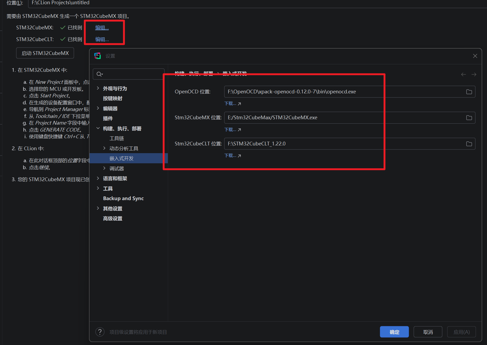
我们在`CLion`的项目创建界面中我们需要找到红色方框中三者的对应安装路径，大家应该都安装过`CubeMX`了，所以我们可以先配置`CubeMX`的可执行文件路径，不过这里不配置也可以，因为这里配置`CubeMX`路径的作用只是方便我们直接从`CLion`中启动它，我们也可以直接手动打开`CubeMX`进行项目配置，然后再用`CLion`打开该项目

#### `Stm32CubeCLT`配置
`Stm32CubeCLT`大多数人可能并没有下载过，不过不用担心，下载方式也非常简单，我们可以直接点击对应选项下面的蓝色下载字体，然后就可以直接跳转到对应的下载界面了，我们在这里点击了蓝色字体后会直接跳转到意法半导体官方的下载界面中
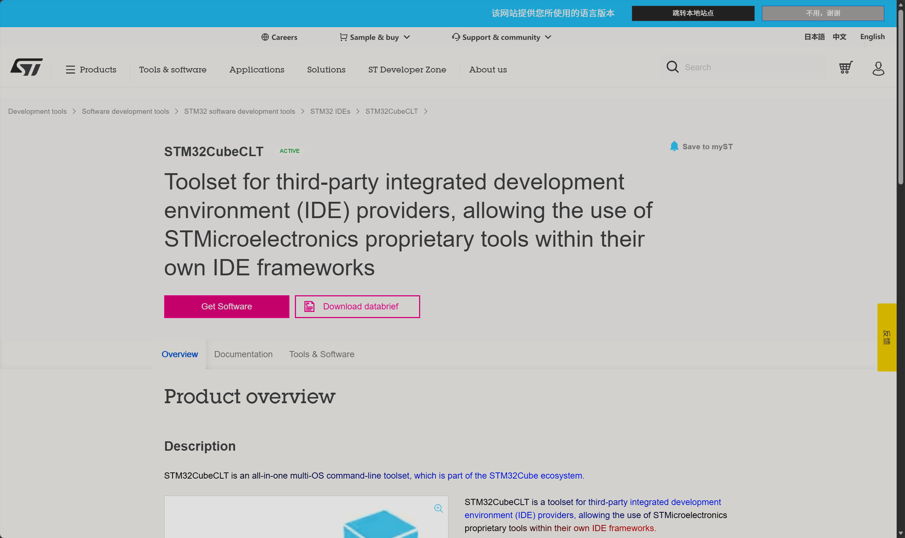
我们下拉就可以看到适配不同操作系统的不同版本的安装包，大家可以根据自身情况进行选择
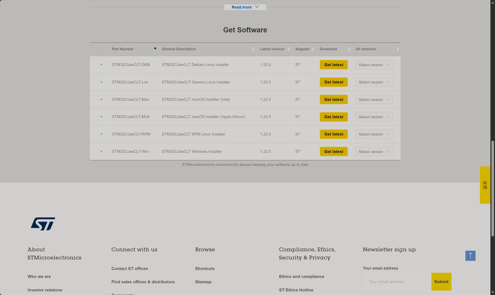
下面演示一下`WIndows`系统下的安装流程，点击对应的版本，然后即可获得一个`.zip`安装包，我们右键解压之后双击即可进行安装
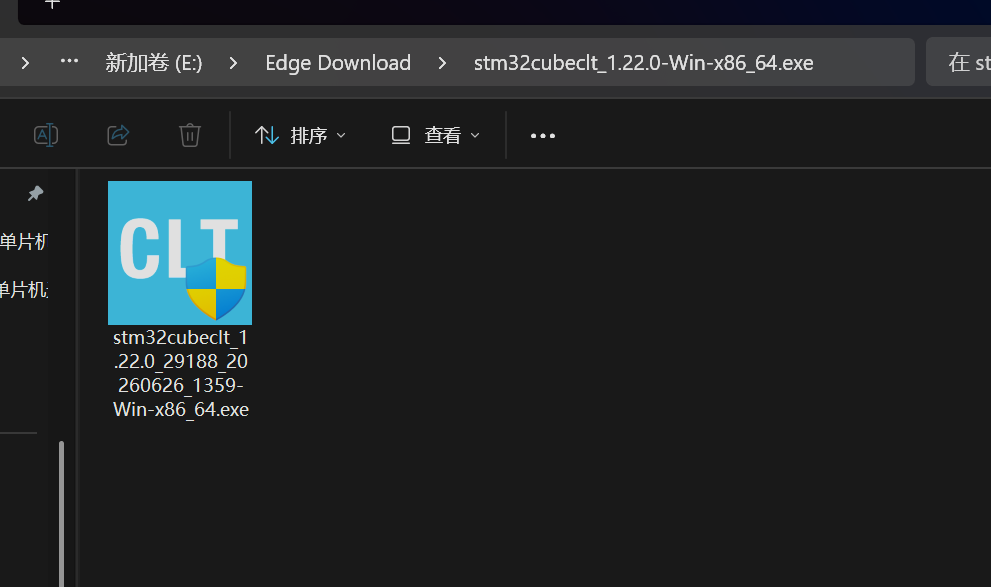
后续的安装过程较为简单，这里就不做过多赘述，不过有一点需要注意的是，你需要记住安装的路径，因为接下来我们需要进行路径的配置
安装完成之后我们将安装的路径导入到`CLion`中即可
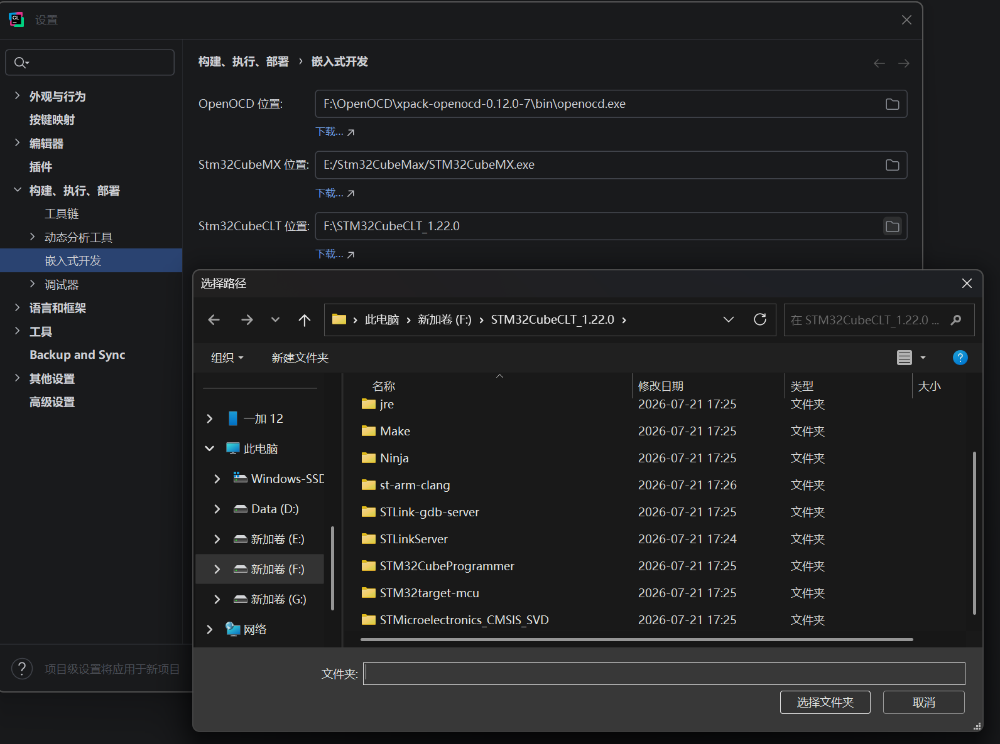

#### `OpenOCD`配置
前面两个配置好之后我们就应该下载并配置`OpenOCD`了，但是当我们点击了蓝色的下载字体后我们跳转到的却不是下载界面
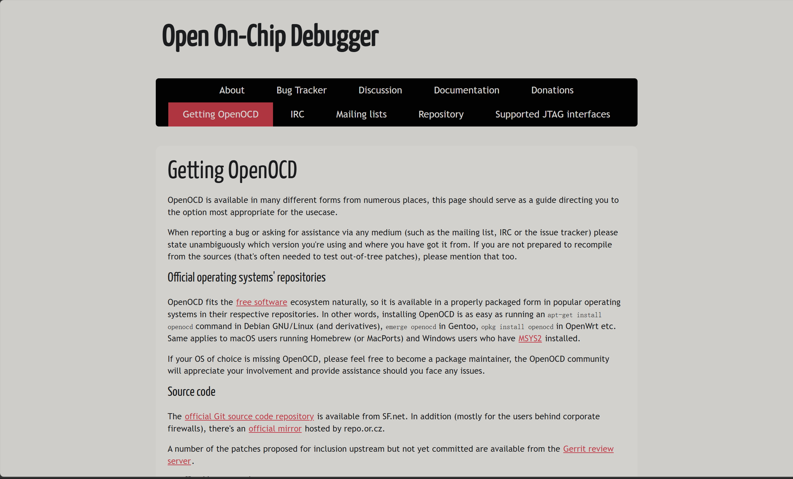
我在当前界面找了一下，并没有找到对应的下载链接，后来我是在`GitHub`里找到了对应的项目，然后下载了对应的安装包，该项目的地址为：
`https://github.com/xpack-dev-tools/openocd-xpack/releases/`
打开该链接可以直接跳转到对应的下载界面
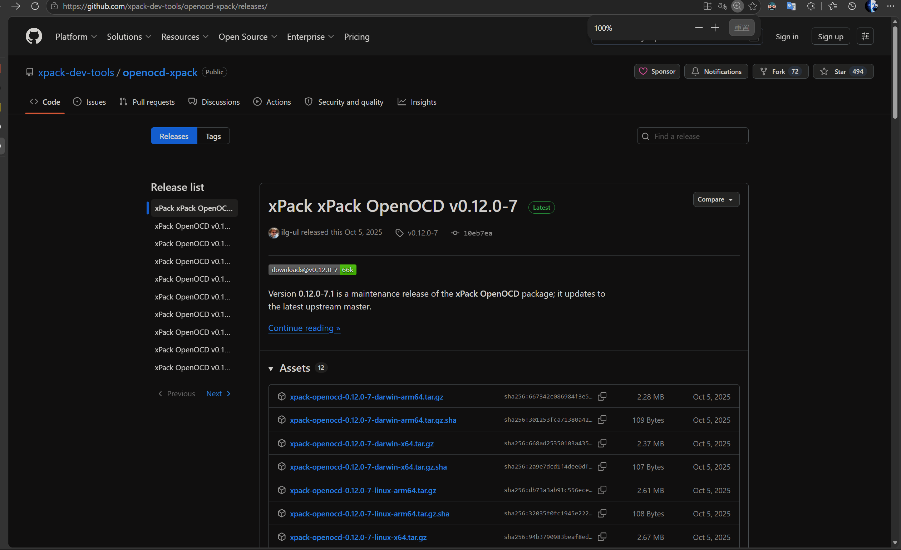
我们可以直接在该界面中下载对应的软件版本，下载之后是一个压缩包，我们可以将其放入指定文件夹中，然后在`CLIon`中选择对应的可执行文件路径即可。
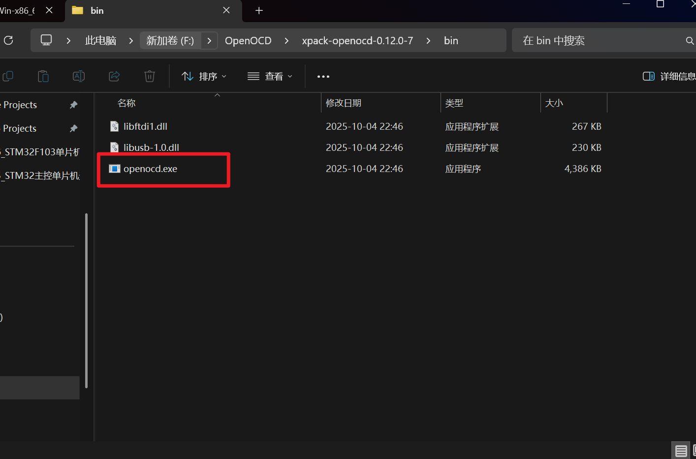

### 基础项目创建
前置配置完成之后我们就可以在`CLion`中点击启动`STM32CUbeMX`然后我们就可以打开`CubeMX`
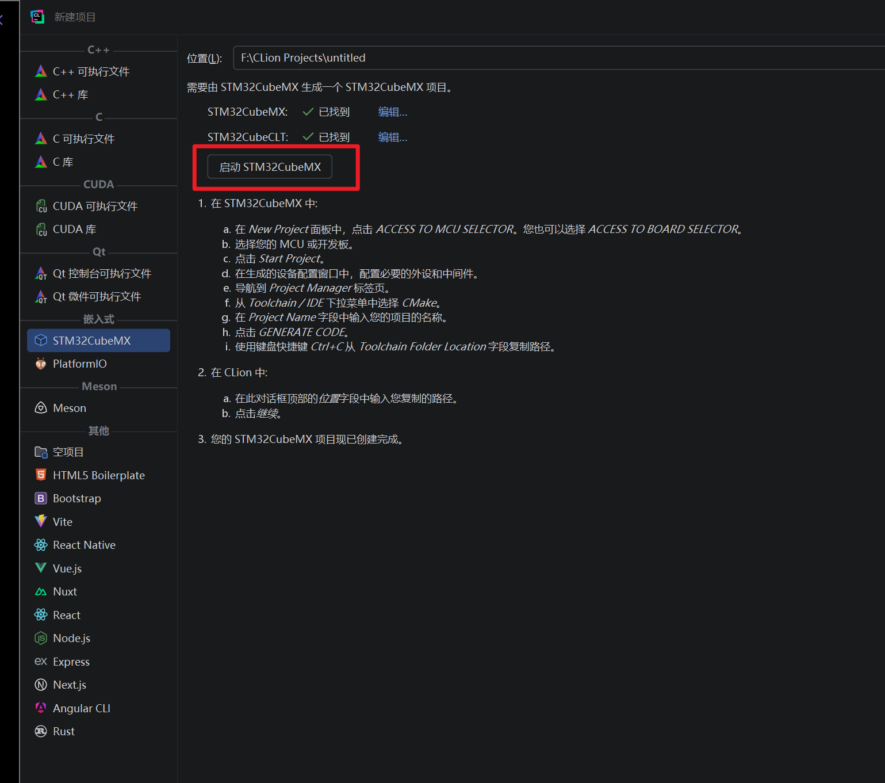

项目配置的一些基础操作我们不做过多赘述，接下我们只会介绍`CubeMX`中与`FreeRTOS`相关的内容
#### 系统时钟配置
之前在使用`HAL`库裸机开发中我们通常使用`SysTick`（系统滴答定时器）作为我们的系统时基，当我们执行一些延时操作时系统就会依据这个定时器来进行时间计算。但是在`FreeRTOS`中，在进行任务调度、时间片轮转的时候同样需要一个定时器来作为系统心跳，因为`SysTick`是`ARM Cortex-M`内核标配的定时器，`FreeRTOS`为了保证可移植性，默认会强制征用`SysTick`作为自己的系统心跳。
如果我们还使用默认的`Systick`那么就会出现冲突，因此我们在配置`SYS`的时候可以使用芯片自带的其它定时器来提供时间基准，这里我使用的芯片是`STM32F103RCT6`，我选择使用`TIM7`作为系统时钟
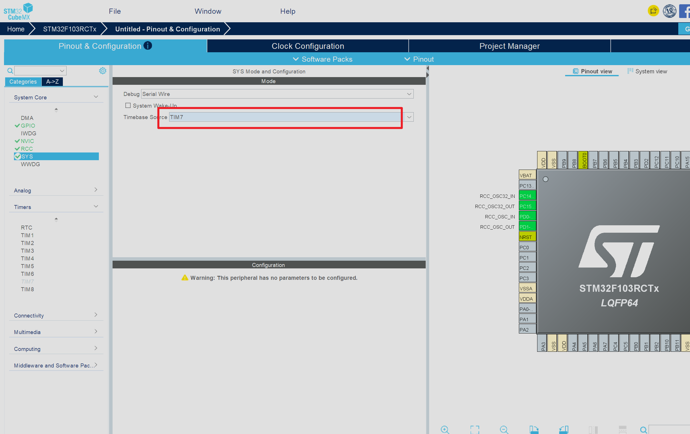
随后我们点开左侧的`Middleware and Software`中点击`FREERTOS`，然后选择`CMSIS_V2`，这样我们就成功开启了`FreeRTOS`。
随后在项目配置界面中选择`IDE`为`CMake`
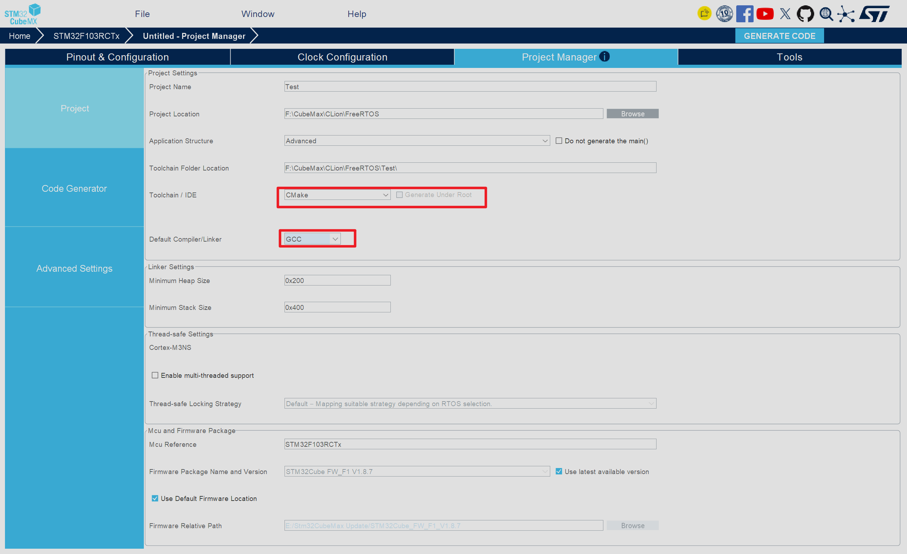
然后在`Code Genarator`中勾选红色方框内选项
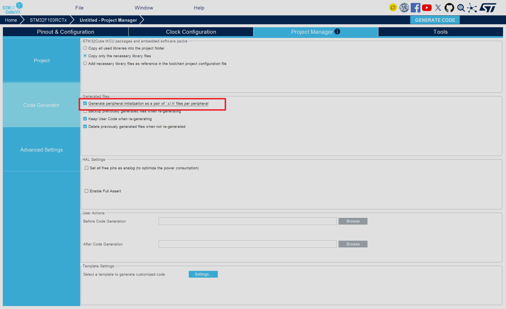

点击生成代码之后会弹出弹窗，我们选择`Open Folder`
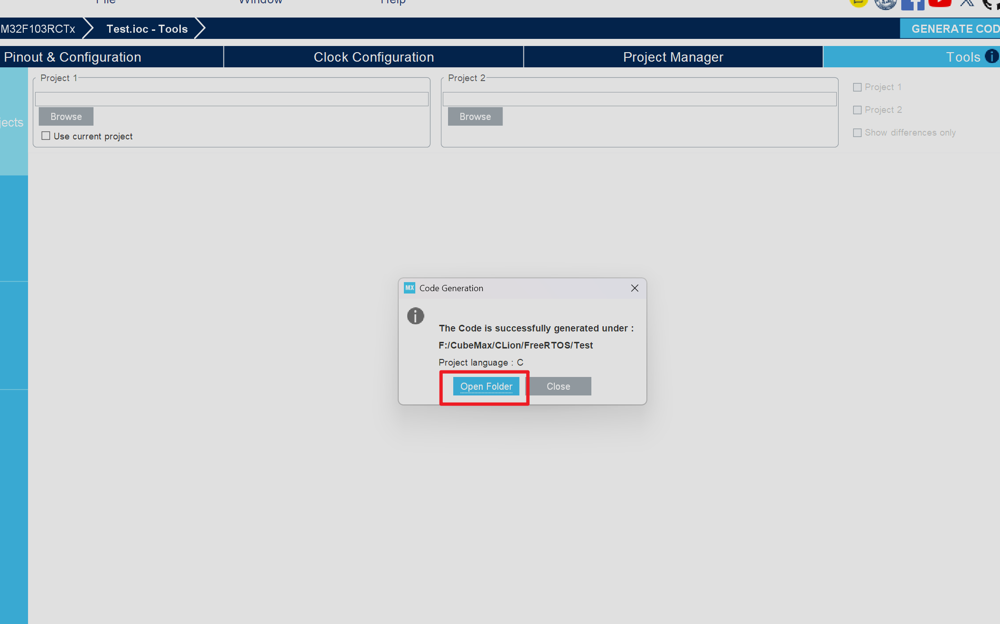
然后我们再回到`CLion`中选择项目路径
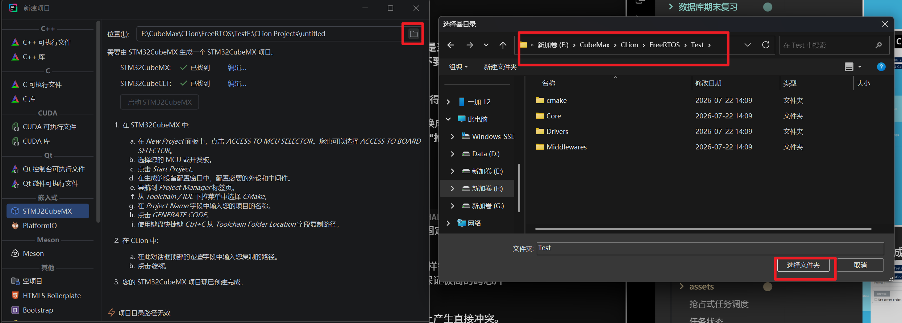
选择成功之后点击继续，然后就会弹出项目的配置界面
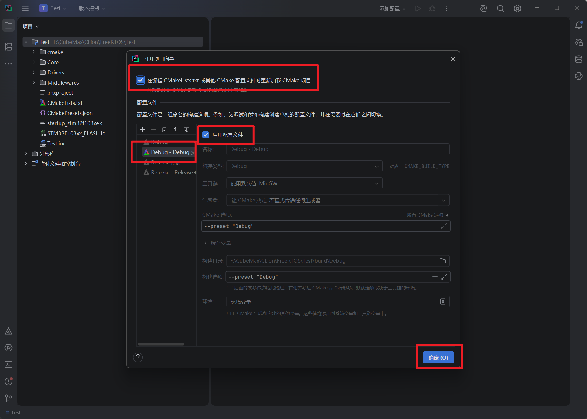
我们保持和图中一样的配置即可点击确定进入下一步的操作，进入到软件中我们可以点击顶部的锤子标识，这是编译选项，点击编译后我们可以看到编译信息和系统资源占用情况
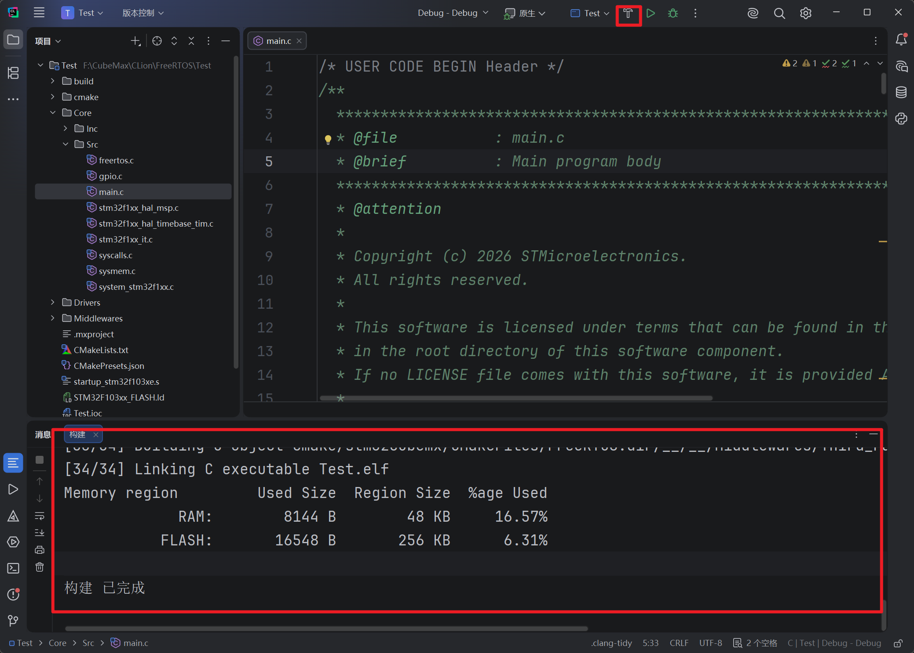

#### 烧录配置
基础配置完成之后如果我们点击顶部绿色的运行按键，那么此时大概率会出现报错，除非你使用的是意法半导体官方提供的`ST-Link`，我这里使用的是`DAP-Link`，所以就触发了报错，此时我们需要再进行烧录的配置
我们先点击顶部的蓝色中断图标，上面对应的是我们的项目名，然后再点击编辑配置
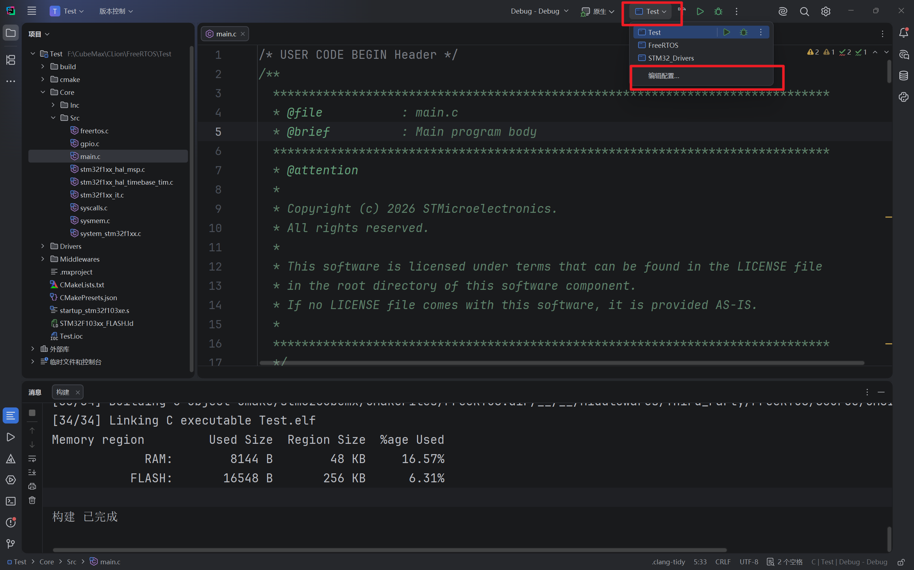
然后我们再点击