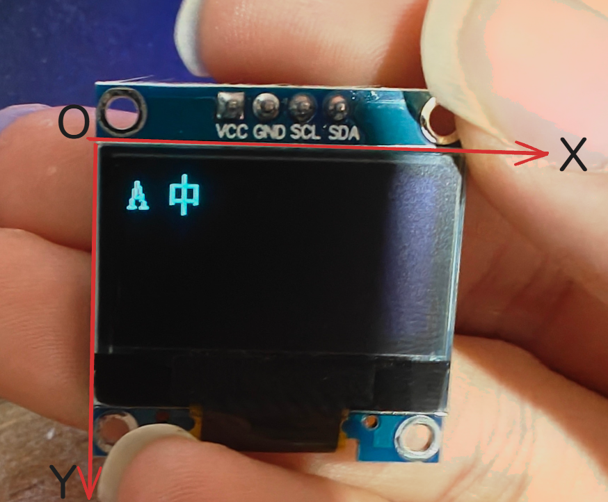
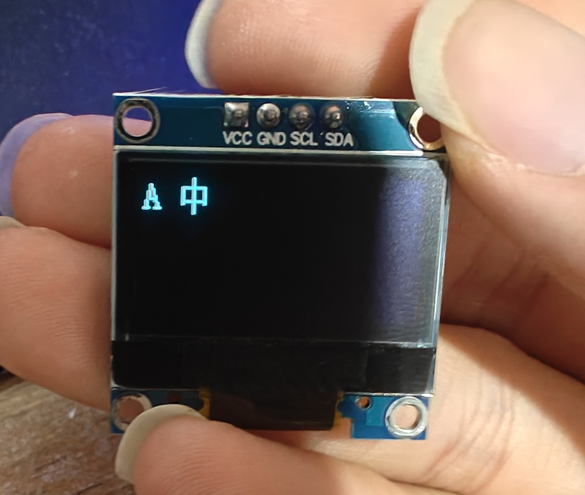

## 简介
本文主要介绍一下如何在`OLED`显示模块上显示中文字符，本次所使用到的开发环境是`CLion`，本次演示使用的硬件为`0.96`寸的`OLED`显示模块，分辨率为`128*64`，这也是使用率较高的一款，其他的硬件配置如主控`MCU`大家可以自行选择，本次教程中使用的`MCU`为`STM32F103C8T6`

## 显示英文字符
### 驱动文件介绍
在显示中文字符之前我们先尝试让`OLED`显示屏显示英文字符，确保显示屏没有问题，我们想要让`OLED`模块显示字符首先需要获取对应的驱动文件，对于我们当前使用的这款显示模块来说，网上有很多的开源资料，其中就包括它的驱动文件，如果你没有的话可以直接向购买的厂商索要，这里我也给大家提供了以下我使用的`OLED`驱动文件，对应的百度网盘下载链接如下：

通过网盘分享的文件：0.96寸OLED显示模块驱动文件
链接: https://pan.baidu.com/s/1yrVWMKvR9KwIDkMgVED6uQ 提取码: 1234 
--来自百度网盘超级会员v5的分享`

一般情况下驱动文件中会包含一个`.c`源文件一个对应的头文件以及一个字符编码文件，其中`.c`源文件中存放的是操作`OLED`显示模块时会使用到的库函数，字符编码文件中保存了常见的英文字符编码信息，有了这几个文件我们就可以在`OLED`屏幕上显示英文字符了，我提供的驱动文件中`ascii_font.c`和`ascii_font.h`文件是对应的字符编码文件，`driver_oled.c`和`driver_oled.h`是驱动文件，`chinese_font.c`和`chinese_font.h`是中文字符编码文件

### 驱动文件添加
拿到了这几个驱动文件之后接下来我们就要把这几个驱动文件添加到项目中去，我们可以在程序的根目录下创建一个`HardWare`文件夹，然后在该文件夹下再创建名为`OLED`的文件夹，我们再将上面提到的几个文件放入该文件夹中即可，操作完成后项目的层级如下：

当前的文件添加完毕之后我们就可以在`mian.c`的`main`函数中的`/* USER CODE BEGIN 2 */和/* USER CODE END 2 */之间添加如下代码
```c
OLED_Init();  
OLED_Clear();  
  
OLED_PutChar(0,0, 'A');
```
烧录程序之后可以看到对应的显示数据


## 显示中文字符
### 获取字模
当我们成功的在`OLED`显示模块上显示了英文字符之后我们接下来就可以尝试在其上显示一些中文字符了，首先我们需要认识到的一个事情是`OLED`本身并不认识中文和英文，它只认识像素数据，如果想要显示中文，那么必须要提前准备对应汉字的点阵字模。汉字的字模获取并不困难，我们可以通过取模软件来获取，网上有很多取模软件，大家可以自行搜索并下载，本次使用的取模软件为`PCtoLCD2002`，对应的下载链接如下：
通过网盘分享的文件：PCtoLCD2002
链接: https://pan.baidu.com/s/1-w60MaZ5gA32xmBjjkoTCQ 提取码: 1234 
--来自百度网盘超级会员v5的分享
默认的软件配置可能不是很符合我们的要求，因此我们需要结合实际情况来进行一些参数的调整

我们可以点击顶部的选项，然后就会弹出对应的配置窗口了
该软件的配置如下：

保持如图所示的配置之后我们就可以获取到对应的字模数据了
我们直接复制下面的一大串字符数据，然后回到`chinese_font.c`文件中创建一个新的字符数组，字符数组的内容如下：
```c
const uint8_t font_zhong[32] = {  
  
    0x00,0x00,0xF0,0x10,  
    0x10,0x10,0x10,0xFF,  
    0x10,0x10,0x10,0x10,  
    0xF0,0x00,0x00,0x00,  
  
    0x00,0x00,0x0F,0x04,  
    0x04,0x04,0x04,0xFF,  
    0x04,0x04,0x04,0x04,  
    0x0F,0x00,0x00,0x00,/*"中",0*/  
};
```
为了看起来更美观我们将每四个数据为一组进行摆放，数组中的每一个字符组合在一起，最终才组成了一个字符的显示内容，我们粘贴过来的时候会引发报错，因为粘贴过来的字符中有大括号，所以我们需要删除中间的大括号，最后剩下的才是我们需要的内容，随后我们还需要在头文件中为这个新数组添加声明，声明语句为：`extern const uint8_t font_zhong[32];`

### 编写输出函数
当我们获取并配置好了字符编码的相关内容之后我们还需要编写对应的中文显示函数，中文显示函数的内容如下：
```c
void OLED_PutChinese16(uint8_t x, uint8_t y, const uint8_t font[32])  
{  
    uint8_t col;  
    uint8_t page;  
  
    if (y > 7 || y > 3 || font == 0)  
    {  
        return;  
    }  
  
    col = x * 16;  
    page = y * 2;  
  
    OLED_SetPosition(page, col);  
    OLED_WriteNBytes((uint8_t*)&font[0], 16);  
  
    OLED_SetPosition(page + 1, col);  
    OLED_WriteNBytes((uint8_t*)&font[16], 16);  
}
```
该函数同属于`OLED`操作函数，因此我将它放在`driver_oled.c`文件中实现，为了能够输出一个完整的中文字符我们选择将其分为上下两部分来进行输出，每次先输出汉字的上半部分，然后再输出下半部分。其中一个汉字占用的像素点为`16 * 16`由于`OLED`屏幕的分辨率为`128*64`所以当我们调用该函数输出中文字符时，`OLED`屏幕横向最多显示8个字符，纵向最多显示4个字符。中文显示函数中前两个参数控制的是字符显示的位置，大致的坐标布局如下图所示：

函数中的X代表图中的X轴坐标，函数中的y参数代表图中的Y轴坐标
### 函数调用
输出函数编写完毕之后我们就可以直接进行调用，我们可以在`main.c`中进行调用，调用该函数的相关代码如下：
`OLED_PutChinese16(1, 0, font_zhong);`
我们在代码中调整了中文字符的显示位置，
程序修改并烧录后的输出效果如图所示：


### 网页版取模
如果你不想下载对应的取模软件，你也可以在网页中进行取模操作