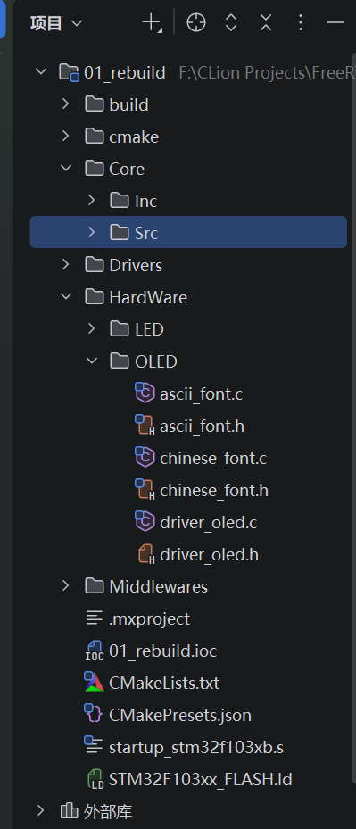
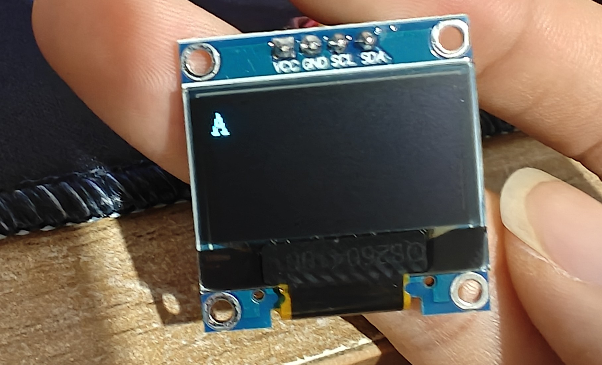
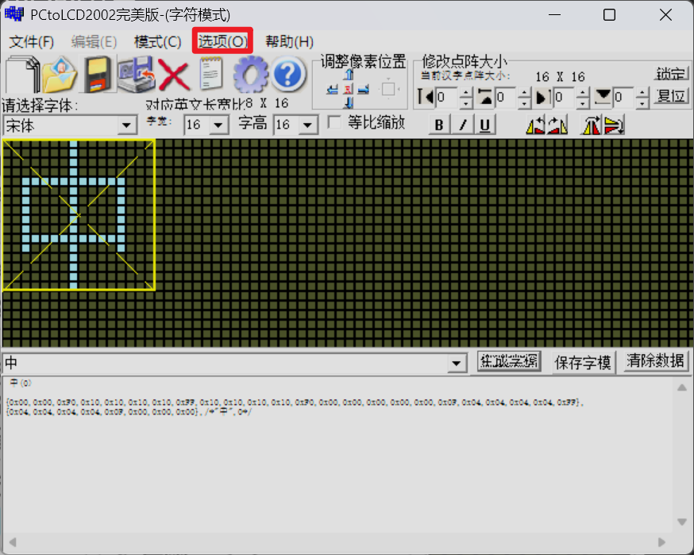
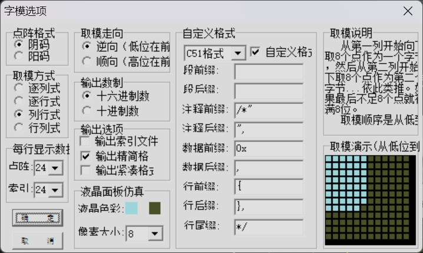

## 简介
本文主要介绍一下如何在`OLED`显示模块上显示中文字符，本次所使用到的开发环境是`CLion`，本次演示使用的硬件为`0.96`寸的`OLED`显示模块，分辨率为`128*64`，这也是使用率较高的一款，其他的硬件配置如主控`MCU`大家可以自行选择，本次教程中使用的`MCU`为`STM32F103C8T6`

## 显示英文字符
### 驱动文件介绍
在显示中文字符之前我们先尝试让`OLED`显示屏显示英文字符，确保显示屏没有问题，我们想要让`OLED`模块显示字符首先需要获取对应的驱动文件，对于我们当前使用的这款显示模块来说，网上有很多的开源资料，其中就包括它的驱动文件，如果你没有的话可以直接向购买的厂商索要，这里我也给大家提供了以下我使用的`OLED`驱动文件，对应的百度网盘下载链接如下：

通过网盘分享的文件：0.96寸OLED显示模块驱动文件
链接: https://pan.baidu.com/s/1yrVWMKvR9KwIDkMgVED6uQ 提取码: 1234 
--来自百度网盘超级会员v5的分享`

一般情况下驱动文件中会包含一个`.c`源文件一个对应的头文件以及一个字符编码文件，其中`.c`源文件中存放的是操作`OLED`显示模块时会使用到的库函数，字符编码文件中保存了常见的英文字符编码信息，有了这几个文件我们就可以在`OLED`屏幕上显示英文字符了，我提供的驱动文件中`ascii_font.c`和`ascii_font.h`文件是对应的字符编码文件，`driver_oled.c`和`driver_oled.h`是驱动文件，`chinese_font.c`和`chinese_font.h`是中文字符编码文件

### 驱动文件添加
拿到了这几个驱动文件之后接下来我们就要把这几个驱动文件添加到项目中去，我们可以在程序的根目录下创建一个`HardWare`文件夹，然后在该文件夹下再创建名为`OLED`的文件夹，我们再将上面提到的几个文件放入该文件夹中即可，操作完成后项目的层级如下：

当前的文件添加完毕之后我们就可以在`mian.c`的`main`函数中的`/* USER CODE BEGIN 2 */和/* USER CODE END 2 */之间添加如下代码
```c
OLED_Init();  
OLED_Clear();  
  
OLED_PutChar(0,0, 'A');
```
烧录程序之后可以看到对应的显示数据


## 显示中文字符
当我们成功的在`OLED`显示模块上显示了英文字符之后我们接下来就可以尝试在其上显示一些中文字符了，首先我们需要认识到的一个事情是`OLED`本身并不认识中文和英文，它只认识像素数据，如果想要显示中文，那么必须要提前准备对应汉字的点阵字模。汉字的字模获取并不困难，我们可以通过取模软件来获取，网上有很多取模软件，大家可以自行搜索并下载，本次使用的取模软件为`PCtoLCD2002`，对应的下载链接如下：
通过网盘分享的文件：PCtoLCD2002
链接: https://pan.baidu.com/s/1-w60MaZ5gA32xmBjjkoTCQ 提取码: 1234 
--来自百度网盘超级会员v5的分享
默认的软件配置可能不是很符合我们的要求，因此我们需要结合实际情况来进行一些参数的调整

我们可以点击顶部的选项，然后就会弹出对应的配置窗口了
该软件的配置如下：

保持如图所示的配置之后我们就可以获取对应的