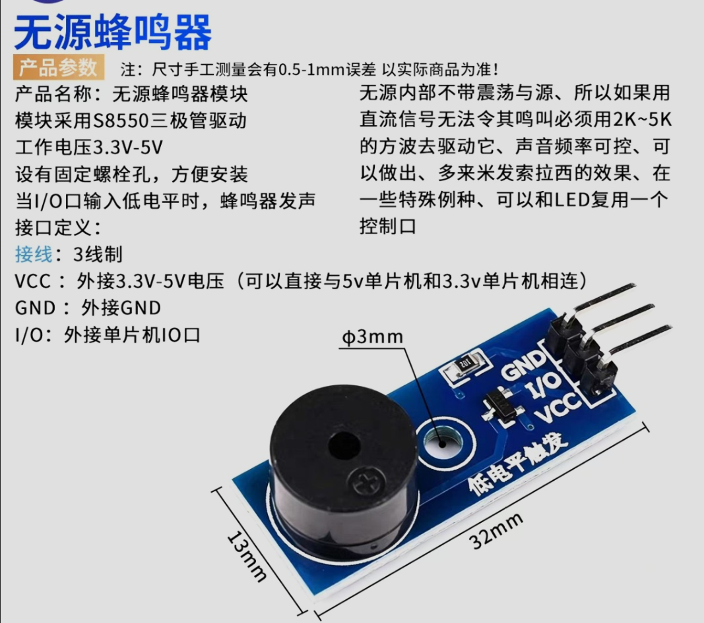
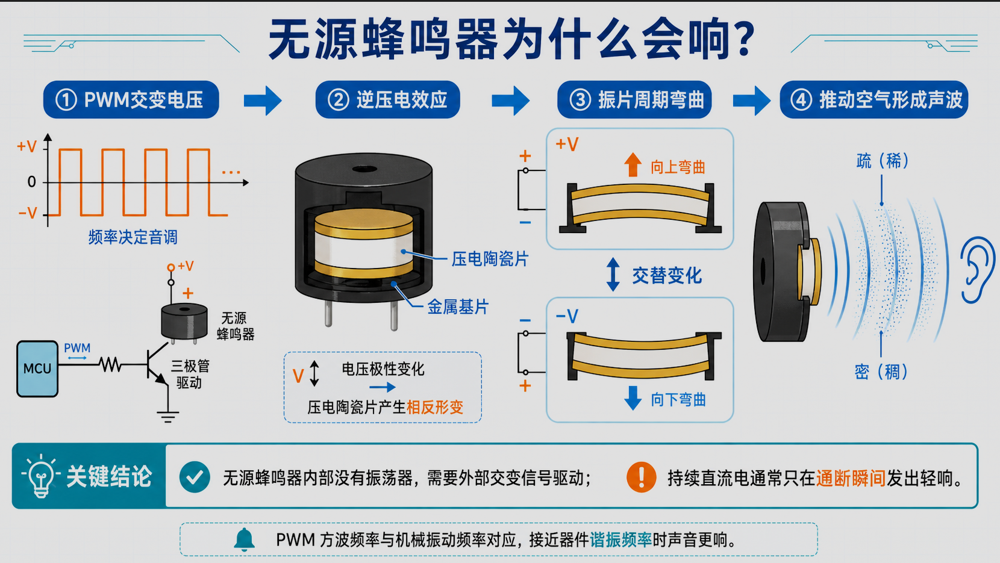
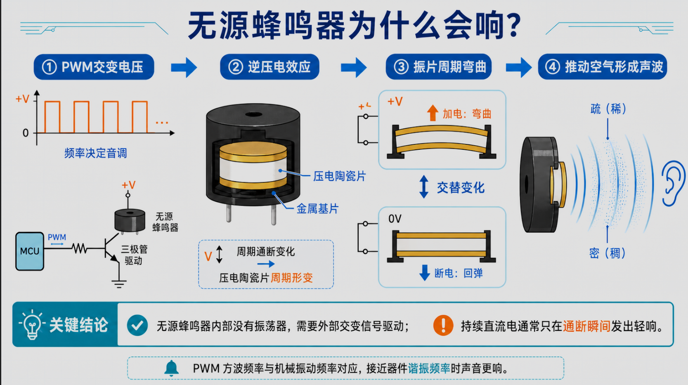
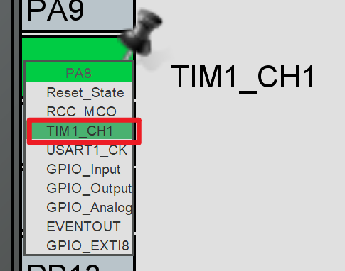
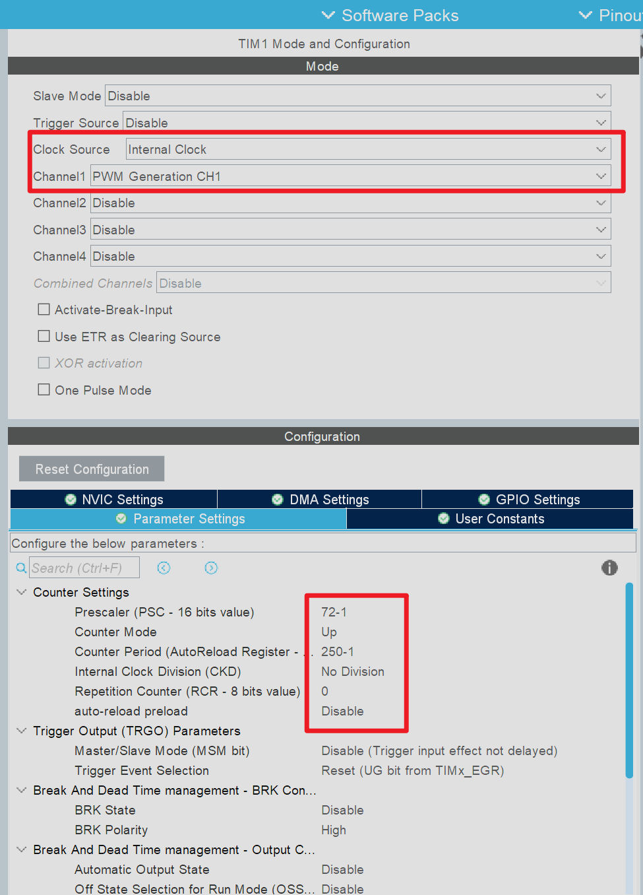
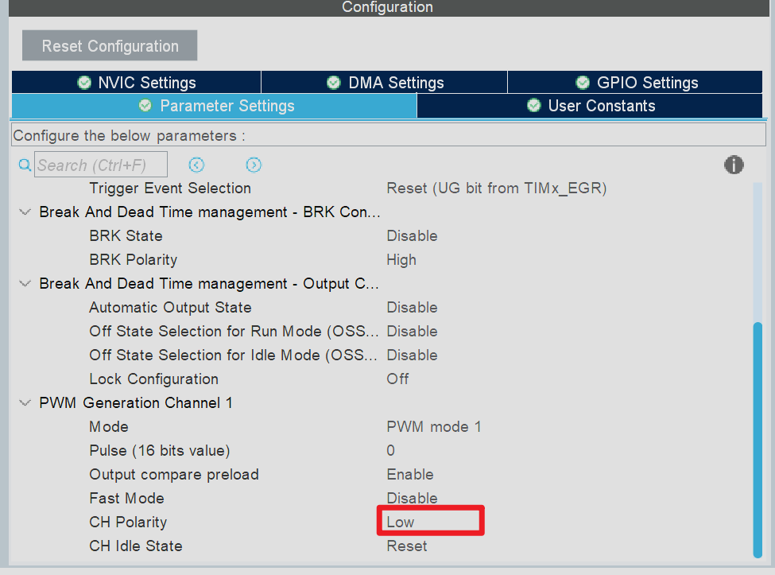

# STM32无源蜂鸣器播放《晴天》——基于TIM1与FreeRTOS

## 引言
本期内容介绍一下如何让`stm32`单片机控制蜂鸣器播放音乐，本期教程中使用的无源蜂鸣器就是市面上最常见的三引脚无源蜂鸣器模块

使用的单片机主控也是嵌入式开发工程师几乎人手一个`STM32F103C8T6`，相信你看完的本期教程之后也能够轻松的使用`STM32`单片机控制无源蜂鸣器播放音乐

## 硬件介绍
我们首先需要了解一下无源蜂鸣器的发声原理，无源蜂鸣器相较于有源蜂鸣器内部没有振荡器，我们无法通过恒定的高低电平来控制其发出声音。我们需要高低变化的方波脉冲信号来驱动其发出声音，其实无源蜂鸣器的发声原理很简单，我们向`I/O`引脚输入不同的信号电平时内部的金属片就会产生不同方向的形变，因此当我们快速的改变电平信号就相当于在快速的改变金属片的形变方向，金属片快速的振动就会发出声音。具体的原理可以参照下图：

了解了无源蜂鸣器发声的原理之后我们不难得出常规的`GPIO`输出模式是无法满足我们的需求的，我们需要对应的引脚能够输出快速变化的高低电平。因此我们不难得出，只有`PWM`输出模式才能满足我们的需求
## 配置PA8和TIM1

当前蜂鸣器的`I/O`引脚连接到开发板上的`PA8`引脚，`PA8`可以复用为`TIM`的输出通道一，我们在配置界面中点击`PA8`引脚就可以配置引脚模式信息了

将`PA8`配置为`TIM1_CH1`之后就可以配置`TIM`对应的参数信息了

由于蜂鸣器模块采用低电平触发，`TIM1`的输出通道需要配置为低有效：

TIM1 当前的参数配置为：
`TIM1`的主频为`72 MHz`，我们将预分频值设置为 `72-1` ，对应的定时器计数频率为：`72 MHz ÷ (71 + 1) = 1 MHz`，因此后续定时器每 `1μs`增加一次计数值。后续播放不同音调时根据音符频率动态修改自动重装载器的值：
~~~text
ARR = 1,000,000 ÷ 音符频率 - 1
~~~

例如输出 `4000Hz`频率的方波型号时，自动重装载器的值等于`249`，这也就是`TIM1`初始化时将 `Period`设置为`250 - 1` 的原因

## 项目文件结构

蜂鸣器功能在项目中被拆分成程序入口、音乐功能模块和定时器输出三层。各文件之间的依赖和控制关系如下图所示：

其中，`main.c` 负责初始化 TIM1、启动 PWM 和启动 FreeRTOS 调度器；`freertos.c` 在默认任务中调用歌曲播放接口；`buzzer_songs.c` 保存并遍历《晴天》乐谱；`buzzer_music.c` 根据频率设置 ARR 和 CCR。最后由 `tim.c` 配置的 `TIM1_CH1` 从 `PA8` 输出 PWM，驱动无源蜂鸣器发声。

头文件 `buzzer_songs.h` 和 `buzzer_music.h` 只负责向其它文件公开接口。以后增加新的歌曲时，主要修改歌曲数据和播放入口，不需要重新编写 TIM1 的底层控制代码。

## 音乐播放调用流程

当前程序从上电到逐个播放音符的真实调用关系如下图所示：

`main()` 先调用 `MX_TIM1_Init()` 完成 TIM1 配置，再通过 `HAL_TIM_PWM_Start()` 启动 PWM。执行 `osKernelStart()` 后，FreeRTOS 进入 `StartDefaultTask()`，先调用 `BuzzerMusic_Init()` 保持静音，然后在循环中执行 `BuzzerSongs_PlaySunny()`。

歌曲函数按照同一个数组下标读取 PSC 和时值，分别调用 `SunnyFrequencyFromPrescaler()` 与 `SunnyDurationMs()` 完成换算。如果当前数据是休止符，程序直接保持静音；否则调用 `BuzzerMusic_SetTone()` 设置频率，再用 `osDelay()` 保持音符时长，最后通过 `BuzzerMusic_Stop()` 停止当前音符并继续处理下一项。

## 编写蜂鸣器底层驱动

### 定义基础参数

在 `buzzer_music.c` 中先定义 TIM1 通道、计数频率、发声比例和音量：

~~~c
#define BUZZER_TIMER_CHANNEL          TIM_CHANNEL_1
#define BUZZER_COUNTER_CLOCK_HZ       1000000U
#define BUZZER_MAX_PERIOD_COUNTS      65536U
#define BUZZER_NOTE_ON_PERCENT        90U
#define BUZZER_VOLUME_PERCENT         10U
~~~

`BUZZER_COUNTER_CLOCK_HZ` 对应 PSC 分频后的 `1 MHz` 计数频率。`BUZZER_NOTE_ON_PERCENT` 设置为 90，表示一个音符总时长的前 90% 发声、后 10% 静音，用于把相邻的相同音符分开。`BUZZER_VOLUME_PERCENT` 则用于设置 PWM 的有效占空比。

### 根据频率设置音调

`BuzzerMusic_SetTone()` 根据传入频率计算 PWM 周期，并把结果写入 ARR 和 CCR：

~~~c
period_counts =
    (BUZZER_COUNTER_CLOCK_HZ + (frequency_hz / 2U)) /
    frequency_hz;

__HAL_TIM_SET_AUTORELOAD(&htim1, period_counts - 1U);
__HAL_TIM_SET_COMPARE(
    &htim1,
    BUZZER_TIMER_CHANNEL,
    (period_counts * BUZZER_VOLUME_PERCENT) / 100U);

__HAL_TIM_SET_COUNTER(&htim1, 0U);
HAL_TIM_GenerateEvent(&htim1, TIM_EVENTSOURCE_UPDATE);
~~~

这里的 ARR 决定 PWM 周期，也就是音调；CCR 决定有效占空比，也就是当前的软件音量。修改参数后清空计数器并产生更新事件，可以让新音调立即生效。

### 停止蜂鸣器输出

当前 TIM1 使用“PWM1 + 低极性”。把 CCR 设置为 0 后，`PA8` 会保持高电平，低电平触发的蜂鸣器随之停止发声：

~~~c
void BuzzerMusic_Stop(void)
{
  __HAL_TIM_SET_COMPARE(&htim1, TIM_CHANNEL_1, 0U);
  HAL_TIM_GenerateEvent(&htim1, TIM_EVENTSOURCE_UPDATE);
}
~~~

初始化音乐模块时直接调用该函数：

~~~c
void BuzzerMusic_Init(void)
{
  BuzzerMusic_Stop();
}
~~~

### 播放单个音符

一个音符同时保存频率和持续时间：

~~~c
typedef struct
{
  uint16_t frequency_hz;
  uint16_t duration_ms;
} BuzzerMusicNote;
~~~

例如 `{262U, 300U}` 表示输出约 `262 Hz` 的方波，并让这个音符持续 `300 ms`。播放时先设置音调，再通过 `osDelay()` 保持对应时间：

~~~c
note_on_ms =
    ((uint32_t)duration_ms * BUZZER_NOTE_ON_PERCENT) / 100U;

BuzzerMusic_SetTone(frequency_hz);
osDelay(note_on_ms);
BuzzerMusic_Stop();
osDelay((uint32_t)duration_ms - note_on_ms);
~~~

这里由 TIM1 决定“播放哪个音”，由 `osDelay()` 决定“这个音播放多久”。

## 迁移《晴天》乐谱

“晴天”工程中的乐谱没有直接保存音符频率，而是保存了原 TIM2 使用的 PSC 参数和时值。当前项目继续使用两个等长数组保存这些数据：

~~~c
static const uint16_t sunny_prescalers[] =
{
  /* 原工程中的 PSC 数据 */
};

static const uint16_t sunny_time_units[] =
{
  /* 每个音符对应的时值 */
};
~~~

这两个数组通过同一个 `index` 组合出一个完整音符。音调和节奏在程序中的协同关系如下图所示：

`sunny_prescalers[index]` 经过 `SunnyFrequencyFromPrescaler()` 得到 `frequency_hz`，决定蜂鸣器播放的音高；`sunny_time_units[index]` 经过 `SunnyDurationMs()` 得到 `duration_ms`，决定这个音保持多久。项目还通过静态断言检查两个数组长度：

~~~c
_Static_assert(
    ARRAY_SIZE(sunny_prescalers) ==
    ARRAY_SIZE(sunny_time_units),
    "Sunny score arrays must have the same length");
~~~

### 把旧PSC转换为频率

原工程使用 `72 MHz` 定时器时钟，并把 ARR 固定为 99，因此原输出频率为：

~~~text
频率 = 72,000,000 ÷ (PSC + 1) ÷ (99 + 1)
     = 720,000 ÷ (PSC + 1)
~~~

当前项目使用下面的函数还原频率，并将旋律整体升高两个八度：

~~~c
static uint16_t SunnyFrequencyFromPrescaler(uint16_t prescaler)
{
  uint32_t divisor;
  uint32_t frequency_hz;

  if (prescaler == SUNNY_REST_PRESCALER)
  {
    return BUZZER_MUSIC_REST;
  }

  divisor = (uint32_t)prescaler + 1U;
  frequency_hz =
      (SUNNY_TIMER_FACTOR_HZ + (divisor / 2U)) / divisor;
  frequency_hz <<= SUNNY_OCTAVE_SHIFT;

  return (uint16_t)frequency_hz;
}
~~~

`SUNNY_OCTAVE_SHIFT` 设置为 2，左移两位相当于把频率乘以 4。以 PSC=1635 为例：

~~~text
原频率 = 720,000 ÷ (1635 + 1) ≈ 440 Hz
升高两个八度后：440 × 4 ≈ 1760 Hz
当前 TIM1 的 ARR：1,000,000 ÷ 1760 - 1 ≈ 567
~~~

旧 PSC 到当前 TIM1 参数的完整转换关系如下图所示，公式继续保留在正文中，图中主要观察数据流向：

PSC 为 30 时表示休止符。程序会让蜂鸣器保持静音，但仍然保留该休止符对应的时间。

### 把时值转换为毫秒

旧工程中的时值通过下面的函数转换：

~~~c
static uint32_t SunnyDurationMs(uint16_t time_unit)
{
  return ((uint32_t)time_unit / 25U) * 180U;
}
~~~

| 原时值 | 播放时间 |
|---:|---:|
| 25 | 180 ms |
| 50 | 360 ms |
| 75 | 540 ms |
| 100 | 720 ms |

播放时使用相同下标读取音调和时值，再依次设置 PWM、保持音符、停止输出并加入默认 `5 ms` 间隔。

## 在main中启动PWM

完成 TIM1 初始化后，还需要在 `main.c` 中启动 PWM：

~~~c
MX_GPIO_Init();
MX_TIM1_Init();

if (HAL_TIM_PWM_Start(&htim1, TIM_CHANNEL_1) != HAL_OK)
{
  Error_Handler();
}
~~~

`MX_TIM1_Init()` 只负责配置定时器。执行 `HAL_TIM_PWM_Start()` 后，`TIM1_CH1` 才会真正开始向 `PA8` 输出 PWM。

## 在FreeRTOS任务中播放音乐

在 `freertos.c` 中包含音乐驱动头文件：

~~~c
#include "buzzer_music.h"
#include "buzzer_songs.h"
~~~

然后在默认任务中初始化蜂鸣器并播放《晴天》：

~~~c
void StartDefaultTask(void *argument)
{
  BuzzerMusic_Init();

  for (;;)
  {
    BuzzerSongs_PlaySunny();
  }
}
~~~

当前程序把 `BuzzerSongs_PlaySunny()` 放在无限循环中，因此一首歌曲播放结束后会重新开始。播放过程中使用的 `osDelay()` 只会阻塞当前默认任务，FreeRTOS 仍然可以调度其他已经就绪的任务运行。

## 调整蜂鸣器响度

当前项目通过 `BUZZER_VOLUME_PERCENT` 控制 PWM 的有效占空比：

~~~c
#define BUZZER_VOLUME_PERCENT 10U
~~~

声音太大时，可以把这个值调小，例如：

~~~c
#define BUZZER_VOLUME_PERCENT 5U
~~~

修改后，CCR 会按照新的比例重新计算：

~~~text
CCR = period_counts × BUZZER_VOLUME_PERCENT ÷ 100
~~~

占空比设置得过小后，部分音调可能无法稳定发声，因此每次修改后都要重新播放整首歌曲进行确认。

## 增加一首新歌曲

如果新歌曲直接使用音符频率和毫秒时长，可以定义一个 `BuzzerMusicNote` 数组：

~~~c
static const BuzzerMusicNote song[] =
{
  {262U, 300U},
  {294U, 300U},
  {330U, 300U},
  {0U,   150U},
  {392U, 600U}
};
~~~

其中频率为 0 的音符表示休止符。播放时调用：

~~~c
BuzzerMusic_Play(song, sizeof(song) / sizeof(song[0]));
~~~

如果新乐谱使用公共频率表和音符索引，则可以调用 `BuzzerMusic_PlayIndexed()`，这样不需要为每个音符重复保存频率。

## 编译和播放验证

完成代码接入后重新编译并烧录程序。上电后的播放和验证过程如下图所示：

程序先初始化 TIM1 和蜂鸣器，然后按照乐谱顺序读取当前音符、设置 ARR 与 CCR，并通过 `osDelay()` 保持对应时长。当前音符结束后继续读取下一项，一首歌曲播放完毕后，默认任务中的无限循环会再次从头调用 `BuzzerSongs_PlaySunny()`。

能够从蜂鸣器中听到连续且节奏正常的《晴天》旋律，就说明 `PA8`、`TIM1_CH1`、底层音乐驱动、乐谱数据和 FreeRTOS 播放任务已经连接完成。
