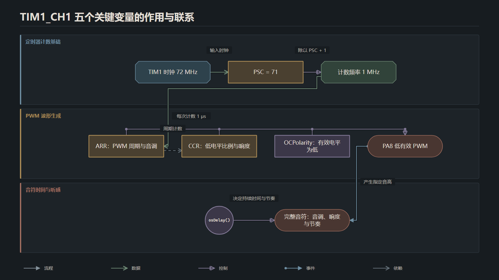

# STM32无源蜂鸣器播放《晴天》——基于TIM1与FreeRTOS

## 引言
本期内容介绍一下如何让`stm32`单片机控制蜂鸣器播放音乐，本期教程中使用的无源蜂鸣器就是市面上最常见的三引脚无源蜂鸣器模块

使用的单片机主控也是嵌入式开发工程师几乎人手一个`STM32F103C8T6`，相信你看完的本期教程之后也能够轻松的使用`STM32`单片机控制无源蜂鸣器播放音乐

## 硬件介绍

### 底层发声原理
我们首先需要了解一下无源蜂鸣器的发声原理，无源蜂鸣器相较于有源蜂鸣器内部没有振荡器，我们无法通过恒定的高低电平来控制其发出声音。我们需要高低变化的方波脉冲信号来驱动其发出声音，其实无源蜂鸣器的发声原理很简单，我们向`I/O`引脚输入不同的信号电平时内部的金属片就会产生不同方向的形变，因此当我们快速的改变电平信号就相当于在快速的改变金属片的形变方向，金属片快速的振动就会发出声音。具体的原理可以参照下图：


了解了无源蜂鸣器发声的原理之后我们不难得出常规的`GPIO`输出模式是无法满足我们的需求的，我们需要对应的引脚能够输出快速变化的高低电平。因此我们不难得出，只有`PWM`输出模式才能满足我们的需求

### 输出控制
我们了解了最底层的硬件发声原理之后，我们接下来需要了解一下如何通过改变`PWM`模式中不同参数的数值，来达到我们输出不同音调和响度的需求
#### 音调控制
总所周知声音是由物体振动产生的，音调是由物体振动的频率决定的，我们想要改变无源蜂鸣器输出声音的频率就是改变输出`PWM`波的频率
这点并不难理解，我们如果输出`1000Hz`的方波，蜂鸣器的膜片每秒会振动`1000`次，声音会比较尖锐。我们输出一个`440Hz`的方波，声音听起来会比较低沉

想要改变方波的频率主要有两种方法，一是改变预分频器（`PSC`）的值，二是改变自动重装载器（`ARR`）的值，在后续的操作中我们主要会选择通过修改自动重装载器的值来控制音调高低
#### 响度控制
想要控制无源蜂鸣器发声的响度只有一种办法，那就是改变`PWM`的占空比，占空比可以控制无源蜂鸣器中发声片的振幅。我们在代码中通过修改捕获比较寄存器（`CCR`）中的值来改变`PWM`方波的占空比
## 配置PA8和TIM1
当前蜂鸣器的`I/O`引脚连接到开发板上的`PA8`引脚，`PA8`可以复用为`TIM`的输出通道一，我们在配置界面中点击`PA8`引脚就可以配置引脚模式信息了

将`PA8`配置为`TIM1_CH1`之后就可以配置`TIM`对应的参数信息了

由于蜂鸣器模块采用低电平触发，`TIM1`的输出通道需要配置为低有效：


TIM1 当前的参数配置为：
`TIM1`的主频为`72 MHz`，我们将预分频值设置为 `72-1` ，对应的定时器计数频率为：`72 MHz ÷ (71 + 1) = 1 MHz`，因此后续定时器每 `1μs`增加一次计数值。当前的计数模式我们配置为向上计数模式，自动重装载值我们设置为`250-1`。按照默认的参数`PWM`的频率为
```txt
PWM频率 = TIM1时钟 ÷ (PSC + 1) ÷ (ARR + 1)
```

```txt
ARR = 249
PWM频率 = 1,000,000 ÷ 250
        = 4000 Hz
```
所以初始化参数对应的基础频率为`4Khz`


后续需要播放不同音调时根据音符频率动态修改自动重装载器的值：
~~~text
ARR = 1,000,000 ÷ 音符频率 - 1
~~~

配置的几个参数之间的关系如下图所示


## 编写蜂鸣器底层驱动
首先我们需要编写蜂鸣器的底层驱动，即控制蜂鸣器发出不同音调，不同响度的声音。我们将其命名为`buzzer_music.c`，在该文件中我们

## 迁移《晴天》乐谱

“晴天”工程中的乐谱没有直接保存音符频率，而是保存了原 TIM2 使用的 PSC 参数和时值。当前项目继续使用两个等长数组保存这些数据：

~~~c
static const uint16_t sunny_prescalers[] =
{
  /* 原工程中的 PSC 数据 */
};

static const uint16_t sunny_time_units[] =
{
  /* 每个音符对应的时值 */
};
~~~

这两个数组通过同一个 `index` 组合出一个完整音符。音调和节奏在程序中的协同关系如下图所示：


`sunny_prescalers[index]` 经过 `SunnyFrequencyFromPrescaler()` 得到 `frequency_hz`，决定蜂鸣器播放的音高；`sunny_time_units[index]` 经过 `SunnyDurationMs()` 得到 `duration_ms`，决定这个音保持多久。项目还通过静态断言检查两个数组长度：

~~~c
_Static_assert(
    ARRAY_SIZE(sunny_prescalers) ==
    ARRAY_SIZE(sunny_time_units),
    "Sunny score arrays must have the same length");
~~~

### 把旧PSC转换为频率

原工程使用 `72 MHz` 定时器时钟，并把 ARR 固定为 99，因此原输出频率为：

~~~text
频率 = 72,000,000 ÷ (PSC + 1) ÷ (99 + 1)
     = 720,000 ÷ (PSC + 1)
~~~

当前项目使用下面的函数还原频率，并将旋律整体升高两个八度：

~~~c
static uint16_t SunnyFrequencyFromPrescaler(uint16_t prescaler)
{
  uint32_t divisor;
  uint32_t frequency_hz;

  if (prescaler == SUNNY_REST_PRESCALER)
  {
    return BUZZER_MUSIC_REST;
  }

  divisor = (uint32_t)prescaler + 1U;
  frequency_hz =
      (SUNNY_TIMER_FACTOR_HZ + (divisor / 2U)) / divisor;
  frequency_hz <<= SUNNY_OCTAVE_SHIFT;

  return (uint16_t)frequency_hz;
}
~~~

`SUNNY_OCTAVE_SHIFT` 设置为 2，左移两位相当于把频率乘以 4。以 PSC=1635 为例：

~~~text
原频率 = 720,000 ÷ (1635 + 1) ≈ 440 Hz
升高两个八度后：440 × 4 ≈ 1760 Hz
当前 TIM1 的 ARR：1,000,000 ÷ 1760 - 1 ≈ 567
~~~

旧 PSC 到当前 TIM1 参数的完整转换关系如下图所示，公式继续保留在正文中，图中主要观察数据流向：


PSC 为 30 时表示休止符。程序会让蜂鸣器保持静音，但仍然保留该休止符对应的时间。

### 把时值转换为毫秒

旧工程中的时值通过下面的函数转换：

~~~c
static uint32_t SunnyDurationMs(uint16_t time_unit)
{
  return ((uint32_t)time_unit / 25U) * 180U;
}
~~~

| 原时值 | 播放时间 |
|---:|---:|
| 25 | 180 ms |
| 50 | 360 ms |
| 75 | 540 ms |
| 100 | 720 ms |

播放时使用相同下标读取音调和时值，再依次设置 PWM、保持音符、停止输出并加入默认 `5 ms` 间隔。

## 在main中启动PWM

完成 TIM1 初始化后，还需要在 `main.c` 中启动 PWM：

~~~c
MX_GPIO_Init();
MX_TIM1_Init();

if (HAL_TIM_PWM_Start(&htim1, TIM_CHANNEL_1) != HAL_OK)
{
  Error_Handler();
}
~~~

`MX_TIM1_Init()` 只负责配置定时器。执行 `HAL_TIM_PWM_Start()` 后，`TIM1_CH1` 才会真正开始向 `PA8` 输出 PWM。

## 在FreeRTOS任务中播放音乐

在 `freertos.c` 中包含音乐驱动头文件：

~~~c
#include "buzzer_music.h"
#include "buzzer_songs.h"
~~~

然后在默认任务中初始化蜂鸣器并播放《晴天》：

~~~c
void StartDefaultTask(void *argument)
{
  BuzzerMusic_Init();

  for (;;)
  {
    BuzzerSongs_PlaySunny();
  }
}
~~~

当前程序把 `BuzzerSongs_PlaySunny()` 放在无限循环中，因此一首歌曲播放结束后会重新开始。播放过程中使用的 `osDelay()` 只会阻塞当前默认任务，FreeRTOS 仍然可以调度其他已经就绪的任务运行。

## 调整蜂鸣器响度

当前项目通过 `BUZZER_VOLUME_PERCENT` 控制 PWM 的有效占空比：

~~~c
#define BUZZER_VOLUME_PERCENT 10U
~~~

声音太大时，可以把这个值调小，例如：

~~~c
#define BUZZER_VOLUME_PERCENT 5U
~~~

修改后，CCR 会按照新的比例重新计算：

~~~text
CCR = period_counts × BUZZER_VOLUME_PERCENT ÷ 100
~~~

占空比设置得过小后，部分音调可能无法稳定发声，因此每次修改后都要重新播放整首歌曲进行确认。

## 增加一首新歌曲

如果新歌曲直接使用音符频率和毫秒时长，可以定义一个 `BuzzerMusicNote` 数组：

~~~c
static const BuzzerMusicNote song[] =
{
  {262U, 300U},
  {294U, 300U},
  {330U, 300U},
  {0U,   150U},
  {392U, 600U}
};
~~~

其中频率为 0 的音符表示休止符。播放时调用：

~~~c
BuzzerMusic_Play(song, sizeof(song) / sizeof(song[0]));
~~~

如果新乐谱使用公共频率表和音符索引，则可以调用 `BuzzerMusic_PlayIndexed()`，这样不需要为每个音符重复保存频率。

## 编译和播放验证

完成代码接入后重新编译并烧录程序。上电后的播放和验证过程如下图所示：


程序先初始化 TIM1 和蜂鸣器，然后按照乐谱顺序读取当前音符、设置 ARR 与 CCR，并通过 `osDelay()` 保持对应时长。当前音符结束后继续读取下一项，一首歌曲播放完毕后，默认任务中的无限循环会再次从头调用 `BuzzerSongs_PlaySunny()`。

能够从蜂鸣器中听到连续且节奏正常的《晴天》旋律，就说明 `PA8`、`TIM1_CH1`、底层音乐驱动、乐谱数据和 FreeRTOS 播放任务已经连接完成。
