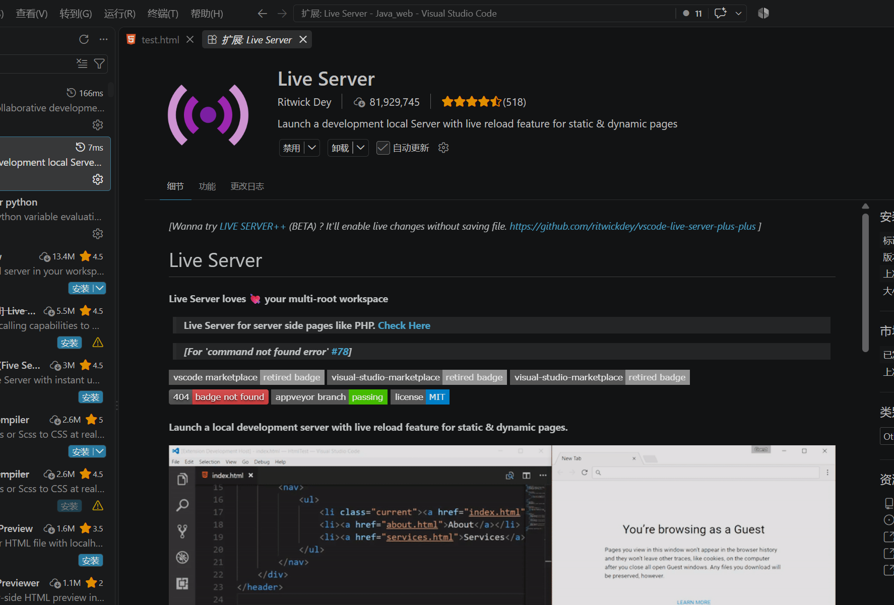
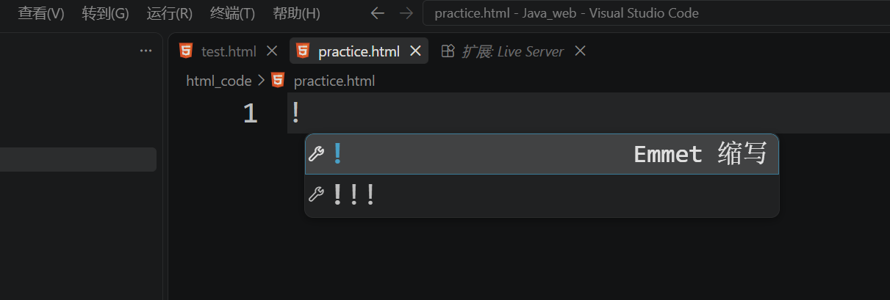

## 起手式
在`Vscode`中安装了对应的插件之后即可进行代码的编写

`HTML`语言的起手式很简单，只需要在对应的`.html`文件中输出英文状态下的`!`即可弹出对应的提示，
然后我们按下键盘上的回车键即可自动补全`HTML`的起手式内容，具体内容如下
```html
<!-- 声明文档类型 -->

<!DOCTYPE html>

<!-- 定义界面语言 -->

<html lang="en">

  

<!-- 配置信息 -->

<head>

    <!-- 字符编码格式 -->

    <meta charset="UTF-8">

    <meta name="viewport" content="width=device-width, initial-scale=1.0">

    <!-- 网页标题 -->

    <title></title>

</head>

  

<!-- 网页主体 -->

<body>

    <h1></h1>

    <p></p>

    <p></p>

</body>

</html>
```
不同部分的代码作用如下：