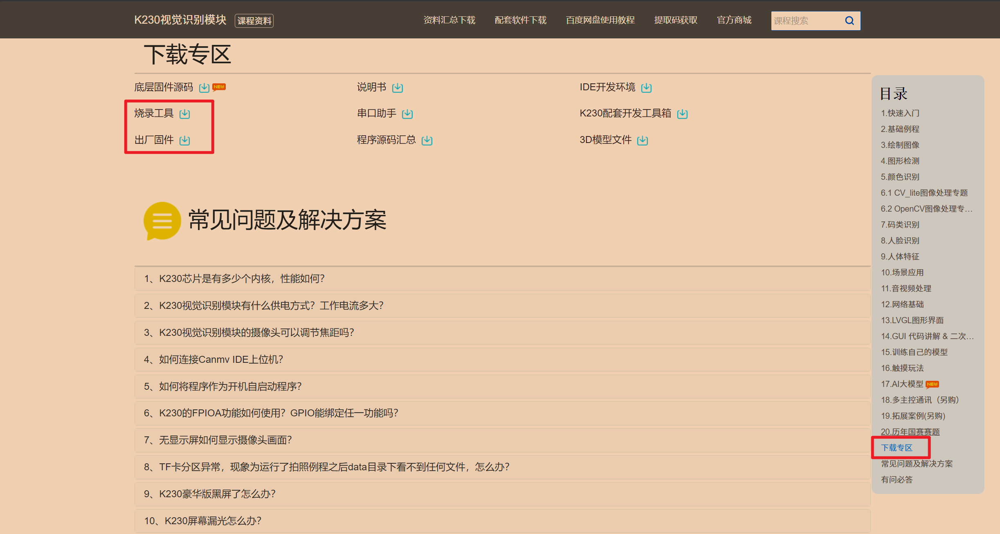

## 简介
本文主要介绍一下如何在储存卡中烧录`K230`视觉模块的固件，烧录流程较为简单，出现问题也可以快速进行排查

## 实操
### 下载软件
首先我们需要到官网上去下载对应的软件程序，这里推荐使用亚博智能的官方网站中提供的固件，官方网址为:[https://www.yahboom.com/study/K230](https://www.yahboom.com/study/K230)
点击进入之后我们在网页中点击右侧侧边栏中的下载专区，即可跳转到下载界面，在下载界面中我们需要下载**烧录工具**和**出场固件**

下载完成之后我们就可以进行