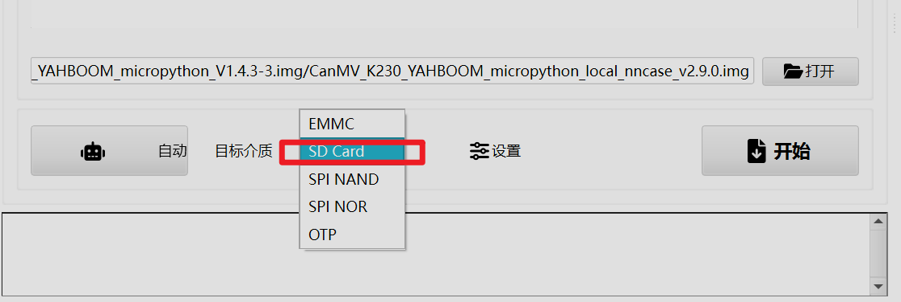

## 简介
本文主要介绍一下如何在储存卡中烧录`K230`视觉模块的固件，烧录流程较为简单，出现问题也可以快速进行排查

## 实操
### 下载软件
首先我们需要到官网上去下载对应的软件程序，这里推荐使用亚博智能的官方网站中提供的固件，官方网址为:[https://www.yahboom.com/study/K230](https://www.yahboom.com/study/K230)
点击进入之后我们在网页中点击右侧侧边栏中的下载专区，即可跳转到下载界面，在下载界面中我们需要下载**烧录工具**和**出场固件**

下载完成之后我们将出场固件压缩包解压之后即可得到对应的镜像文件

我们将烧录工具对应压缩包解压之后即可得到**驱动安装程序**

和**镜像烧录程序**

### 烧录操作流程

#### 安装驱动
首先我们将`K230`视觉模块通过数据线连接到电脑上，连接成功之后右键开始菜单并打开设备管理器

在设备管理器界面找到`K230`对应的接口，我们发现该接口上有黄色感叹号，这就说明`K230`并没有安装相应驱动

我们双击打开安装工具解压后文件夹下的驱动安装程序

一般情况下程序会自动识别到对应的接口，如果没有那么可以尝试手动选择`K230`设备对应的接口

选择之后点击`Install Driver`选项，等待安装完成

安装完成之后关闭程序

插拔一次`K230`模块，然后在设备管理器中查看对应的端口是否恢复正常

没有黄色感叹号就说明对应接口正常

#### 烧录镜像
驱动安装完成之后接下来我们就可以进行镜像的烧录了
我们打开烧录工具中`bin`文件夹下的镜像烧录程序

打开软件之后点击软件下方的镜像选择选项

找到我们之前解压出的镜像文件

目标介质保持默认选择`SD Card`

