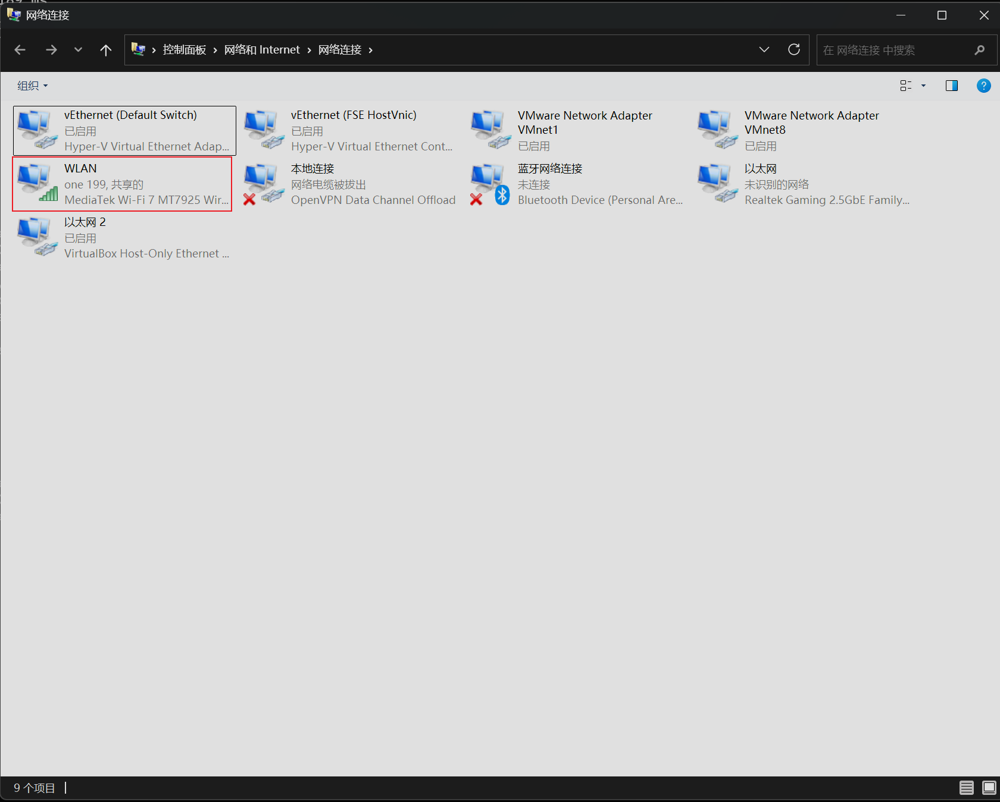
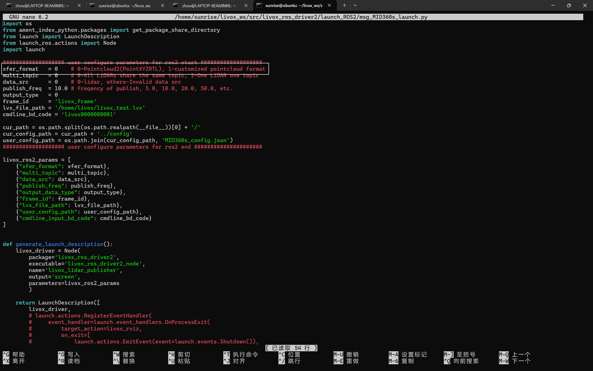
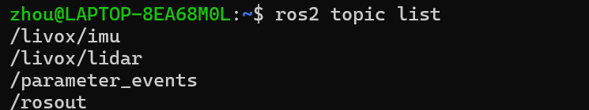
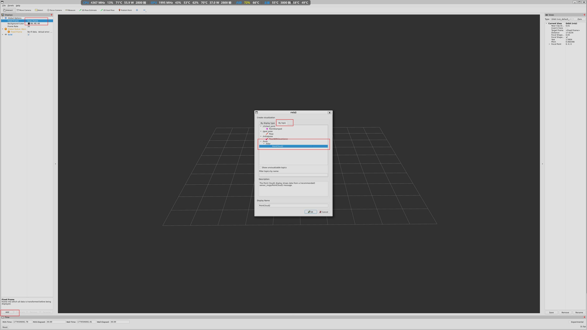

## 操作模式

雷达模块通过网线与`RDK S100`开发板连接，雷达模块通过网线将数据传输给开发板，我们可以直接在卡发板上外接显示器并启动`rviz2`软件观察建图结果，虽然`RDKS100`开发板算力强劲，但是其图形渲染能力较差，强行运行只会导致帧率暴跌，卡成`PPT`。因此我们采用的模式是通过上位机来接收相关数据，在上位机中进行图形渲染操作，这样才能观察到流畅的建图画面，

## 硬件连接

我使用的硬件组合为：`RDK S100`+`MID-360s`雷达（雷达工作时发热量较大，使用时确保雷达散热正常）+拯救者`R9000P`（只要你的电脑有网口即可，有独立显卡效果更佳），硬件连接非常简单，我们首先需要使用网线将`RDK S100`和`PC`上位机连接起来，随后使用MID-360s自带的一分三线中的网线将雷达模块和开发板的另一个网口连接起来即可，`RDK S100`上有两个网口，两个都是千兆网口，连接时随意选择即可

## `IP`配置

我们使用网线连接开发板与`PC`机之后需要为开发板配置固定`IP`以简化操作，首先我们按下键盘上的`WIN`+`R`，随后在弹出的窗口中输入`ncpa.cpl`，随后进入网络配置界面


在当前界面中找到连接到网络的目标对象，这里我连接的是自己的手机热点，可以根据热点名称寻找目标网络，随后右键`WLAN`选项之后点击属性，在弹出的属性窗口中选择共享，点击允许其它网络通过此计算机的Internet来连接，和下面的允许其它网络用户控制或禁止共享的Internet连接，共享对象选择**以太网**，


修改开发板上上的`~/livox_ws/src/livox_ros_driver2/config/MID360s_config.json`配置文件，确保文件内容如下

```bash
{
  "lidar_summary_info" : {
    "lidar_type": 8
  },
  "Mid360s": {
    "lidar_net_info" : {
      "cmd_data_port"  : 56100,
      "push_msg_port"  : 56200,
      "point_data_port": 56300,
      "imu_data_port"  : 56400,
      "log_data_port"  : 56500
    },
    "host_net_info" : [
      {
        "host_ip"        : "192.168.1.50",
        "cmd_data_port"  : 56101,
        "push_msg_port"  : 56201,
        "point_data_port": 56301,
        "imu_data_port"  : 56401,
        "log_data_port"  : 56501
      }
    ]
  },
  "lidar_configs" : [
    {
      "ip" : "192.168.1.117",
      "pcl_data_type" : 1,
      "pattern_mode" : 0,
      "extrinsic_parameter" : {
        "roll": 0.0,
        "pitch": 0.0,
        "yaw": 0.0,
        "x": 0,
        "y": 0,
        "z": 0
      }
    }
  ]
}
```

其中的`host_ip`选择自己的开发板对应`IP`地址，`idar_configs`下面对应的`ip`根据自己雷达模块的实际`IP`进行修改，修改后需要确保文件内容生效，需要使用如下命令

```bash
cd ~/livox_ws
colcon build --symlink-install --packages-select livox_ros_driver2
source install/setup.bash
```

随后我们就可以尝试去启动雷达

```bash
# 1. 确保 IP 已分配且能 Ping 通雷达
sudo ifconfig eth0 192.168.1.50 netmask 255.255.255.0 up
ping 192.168.1.117 -c 3

# 2. 环境变量配置
export ROS_DOMAIN_ID=42

# 3. 启动雷达 (确保 xfer_format=0 发布标准点云)
ros2 launch livox_ros_driver2 msg_MID360s_launch.py
```

在这里我们还需要注意的一点是如果想要在`WSL`中观察到对应的建图结果的话需要修改启动脚本文件，图中白框中的内容需要将值从原来的1改成0，不然在`WSL`上启动的`RVIZ`软件中就无法看到对应的建图结果


## `WSL`操作

每次开启新的`WSL`终端需要执行以下三条指令防止

```bash
unset ROS_DISCOVERY_SERVER
export ROS_DOMAIN_ID=42
ros2 daemon stop  # 强制刷新后台进程
```

执行完对应操作之后需要执行`ros2 topic list`指令确保上位机能够接收到对应的话题信息，雷达模块对应的话题信息名称为`/livox/imu`和`/livox/lidar`，如果能够看到这两个话题就说明上位机和开发板之间能够正常通信


最后我们直接在`wsl`中执行`rviz2`命令即可调出对应的图形化界面

## `RViz`软件配置



首先将`Fixed Frame`后面对应的`map`手动更改为`livox_frame`

## `WSL`端（更新）

```bash
 # 1. 切换为同样的通信兵
export RMW_IMPLEMENTATION=rmw_cyclonedds_cpp

# 2. 对齐频道
export ROS_DOMAIN_ID=42

# 使用配置文件
export RMW_IMPLEMENTATION=rmw_cyclonedds_cpp
export CYCLONEDDS_URI=file:///home/zhou/cyclonedds_config.xml
# 3. 杀掉缓存的死进程
ros2 daemon stop

# 4. 观察话题
ros2 topic list

# 5，启动建图软件查看结果
rviz2
```

永久环境配置命令 

```bash 
echo "source ~/fastlio_ws/install/setup.bash" >> ~/.bashrc
echo "export ROS_DOMAIN_ID=42" >> ~/.bashrc
echo "export RMW_IMPLEMENTATION=rmw_cyclonedds_cpp" >> ~/.bashrc
```

远程连接时在终端启动建图由于终端无法调起图形化界面，因此会产生报错，此时可以设置默认显示器以避免报错(在执行此操作时不能以root用户的身份进行)

```bash 
export DISPLAY=:0
```


每次修改完配置文件后需要重新编译才能生效(文件路径`~/fastlio_ws/src/FAST_LIO/config/mid360.yaml`)

```bash 
cd ~/fastlio_ws
colcon build --symlink-install
```


## 开发板端（更新）

开发板端启动雷达命令如下：

```bash
ping 192.168.137.10
cd livox_ws
source install/setup.bash
source /home/sunrise/livox_ws/install/setup.bash

# 1. 切换为 CycloneDDS
export RMW_IMPLEMENTATION=rmw_cyclonedds_cpp

# 2. 强制绑定发往电脑的网卡 (eth1)，实际使用时依据情况而定
export CYCLONEDDS_URI="<CycloneDDS><Domain><General><NetworkInterfaceAddress>eth1</NetworkInterfaceAddress></General></Domain></CycloneDDS>"

# 3. 对齐频道
export ROS_DOMAIN_ID=42

# 4. 启动雷达
ros2 launch livox_ros_driver2 msg_MID360s_launch.py
```

### 开发板端本地运行建图

（借助上位机，此处上位机仅进行远程连接操作，所有的数据计算和图形渲染都将在开发板端进行）

一下命令在`wsl`端和开发板端运行均可

```bash
#雷达启动
export CYCLONEDDS_URI=file:///home/sunrise/cyclonedds_config.xml
source /opt/ros/humble/setup.bash
source /home/sunrise/livox_ws/install/setup.bash
source /home/sunrise/fastlio_ws/install/setup.bash
export ROS_DOMAIN_ID=42
export RMW_IMPLEMENTATION=rmw_cyclonedds_cpp
source /home/sunrise/livox_ws/install/setup.bash
ros2 launch livox_ros_driver2 msg_MID360s_launch.py
```

#### 启动建图算法（无显示器）

```bash
export CYCLONEDDS_URI=file:///home/sunrise/cyclonedds_config.xml
source /opt/ros/humble/setup.bash
source /home/sunrise/livox_ws/install/setup.bash
source /home/sunrise/fastlio_ws/install/setup.bash
export ROS_DOMAIN_ID=42
export RMW_IMPLEMENTATION=rmw_cyclonedds_cpp

# 启动算法，且不让它自己弹 RViz
ros2 launch fast_lio mapping.launch.py rviz:=false
```

启动显示器（远程连接时必须以普通用户的身份执行以下命令）

```bash
#声明默认显示器信息，防止远程连接由于检测不到显示器而报错
export DISPLAY=:0
source /opt/ros/humble/setup.bash
source /home/sunrise/fastlio_ws/install/setup.bash
export ROS_DOMAIN_ID=42
export RMW_IMPLEMENTATION=rmw_cyclonedds_cpp

rviz2
```


## RVIZ2软件端

将 **`Fixed Frame`** 的值从 `map` 手动输入（或下拉选择）改为 **`livox_frame`**


### 上位机话题消失解决方法

需要在上位机，和开发板端都创建对应的网络配置文件，开发板端和`wsl`端配置文件路径为`~/cyclonedds_config.xml`

### 开发板端文件内容

```xml
<?xml version="1.0" encoding="UTF-8" ?>
<CycloneDDS xmlns="https://cyclonedds.org/schema" xmlns:xsi="http://www.w3.org/2001/XMLSchema-instance" xsi:schemaLocation="https://cyclonedds.org/schema https://cyclonedds.org/schema/cyclonedds.xsd">
    <Domain id="any">
        <General>
            <NetworkInterfaceAddress>192.168.137.10</NetworkInterfaceAddress>
            <AllowMulticast>true</AllowMulticast>
            <MaxMessageSize>65500B</MaxMessageSize>
        </General>
        <Discovery>
            <Peers>
                <Peer address="192.168.137.1"/> 
            </Peers>
            <ParticipantIndex>auto</ParticipantIndex>
        </Discovery>
    </Domain>
</CycloneDDS>
```


### `WSL`端配置文件内容

```xml
<?xml version="1.0" encoding="UTF-8" ?>
<CycloneDDS xmlns="https://cyclonedds.org/schema" xmlns:xsi="http://www.w3.org/2001/XMLSchema-instance" xsi:schemaLocation="https://cyclonedds.org/schema https://cyclonedds.org/schema/cyclonedds.xsd">
    <Domain id="any">
        <General>
            <NetworkInterfaceAddress>192.168.137.1</NetworkInterfaceAddress>
            <AllowMulticast>true</AllowMulticast>
            <MaxMessageSize>65500B</MaxMessageSize>
        </General>
        <Discovery>
            <Peers>
                <Peer address="192.168.137.10"/> 
            </Peers>
            <ParticipantIndex>auto</ParticipantIndex>
        </Discovery>
    </Domain>
</CycloneDDS>
```

### 文件使用操作

在开发板端启动算法时需要调用对应文件

```bash
# 1. 修正路径变量
export CYCLONEDDS_URI=file:///home/sunrise/cyclonedds_config.xml

# 2. 确保其他变量也正确
export ROS_DOMAIN_ID=42
export RMW_IMPLEMENTATION=rmw_cyclonedds_cpp

# 3. 重新启动算法
ros2 launch fast_lio mapping.launch.py rviz:=false
```

在`wsl`端接收对应信息时也需要使用对应文件

```bash
export ROS_DOMAIN_ID=42
export RMW_IMPLEMENTATION=rmw_cyclonedds_cpp
export CYCLONEDDS_URI=file:///home/zhou/cyclonedds_config.xml

# 检查话题列表
ros2 topic list
```

## 如何防止`rviz2`软件跑飞

由于建图过程中雷达扫描到的点云数量会变得越来越多，因此常常会出现雷达模块原地不动，但是软件内部的雷达开始如同幽灵般快速移动，为了防止这一现象的发生我们可以提高缓冲区大小，提升操作非常简单，只需要在开发板和PC上位机同时执行以下命令即可

```bash
sudo sysctl -w net.core.rmem_max=2147483647
```


## 点云图录制与回放

参照[MID-360s点云图录制](MID-360s点云图录制.md)文章进行操作即可