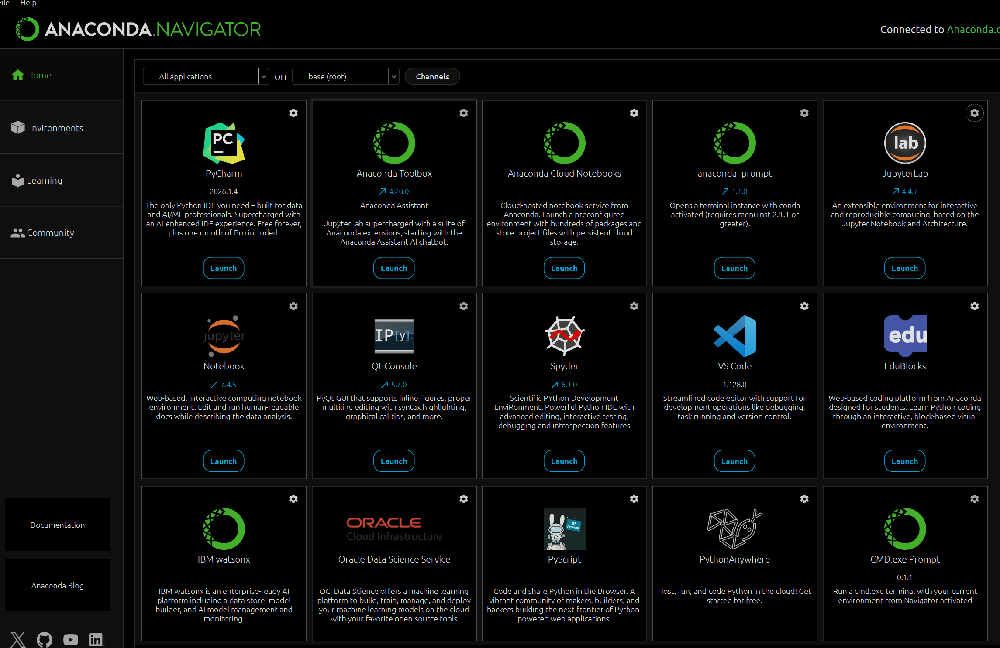
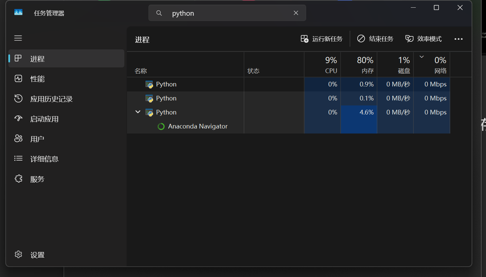
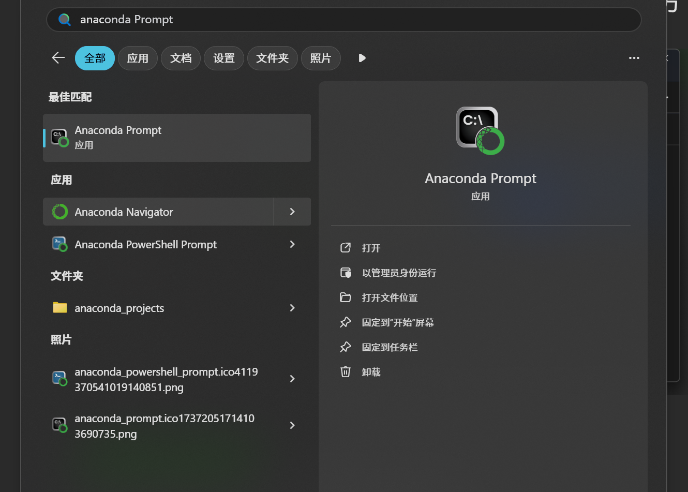

## 简介
Anaconda是一个强大的包管理器，专为数据科学、机器学习和科学计算而设计，它可以被理解为一个豪华精装版的Python

## 作用
### 提供虚拟环境
`Anaconda`可以为不同的项目提供不同版本的Python或不同版本的第三方库，可以让不同项目在不同版本的虚拟环境下运行而互不干扰

### 包管理器
`Anaconda`内置了`conda`这个包管理和环境管理工具，它的功能类似于`Python`自带的`pip`，但是功能更加全面也更加强大

### 开箱即用
`Anaconda`在安装时就已经预装了数百个数据科学和机器学习最常用的核心库，如`NumPy`、`Pandas`等，安装完成之后就能直接开始跑相关的算法，省去了环境配置的步骤

### 内置开发工具丰富
通过该软件可以一键启动多款开发工具

## 缺点
该软件的体积较大，且运行时占用的系统资源较多，如果电脑的存储空间不够可能导致软件启动失败，启动失败后重启流程如下：

### 关闭相应系统进程
按下键盘上的`CTRL + SHIFT + ESC`打开资源管理器，然后在上方的搜索栏中搜索`python`，随后右键关闭所有相关进程

### 重新启动软件
重新启动软件时建议通过命令行进行启动，我们可以开启`Anaconda Prompt`软件，开启后会打开一个终端，我们直接在终端中输入如下两条命令即可
`anaconda-navigator --reset
anaconda-navigator`

