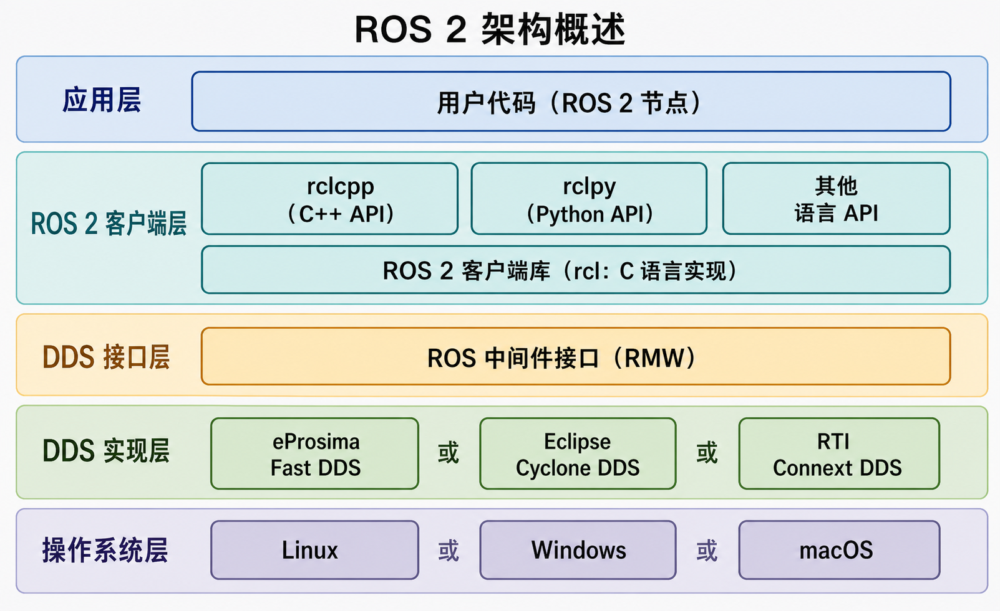

## 概述
`ROS2`（`Robot Operating System 2`）是一个用于构建机器人应用程序的开源软件开发套件（`SDK`)和[中间件](../中间件.md)。虽然名字里有“操作系统”但是它并不是像`Windows`或者`Linux`那样的底层操作系统，它是运行在宿主操作系统之上的，它主要是为了解决通信问题，为开发者提供了硬件抽象、设备驱动、进程间通信、工具和强大的生态库

## ROS的发展史
[ROS发展史](../Excalidraw/ROS发展史.md)

## ROS2系统架构

## 通信机制介绍
上述介绍中我们提到`ROS 2`主要作用是进行通信，在`ROS2`中，机器人系统的各个功能模块被拆分成独立的、单一职责的程序，我们称之为节点，节点之间的通信主要有以下三种方式
1. [[