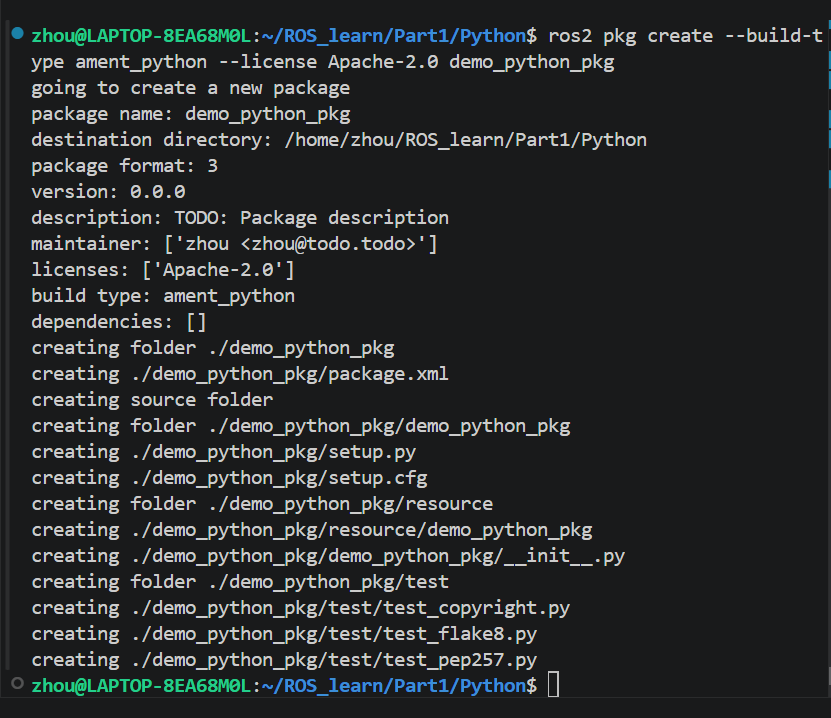
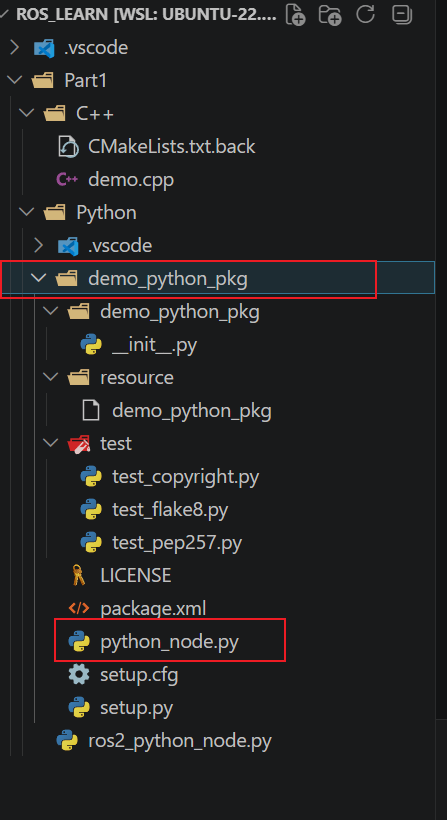
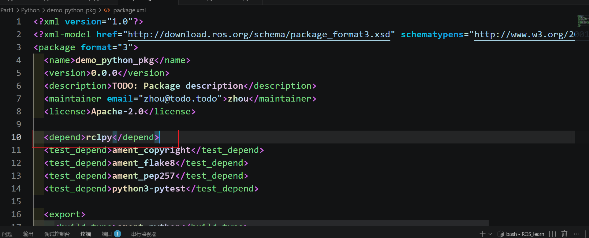
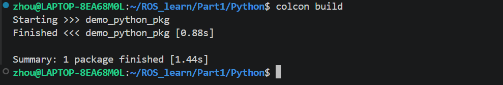
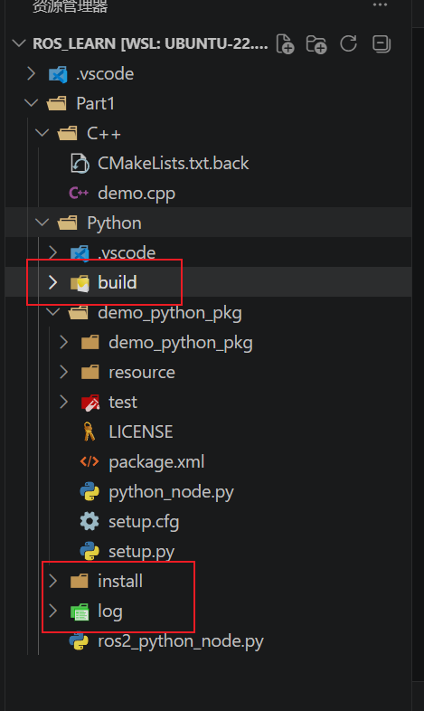
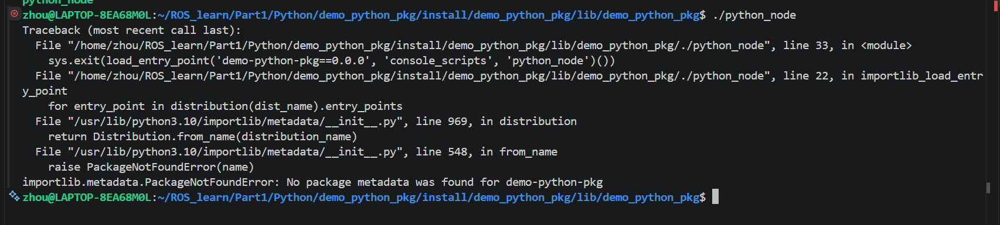

## 创建指令
```bash
ros2 pkg create --build-type ament_python --license Apache-2.0 demo_python_pkg
```
使用当前指令即可创建一个新的节点

### 命令解析
1. `ros2 pkg create`
	- `ros2`：`ROS 2`命令行工具
	- `pkg`：操作功能包
	- `create`：创建一个新功能包
	因此这前一段命令的整体意思就是：“创建一个新的`ROS 2`功能包
2. `--build-type ament_python`
	- `ament_python`：构建`python`包
	指定构建包的类型为`python`版本
3. `--license Apache-2.0`
	这个选项是在指定功能包的证书
## 创建结果
命令执行后的输出结果如下

从输出结果中我们可以清晰的看到在创建包的过程中产生了哪些新文件

## 添加节点
使用命令创建对应的功能包之后我们可以直接在其中添加对应的节点文件，这里拿[编写Python版本节点](编写Python版本节点.md)中的最小化节点代码作为演示，我们只需要右键新创建的功能包文件创建新的`python`节点文件即可



我们可以直接复用最小化`python`节点中的代码，将其中的代码复用过来之后稍作修改即可，文件中的代码如下
```python
import rclpy

from rclpy.node import Node

def main():

    rclpy.init();

    node = Node('python_node')

    node.get_logger().info('你好 Python 节点')

    node.get_logger().warn('你好 Python 节点')

    rclpy.spin(node)

    rclpy.shutdown()
```
和之前的最小化节点文件中的代码相比去除了调用`main`函数的部分，这是因为`ROS2`功能包会自动生成可执行文件来调用`main`函数，所以我们不需要在节点文件中主动调用`main`函数

## 注册入口
刚才我们提到节点中的函数会被`ROS2`自动调用，这是因为已经在 `setup.py`文件里注册了入口，我们只需要关注文件的最后几行即可，默认情况下是没有配置的，对应代码如下
```python
    entry_points={
        'console_scripts': [

        ],
    },
```
我们对该部分代码修改之后的结果为
```python
entry_points={
        'console_scripts': [
        'python_node = demo_python_pkg.python_node:main'
        ],
    },
```
主要增加了`'python_node = demo_python_pkg.python_node:main'`部分代码，这部分代码的结构为:**生成的可执行文件名 = 当前的功能包名.节点文件名:调用的函数名**

## 添加依赖信息
我们只需要修改对应的`package.xml`文件即可，我们只需要在文件中添加框中的一行即可，由于本次节点内容较为单一，所以对应的依赖项也很少


## 构建
上述前置工作做完了之后我们就可以尝试去进行构建了，构建对应的命令也较为简单，我们只需要到功能包的父目录下去执行`colcon build`命令即可

使用`colcon`命令进行构建还会导致[colcon构建冗余问题](colcon构建冗余问题.md)
## 输出结果分析
上述构建后输出结果，构建之后产生了三个新的文件夹，其分别是：`build`、`install`和`log`，这三个文件夹与功能包位于同一个目录下

其中`build`文件夹是构建过程中产生的中间文件、`install`就是保存构建结果的文件夹，生成的可执行文件就在该文件夹下

## 环境变量配置
当我们在指定目录里找到了功能包生成的可执行文件并尝试运行时往往就会出现报错

这里面报错表示找不到对应的文件，这就是程序在运行时查找[环境变量](../计算机基本概念/环境变量.md)导致的报错，因此接下来