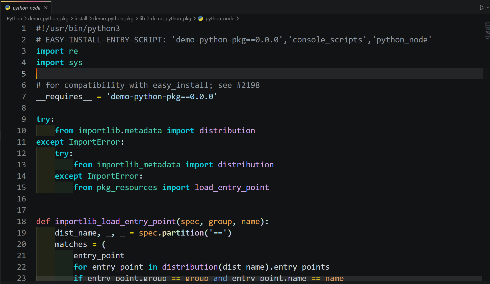

## 简介
当我们构建完一个功能包之后在对应的文件夹下我们可以看到最终的可执行文件，从文件夹中观察，它是一个无后缀文件，但是当我们使用`VScode`等代码编辑器打开它的时候发现，它其实是一个极简的`Python`脚本文件

仔细观察这个脚本文件我们发现其中的代码跟我们的节点文件中的代码貌似一点关系都没有

## 代码逻辑
简单介绍了一下这个启动文件的特点之后接下来我们就来深入了解一下其中的代码，这样我们就知道功能包的启动逻辑了
