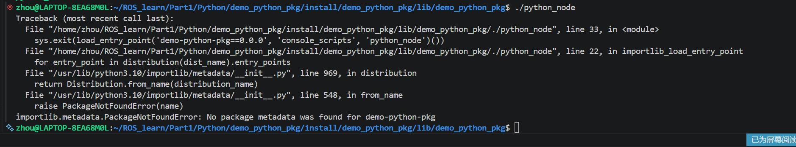

## 背景
在我们使用`colcon build`命令构建功能包之后所有的输出结果都被放在了当前工作空间的`install`文件夹里，但是到此为止系统的[环境变量](../计算机基本概念/环境变量.md)并没有被修改，因此当前终端感知不到这些生成的结果，如果我们此时直接输入命令`ros2 run demo_python_pkg python_node`，那么程序就会到系统默认的`$PATH`环境变量中去寻找生成的可执行文件，但是根本找不到，此时就会引发报错。如果我们到对应的目录下去直接运行也还是会引发报错，报错信息如下：

通过报错信息我们不难发现，主要的报错原因是因为在运行节点时系统找不到对应包的安装信息。
## 注入方式