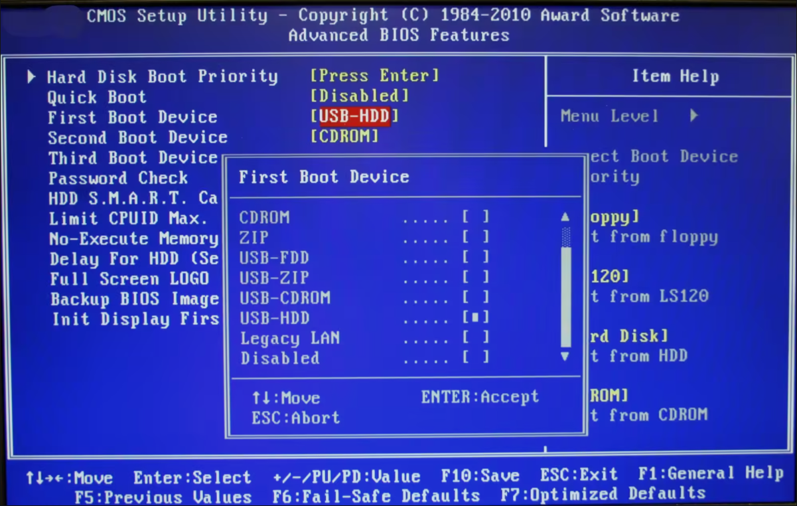
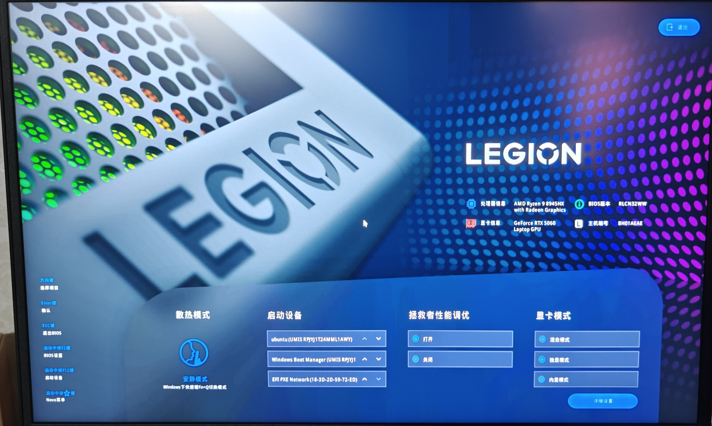

## 简介
本文主要介绍一下`UEFI`的相关知识，感受一下该引导分区模式和传统的`BIOS`模式想比有哪些区别

## 对比介绍
现在的电脑主板普遍采用的是`UEFI`(Unified Extensible Firmware Interface，统一可扩展固件接口)引导模式，这种新的引导模式已经开始逐渐取代了老式的`BIOS`引导模式。如果你现在在电脑开机时连续按下键盘上的`F2`按键就会进入`UEFI`界面，你可能在网上听别人说过电脑重启后按下`F2/DEL`进入的是`BIOS`界面，为什么这里又说成是`UEFI`界面呢？这其实是一个历史遗留问题，在早期的电脑中大家使用的都是`BIOS`，后来随着科技的发展电脑上又渐渐通过`UEFI`取代了`BIOS`，但是直接改名的话会显得比较生疏，因此为了照顾用户各大厂商还是会将其叫做`BIOS`界面，一般`2015`年以后的笔记本或者台式机几乎搭载的都是`UEFI`了

虽然二者之间的名字是混用的，但是二者的界面却有着巨大的差别，老式的`BIOS`界面色彩单调，通常只有黑白或者蓝白两种颜色，只能够使用键盘来操控界面中的选项，如下图所示：

而现代化的`UEFI`界面的色彩通常会比较丰富，也支持用鼠标进行界面操作，示例图如下：

在`UEFI`模式下，硬盘里面会有一个专门用来存放启动引导文件的独立空间，叫做`EFI`系统分区

我们也可以在`Windows`的磁盘管理器中看到对应的`EFI`分区，这个分区就像是一个公寓，公寓中有不同的房间，每个房间中都存放着不同系统的启动文件。在没有安装双系统时`EFI`分区中就只存放了`Windows`系统的启动文件，后续如果我们在安装系统时将启动分区也指定到这个分区时，`Ubuntu`会在改分区下创建一个文件夹，然后把自己的引导程序放入其中，并不会与`Windows`的启动文件产生干涉。