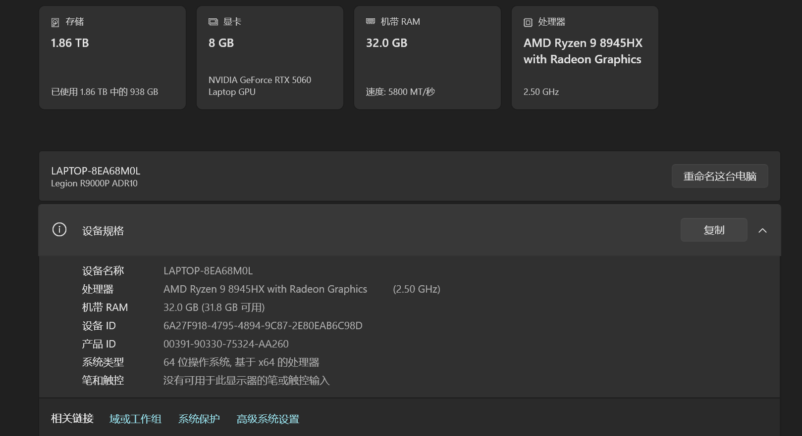
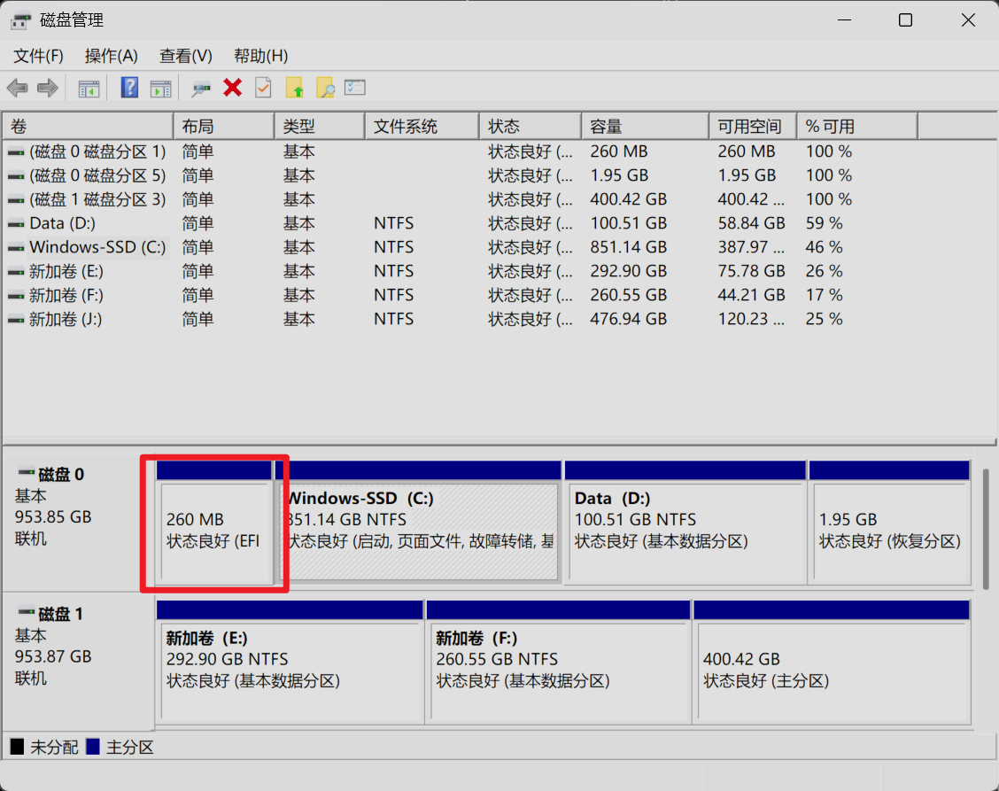

## 简介
上篇文章中我带着大家回忆了一遍我的`Ubuntu`安装历史，这次我就要开始教学一下如何在自己的电脑上安装双系统了，这次的内容不会太难，因为`Ubuntu 24.04`版本较新，因此面向用户的操作也更加友好，我们可以很轻易的完成双系统的安装。且这个版本的硬件支持也比较全面，极少出现安装之后调驱动的问题，只要你的硬件不是特别的新，一般都能实现开箱即用。本次我安装双系统使用的硬件平台是拯救者的`R9000P`2025款，核心配置如下图：

即便的你的电脑是2026款的也无需担心，因为一般情况下`Ubuntu`中驱动问题往往会出现在网卡和独立显卡上，我的电脑上搭载的是支持`WIFI7`协议的网卡，具体型号是联发科的MT7925。实测当前网卡可以在`Ubuntu`中稳定使用，因此即便你的电脑的网卡是新版网卡大概率也是不会出现掉网的情况的。至于独立显卡，当前我的笔记本上搭载的是50系显卡同样可以正常使用，目前市面上最新的显卡也就只到50系，因此显卡驱动的问题也无需担心

## 操作思路

### 存储空间分配
在动手安装双系统之前，我们需要先理清整体思路。首先要确认的核心问题是：**你需要为 Ubuntu 分配多大的硬盘空间？**

对于日常学习而言，分配 `200~300G` 通常绰绰有余。以我个人为例，安装 `Ubuntu` 主要是为了学习嵌入式开发，核心围绕 `ROS2` 展开，同时也会安装一些常用软件来体验 Linux 的软件生态。对我来说，`300G` 的空间已经完全够用。当然，如果你有存储大型文件或源码仓库的需求，可以结合实际情况适当扩容

### 启动分区选择
当你心里对总容量有了底，下一步就是**考虑如何进行空间细分**。我们知道，想要正常引导 `Ubuntu` 就必须有相应的启动分区。既然电脑上已经存在 `Windows` 系统，说明现有的启动分区是正常工作的。对于只有一块固态硬盘的单硬盘用户，其实可以直接将 `Ubuntu` 和 `Windows` 共用同一个启动分区

听到这里，你可能会产生置疑：把两个系统的引导文件放在一起，万一相互干扰，会不会直接导致系统崩溃？

要解释这个问题我们就需要简单的了解一下现代电脑的启动机制，现在的电脑主板普遍采用的是`UEFI`(Unified Extensible Firmware Interface，统一可扩展固件接口)引导模式，这种新的引导模式已经开始逐渐取代了老式的`BIOS`引导模式。如果你现在在电脑开机时连续按下键盘上的`F2`按键就会进入`UEFI`界面，你可能在网上听别人说过电脑重启后按下`F2/DEL`进入的是`BIOS`界面，为什么这里又说成是`UEFI`界面呢？这其实是一个历史遗留问题，在早期的电脑中大家使用的都是`BIOS`，后来随着科技的发展电脑上又渐渐通过`UEFI`取代了`BIOS`，但是直接改名的话会显得比较生疏，因此为了照顾用户各大厂商还是会将其叫做`BIOS`界面，一般`2015`年以后的笔记本或者台式机几乎搭载的都是`UEFI`了

虽然二者之间的名字是混用的，但是二者的界面却有着巨大的差别，老式的`BIOS`界面色彩单调，通常只有黑白或者蓝白两种颜色，只能够使用键盘来操控界面中的选项，如下图所示：

而现代化的`UEFI`界面的色彩通常会比较丰富，也支持用鼠标进行界面操作，示例图如下：

在`UEFI`模式下，硬盘里面会有一个专门用来存放启动引导文件的独立空间，叫做`EFI`系统分区

我们也可以在`Windows`的磁盘管理器中看到对应的`EFI`分区，这个分区就像是一个公寓，公寓中有不同的房间，每个房间中都存放着不同系统的启动文件。在没有安装双系统时`EFI`分区中就只存放了`Windows`系统的启动文件，后续如果我们在安装系统时将启动分区也指定到这个分区时，`Ubuntu`会在改分区下创建一个文件夹，然后把自己的引导程序放入其中，并不会与`Windows`的启动文件产生干涉。

`Ubuntu`的引导程序还比较智能，它在安装时会自动扫描并识别出旁边文件夹里存放的`Windows`文件，从而在开启之后向用户提供一个双系统选择菜单，便于用户进行系统选择

### 根分区
在`Windows`中有`C`盘，且该盘往往是作为系统盘存在的，里面存放了基本的系统信息。`Ubunut`虽然没有`C`盘，但是它有系统盘，它的系统盘是根分区。在`Linux`中根分区一般用`\`来表示，在逻辑上`Linux`系统的所有其它目录都是在这个目录下衍生的。它主要存放的内容如下：
- 操作系统的底层核心文件
- 系统级的配置文件
- 系统运行所需的库文件
- 通过系统包管理器安装的全局软件

### 用户分区
用户分区对标的是`Windows`下的系统盘以外的其它盘，它的作用是保存用户数据，在`Linux`下用`/home`来表示。这里面存放的内容完全由用户自己决定

### 分区取舍
在实际的系统安装过程中不单独分一个用户分区其实也没事，毕竟只要我们挂载的根分区之后，安装操作系统时系统会自动在根目录下创建对应的用户分区的。这里简单提一下单独建立用户分区的好处，

## 实操
接下来我们就可着手进行双系统的安装了，首先我们需要明确一下我们的操作思路，