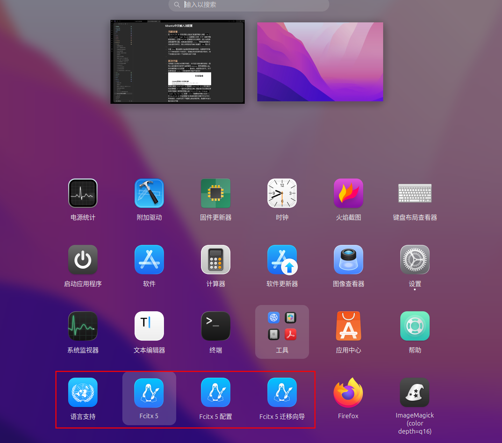
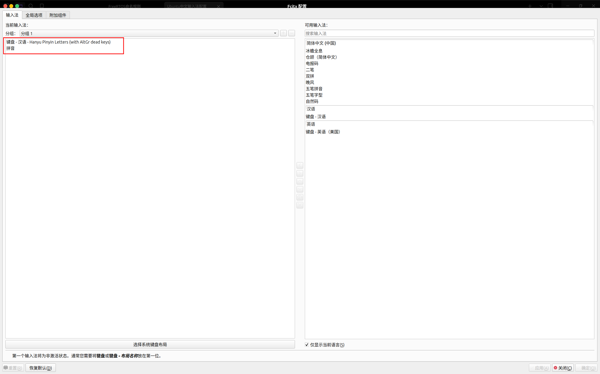
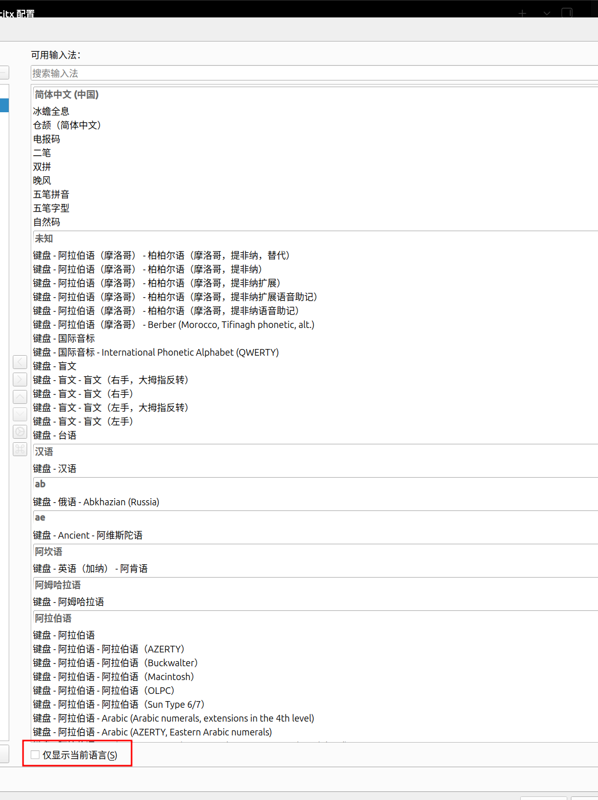

## 问题背景
在`ubuntu24.04`中系统默认给我们配置的输入法是`ibus`(`Intelligent Input Bus`)，这套输入法和`GNOME`桌面的集成度很高，，且和`Wayland`的兼容性也比较好，极少出现候选框偏移等问题。如果我们在安装`ubunut`时将系统的默认语言选择为中文，那么系统就会为我们配置好`ibus`输入法

尽管`ibus`是系统默认且稳定性极强的框架，但是在中文输入下的体验感却不是很好，使用起来会觉得有些不跟手。接下来我就会分享一下如何解决这个问题

## 解决方案
搜狗输入法想必大家都不陌生，作为国内知名度较高的一款输入法在很多中国用户会选择在`Windows`使用搜狗输入法。其实搜狗输入法也是有`Linux`版本的，但是有点古早，对于较新版本的`ubunut`系统兼容性可能不是很好

官网上看从`ubuntu16.04`支持到`ubunut20.10`，对于我们现在使用的`24.04`版本来说有点古老。因此我们在这里会更倾向于用另一款较新的输入法框架：`Fcitx`(`Free Chinese input Toy for X`)，这是`Linux`下最著名的输入法框架之一，在`Ubuntu24.04`中如果我们在系统安装时选择了中文作为系统语言，并且勾选了下载默认集合等选项，系统同样会为我们自动下载`Fcitx5`输入法框架

该输入法框架的中文输入体验就比`ibus`要好很多了，且可扩展性也比较强，我们可以配置它的外观界面以及词库等，正是由于这些可定制化的特性使得该输入法的上限变的很高，在本期内容我就会向你展示如何在`Ubuntu24.04`下配置一套操作体验极好的中文输入法

## 实操
由于有些人的系统中默认没有安装`Fcitx5`输入法框架，所以在这里提供一下安装该输入法的命令
```bash
sudo apt update
sudo apt install fcitx5 fcitx5-chinese-addons fcitx5-frontend-gtk3 fcitx5-frontend-gtk4 fcitx5-frontend-qt5 fcitx5-config-qt
```
安装完成之后我们需要将系统默认的输入法更改为`Fcitx5`，对应的命令如下：
```bash
im-config -n fcitx5
```
配置玩默认输入法之后我们需要先进行最底层的配置，我们在终端中输入如下命令可以直接唤起`Fcitx5`的配置界面
```bash
fcitx5-configtool
```
在配置界面中我们需要将左侧面板中原先默认的几个选项都删除，删除方法很简单双击目标选项栏即可删除，将默认选项全部删除完毕之后我们接下来还需要添加图中红色方框内的选项

在选择之前我们需要取消勾选底部的仅显示当前语言选项，否则我们就只能看到部分选项


如果没有生效我们可以执行
```bash
fcitx5-remote -r
```
命令来刷新输入法状态