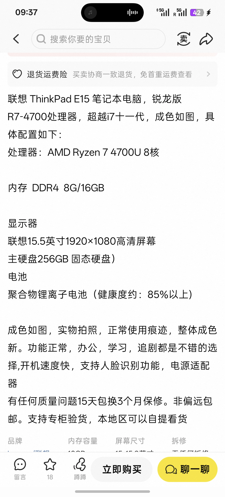
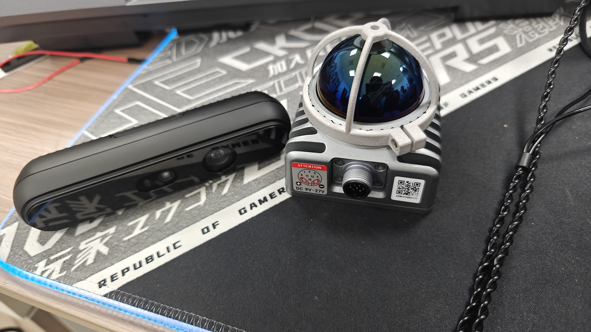
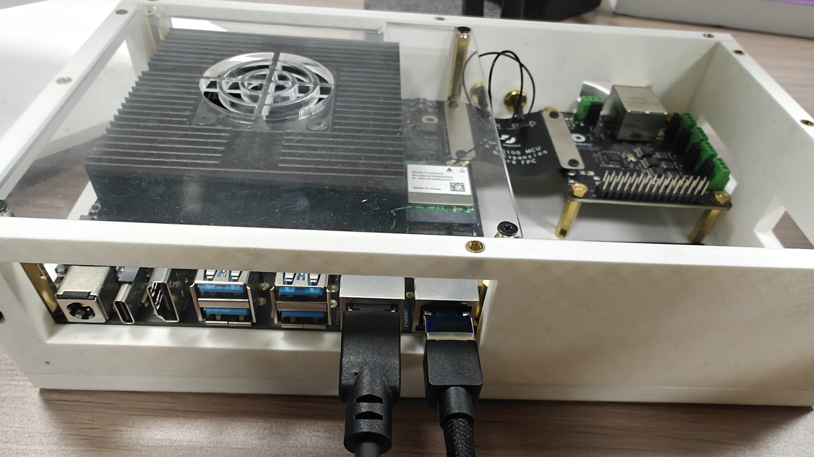
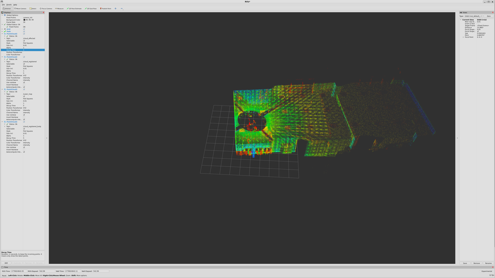

## 引言
作为物联网工程专业的本科生，早在大一上学期我们学校就开设了一门`Linux`相关课程，这门课当时只有三节课，当时我觉得这就是一门水课，以至于我现在连这门课叫什么名字都忘记了，当时这门课程也没有纸质考试，只需要写一个报告上交就行了。如果想要拿高分就只需要现场根老师交流一下学习心得就行了，当时老师在课上只教了一些简单的`Linux`操作命令，后面为了体验`Linux`操作环境就选择了在虚拟机里面安装`Linux`操作系统，后面结课的时候跟老师线下交流了一波，交流的过程还是挺顺利的，这门课后面的总评分也很高，这门课虽然并没有让我学到太多关于`Linux`系统的相关知识，但是让我知道了有这么个东西，并且还让还让我对这个东西产生兴趣。

## 第一次尝试
由于当时大一的时候我使用的笔记本是华为轻薄本且是我姐传给我的，所以那台笔记本的性能比较差，那台轻薄本的`CPU`型号是`Inter`的`8250U`，为了提升电脑性能当时还加装了内存条和固态硬盘。但是都没什么太大的效果，我在使用电脑的过程中能直观的感受到系统的卡顿。但是当时在虚拟机中运行`Ubuntu`的时候就极少出现系统卡顿的现象，其实更多的还是听网上很多人都在说`Linux`系统的操作效率会比`Windows`高，且用终端操作系统这本身就是一件让人感觉很高级的事情，毕竟影视作品中的黑客就是一直在用终端来控制电脑的。当时也是有着一些想装逼的想法在里面的，这就让当时的我萌生了安装双系统的想法。这样一来既能保留原有的系统资料不丢失还能有着更加流畅的使用体验。

当时我的操作是在网上购买一个外接的固态硬盘，然后将`Ubuntu`系统安装到外界固态硬盘中去，这样就能够实现拔掉固态硬盘时是`Windows`，插上固态硬盘后是`Ubuntu`，在物理上隔绝两个操作系统，防止二者之间出现干涉的情况。但是这套方案有着一些无法弥补的缺陷，在使用移动硬盘时读写速度会降级，且安全性较差（这点后面会提到）。当时安装完成之后其实也并没有我想象中那么好用，因为`Ubuntu`操作系统的操作风格和`Windows`相差太大，对于只接触过`Windows`的我来说使用图形化界面就像日常吃饭喝水一样，早已习惯了图形化界面操作的我来说这个跨度有点太大了，我时常会在`Ubuntu`的终端面前发呆，不知道该做些什么，有了明确的目标之后又不知道对应的命令应该如何使用。然后又只能转头去使用`Ubuntu`的图形化界面去进行操作，这种本末倒置的使用方式让当时的我非常难受。再加上当时安装的`Ubuntu`版本较为老旧，对于笔记本的硬件驱动支持的不是很完善，其中最致命的是网卡驱动，经常会出现安装后无法连接网络的情况。后面有一次用完电关机的时候系统没有完全关机我就直接拔掉了移动硬盘，这导致系统彻底崩溃，当时我觉得崩就崩了吧，反正现在又用不到`Ubuntu`，且`Ubuntu`的操作体验并没有让我想象中那么好，第一次尝试也就到此结束

## 第二次尝试
后来到了大二我换了新电脑，是联想的拯救者，它的性能是远超大一的那台轻薄本的，运行`Windows`的流畅度也很高。虽然平时的学习中在跨平台编译时偶尔也会用到`Ubuntu`，但是虚拟机的性能也能够满足我的需求了，如果不出意外的话在我接下来的大学生活中我应该不会产生安装双系统的想法了。有一次我在B站上看到了一个播主发了一期`Ubuntu`美化的教程，最终的美化效果类似于`MacOS`，这让当时的我大为震惊，又产生了安装双系统的想法，没错，这一次还是因为想装逼。但也不完全是，毕竟大一下学期到大二上学期的这一段时间里我也在不断的与`Linux`操作系统进行磨合。那时的我认为自己应该能够驾驭它了，所以我就开始了自己的第二次尝试，这一次的打法思路和上一次大体相同，同样是在移动硬盘中安装双系统。但是天有不测风云，当时我在安装双系统时选错的分区，导致我的`Windows`系统出现的故障无法正常启动了。这让当时的我如遭雷击，尝试了很多修复的办法，最终还是只能重装系统。系统恢复之后也没有心境去搞这些了，第二次尝试还没开始就草草结束了

## 第三次尝试
后面大二下学期我们学校给我们拨了一批设备，是`TURTLEBOT3`型号的`ROS2`小车，当时学校是原价`8000`左右一台购买的，最初是打算买来给大四学生上实训课使用的，每年也就只有实训的那一段时间会用到，大部分时间都是在吃灰。刚好我们物联网专业搬到的新的实验室之后空间大了不少，然后我们就向学校的老师去要这些设备，后面老师也是非常放心的把这些设备给我们了。拿到这些设备之后我们就开始去学习，学习过程中我们了解到了`ROS2`，我们发现`ROS2`与`Ubuntu`的适配做的最好，几乎是每一代长期支持的`Ubuntu`都有对应的`ROS2`版本。早期在学习`ROS2`的时候我们都是在虚拟机中进行操作的，后面随着时间的推移，我们想要进行的操作越来越复杂，从最开始的建图到后面的导航再到多机协同。很多时候都需要在现场进行长时间的调试。但是我的游戏本续航太差，且非常笨重，这个时候我为了能够减轻调试时的负担选择了从咸鱼上淘了一个二手的`ThinkPad`

虽然性能并不是很强劲，但是对于`Ubuntu`来说也够用了，我当时刚买回来的时候笔记本的硬盘容量是`512G`，一半用来装`Windows`另一半装了`Ubuntu`，后来感觉`Windows`的作用不是很大就全部刷成了`Ubuntu`，其中安装的版本是`22.04`，由于笔记本不是很新，所以这一次的安装没有像第一次那样出现掉驱动的问题，后面我就一直使用这台笔记本进行`ROS2`的学习

## 第四次尝试
其实到这里故事也就应该结束了，但是在大二下学期的中后期，一个其他学校的朋友购买了一个`livox的mid-360s雷达`，由于那一段时间他身边事情比较多，所以就希望我来帮他进行一下雷达的第一阶段开发，后来他把雷达模块和项目中的`RDK S100`都借给我了，

拿到东西之后我就开始尝试进行开发，起初遇到了一些小困难，因为他当时购买的太早了，以至于我开发的时候官方还没有在`Github`上更新该版本雷达的`SDK`，后续的开发还算顺利，但是当时最大的问题就是当尝试在`Rviz2`中查看实时建图结果时会出现卡顿的情况，这是因为`S100`的算力虽然不差但是图形渲染能力较弱。因此当时只能采取分布式可视化的操作，即在`S100`上运行`SLAM`节点在电脑端启动`Rivz2`，去订阅`S100`发布的话题，在电脑端查看节点的更新状态，在[MID-360s雷达操作手册](../MID-360s/MID-360s雷达操作手册.md)文章中有相关的操作教程，建图的效果如下：

当时为了能够在`PC`端最大限度的发挥独立显卡的性能，我采用了`Windows`的`WSL`进行部署，这个部署的过程也较为耗时，因此在那个时候我就在想：要是能给我的电脑安装双系统是不是就没那么多事了

真正让我下定决心的是当时工作室那边还有一个机械的学长，他当时在自己搞机械臂，他从最底层的`SDK`开始写起，一点点搭建机械臂的操控架构。当时他给我们演示的时候我发现他就是在自己的电脑上安装了双系统。这就让我下定决心自己也要在电脑上安装双系统，这次我打算直接安装在电脑内部，而不是安装在移动硬盘中