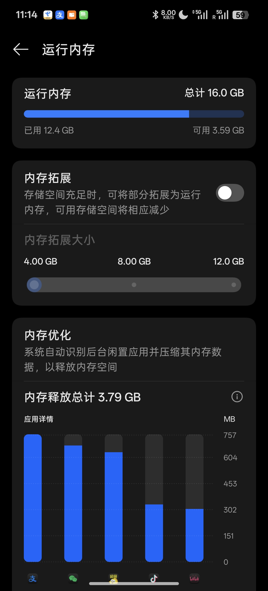

交换分区在`Linux`下用`/Swap`来表示，它的作用是为系统充当虚拟内存，这个功能乍一听感觉很高端，居然能为系统系统虚拟内存。尤其实在当下这个内存条价格居高不下的市场行情下，虚拟内存听起来太有吸引力了。其实这个功能并不算稀奇了，现在不少手机都支持这个功能，

手机的内存扩展其实扩展的也是虚拟内存，到这里你可能会好奇，这些虚拟内存是从哪来的？其实这些虚拟内存是从硬盘中分出来的。由于硬盘的读写速度和内存相差较大，所以虚拟内存更多只能用来救急，并不能像物理内存一样使用。在`Ubuntu`中虚拟内存的主要作用是缓解内存压力和保证休眠模式正常运行，这里的休眠模式和我们`Windows`下的睡眠模式有着巨大的差距

在`Windows`下的睡眠模式是指系统关闭屏幕硬盘等耗电设备，但是内存仍然保持通电状态，因此可以在短时间内快速唤醒。在这种模式下电脑会持续耗电，一旦电源耗尽，内存种的未保存数据就会丢失

`Ubuntu`种的休眠功能相较于睡眠就来的更加彻底，当我们开启了休眠模式之后系统会将当前内存种的数据以快照的形式保存下来，然后存放到硬盘中。这样的话唤醒速度会比较慢，但是由于硬盘断点数据不丢失的特性，电脑不会再消耗电量，我们可以把电脑完全断电甚至把电池扣下来都没事

了解了休眠功能的运行流程之后我们不难发现，想要将内存中的数据保存起来就需要在硬盘上划分一片区域来单独保存内存中的信息。交换分区就是用来专门保存内存信息的