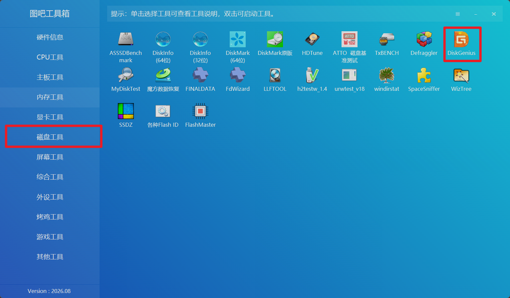
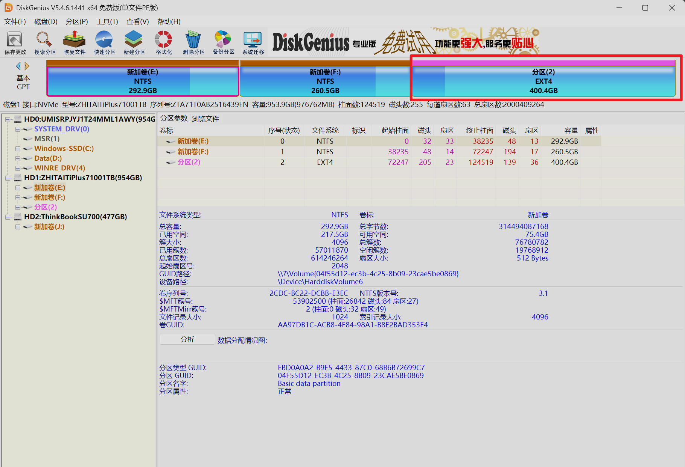
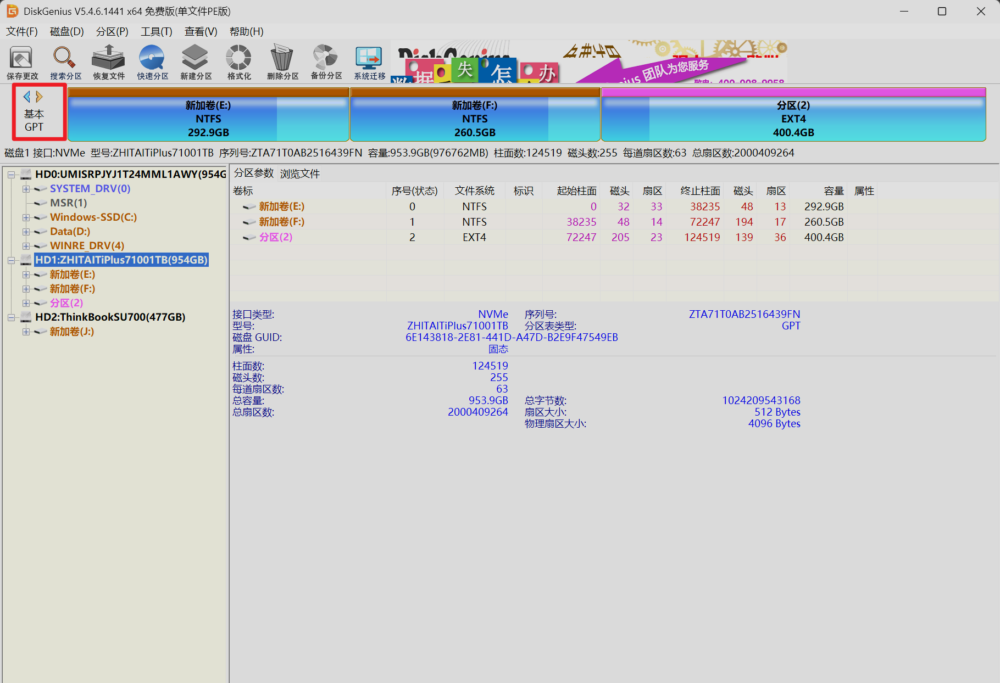
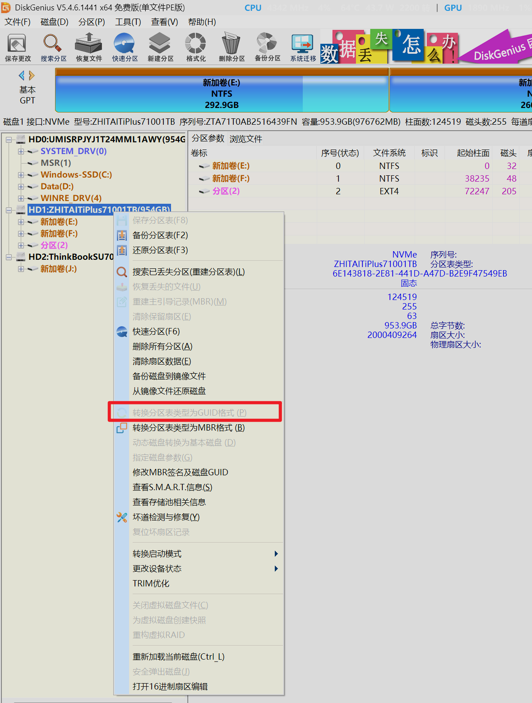
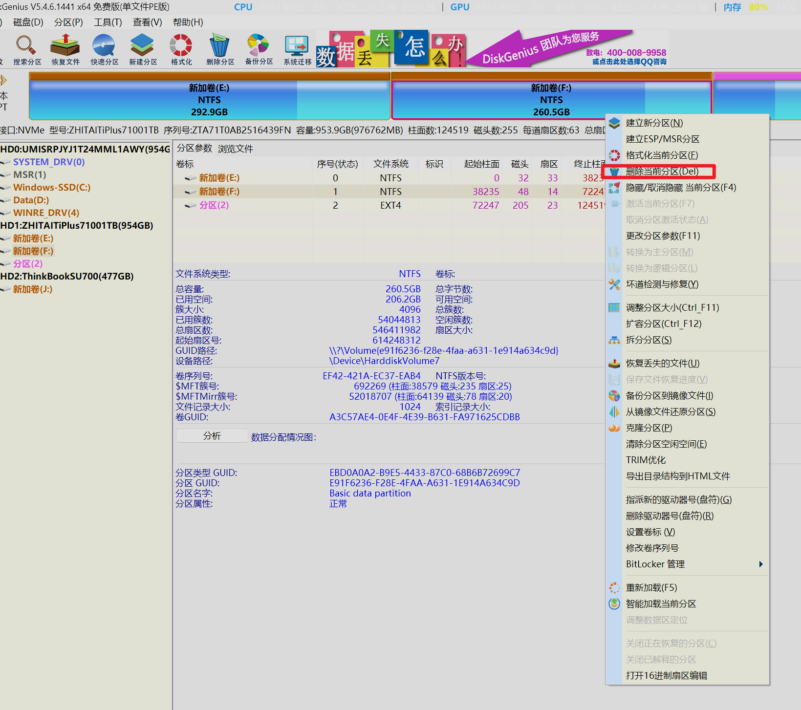
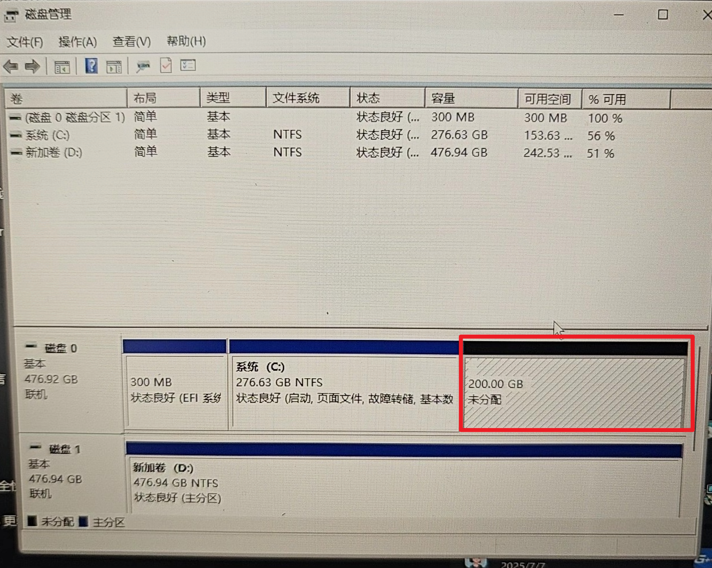
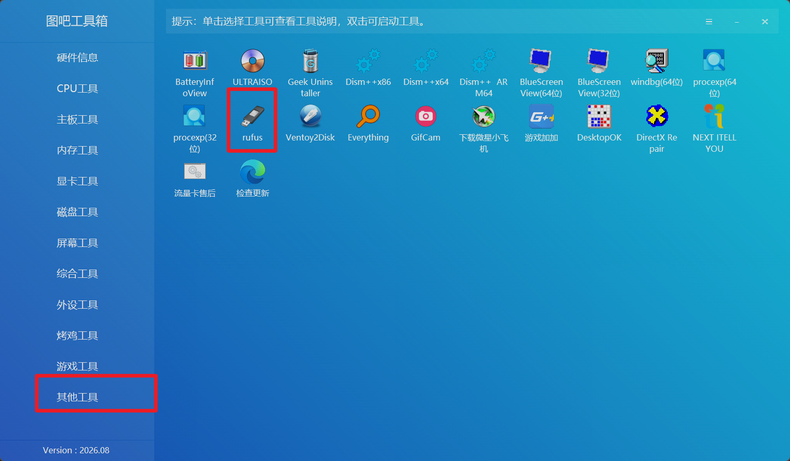
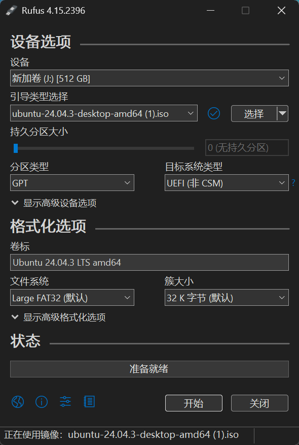

## 简介
前面做了那么多铺垫，接下来我们终于可以进行双系统的安装环节了，相信只要你看完了理论部分的内容，实操起来就没有什么问题了

## 工具软件
在安装双系统时我们肯定离不开对应的工具软件，我们在安装双系统时主要需要做两件事：制作启动U盘和调整电脑硬盘空间。制作系统启动U盘我推荐使用`rufus`软件，调整电脑的硬盘空间我推荐使用`DiskGenius`软件。比起单独安装这两个软件我更推荐直接安装图吧工具箱，其中就包含了这次我们会使用到的两个软件，且其中还还包含其它的工具，如果大家有需要也可以自行探索。该软件的官方下载网址为
`https://www.tbtool.cn/`

## 硬盘调整
在下载好了对应的工具软件之后我们就需要进行硬盘空间的调整了，首先我们需要在当前的电脑中压缩出合适的空间空间，这依据你的实际需求进行调整。我们这里在图吧工具箱中使用`DiskGenius`软件来压缩可用空间，我们在软件的磁盘工具这一栏中双击右上角的`DiskGenius`软件即可

我的电脑现在已经安装了双系统，我的电脑目前是`2TB`的硬盘空间，由两根`1TB`的硬盘组成。我将系统的根目录挂载在了`D盘`，所以在软件中就可以直观的看到对应的分区使用情况，`ubuntu`系统的磁盘格式为`EXT4`

这里有一个小贴士，如果你跟我一样电脑里面也是有两根硬盘，那么推荐你注意一下自己第二根硬盘的数据格式，

红色方框中显示的就是硬盘的分区格式，你的第二根硬盘这里显示的的结果有可能是`MBR`，如果你显示的是`MBR`的话这里建议你将其转换为`GPT`格式。转换的方式也很简单，我们直接在软件中右键当前硬盘，选择转换分区为`GUID`格式

由于我这里已经是`GPT`格式了，所以这个选项无法选择，如果你的硬盘是`MBR`格式那这个选项就能直接选择并生效，这里更改硬盘分区模式是为了于`UEFI`模式相契合

我们创建了新的分区之后接下来再删除分区即可获得未分配空间

我们选中指定分区然后右键选择删除分区即可，到这里我们的分盘操作就结束了，我们可以在系统的磁盘管理器中看到对应的磁盘分配情况，如果能看到灰色的未分配分区那就说明基本成功了

### 启动盘制作
接下来我们就要开始制作启动`U盘`了，制作启动`U盘`需要一个`8GB`以上的`U盘`，然后还需要获取对应的系统镜像，我们本次安装演示使用的是`Ubuntu24.04`版本的系统，大家可以到官网下载
官网的下载地址为：[官网下载地址](https://ubuntu.com/download/desktop)
国内的清华源下载地址为：[下载地址](https://mirrors.tuna.tsinghua.edu.cn/ubuntu-releases/)
下载完成之后我们需要借助图吧工具箱里面的`rufus`软件来制作启动`U盘`

我们打开软件之后保持如图所示选项即可，需要改动的点可能是将分区类型从`MBR`更改为`GPT`

确定镜像和格式化`U`