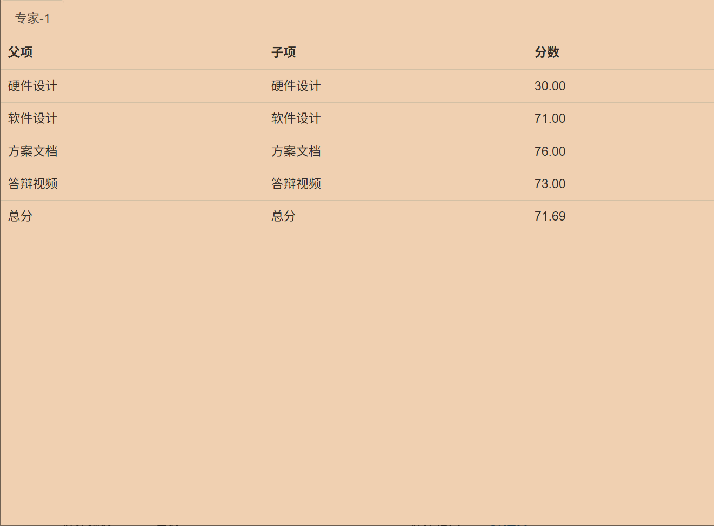

## 引言
本届西门子杯最终的成绩为

为了下次或者后来的同学能够从中获得些许借鉴，因此决定做一个复盘

## 还算成功的软件
从最后的得分情况来看软件部分不管是代码，策划书、方案文档还是答辩视频，分数都不低，而且软件部分的分数占比也比较高，所以最终我们的总得分也比较好看，这里主要是总结一下软件写的成功的地方

### 重要的参照
在我看来软件部分我们最终能够拿到还不错的成绩主要是因为我们队伍中的成员在`Github`上找到了第一届工业嵌入式赛道的省一作品，这对我们后续的软件代码架构以及方案文档的编写提供了重要的参照

### 功不可没的成员
当然这和我们队伍中大部分队员都是偏软的特性有着密不可分的联系，队伍中的三名队员都比较擅长代码以及方案文档的编写

## 失败的硬件
### 客观因素的不可抗力
从最终的得分结果来看，硬件部分的得分可以说是惨不忍睹，只拿了30分，在软件部分的得分面前显得尤为割裂，同时硬件部分也是在正常比赛当中耗时最多，踩坑最多的环节，因此这次的复盘中心就是硬件部分。

我始终觉得硬件部分的题目是比软件部分要难的，难点主要是硬件的不确定性太高了。对于软件来说，代码编写好之后只要环境不发生变化，那么代码不管什么时候就都可以运行，而且软件部分的问题大多都可以借助`AI`的力量

但是硬件就截然不同了，可能你今天上午刚焊接好一个电源板，可以正常输出电压电流，到了下午再试一下你就惊讶的发现没有输出了

你可能听起来感觉有点夸张，但是如果你真的自己设计过硬件电路，并自己手动焊接，你就能感同身受了

还有一个很重要的点就是硬件部分的问题`AI`都爱莫能助，遇到问题只能自己想办法去排查，物联网专业属于一个软硬件结合的专业，我们学校的物联网更多是偏软一点，这点从我们物联网专业没有开设模电课程就可见一斑

因此我们在进行硬件设计的时候就会很吃力，焊接经验也比较匮乏，早期的几个版本很多问题并不是出在电路设计上，单纯只是因为我们的焊接手法过于粗糙，导致虚焊等问题，这也浪费了我们不少时间

### 主观下的决策失误
其实硬件部分的赛题在比赛之前一个月就发出来了，参赛选手有一个月的时间可以进行硬件设计。当时硬件赛题公布出来的时间刚好是五一假期前两天，当时我们队伍中的几名成员聚在一起讨论该如何处理硬件部分的内容。经过一番商议我们决定采取后发制人的策略，当时的我们觉得：“我们没有硬件设计的经验，即便是一开始就投入精力去进行硬件设计，也不见得就一定能取得多好的结果，不如先缓缓，等到后续有人设计出来初版了我们再在该基础上进行二次设计，这样即省时又省力”。然后五一假期那两天参赛的队员大都回家探亲或者外出游玩了。

后来的确有人设计出来了对应的硬件版本，我们也尝试手动去复刻了，最初的几个版本都以失败告终，最终我们持续尝试也得到了几版勉强能用的硬件

我们当时每一块板子都只准备的一份，这就导致当电源板在软件赛那三天中突然暴毙时，我们一时间自乱阵脚，只能临时焊接，虽然最终补救回来了，但是也影响到了当时软件代码编写的节奏，因此硬件部分的板子理应多准备几份备用，以防出现不测
#### 致命失误
当时我们的电源板是功能相对正常的，可以将`20V`到`36V`的电压降低到`5V`左右，但是问题是当时尝试用电源板给西门子杯开发板进行供电的时候短时间内可以正常供电，但是超过10秒开发的电源指示灯就会开始闪烁，且使用电源板给`ADC`采样板供电的时候也会导致开发板无法读取到对应数据。这让我们一时间摸不着头脑。最终我们在录制视频的时候在进行`ADC`部分的功能演示时我们使用了电脑的`USB`口进行供电，这就导致电源板后面的部分都没有分了

当然这也是没有办法的办法，即便我们当时使用电源板进行供电估计也无法得到想要的结果
## 总结
总体来看最终的成绩还算说的过去，软件部分发挥的不错，硬件部分由于自身的设计经验缺乏以及动手能力较差导致最终的结果不堪入目。最终我们无法挺进国赛，留下了些许遗憾，但是老实说最终的结果也超出了我的预期，我没有想到第一年打这个比赛就能够拿到省一的成绩，比赛那三天我们的队员都熬了通宵，白天的课程也都请了假。最后一天晚上我们上传完所有资料之后已经是夜里12点了，我们三个队员一起走回宿舍，那也是一个难忘的夜晚
