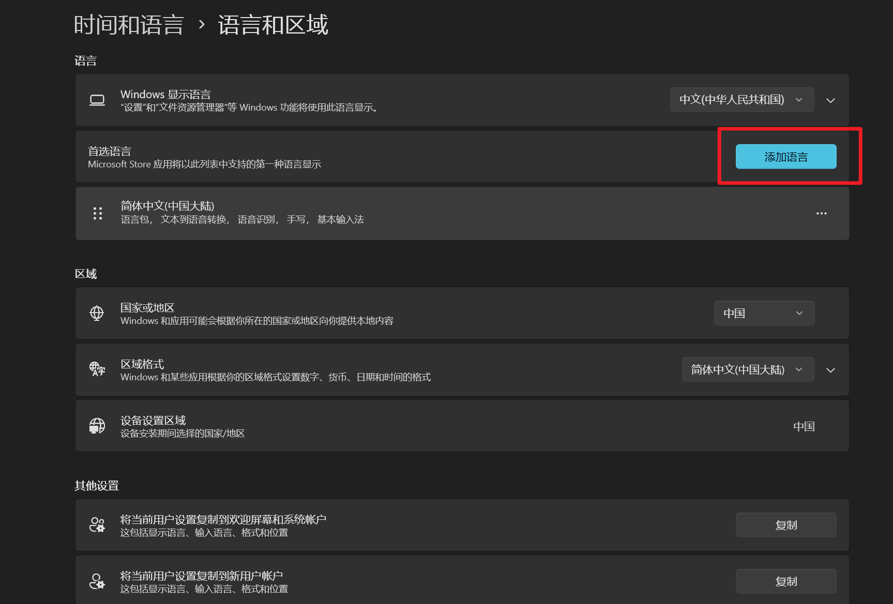
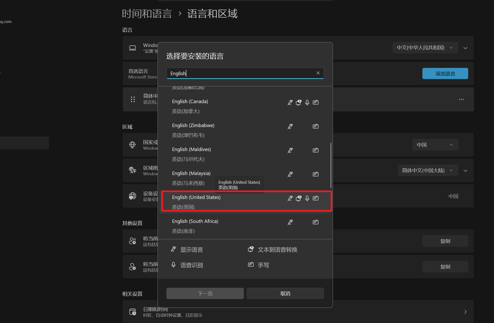
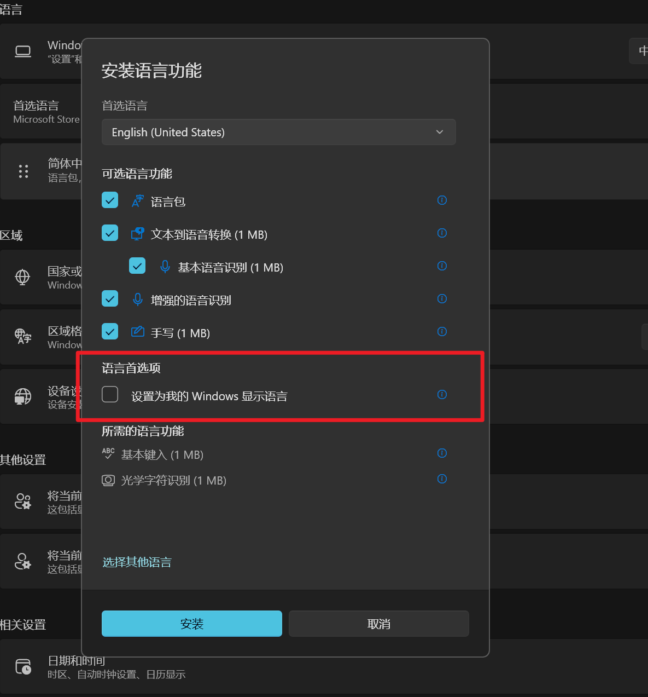

## 简介
在`Windows`下我发现自带的输入法有一个用起来很难受的问题，就是输入法的状态是全局共享的，即不同软件之间共享中英文状态。这点在日常使用中会让我感觉很变扭，假设你正在编写代码，突然有一部分内容你想不起来了，然后切换到`AI`软件中用中文询问相关内容，了解之后再切回来，直接开始写代码你就会发现你的输入法还是中文。这就会让我感觉很难受，为什么不能相互隔离，互不影响呢？实现我在聊天软件中默认使用中文输入法，在编程软件中默认使用英文输入法。在一款软件中切换输入法之后不会影响到其它软件的中英文状态，省去每次切换软件后首先需要切换输入法的问题，本次主要介绍的就是输入法切换的问题

## 解决方案
首先我们需要了解一件事：`Windows`是无法实现像我们想象的那样为每个软件都保留自己的中英文输入法状态，但是可以为不同的软件配置不同的输入法。因此，我们接下来解决问题的思路就是为电脑再增加一个英文输入法，这个很简单，具体的操作流程如下：
首先打开电脑的设置，在语言和区域部分选择添加语言

在接下来的界面中选择添加英文输入法

选择好之后点击下一步

这里除了将英语设置为`Windows`显示语言之外其它的选项都要勾选

到这里我们的基本配置就结束了