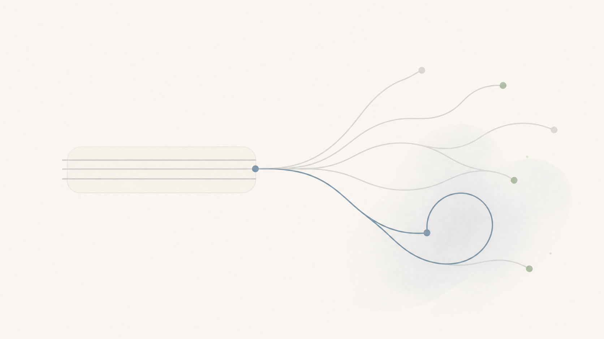
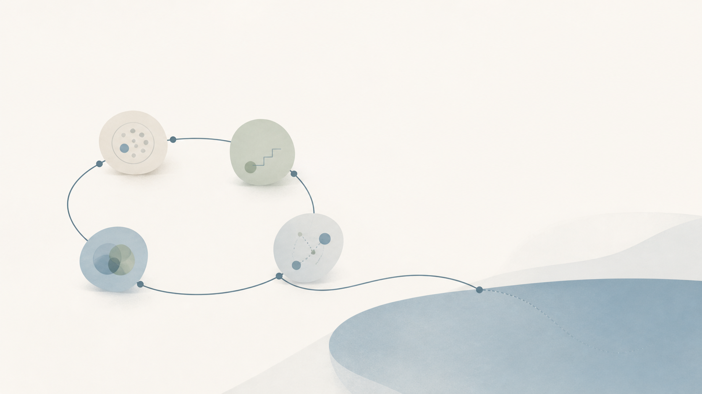

## 什么是学生思维

学生思维并不是学生特有的思维方式，而是一种长期处于明确任务、标准答案和外部评价中形成的行为惯性：习惯等待别人定义问题、规定行动路径，再根据外界评价判断自己的价值

## 学生思维如何限制我们
它对我们最大的负面影响不是让我们不努力，而是让我们只在被要求的时候努力，有人出题我们就去寻找答案，有人安排我们就去完成任务，没有明确的指令我们就不知道下一步该干什么，久而久之我们会越来越擅长服从和执行，却很少主动追问，这道题值得做吗？这个规则合理吗？除了完成要求还有没有更好的方法？

学生思维真正限制我们的不是知识也不是能力，而是我们把思考交给出题人，把选择交给指定规则的人再把自己的价值交给负责评分的人。在学校里这套方法很有效，目标有人规定，范围有人划定，结果也有明确的评价标准，只要遵守规则完成要求，我们就能得到对应的分数

但离开学校以后我们面对的不再是一张设计好的试卷，很多事情没人布置，很多事情没有标准答案，也很少有人因为我们足够辛苦就给我们奖励

### 1、用服从代替判断
接到要求，第一反应是思考怎样完成，而不是为什么要这么做，看到规则，首先想到怎么去遵守，而不是它究竟在解决什么问题。做课程设计时只想着对照评分表完成要求，却没有考虑项目到底解决了什么问题

服从本身没有错，我们与他人合作需要遵守基本秩序，生活在社会中也需要遵守必要的规则，真正的问题是当服从变成习惯，我们的判断力就会慢慢退化，最后只关心自己有没有按照要求行动，却不再关心目标是否合理，方法是否有效

独立思考并不是让我们什么都反对，盲目服从和盲目反抗看起来相互对立，但其实都没有经过独立判断。真正的独立是我们要先理解目标，再决定如何行动，既能遵守对应的规则也能看见规则解决不了的问题

### 2、用努力证明有效
学生时代只要认真听讲，按时完成任务，过程也能够得到一定的分数，于是很容易形成一种感觉：只要自己足够辛苦，就应该获得回报，可现实最终检验的是我们的付出有没有带来改变，投入了多少时间，承受了多少压力，只能说明成本很高，不能说明方向正确。努力是投入，结果才是产出。这并不是否定你的努力，而是防止你用努力来感动自己，却从来不检查结果。

为一次比赛连续熬夜，看起来投入了很多时间，但如果没有不断验证方案是否可行，熬夜只能证明成本很高，不能证明方向正确。做完一件事，不要只问我付出了多少，还要问这些付出最终留下了什么？你解决了什么问题？形成了什么能力？创造了什么结果？如果什么都没有留下，那么我们需要重新审视一下自己当前的方向

### 3、用标准答案代替真实反馈

面对重要选择，总想着先确认那个答案正确，怎样做才不会失败，但现实中的很多问题本身就是开放题，同一个选择，即便是由同一个人做出，在不同阶段和不同条件下，也可能得到完全不同的结果。如果一直等待标准答案，我们就容易把犹豫误认为谨慎，把不行动误认为没有犯错，想学习一项技术时，反复比较路线和课程，却迟迟没有完成一个最小项目

可即使什么都不做，时间依然在产生代价。与其反复追问这样做到底对不对，不如在风险可控、成本较低、结果可逆的情况下，先迈出最小的一步，让现实给我们反馈，结果有效就继续投入，结果不好就及时调整。很多方向不是我们想清楚以后才出现的，而是在行动和修正中逐渐形成的

## 从答题者到问题解决者

所谓问题解决者思维，就是不再等别人交付一道完整的题目，而是主动发现问题、判断价值、设计行动，并根据反馈修正方向
面对一件事可以先问四个问题：
- 我真正需要解决的问题是什么？
- 现有的规则是否仍然有效？
- 我现在能够采取的最小行动是什么？
- 我应该观察什么反馈，并根据什么标准调整方向？
这四个问题可以让我们从服从转向判断，从完成任务转向解决问题，从等待评分转向创造价值，当没人安排时我们依然能发现值得做的事，当没有标准答案时我们依然能够判断和行动。当结果不理想时也能够及时调整，而不是等待别人给我们下结论

## 真正的毕业，是收回思考和评价的权利
学生身份会随着毕业自动结束，但学生思维并不会自动消失，真正的毕业是我们不再把思考交给出题的人，不再把选择交给制定规则的人，也不再把自己的价值完全交给负责评分的人。真正的毕业，不只是离开学校，而是在没人出题时依然能够发现问题，在没人评分时依然知道一件事为什么值得做