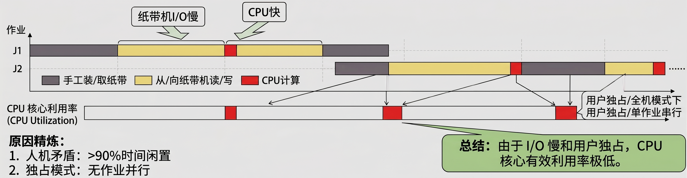
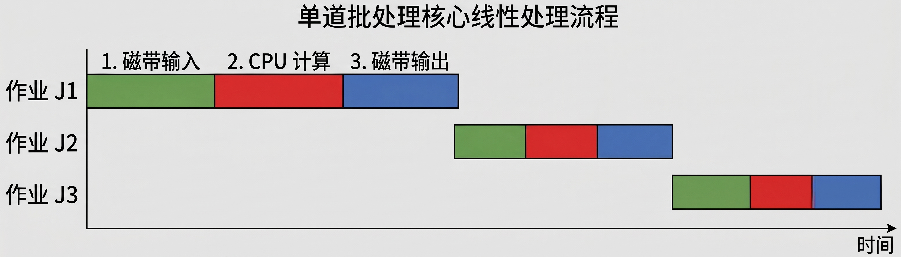
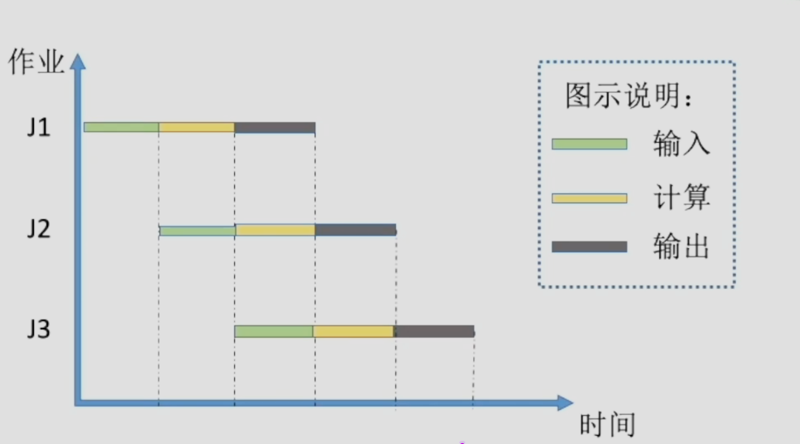

## 引言
本文主要介绍一下操作系统的发展历程

## 手工操作阶段
在早期程序员使用纸带机进行输入，计算的运行速度很快，但是运行结束之后计算机又要花费很长的时间在纸带机上将对应的运行结果输出出来

## 缺点
用户独占全机、人机速度矛盾导致资源利用率极低

## 批处理阶段
### 单道批处理系统
引入脱机输入/输出技术，并由监督程序负责控制作业的输入输出

#### 主要优点
缓解了一定程度的人机速度矛盾

#### 主要缺点
内存中仅能有一道程序运行，只有该程序运行结束之后才能调入下一道程序，CPU有大量时间是在空闲等待`I/O`完成，资源利用率仍然很低

### 多道批处理系统
操作系统正式诞生，每次往内存中读入多道程序

#### 主要优点
多道程序并发执行，共享计算机资源，资源利用率大幅提升，`CPU`和其它资源更能保持“忙碌”状态，系统吞吐量增大

#### 主要缺点
用户响应时间长，没有人机交互（用户提交自己的作业之后就只能等待计算机处理完成，中间不能控制自己的作业执行）

### 分时操作系统
计算机以时间片为单位轮流为各个用户/作业服务，各个用户可以通过终端于计算机进行交互

#### 主要优点
用户请求可以被即时响应，解决了人机交互问题。允许多个用户同时使用一台计算机，并且用户对计算机的操作相互独立，感受不到别人的存在
#### 主要缺点
不能优先处理一些紧急任务，操作系统对各个用户/作业都是公平的，循环的为每个用户/作业服务一个时间片，不区分任务的紧急性