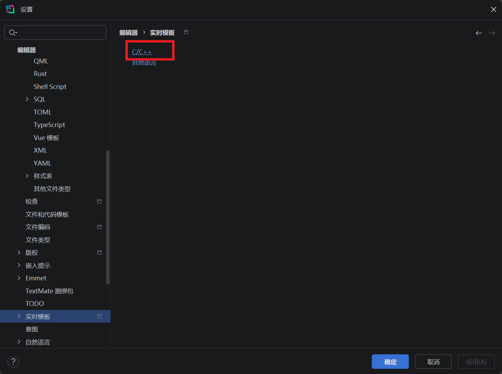
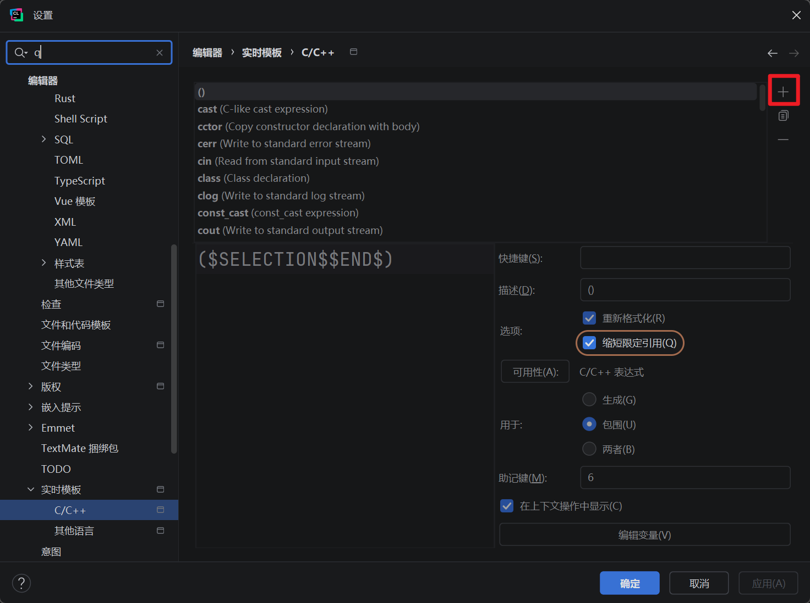
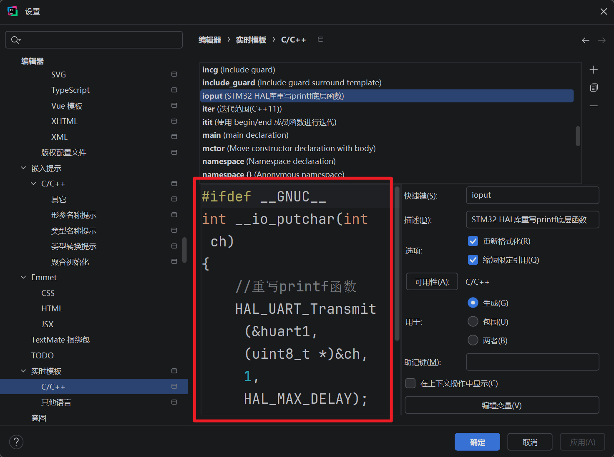
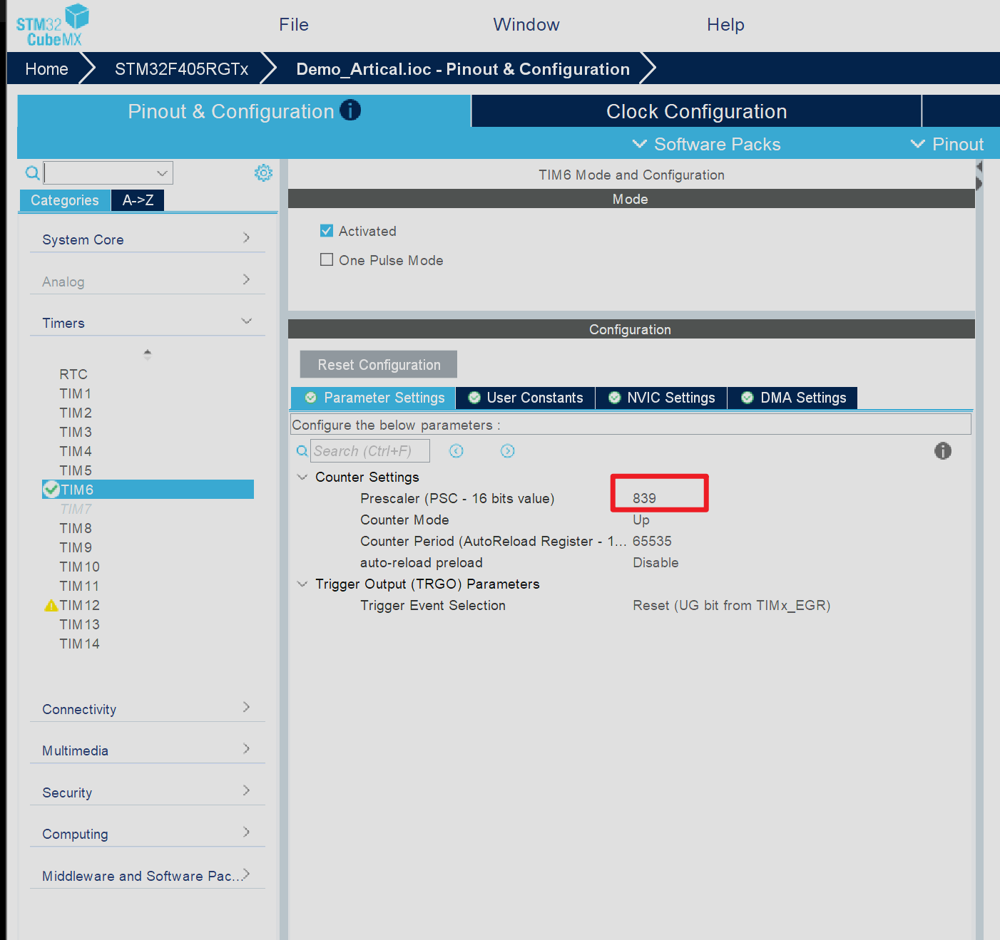
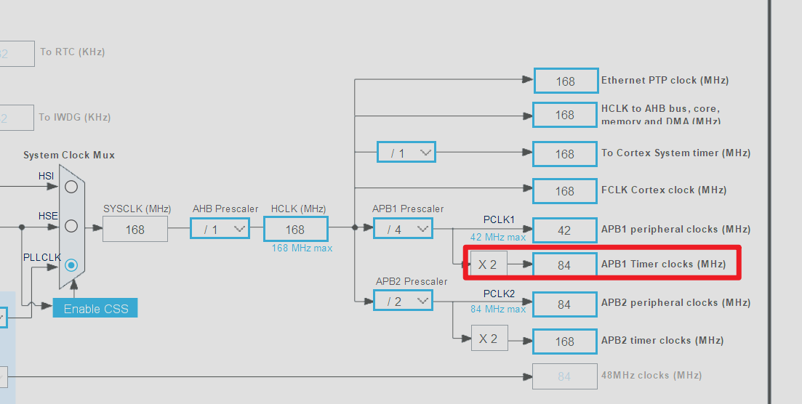
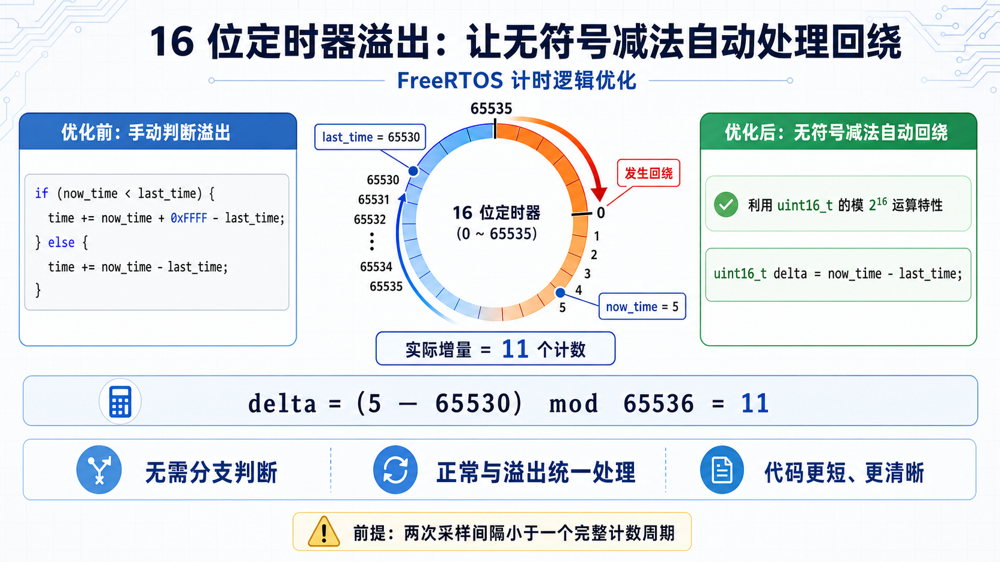

## 引言
在上一次的文章中我们了解了如何进行`CLion`的项目环境配置，成功的实现了程序的基本构建。大部分单片机开发者早期都是使用`Keil`等软件进行程序开发的，包括我也是一样，从一款开发工具过度到另一款开发工具是一件很困难的事，这并不是因为新工具有多么的难用而是因为我们早已适应了去使用旧软件，一个人的开发习惯是很难去改变的，例如我们使用`CLion`进行文件的添加和删除时无法像之前使用`Keil`那样直接通过图形化界面进行添加，我们需要自己去编写对应的`CMake`语句，这不管是对于新手还是老手，都是极具挑战性的，但是不要灰心，因为你现在已经迈出了最难的第一步

在本次文章中我会介绍如何最大化发挥`CLion`作为现代`IDE`的优势，本期我们依旧会使用`CLion`去进行无人机项目的进一步开发，本次开发过程中我们会感受到`CLion`的魅力

## 实操

### 钩子函数简介
本次开发同样是基于上一次文档中的项目进行的，如果没看也没关系，自己创建一个新的项目也行，接下来我们直接进行项目的进一步开发。首先我们先在`CubeMX`中进行一下项目的配置，我们点开`FreeRTOS`中的`Config parameters`选项

我们本次需要关注的内容是`Hook function related definitions`的相关内容，这部分的选项大多都是`FreeRTOS`给开发者预留的接口函数，这些选项对于日常的报错排查和程序调试来说非常重要，这也是我们本次介绍的重点

#### 空闲任务钩子函数
- **触发时机：** 当系统中没有任何“就绪态”任务需要运行时，空闲任务便会被不断循环调用
- 对应选项：`USE_IDLE_HOOK`
    
- **关联函数：** `vApplicationIdleHook(void)`
    
- **典型用途：**
    
    - **电源管理：** 在这里编写让 MCU 进入低功耗模式的代码。当有任务就绪被唤醒时，MCU 自动退出低功耗
        
    - **后台监控：** 执行一些优先级极低、不影响实时性的后台自检代码
        
- **注意事项：** 不能在这个钩子函数中调用任何会导致阻塞的函数（如延时函数等），否则系统会彻底卡死

#### 滴答定时器钩子函数
在`FreeRTOS`中，滴答定时器是整个操作系统的心跳，复制驱动任务调度、软件定时器和延时等功能，通常情况下，它的频率是`100`到`1000hz`（即每100ms或1ms产生一次中断）

这里需要辨析一个问题：`FreeRTOS`中的定时器和系统的硬件定时器的区别，这个问题可以在[硬件定时器 VS 软件定时器](硬件定时器%20VS%20软件定时器.md)文章中得到答案。滴答定时器钩子函数通常是由硬件的`SysTick`产生的，因此它的准确度很高。
- **触发时机：** 每当系统发生一次滴答定时器的任务中断时该函数就会被调用一次
- 对应选项：`USE_TICK_HOOK`
    
- **关联函数：** `vApplicationTickHook(void)`
    
- **典型用途：** 需要极高时间精度的周期性极短操作
    
- **注意事项：** 这个函数是**在中断上下文中执行的**。代码中不能出现任何的耗时操作
#### 内存分配失败钩子函数
- **触发时机：** 当代码中尝试使用 `pvPortMalloc()` 申请动态内存，但 FreeRTOS 的堆空间耗尽导致分配失败时被调用。
- 对应选项：`USE_MALLOC_FAILED_HOOK`
    
- **关联函数：** `vApplicationMallocFailedHook(void)`
    
- **典型用途：** 调试和异常捕获。通常在这里点亮一个红色的 Error LED或通过串口打印错误日志，以帮助开发者快速发现内存泄漏问题。
#### 栈溢出检查钩子函数
- **触发时机：** 发生任务栈溢出时调用。
- 对应选项：`CHECK_FOR_STACK_OVERFLOW`
    
- **关联函数：** `vApplicationStackOverflowHook(TaskHandle_t xTask, char *pcTaskName)`
    
- **选项含义：**
    
    - `Disabled`: 不检查。
        
    - `Option 1`: 调度器切换上下文时，检查任务栈指针是否超过了栈边界。速度快，但可能漏报（如果在切换前溢出又恢复了指针）。
        
    - `Option 2`: 在创建任务时用已知标记填充栈。检查栈底部的这些标记是否被覆盖。速度稍慢，但可靠性高。
        
- **典型用途：** 捕获导致系统报错的原因。函数参数会直接告诉你**是哪个任务**发生了栈溢出，方便我们针对性地增加该任务的栈大小。
#### 守护任务启动钩子函数
- **触发时机：** 仅在启用了软件定时器的前提下，当 RTOS 的定时器服务任务（守护任务）**首次**开始运行时，被调用一次。
- 对应选项：`USE_DAEMON_TASK_STARTUP_HOOK`
    
- **关联函数：** `vApplicationDaemonTaskStartupHook(void)`
    
- **典型用途：** 如果你的某些初始化代码（例如网络协议栈初始化、需要等待事件标志组的外设初始化）必须在 FreeRTOS 调度器启动**之后**才能安全执行，就可以将这些代码放在这里，而不是放在 `main()` 循环中的 `osKernelStart()` 之前。

### 开启钩子函数
我们了解了钩子函数之后就可以在`CubeMX`中开启钩子函数，开启方式也非常简答，点击一下对应选项右边的状态栏即可进行状态的切换

我们将对应的函数状态都切换成`Enable`即可。生成代码之后我们就可以在`CLion`中的`freertos.c`文件中看到对应的操作函数

上面图片中红色方框内的是对应的函数原型，下面的是对应的函数实现，默认情况下这些函数内部是什么都代码没有的，有的只是官方的介绍注释，作为开发者我们可以在其中自由的编写对应的业务逻辑代码

### 重写printf函数
在之前进行裸机开发中我们经常会利用串口来输出调试信息，但我们不会直接使用`HAL_UART_Transmit`函数，因为这样操作调用的函数名太长，我们往往会重写`printf`函数的底层实现，即我们会在`main.c`中重写一下`fputc`函数。但是在`CMake`构建的项目中我们使用的编译器不同，在`Keil`环境中我们使用的是`ARMCC`编译器，在`CMake`中我们使用的是`GCC`编译器，由于编译器不同，所以`printf`函数的底层实现也不一样，在`Keil`中`printf`底层的实现依靠的是`fputc`函数，在`GCC`中底层的实现依靠的是`__io_putchar`函数。我们重写的函数内容如下：
```c
#ifdef __GNUC__  
int __io_putchar(int ch)  
{  
  //重写printf函数  
  HAL_UART_Transmit(&huart1, (uint8_t *) &ch, 1, HAL_MAX_DELAY);  
  return ch;  
}  
  
#endif
```
这个函数可以放在`main.c`中，一般我们是把它放在下图所示的位置中

在`CMake`里面我们可以配置对应的代码片段，这里我们可以将重写`printf`函数的这一部分代码保存到代码片段中，这样我们就能够在下次进行快速复用了

#### 代码片段配置
在`CLIon`中配置代码片段的操作如下：
1. 按下键盘上的`CTRL + ALT + S`，这样能够快速打开设置界面
2. 进入系统设置界面之后我们可以选择编辑器选项，然后在新界面中点击蓝色字体中的**实时模板**
	
3. 在随后的界面中选择语言类型为`C/C++`
	
4. 我们接下来点击新界面中的`+`号，随后我们就可以创建新的代码片段
	
5. 随后我们就可以编辑代码片段中的内容，左边是代码体，右边是片段的相关参数
	
6. 然后我们在写程序时就能够通过关键词来直接快速写出对应的代码了，比如本次我们配置的关键词就是`input`

## 实时监控
接下来我们会借助上面提到的钩子函数实现一个实时`RTOS`在线状态监控，程序可以通过串口持续输出系统状态信息。后续我们可以在开发阶段定位`CPU`、任务栈和内存问题

### 硬件定时器配置
这里有一个问题是：默认情况下我们想要运行`FreeRTOS`系统就必须要依赖系统的软件定时器，软件定时器以`1ms`为周期触发。但是由于我们需要实时监测`CPU`的状态软件定时器的周期就显得相形见绌了，`FreeRTOS`官方给出的建议是：用于运行时间统计的定时器频率，至少应该是`Tick`频率的10倍到100倍。因此我们还需要配置并启动一个高精度的硬件定时器，为`FreeRTOS`统计各个任务的`CPU`占用率提供时间基准。
`FreeRTOS`内核会通过宏定义来调用我们编写的`configureTimerForRunTimeStats`函数，因此在该函数中我们需要自己手动配置一个独立的硬件定时器，定时器的频率我们通常会配置为系统时钟频率的`10`到`100`倍，在本次程序中我们打算使用定时器`TIM6`，具体的参数配置如下：

由于`STM32F405RGTx`系列`MCU`的`TIM6`挂载在低俗外设总线（`APB1`）上，结合当前程序的时钟树我们不难发现低速时钟总线上的主频为`84Mhz`

为了获取一个频率为软件定时器`100`倍的硬件定时器，在`CubeMX`中我们把预分频器的值设置为`840 - 1`，这样我们就得到了一个`10us`精度的硬件定时器

### 定时器初始化
我们开启了对应的硬件定时器之后还需要在对应的函数中去开启它，对应函数为`configureTimerForRunTimeStats`，我们在其中开启定时器`TIM6`，系统内会自动调用该函数，启动后这个高精度定时器就会在后台开始计数，之后每发生一次任务切换时`FreeRTOS`就会获取该定时器的时间戳，以此来计算任务到底占用了多长时间的`CPU`

修改后的代码内容如下
```c
/* USER CODE BEGIN 1 */  
/* Functions needed when configGENERATE_RUN_TIME_STATS is on */  
__weak void configureTimerForRunTimeStats(void)  
{  
  HAL_TIM_Base_Start(&htim6);  
}
```
由于该函数前面有`__weak`标识我们也可以在其它文件中重写函数名并实现该函数

如果我们在`HAL_TIM_Base_Start`函数内部传入参数`htim6`，通常情况下都会报错，产生报错的原因对于接触过裸机开发的同学来说并不陌生。

这是因为`C`语言是独立编译的，当我们直接在其它文件中使用`htim6`，由于文件中没有定义它所以会引发报错。在`tim.h`文件中有两段重要的代码，一个是引入了关键头文件，还有一个是向外声明了`htim6`的存在
```c
/* tim.h 文件内部 */

/* 第1步：引入底层的 HAL 库头文件 */
#include "main.h"  // main.h 内部最终会包含 stm32f4xx_hal.h 等

/* 第2步：使用 extern 关键字声明外部变量 */
extern TIM_HandleTypeDef htim6;
```

以前我们需要手动引入头文件，但是现在`CLion`给我们提供了一种新的解决方案，我们可以通过键盘上的`ALT + ENTER`组合键来快速引入对应的头文件，在`CLion`中这个组合键的作用是一键修复报错，当我们遇到因为头文件没有引入而引发的报错时我们可以直接按下这个组合键，`CLion`会帮我们直接引入缺失的头文件。这种方式相较于之前的手动引入要方便的多

### 定时器参数读取
我们刚才初始化了对应的高精度硬件定时器之后接下来就要想办法去获取对应的数值了，由于我们后续需要根据时间戳来判断一个任务占据了多少CPU资源，因此我们需要去实时的读取定时器的计数值。读取计数值的操作系统会通过调用`getRunTimeCounterValue`函数来实现，该函数和定时器初始化函数一样，也是一个弱定义函数，我们同样可以在其它文件中去实现它，本次仅作演示，就直接在原文件中进行代码实现了，具体的代码实现如下：

```c
__weak unsigned long getRunTimeCounterValue(void)
{
    static unsigned long total_time = 0;
    static uint16_t last_time = 0;
    uint16_t now_time = TIM6->CNT;

    // 利用 16 位无符号整数的溢出特性，直接相减获取增量，无论是否发生溢出，delta 都是完全准确的
    uint16_t delta = now_time - last_time; 
    
    total_time += delta;
    last_time = now_time;

    return total_time;
}
```
原版函数中会判断是否发生溢出，如果发生溢出会进行补数操作，即将上一次的结果加上`0xffff`之后再进行相减操作，但是后面我发现无符号整数溢出后会直接变成0，然后继续增加，即当数值增加到`65535`溢出之后会从`0`开始继续增加，相对应的，如果我们用一个无符号整数去接收计算的结果，那么即便发生了溢出也不会产生任何异常，官方的原版代码内容如下：
```c
__weak unsigned long getRunTimeCounterValue(void)  
{  
  static unsigned long time = 0;  
  static uint16_t lasttime = 0;  
  static uint16_t nowtime = 0;  
  
  //读取当前计数值  
  nowtime = TIM6->CNT;  
  
  //如果本次计数值小于上次计数值说明发生了溢出  
  if (nowtime < lasttime)  
  {  
    //溢出后的时间增量  
    time += (nowtime + 0xffff - lasttime);  
  }  
  //未发生溢出增量为：本次时间-上次时间  
  else time += (nowtime - lasttime);  
  
  lasttime = nowtime;  
  return time;  
}
```
大致的原理如下图所示：

其实还有一种更省事的方法，我们可以直接配置32位定时器，当前使用的是16位定时器`TIM6`，如果我们使用32位定时器`TIM2`或`TIM5`那么对应的计数器容量就大幅提升，从原来的$2^{16} = 65,536$提升到了$2^{32} = 4,294,967,296$ （约 42.9 亿），由于我们现在使用的时钟源的频率为`100Khz`，计算一下可以得到结果：
4,294,967,296 ÷ 100,000 = 42,949.67 秒
42,949.67 ÷ 3600 ≈ **11.9 小时**
这就意味着如果我们使用的是32位硬件定时器那么每隔11个小时才会溢出一次，那么我们就完全不用操心溢出的问题了，代码也可以因此变得更加简洁：
```c
unsigned long getRunTimeCounterValue(void)
{
    /* 直接返回 32 位硬件定时器的当前值，零风险，零开销 */
    return TIM2->CNT; 
}
```

### 监测任务创建
在进行了前面这么长的铺垫之后我们终于可以进行监测任务的创建了，我们会自己手动创建一个对应的监测任务，这里手动创建对应的任务相较于直接在`CubeMX`生成，相对应的优势是我们可以借助宏定义来控制是否开启调试任务。大致的代码实现逻辑如下：

#### 声明任务函数
我们先创建对应的宏定义变量来进行总览控制
```c
#if ( 1 == userconfig_RTOS_DEBUG)  
void RTOSDebugTask(void *param);  
#endif
```

#### 创建任务
```c
#if ( 1 == userconfig_RTOS_DEBUG)  
  static uint16_t delaytime = 5000;  
  xTaskCreate(RTOSDebugTask, "DebugTask", 128, &delaytime, osPriorityAboveNormal, NULL);  
#endif
```

#### 定义任务函数
```c
/* Private application code */  
/* USER CODE BEGIN Application */  
#if (1 == userconfig_RTOS_DEBUG)  
void RTOSDebugTask(void *param)  
{  
  uint16_t* delaytime = (uint16_t*)param;  
  static char showbuf[500];  
  
  while (1)  
  {  
    vTaskGetRunTimeStats(showbuf);  
    printf("TaskName\tUsername\tCPU\t\n");  
    printf("%s\r\n",showbuf);  
    vTaskDelay(*delaytime);  
  
    vTaskList(showbuf);  
    printf("TaskName\tTaskState\tTaskPrio\tStackSize\tTaskNum\r\n");  
    printf("%s\r\n",showbuf);  
    vTaskDelay(*delaytime);  
  
    printf("free heap size : %d bytes\r\n\r\n", xPortGetFreeHeapSize());  
    vTaskDelay(*delaytime);  
  }  
}  
#endif  
/* USER CODE END Application */
```

### 代码分析
上述代码中我们都在代码块前后添加了对应的宏定义约束，确保任务能否生效都取决于宏定义的状态。我们通过`userconfig_RTOS_DEBUG`控制着监测任务的状态，我们先声明了任务函数，然后创建了对应的任务，我们在创建任务时将改任务的优先级设置为了`osPriorityAboveNormal`，这种优先级高于常规的`Normal`优先级，这样可以确保即便有其它的常规任务函数在运行时系统监测任务也能正常运行。

在任务函数中我们主要监测了`CPU`运行时间信息、任务状态与栈空间健康度以及动态内存是否泄漏
#### CPU运行时间统计
代码如下：
```c
vTaskGetRunTimeStats(showbuf);
printf("TaskName\tUsername\tCPU\t\n");
printf("%s\r\n",showbuf);
vTaskDelay(*delaytime);
```
- 作用：监测系统中各个任务占用的`CPU`时间百分比
- 底层关联：当调用 `vTaskGetRunTimeStats` 时，FreeRTOS 内核就会去调用你之前写的那个 `getRunTimeCounterValue()` 函数，在该函数中我们会去读取硬件定时器`TIM6`的值
- 工作机制：系统会将每个任务的绝对运行时间换算成百分比，并格式化成一个多行字符串写入`showbuf`中，然后通过串口打印。打印完成后，任务主动挂起休眠

#### 任务状态与栈空间健康度
代码如下：
```c
vTaskList(showbuf);
printf("TaskName\tTaskState\tTaskPrio\tStackSize\tTaskNum\r\n");
printf("%s\r\n",showbuf);
vTaskDelay(*delaytime);
```
- 作用： 监测所有任务的当前状态以及是否面临栈溢出风险。
    
- **工作机制：** `vTaskList` 会遍历整个操作系统的任务控制块，并收集以下信息：
    
    - TaskState (任务状态): `X` (运行态 Running)、`R` (就绪态 Ready)、`B` (阻塞态 Blocked)、`S` (挂起态 Suspended)、`D` (被删除 Deleted)
        
    - TaskPrio (任务优先级): 当前配置的任务优先级
        
    - StackSize (历史最小剩余栈空间): 在 FreeRTOS 中，这个值叫做 High Water Mark（高水位线）。它表示该任务自启动以来，栈空间最少剩下过多少。如果这个值接近 0，说明该任务随时可能发生栈溢出崩溃；如果这个值很大，说明任务创建时栈分配得过大，浪费了内存
        
- 打印完成后，任务再次进入休眠

#### 动态内存泄漏监测
代码如下：
```c
printf("free heap size : %d bytes\r\n\r\n", xPortGetFreeHeapSize());
vTaskDelay(*delaytime);
```
- 作用： 监测系统的堆内存健康状况
    
- 工作机制： 直接调用 `xPortGetFreeHeapSize()` 获取 FreeRTOS 管理的内存堆中当前还有多少空闲字节可以被 `pvPortMalloc` 分配
    
- 诊断用途： 在长时间运行测试中，如果我们观察到打印出来的 `free heap size` 在不断变小，就说明代码中存在内存泄漏

我们编写好对应的程序之后我们可以在文件中声明宏定义并将对应的值设置为1`#define userconfig_RTOS_DEBUG 1`，定义完成之后我们就可以进行编译烧录的操作了
### 程序烧录
我们本次使用的烧录器是`ST-Link`，使用该烧录器在`CLion`中的开发体验要好于其它的烧录器，我们可以