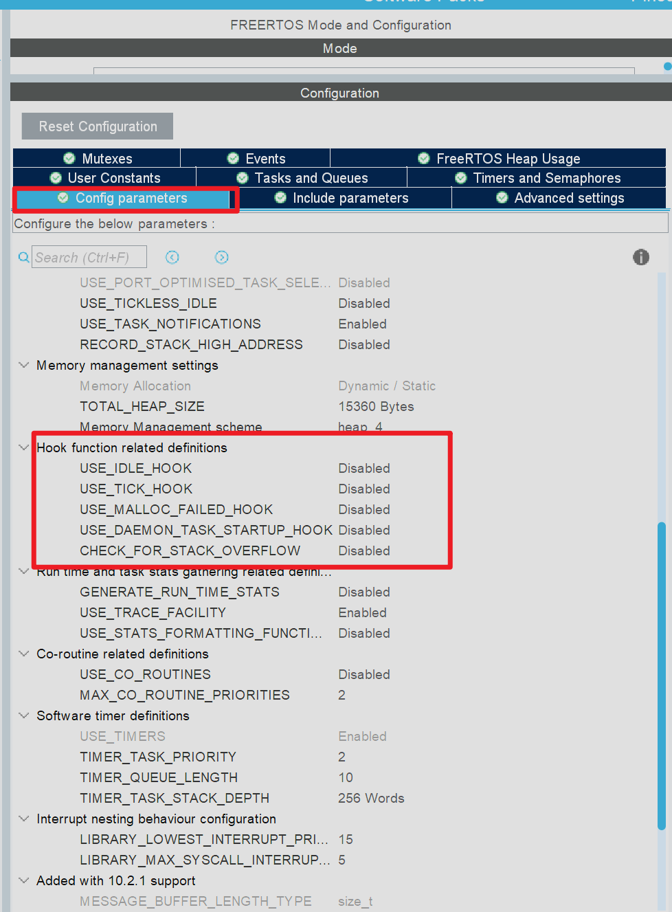
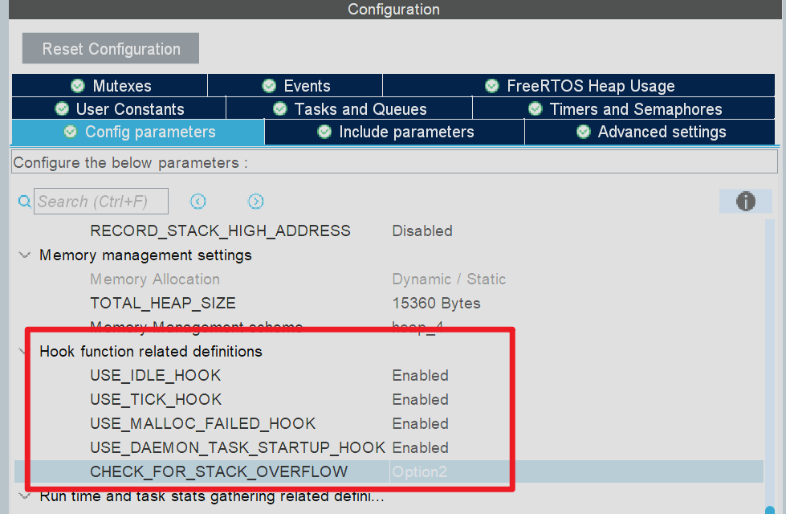
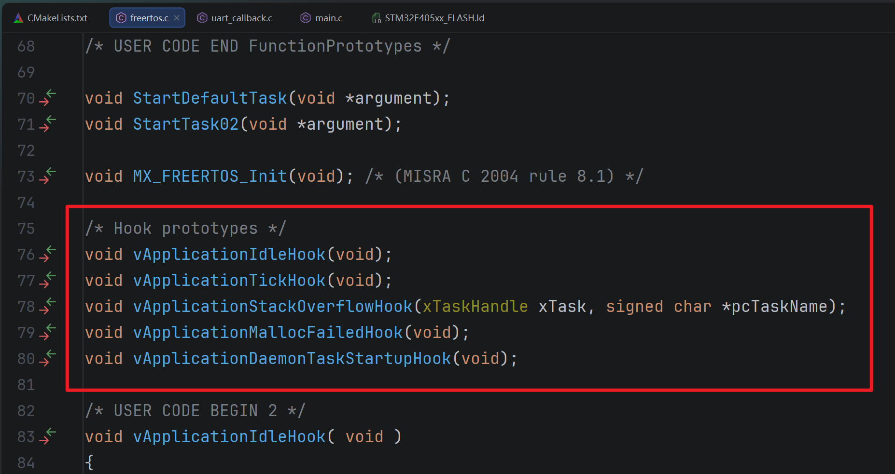
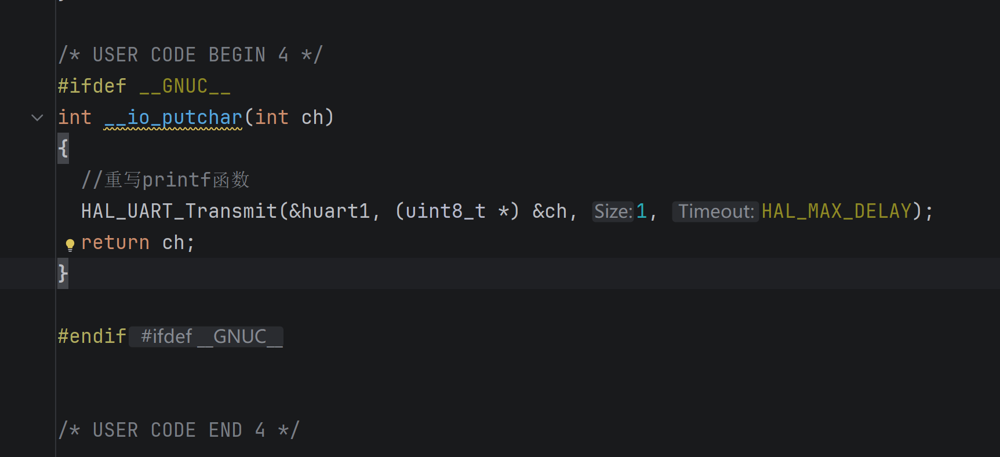
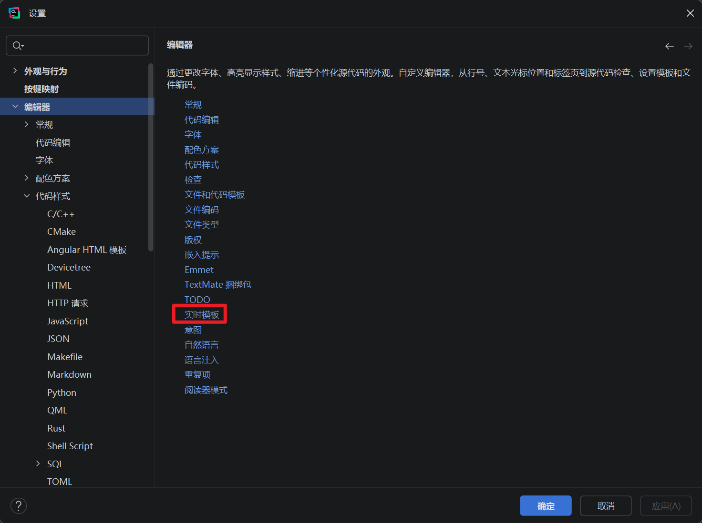

## 引言
在上一次的文章中我们了解了如何进行`CLion`的项目环境配置，成功的实现了程序的基本构建。大部分单片机开发者早期都是使用`Keil`等软件进行程序开发的，包括我也是一样，从一款开发工具过度到另一款开发工具是一件很困难的事，这并不是因为新工具有多么的难用而是因为我们早已适应了去使用旧软件，一个人的开发习惯是很难去改变的，例如我们使用`CLion`进行文件的添加和删除时无法像之前使用`Keil`那样直接通过图形化界面进行添加，我们需要自己去编写对应的`CMake`语句，这不管是对于新手还是老手，都是极具挑战性的，但是不要灰心，因为你现在已经迈出了最难的第一步

在本次文章中我会介绍如何最大化发挥`CLion`作为现代`IDE`的优势，本期我们依旧会使用`CLion`去进行无人机项目的进一步开发，本次开发过程中我们会感受到`CLion`的魅力

## 实操

### 钩子函数简介
本次开发同样是基于上一次文档中的项目进行的，如果没看也没关系，自己创建一个新的项目也行，接下来我们直接进行项目的进一步开发。首先我们先在`CubeMX`中进行一下项目的配置，我们点开`FreeRTOS`中的`Config parameters`选项

我们本次需要关注的内容是`Hook function related definitions`的相关内容，这部分的选项大多都是`FreeRTOS`给开发者预留的接口函数，这些选项对于日常的报错排查和程序调试来说非常重要，这也是我们本次介绍的重点

#### 空闲任务钩子函数
- **触发时机：** 当系统中没有任何“就绪态”任务需要运行时，空闲任务便会被不断循环调用
- 对应选项：`USE_IDLE_HOOK`
    
- **关联函数：** `vApplicationIdleHook(void)`
    
- **典型用途：**
    
    - **电源管理：** 在这里编写让 MCU 进入低功耗模式的代码。当有任务就绪被唤醒时，MCU 自动退出低功耗
        
    - **后台监控：** 执行一些优先级极低、不影响实时性的后台自检代码
        
- **注意事项：** 不能在这个钩子函数中调用任何会导致阻塞的函数（如延时函数等），否则系统会彻底卡死

#### 滴答定时器钩子函数
在`FreeRTOS`中，滴答定时器是整个操作系统的心跳，复制驱动任务调度、软件定时器和延时等功能，通常情况下，它的频率是`100`到`1000hz`（即每100ms或1ms产生一次中断）

这里需要辨析一个问题：`FreeRTOS`中的定时器和系统的硬件定时器的区别，这个问题可以在[硬件定时器 VS 软件定时器](硬件定时器%20VS%20软件定时器.md)文章中得到答案。滴答定时器钩子函数通常是由硬件的`SysTick`产生的，因此它的准确度很高。
- **触发时机：** 每当系统发生一次滴答定时器的任务中断时该函数就会被调用一次
- 对应选项：`USE_TICK_HOOK`
    
- **关联函数：** `vApplicationTickHook(void)`
    
- **典型用途：** 需要极高时间精度的周期性极短操作
    
- **注意事项：** 这个函数是**在中断上下文中执行的**。代码中不能出现任何的耗时操作
#### 内存分配失败钩子函数
- **触发时机：** 当代码中尝试使用 `pvPortMalloc()` 申请动态内存，但 FreeRTOS 的堆空间耗尽导致分配失败时被调用。
- 对应选项：`USE_MALLOC_FAILED_HOOK`
    
- **关联函数：** `vApplicationMallocFailedHook(void)`
    
- **典型用途：** 调试和异常捕获。通常在这里点亮一个红色的 Error LED或通过串口打印错误日志，以帮助开发者快速发现内存泄漏问题。
#### 栈溢出检查钩子函数
- **触发时机：** 发生任务栈溢出时调用。
- 对应选项：`CHECK_FOR_STACK_OVERFLOW`
    
- **关联函数：** `vApplicationStackOverflowHook(TaskHandle_t xTask, char *pcTaskName)`
    
- **选项含义：**
    
    - `Disabled`: 不检查。
        
    - `Option 1`: 调度器切换上下文时，检查任务栈指针是否超过了栈边界。速度快，但可能漏报（如果在切换前溢出又恢复了指针）。
        
    - `Option 2`: 在创建任务时用已知标记填充栈。检查栈底部的这些标记是否被覆盖。速度稍慢，但可靠性高。
        
- **典型用途：** 捕获导致系统报错的原因。函数参数会直接告诉你**是哪个任务**发生了栈溢出，方便我们针对性地增加该任务的栈大小。
#### 守护任务启动钩子函数
- **触发时机：** 仅在启用了软件定时器的前提下，当 RTOS 的定时器服务任务（守护任务）**首次**开始运行时，被调用一次。
- 对应选项：`USE_DAEMON_TASK_STARTUP_HOOK`
    
- **关联函数：** `vApplicationDaemonTaskStartupHook(void)`
    
- **典型用途：** 如果你的某些初始化代码（例如网络协议栈初始化、需要等待事件标志组的外设初始化）必须在 FreeRTOS 调度器启动**之后**才能安全执行，就可以将这些代码放在这里，而不是放在 `main()` 循环中的 `osKernelStart()` 之前。

### 开启钩子函数
我们了解了钩子函数之后就可以在`CubeMX`中开启钩子函数，开启方式也非常简答，点击一下对应选项右边的状态栏即可进行状态的切换

我们将对应的函数状态都切换成`Enable`即可。生成代码之后我们就可以在`CLion`中的`freertos.c`文件中看到对应的操作函数

上面图片中红色方框内的是对应的函数原型，下面的是对应的函数实现，默认情况下这些函数内部是什么都代码没有的，有的只是官方的介绍注释，作为开发者我们可以在其中自由的编写对应的业务逻辑代码

### 重写printf函数
在之前进行裸机开发中我们经常会利用串口来输出调试信息，但我们不会直接使用`HAL_UART_Transmit`函数，因为这样操作调用的函数名太长，我们往往会重写`printf`函数的底层实现，即我们会在`main.c`中重写一下`fputc`函数。但是在`CMake`构建的项目中我们使用的编译器不同，在`Keil`环境中我们使用的是`ARMCC`编译器，在`CMake`中我们使用的是`GCC`编译器，由于编译器不同，所以`printf`函数的底层实现也不一样，在`Keil`中`printf`底层的实现依靠的是`fputc`函数，在`GCC`中底层的实现依靠的是`__io_putchar`函数。我们重写的函数内容如下：
```c
#ifdef __GNUC__  
int __io_putchar(int ch)  
{  
  //重写printf函数  
  HAL_UART_Transmit(&huart1, (uint8_t *) &ch, 1, HAL_MAX_DELAY);  
  return ch;  
}  
  
#endif
```
这个函数可以放在`main.c`中，一般我们是把它放在下图所示的位置中

在`CMake`里面我们可以配置对应的代码片段，这里我们可以将重写`printf`函数的这一部分代码保存到代码片段中，这样我们就能够在下次进行快速复用了

#### 代码片段配置
在`CLIon`中配置代码片段的操作如下：
1. 按下键盘上的`CTRL + ALT + S`，这样能够快速打开设置界面
2. 进入系统设置界面之后我们可以选择编辑器选项，然后在新界面中点击蓝色字体中的**实时模板**
	
3. 在随后的界面中选择语言类型为`C/C++`
	
4. 我们接下来点击新界面中的`+`号，随后我们就可以创建新的代码片段
	
5. 随后我们就可以编辑代码片段中的内容，左边是代码体，右边是片段的相关参数
	
6. 然后我们在写程序时就能够通过关键词来直接快速写出对应的代码了，比如本次我们配置的关键词就是`input`

## 实时监控
接下来我们会借助上面提到的钩子函数实现一个实时`RTOS`在线状态监控，程序可以通过串口持续输出系统状态信息。后续我们可以在开发阶段定位`CPU`、任务栈和内存问题。
这里有一个问题是：默认情况下我们想要运行`FreeRTOS`系统就必须要依赖系统的软件定时器，软件定时器以`1ms`为周期触发。但是由于我们需要实时监测`CPU`的状态软件定时器的周期就显得相形见绌了，`FreeRTOS`官方给出的建议是：用于运行时间统计的定时器频率，至少应该是`Tick`频率的10倍到100倍。因此我们还需要配置并启动一个高精度的硬件定时器，为`FreeRTOS`统计各个任务的`CPU`占用率提供时间基准。
`FreeRTOS`内核会通过宏定义来调用我们编写的`configureTimerForRunTimeStats`函数，因此在该函数中我们需要自己手动配置一个独立的硬件定时器，定时器的频率我们通常会配置为系统时钟频率的`10`到`100`倍，在本次程序中我们打算使用定时器`TIM6`，具体的参数配置如下：

由于`STM32F405RGTx`在`CubeMX`中我们把预分频器的值设置为`840 - 1`