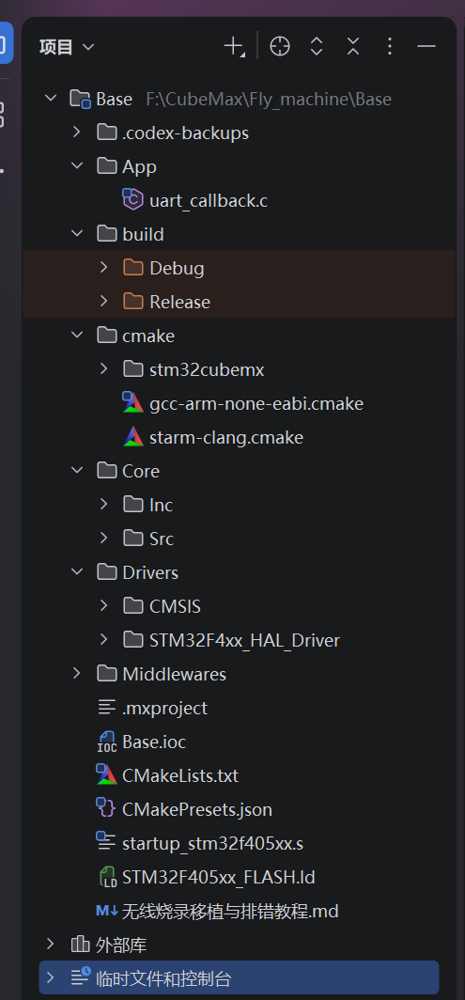

## 简介
在之前的`FreeRTOS`学习中我就已经开始尝试使用`CLion`作为开发工具了，相关内容可以参照[CLion开发FreeRTOS的基本配置](../FreeRTOS/CLion开发FreeRTOS的基本配置.md)在近期进行`F570`无人机开发的过程中同样涉及到了`FreeRTOS`的相关内容，因此我打算使用`CLion`进行无人的开发，接下来我就会介绍一下相关的配置操作

## 了解项目结构
由于在`CLion`中进行开发时整个程序是由`CMake`进行组织和构建的，在软件的侧边栏中我们可以看到对应的项目层级

因此我们关注的重点也就是文档中的`CMakeLists.txt`，我们可以在该文件中看到程序的属性信息，如果学习过`CMake`相关知识的话那么对文件中的内容肯定不会陌生。后续我们需要在项目中创建文件夹并添加文件夹时就需要去修改该文件中的内容，直接修改`CMakeLists.txt`文件对初学者并不友好，但是好处是我们需要用到的配置语句并不复杂，数量也不算多，因此我们可以先简单学习一下相关的`CMake`知识

### `CMake`简单语法
在学习这部分内容之前我们首先需要了解我们的需求是什么，在编程程序的时候我们会在程序中添加或删除文件以及目录，虽然`CLion`有时候也会主动帮助我们去修改对应的`CMakeLists.txt`文件，但是有些时候会出现修改不及时的情况，这便会引发报错，因此现阶段我们需要做的就是能够自己手动的在`CMakeLists.txt`文件中修改文件编译信息。不过我们如果仔细观察一下就会发现自动生成的`CMakeLists.txt`文件中的内容和之前我们看过的`main.c`文件和`freertos.c`文件很相似，其中都有官方为我们提前准备好的占位符，并用英文为我们提前做好了注释，该文件的内容大家可以在`CLion`中自行查看，接下来我只会介绍其中与我们现阶段需求相关的内容

#### 添加源文件
当我们在程序中新建了一个目录并在其中创建了一个全新的C语言文件之后我们就需要将它们添加到`CMakeLists.txt`文件中，该文件中我们可以看到下面部分的代码
```cmake
# Add sources to executable  
target_sources(${CMAKE_PROJECT_NAME} PRIVATE  
    # Add user sources here   
)
```
英语好的同学应该一下就能看出来这部分代码的作用是什么，上面的英文注释翻译成中文就是：向可执行文件中添加源文件。因此不难推出如果我们向项目中添加了一个新的源文件，那么我们就应该在这里来添加相关信息
假设我们现在向程序中创建了一个`App`目录，并在其中创建了串口接收相关的源文件用于处理串口接收任务，源文件的文件名为`uart_callback.c`，添加完成后我们就需要在`CMakeLists.txt`文件中上面的代码中添加一条新语句`${CMAKE_CURRENT_SOURCE_DIR}/App/uart_callback.c `，添加后对应部分的代码变为
```cmake
# Add sources to executable  
target_sources(${CMAKE_PROJECT_NAME} PRIVATE  
    # Add user sources here  
    ${CMAKE_CURRENT_SOURCE_DIR}/App/uart_callback.c  
)
```
我们可以尝试拆解一下该语句，这条语句的内容并不复杂，其中`${CMAKE_CURRENT_SOURCE_DIR}`是一个占位符，它代表当前程序的根目录，我们可以直接记忆，它也是编写此类添加语句的起手式，因为`CMake`需要从根目录开始向下寻找对应的文件。此部分之后的内容就是我们添加的目标文件相较于根目录的相对路径。

#### 添加头文件包含目录
如果我们新建了一个包含头文件的文件夹，且我们还在程序中引用了该文件夹中的头文件，那么我们就需要告诉编译器去哪里找这些`.h`文件，对应部分的代码如下：

```cmake
# Add include paths  
target_include_directories(${CMAKE_PROJECT_NAME} PRIVATE  
    # Add user defined include paths  
)
```
假设我们创建了一个`App`文件夹，并在该文件夹下又创建了一个`Inc`文件夹，我们将程序中引用的部分头文件放入了改文件夹中，那么我们就需要使用`${CMAKE_CURRENT_SOURCE_DIR}/App/Inc`语句将改文件夹添加到程序的头文件搜索路径中，修改后的代码部分如下：
```cmake
# 添加头文件搜索路径
target_include_directories(${CMAKE_PROJECT_NAME} PRIVATE
    # Add user defined include paths
    ${CMAKE_CURRENT_SOURCE_DIR}/App/Inc
)
```
该命令和添加源文件的命令形式极为相似，我们可以类比的去记忆

#### 进阶管理
随着项目变得越来越复杂，我们需要控制的外设也越来越多，业务裸机也变得越来越复杂，也必然会创建更多的文件，如果我们将所有的文件都一股脑的放到`target_sources` 下，那么过不了多久该部分的代码就会变得无比臃肿，因此我们可以想办法通过定义变量来解决这一问题，我们可以将文件的路径信息保存到变量中，然后再将变量导入到`target_sources` 下，示例代码如下：
```cmake
# 1. 定义模块变量 
set(APP_SOURCES ${CMAKE_CURRENT_SOURCE_DIR}/App/main_task.c ${CMAKE_CURRENT_SOURCE_DIR}/App/motor_control.c ) 

set(DRIVER_SOURCES ${CMAKE_CURRENT_SOURCE_DIR}/Drivers/Custom/imu_sensor.c ${CMAKE_CURRENT_SOURCE_DIR}/Drivers/Custom/can_bsp.c )
```
我们可以定义两个变量，一个用于存放业务逻辑相关的文件信息，另一个用于存放驱动文件的文件信息，然后我们再将这两个变量导入到`target_sources`中
```cmake
# 2. 将变量展开并添加到工程源文件中 
target_sources(${CMAKE_PROJECT_NAME} PRIVATE 
	${APP_SOURCES} 
	${DRIVER_SOURCES} 
)
```

