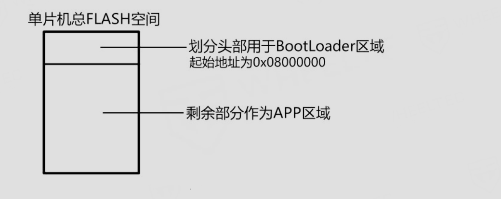

# 简介
本次使用的无人机支持通过蓝牙进行无线烧录，具体的实现原理类似西门子杯中的`OTA`远程升级

# 原理介绍
无线烧录主要依靠`BootLoader`引导程序进行实现，单片机中存储程序的区域可以分为逻辑代码区(APP区)以及程序引导区(Bootloader区)，我们要想进行蓝牙无线烧录需要干两件事

## 烧录BootLoader程序
我们需要先烧录官方提供的BootLoader程序，然后程序才能够相应我们的无线烧录请求，我们可以通过串口进行烧录

## 修改程序起始地址
烧录完引导程序之后对应的逻辑代码区的地址也需要进行修改，否则后续烧录的APP程序会覆盖前面烧录的引导区代码，结合官方提供的用户手册我们可以看到`BootLoader`默认的起始地址是`0x8000000`

因此我们需要将对应APP程序的起始地址修改为