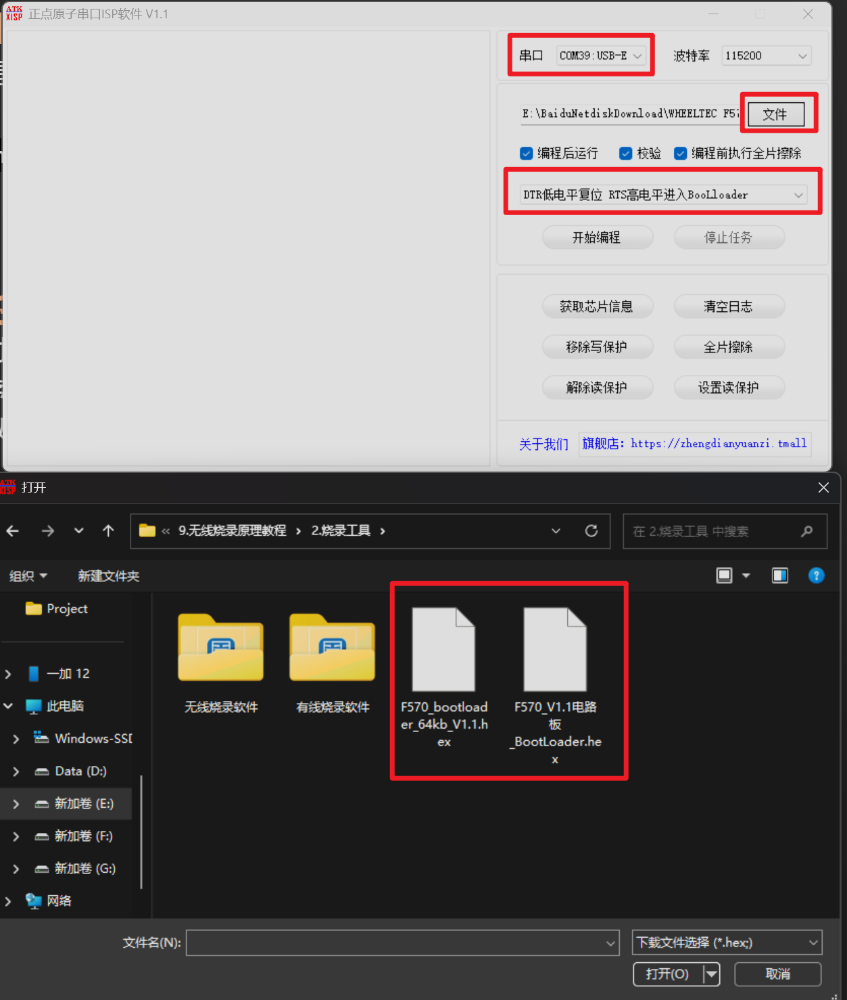
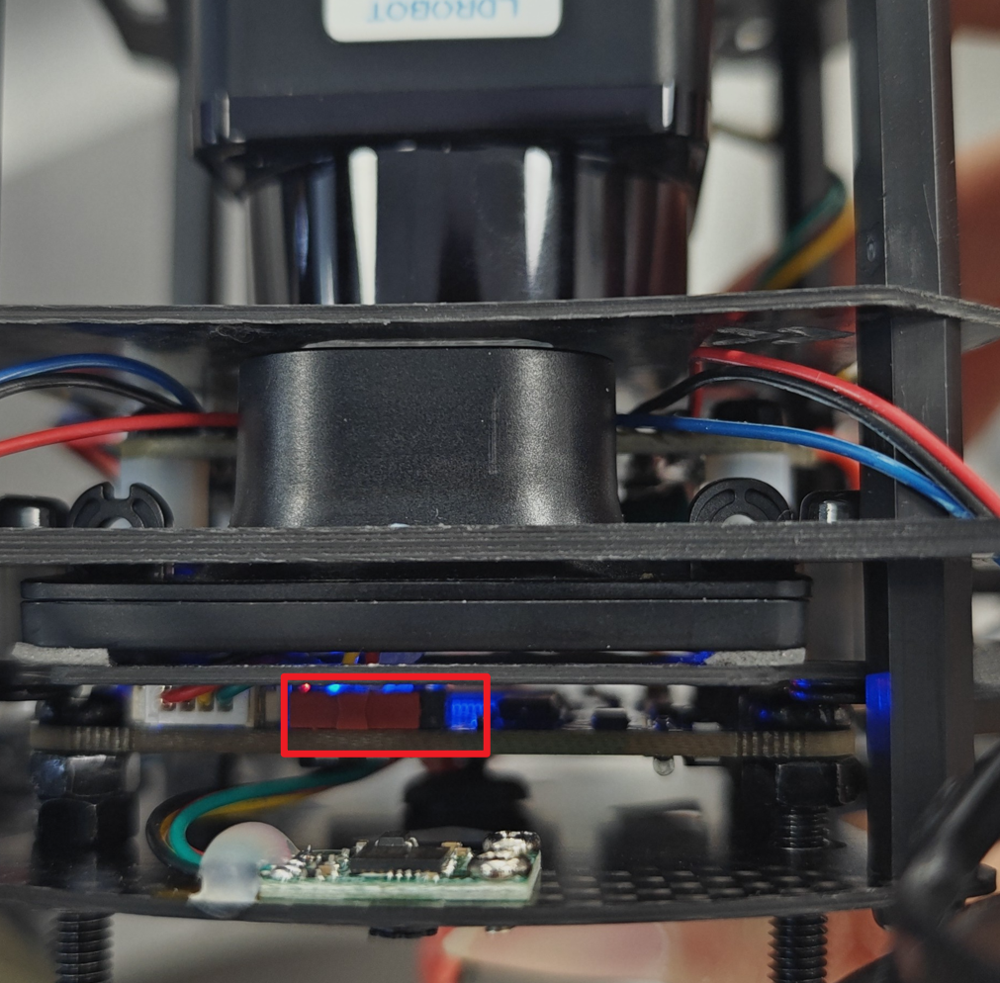
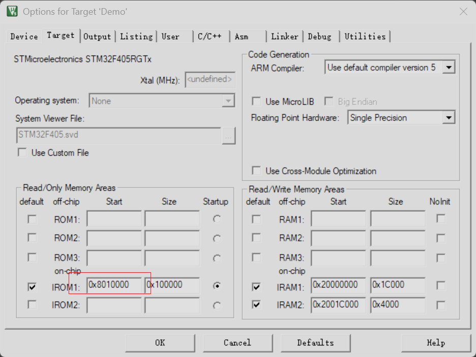
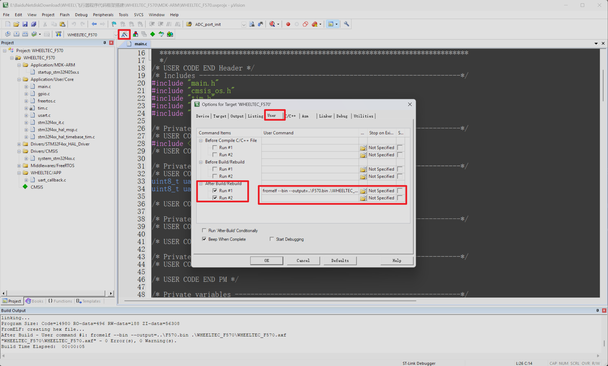
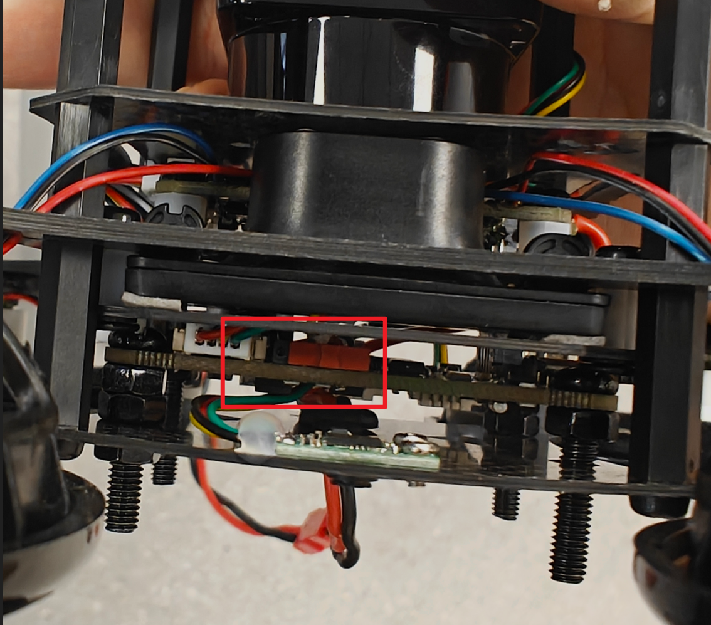
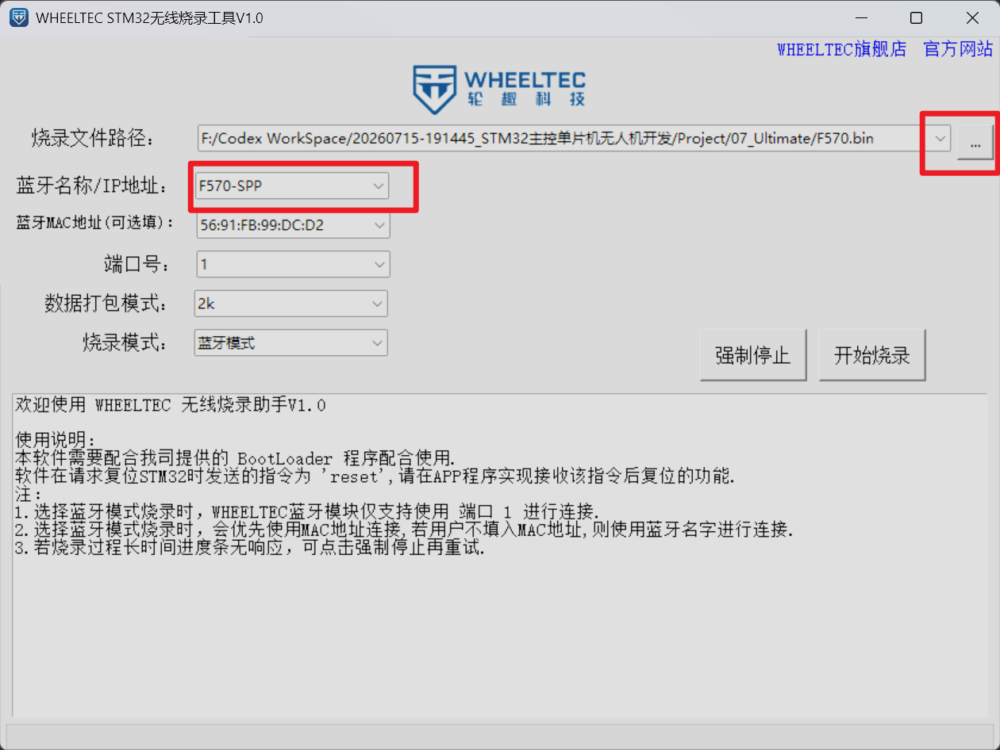
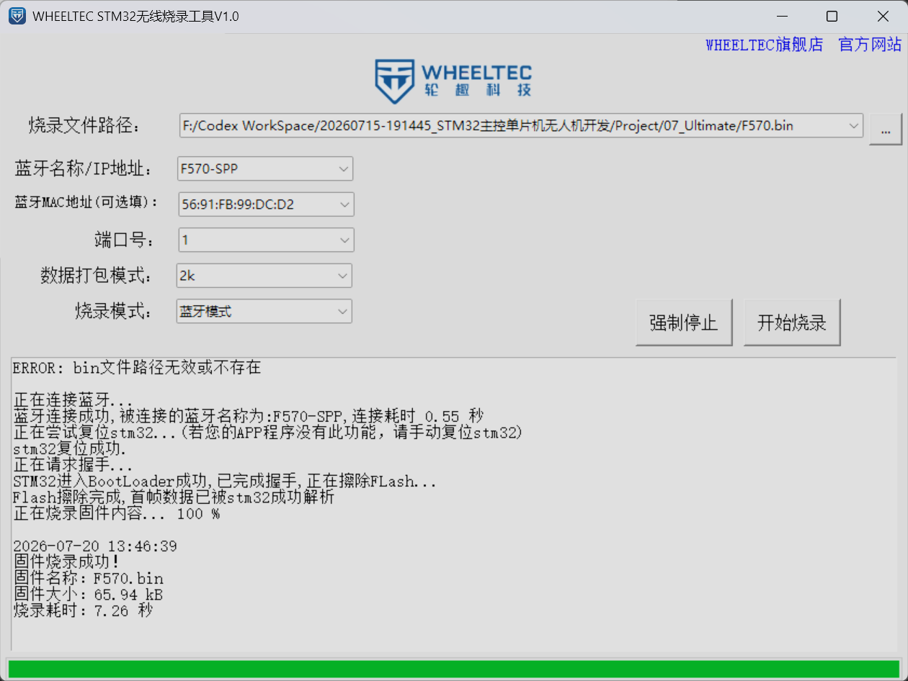

## 简介
本次使用的无人机支持通过蓝牙进行无线烧录，具体的实现原理类似西门子杯中的`OTA`远程升级

## 原理介绍
无线烧录主要依靠`BootLoader`引导程序进行实现，单片机中存储程序的区域可以分为逻辑代码区(APP区)以及程序引导区(Bootloader区)，`Bootloader`是芯片上电复位后执行的**第一段代码**。它的核心作用是决定系统接下来该做什么：是直接运行主应用程序（App），还是通过外部接口（如UART、CAN、网络等）接收新固件并进行在线升级（IAP / OTA）。因此如果我们能够修改`Bootloader`区中的程序，那么我们就能够改变单片机上电之后的行为，如果有参加过2026年西门子杯工业嵌入式赛道的同学对上面的内容肯定不陌生，因为那年的软件赛题中就需要让参赛者借助`RS485`串口通信实现`BootLoader`固件在线升级，不过好在官方提供了现成的`BootLoader`程序，我们直接烧录即可

## 烧录BootLoader程序
我们需要先烧录官方提供的BootLoader程序，然后程序才能够相应我们的无线烧录请求，我们可以通过串口进行烧录，官方提供的`BootLoader`程序为`.hex`模式，我们可以使用串口烧录软件进行烧录操作，这里使用的是正点原子官方提供的串口烧录软件，我们选择好对应的串口，然后选择对应的`.hex`固件，随后配置烧录格式为：DTR低电平复位，RTS高电平进入BootLoader。做好上述操作之后即可进行烧录工作

但是在烧录之前我们需要将开发板上的红色烧录按键拨到左侧，大致如图所示

然后就可以点击开始编程进行固件的烧录了
## 修改程序起始地址
烧录完引导程序之后对应的逻辑代码区的地址也需要进行修改，否则后续烧录的APP程序会覆盖前面烧录的引导区代码，结合官方提供的用户手册我们可以看到`BootLoader`默认的起始地址是`0x8000000`


因此我们需要将对应APP程序的起始地址修改为`0x8010000`

当我们修改完程序对应的起始地址之后就可以进行后续的代码编写编译操作了

## 程序烧录
当我们编写程序之后我们就可以进行编译，但是默认情况下我们产生的只有`.hex`程序，但是使用官方的无线烧录上位机时需要使用的是`.bin`格式的固件，因此如果我们需要让程序生成目标格式的文件，那么我们就需要对项目进行深入配置

我们可以在`keil`软件中点击魔法棒，在弹出的窗口中点击顶部的`User`选项卡，随后在新界面的`After Build/Rebuild`下选择对应的`Run #1`，选中之后在`User Command`中输入如下参考指令：
```text
fromelf --bin --output=..\F570.bin .\WHEELTEC_F570\WHEELTEC_F570.axf
```
该指令的作用是调用ARM 编译工具链中的 `fromelf` 工具进行格式转换，具体的参数大家可以结合自己的程序文件层级进行修改

### 命令参数解析

**`fromelf`**

- **含义**：这是 ARM 编译器套件（ARM Compiler toolchain）中的一个实用工具程序
    
- **作用**：它主要用于处理可执行和可链接格式（ELF，Executable and Linking Format）的图像文件。它可以提取信息、转换文件格式（如转为 .bin, .hex）或者生成代码的反汇编清单
    

**`--bin`**

- **含义**：这是一个格式转换选项
    
- **作用**：指示 `fromelf` 工具将输入的 ELF 格式文件转换为**纯二进制（Plain Binary）格式**


**`--output=..\F570.bin`**

- **含义**：指定输出文件的路径和名称
    
- **作用**：告诉 `fromelf` 将生成的纯二进制文件命名为 `F570.bin`，并存放在当前执行目录的**上一级目录**（`..\` 表示父目录）中
    

**`.\WHEELTEC_F570\WHEELTEC_F570.axf`**

- **含义**：这是命令的**输入文件**
    
- **作用**：指定要被转换的源文件。这是一个位于当前目录下 `WHEELTEC_F570` 文件夹中的 `WHEELTEC_F570.axf` 文件

进行了上述配置之后我们再进行编译操作就能够生成最终的`.bin`文件了，然后我们就可以打开无线烧录的上位机软件进行程序的烧录在烧录之前需要将烧录按键拨到右侧

然后就可以进行烧录操作了

烧录软件的界面如上，由于这是已经烧录过程序的上位机，因此烧录信息都已经保存了，如果是第一次烧录软件内的烧录信息可以与官方保持一致
```text
     ADDR:F570-SPP
      MAC:56:91:FB:99:DC:D2
      MAC:None
     PORT:1
 PACKMODE:2k
FLASHMODE:蓝牙模式
       END
```
配置完成后即可点击开始烧录进行程序的烧录，烧录成功的界面如下：

如果是第一次进行远程烧录，那么在软件提示进行复位时我们需要手动按下开发板上的复位按键进行复位操作

## 程序改进
如果你成功的进行了一次蓝牙无线烧录你或许会感到哪里怪怪的，为什么明明是远程无线烧录我还要自己手动按下复位按键？这个设计也太鸡肋了，能不能不手动复位，直接让单片机自动进行软件复位？当然是可以的，我们只需要简单修改一下程序串口接收逻辑即可，单片机上用于蓝牙通信的串口是串口4，因此每次我们使用上位机进行通信时上位机都会通过串口4向单片机发送复位信息，发送的内容就是`reset`字符串，因此我们在程序中只需要写一个串口中断，每次在串口4接收到`reset`字符串时就触发软件复位即可，官方提供的复位代码为：
```c
#include "usart.h"

//FreeRTOS Include File
#include "FreeRTOS.h"

//
extern uint8_t uart1_recv;
extern uint8_t uart4_recv;

//软件复位进BootLoader
static void _System_Reset_(uint8_t uart_recv)
{
	extern void ResetSystem(uint8_t isFromISR);
	
	static uint8_t res_buf[5];
	static uint8_t res_count=0;
	
	res_buf[res_count]=uart_recv;
	
	if( uart_recv=='r'||res_count>0 )
		res_count++;
	else
		res_count = 0;
	
	if(res_count==5)
	{
		res_count = 0;
		//接受到上位机请求的复位字符“reset”，执行软件复位
		if( res_buf[0]=='r'&&res_buf[1]=='e'&&res_buf[2]=='s'&&res_buf[3]=='e'&&res_buf[4]=='t' )
		{
			NVIC_SystemReset();//进行软件复位，复位后执行 BootLoader 程序
		}
	}
}


//串口接收中断回调函数
void HAL_UART_RxCpltCallback(UART_HandleTypeDef *huart)
{
	//检查FreeRTOS任务是否有高优先级唤醒
	BaseType_t xHigherPriorityTaskWoken = pdFALSE;
	
	if( huart == &huart4 ) //蓝牙使用的串口
	{
		//复位BootLoadr检测指令
		_System_Reset_(uart4_recv);
		
		HAL_UART_Receive_IT(&huart4,&uart4_recv,1);
	}
	else if( huart == &huart1 )
	{
		_System_Reset_(uart1_recv);
		HAL_UART_Receive_IT(&huart1,&uart1_recv,1);
	}
	
	//根据具体情况发起调度
	portYIELD_FROM_ISR(xHigherPriorityTaskWoken);
}
```

实现的思路就是如果串口4接收到了数据那么就进行判断，如果接收到的字符串内容为`reset`那么就进行软件复位，我们可以像官方一样新建一个文件，然后将代码放入该文件中

## 总结
无线蓝牙烧录模式相较于有线烧录模式优势明显，在无人机调试过程中能够极大的减少工作量