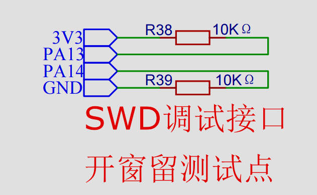
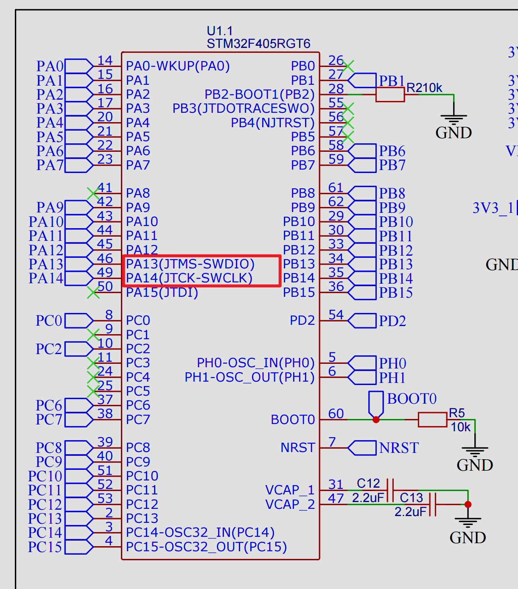
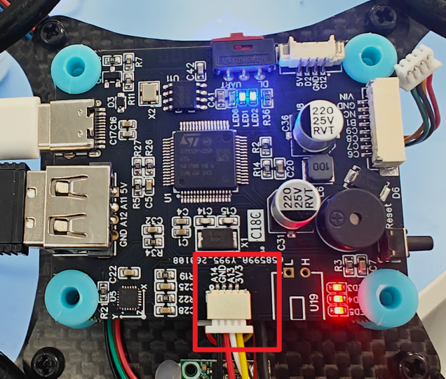
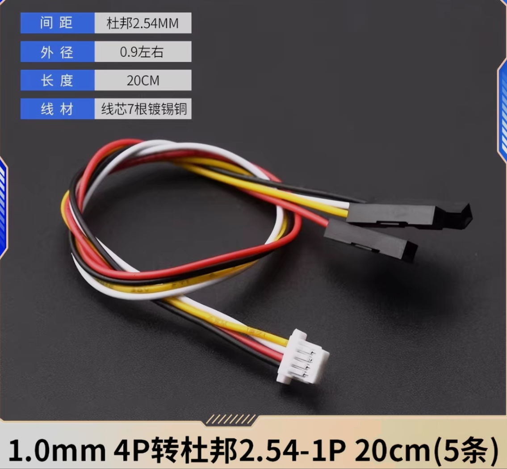
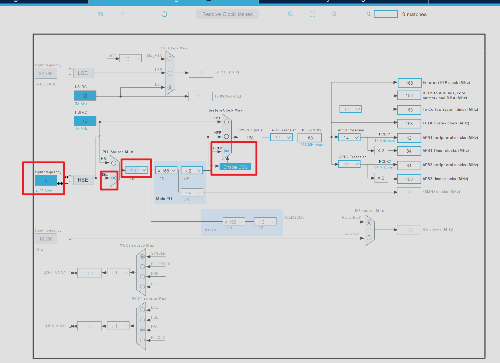
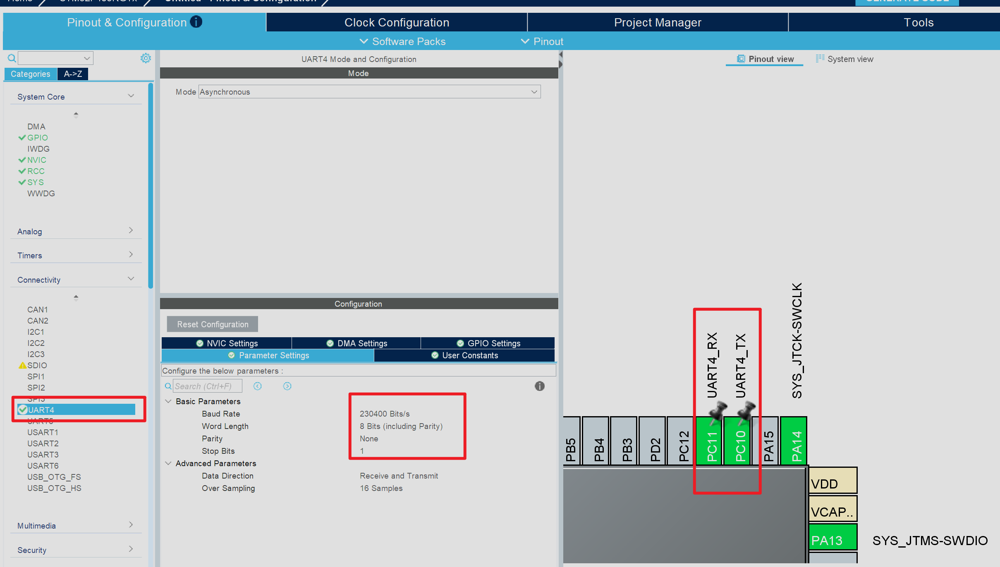
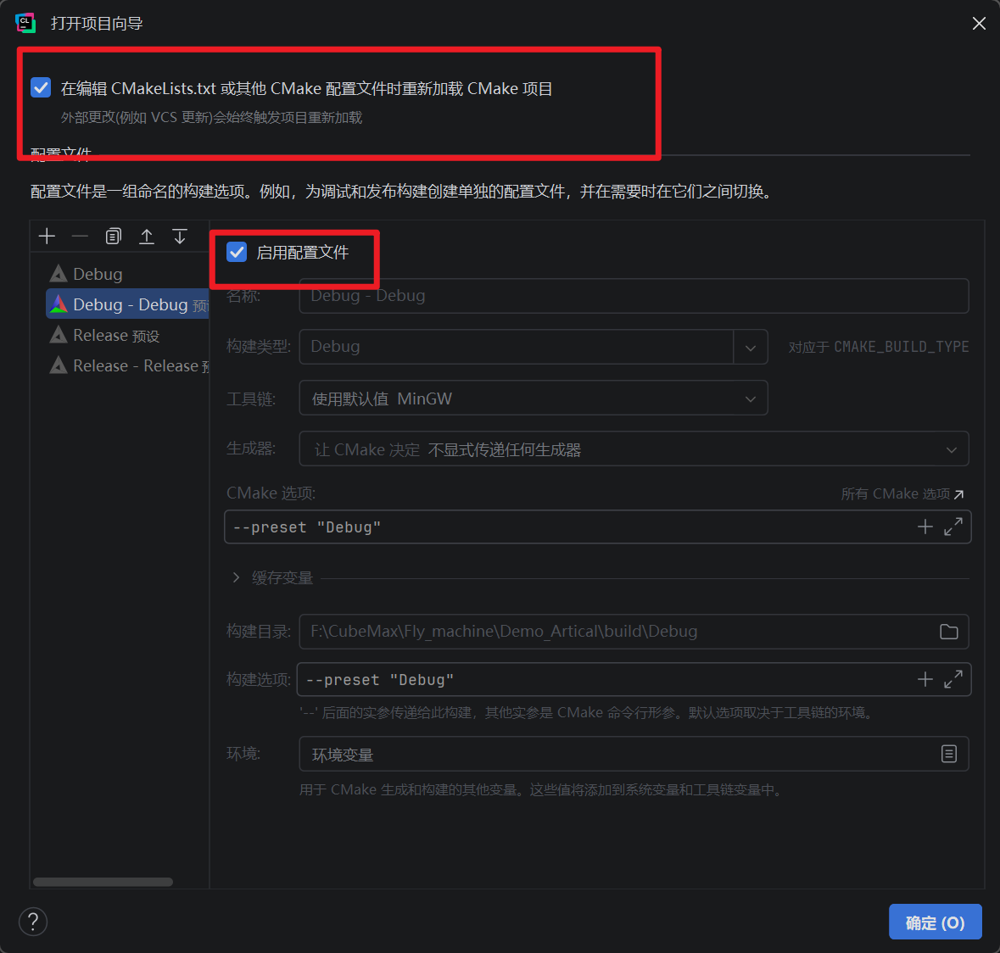

## 引言
在之前的一篇笔记中我介绍了如何在`CLion`中进行文件管理[CLion开发STM32——文件管理](CLion开发STM32——文件管理.md)在该文章中我们了解了使用`CLion`进行单片机开发的基础操作，我们已经具备了使用`CLion`进行项目开发的能力了，刚好我近期在学习轮趣的`F570`无人机相关内容，在开发中同样使用到了`FreeRTOS`，因此我就顺手出一期基于该硬件的`CLion`开发教程

## 准备工作
使用`CLion`开发时推荐使用`ST-link`进行下载烧录，这能为后续的环境配置降低不少难度，如果你想要使用其它仿真器也可以参考[CLion开发FreeRTOS的基本配置](../FreeRTOS/CLion开发FreeRTOS的基本配置.md)，这篇文章中我介绍了如何使用其它的烧录器进行程序的仿真调试以及程序的下载烧录。接下来我们先解决烧录器的问题，F570无人机上面是提供了`SWD`接口的，在原理图上我们可以看到对应的引脚信息



根据上面的原理图我们发现开发板上的`PA13`和`PA14`分别作为了调试器的`DIO`接口和`CLK`接口。
无人机的主控板实物图如下：

红色方框内的是预留的烧录接口，但是官方并没有提供`st-link`和对应的转接线，我们可以在第三方平台自行购买，对应的转接线型号如下图所示

我们购买之后就可以直接将对应的接口引出来了，连接`st-link`之后就可以进行后续的一系列操作了

## 程序配置
我们现在使用`st-link`主要是为了进行仿真调试，观察不同任务之间的切换状态，因此我们在配置项目时还是有一些细节需要关注的。我们要保证蓝牙无线烧录的功能不受影响，因此程序的配置相较于普通工程还是有很大差异的。

### CubeMX端配置
首先还是使用我们的老朋友`CubeMX`进行程序的初始化，由于大部分操作我们都在之前的文章中讲述过，因此本次文章只会介绍那些之前未提及的重要操作。
第一个就是时钟树的配置，时钟树这里需要使用外部高速晶振，且外部高速晶振的频率最好选择`8Mhz`

具体的配置可以参考上图中的配置
由于程序进行无线烧录的时候还会接收到来自上位机软件的复位信息，因此我们要单开一个串口用于信息的接收，这里我们选择串口4，由于串口4要与蓝牙进行通信因此我们需要将对应的波特率修改为`230400`，修改之后我们还需要注意的是串口4对应的引脚必须是`PC11`和`PC10`，具体的参数信息如下图所示，最后不要忘了打开串口中断


到这里`CubeMX`端的配置就大致结束了，我们可以直接点击生成代码

### CLion端配置
生成程序之后我们可以用`CLion`打开对应文件夹，项目的配置和之前保持一致


我们可以先编译一下看看程序会不会报错，如果没有报错那么就可以开始下一步的配置了，这里先不要直接进行烧录，因为如果此时点击烧录的话程序默认是从起始地址（`0x08000000`）开始烧录的，这样的话新程序就会覆盖我们之前烧录的`BootLoader`程序，我们就无法进行无线烧录了。

#### 地址配置
首先我们需要修改一下地址的相关配置，防止因为地址导致无线下载烧录固件被覆盖，对应部分的代码如下：
```cmake
/* Specify the memory areas */  
MEMORY  
{  
RAM (xrw)      : ORIGIN = 0x20000000, LENGTH = 128K  
CCMRAM (xrw)      : ORIGIN = 0x10000000, LENGTH = 64K  
FLASH (rx)      : ORIGIN = 0x8000000, LENGTH = 1024K  
}
```
我们需要修改的代码是这一句：`FLASH (rx)      : ORIGIN = 0x8000000, LENGTH = 1024K`
我们应该把它修改成`FLASH (rx) : ORIGIN = 0x08010000, LENGTH = 960K`，修改之后的内容如下：
```cmake
/* Specify the memory areas */  
MEMORY  
{  
RAM (xrw)      : ORIGIN = 0x20000000, LENGTH = 128K  
CCMRAM (xrw)      : ORIGIN = 0x10000000, LENGTH = 64K  
FLASH (rx) : ORIGIN = 0x08010000, LENGTH = 960K  
}
```

然后我们还需要在根目录下的`CMakeLists.txt`文件中添加一条语句