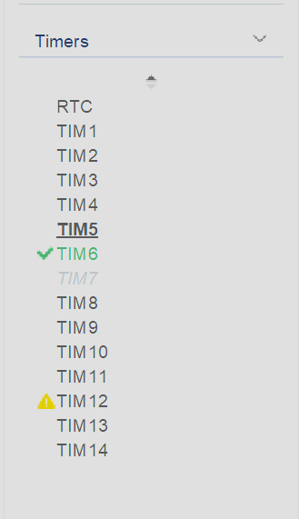
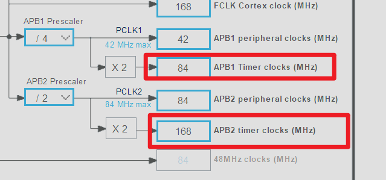

## 简介
本次主要是介绍`STM32F405RGTx`系列`MCU`的定时器分布信息

## 定时器总线分布
在`STM32F405RGTx`上总共有`14`个定时器

这些定时器在总线上的分布信息如下：
`APB1`：最大总线频率为`42MHz`，该总线挂载的通用定时器为`TIM2、TIM3、TIM4、TIM5、TIM12、TIM13、TIM14`，挂载的基本定时器为`TIM6、TIM7`
上述定时器中的`TIM2`和`TIM5`是32位的

`APB2`：最大总线频率为`84MHz`，挂载的高级定时器有`TIM1、TIM8`，挂载的通用定时器有`TIM9、TIM10、TIM11`

结合项目配置的时钟线可知挂载在`APB1`总线上的定时器主频都为`84Mhz`，挂载在`APB2`总线上的定时器主频都为`168Mhz`

因此对应的