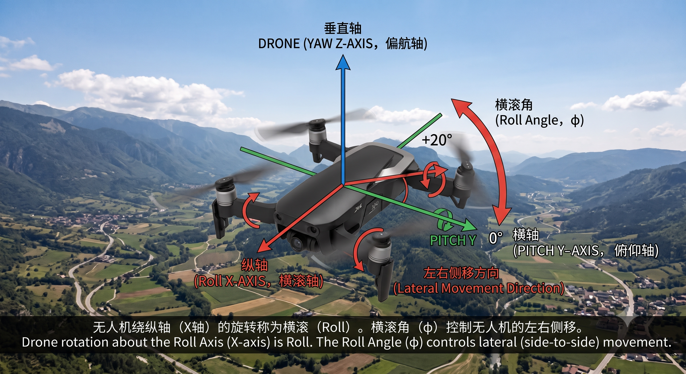
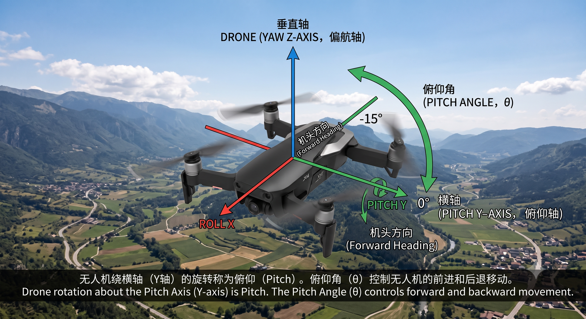

## 简介
本期内容主要介绍无人机姿态控制中的三个自由度，即欧拉角，它们分别是横滚角、俯仰角以及偏航角

## 横滚角
### 定义
绕无人机的纵轴（x轴）旋转的角度
### 控制效果

如上图所示，红色的坐标轴为纵轴，它是机头到机尾的连线，当无人机向左或向右倾斜的时候，螺旋桨的升力会产生水平的分力，从而控制无人机向左或向右平移

## 俯仰角
### 定义
绕无人机的横轴（Y轴）旋转的角度

### 控制效果

如上图所示，绿色的坐标轴为横轴，它是机身左侧到右侧的连线旋转的角度，当无人机向上抬头或向下点头，俯仰动作会改变升力的前后方向，从而控制无人机向前加速或向后倒退

## 偏航角
### 定义
绕无人机的垂直轴（z轴）旋转的角度

### 控制效果
