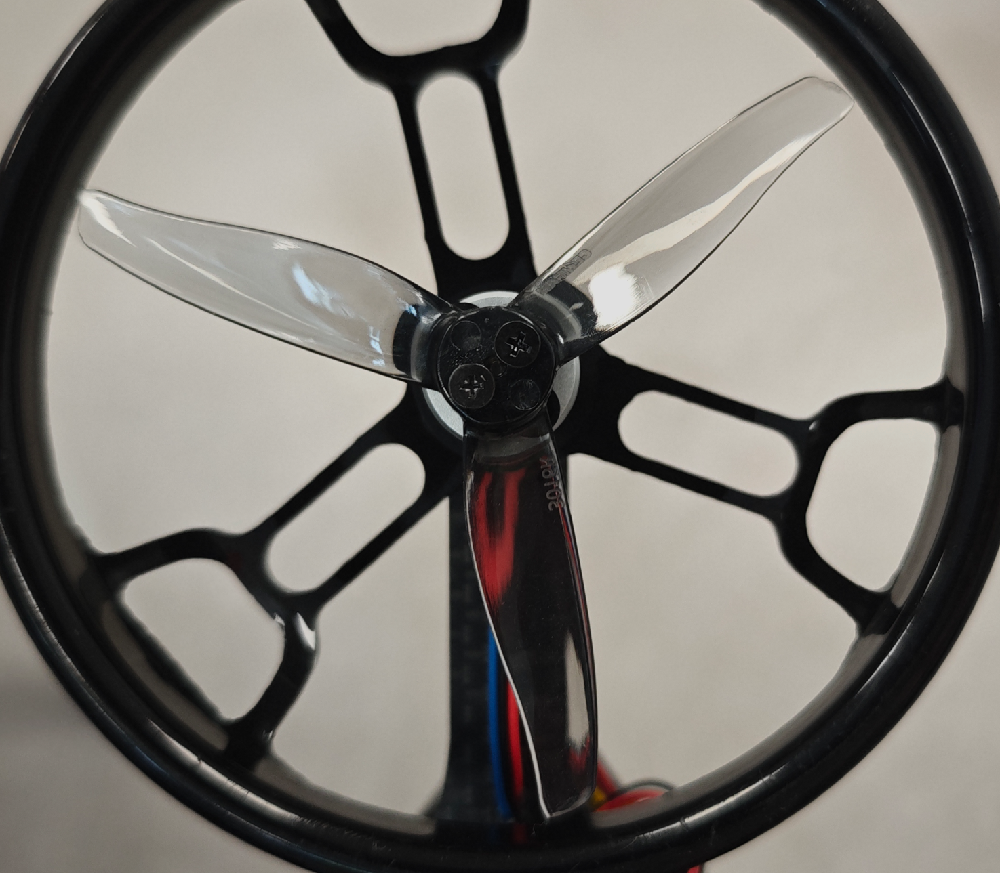
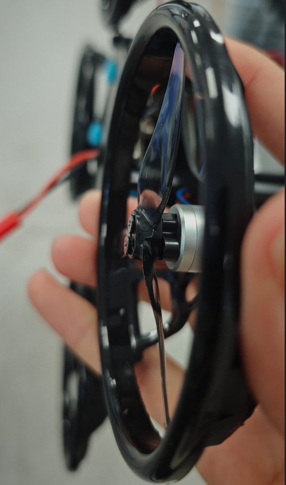
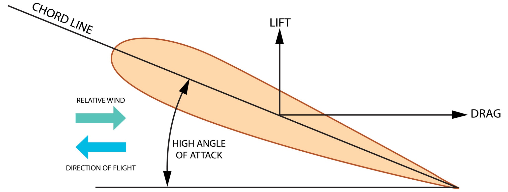
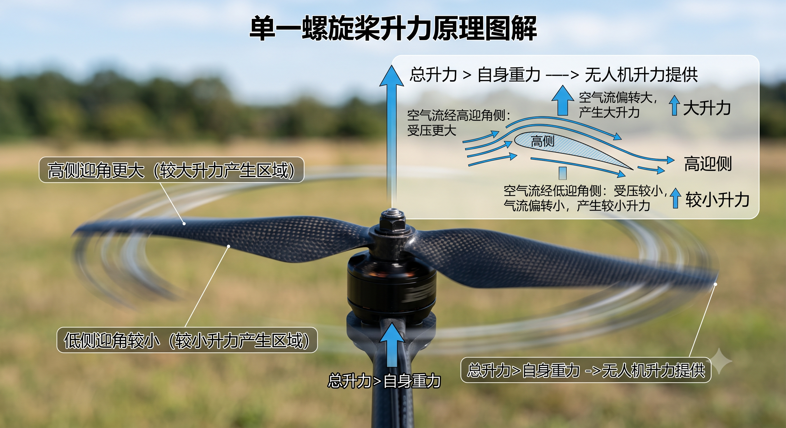
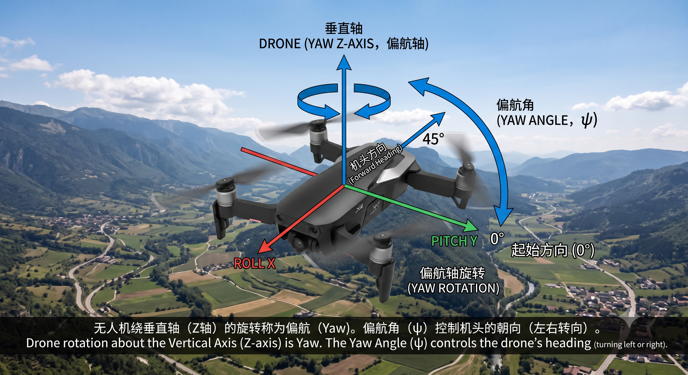

## 简介

本期内容主要介绍无人机控制中的一些基本概念，这些概念较为简单，但是如果后续我们想要自己手搓无人机，或者我们想要进行四轴飞行器的开发，这些基本概念都是我们应该去了解的

## 螺旋桨飞行状态
我们所接触到的无人机大多有四个螺旋桨，这四个螺旋桨在旋转的时候为无人机提供升力，我们如果仔细观察一下无人机的螺旋桨就会发现，螺旋桨不是平整的，而是有弧度的，往往是一边高一边低，如下图所示

无人机的螺旋桨为什么要设计成这种一边高一边低的形状呢？这是在我们高中的时候就了解过，下面是螺旋桨的原理图：

螺旋桨"高"的一端是螺旋桨的前缘，"低"的一端是后缘，当螺旋桨转动起来的时候前缘先接触空气，随着桨面扫过，倾斜的表面会将空气向下方推挤，从而形成一股强烈的向下气流，由于力的所用是相互的，空气被向下推挤的时候也会给螺旋桨一个向上的反作用力，这就是无人机的升力来源，如下图所示：

## 自由度
接下来会介绍无人机姿态控制中的三个自由度，即欧拉角，它们分别是横滚角、俯仰角以及偏航角
### 横滚角
#### 定义
绕无人机的纵轴（x轴）旋转的角度
#### 控制效果

如上图所示，红色的坐标轴为纵轴，它是机头到机尾的连线，当无人机向左或向右倾斜的时候，螺旋桨的升力会产生水平的分力，从而控制无人机向左或向右平移

### 俯仰角
#### 定义
绕无人机的横轴（Y轴）旋转的角度

#### 控制效果

如上图所示，绿色的坐标轴为横轴，它是机身左侧到右侧的连线旋转的角度，当无人机向上抬头或向下点头，俯仰动作会改变升力的前后方向，从而控制无人机向前加速或向后倒退

### 偏航角
#### 定义
绕无人机的垂直轴（z轴）旋转的角度

#### 控制效果

如上图所示，蓝色的坐标轴为垂直轴，它是垂直于机身中心的线，偏航角主要是负责控制无人机在水平面内原地向左或向右旋转，仅改变机头的朝向，不直接产生位置的平移

### 总结
上述的三个角度通常是通过主控板上的`IMU`（惯性测量单元）中的加速度计和陀螺仪采集，然后再通过传感器融合算法解算得出。如果你是第一次听到这些概念可能会有点懵，但是不要担心，在后续的学习中我们会逐渐的去学习这些内容的，我们现阶段没必要上太高的强度

