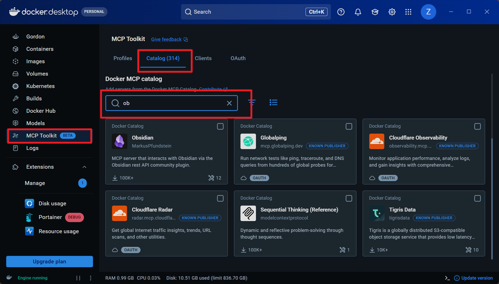
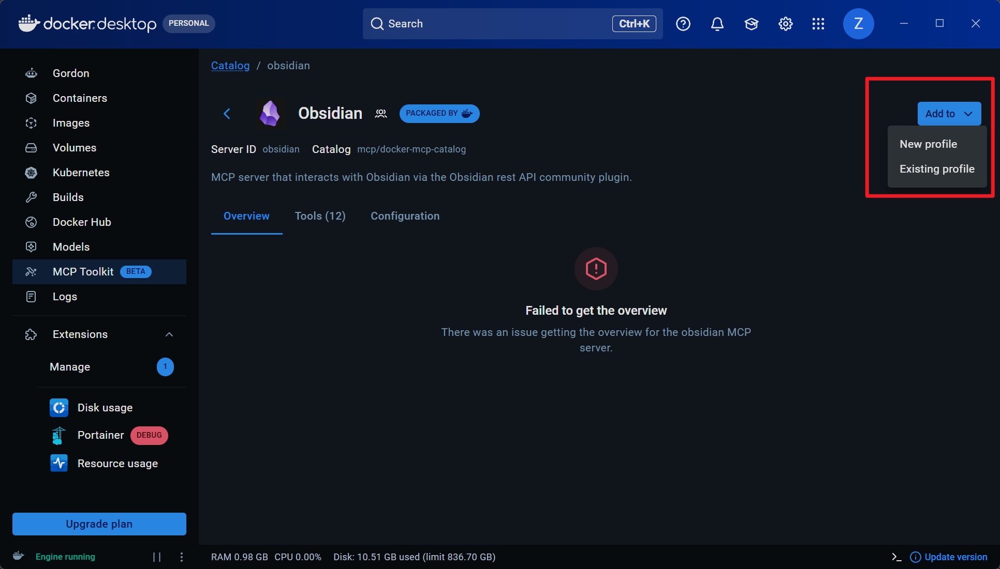
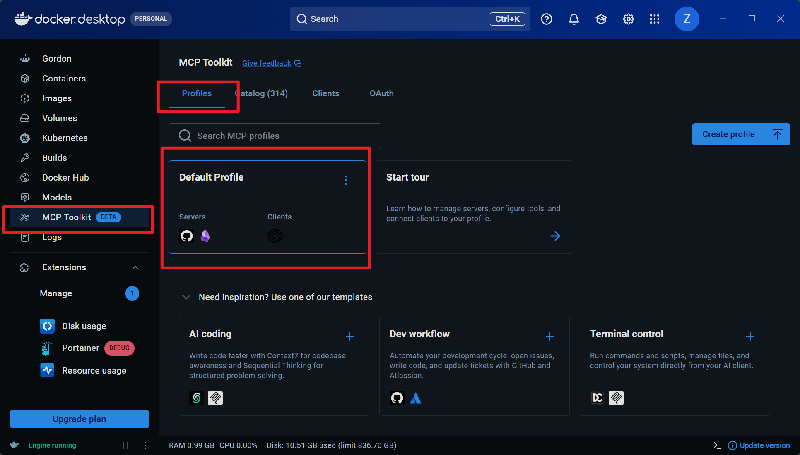
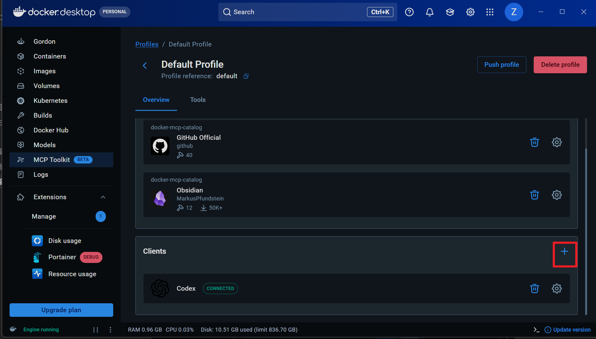
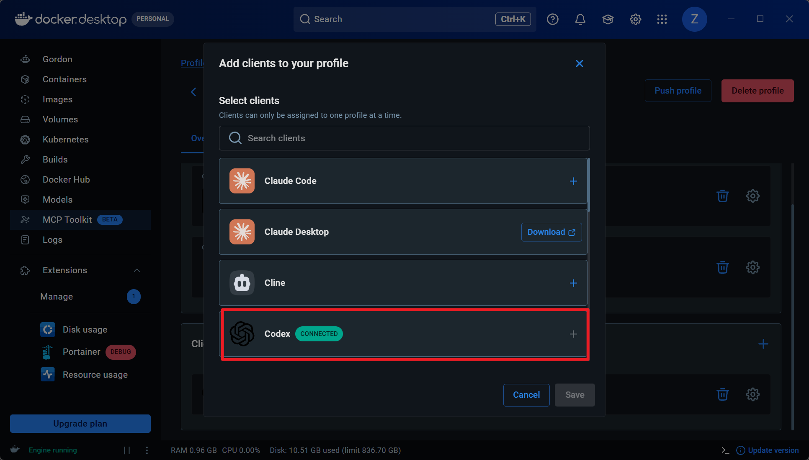
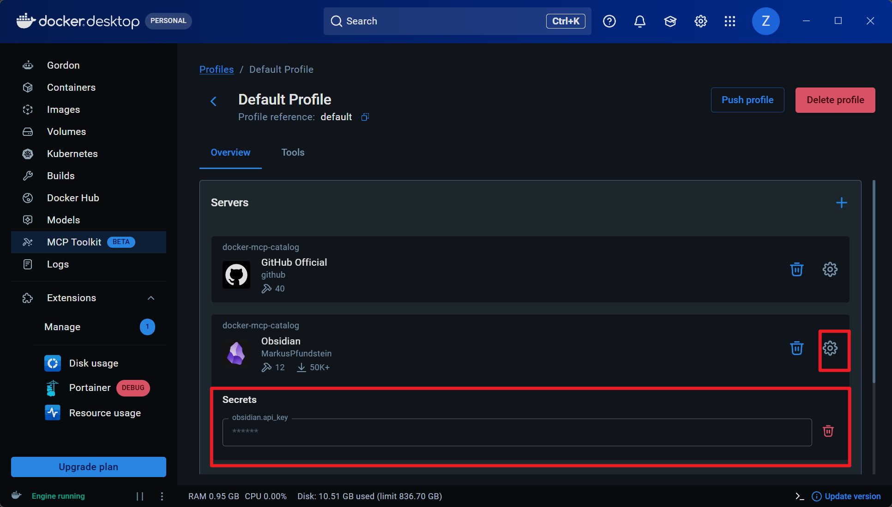
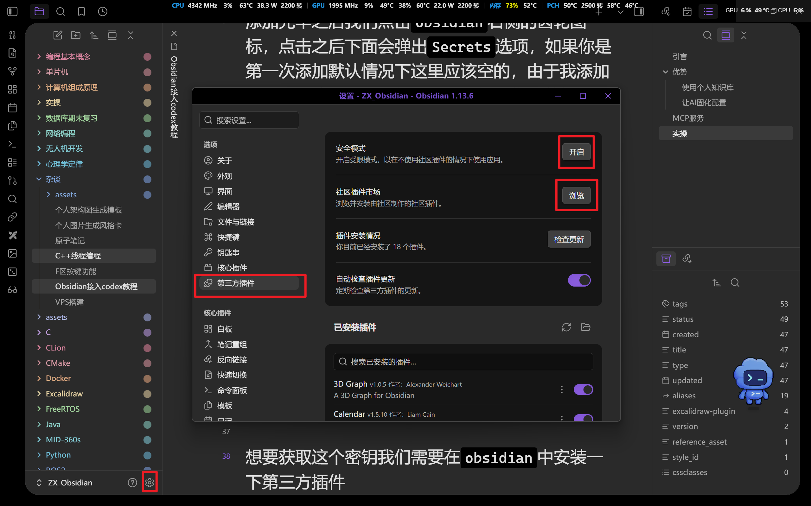

## 引言
本期内容将会介绍一下如何将`Obsidian`中的笔记接入到`codex`等`AI`桌面端软件中，为`AI`搭建知识库，让`AI`更智能

## 优势
### 使用个人知识库
在日常使用桌面端`AI`软件的时候我们可能会觉得`AI`用起来不是很顺手，这不单单是`AI`模型推理能力的问题。作为用户我们如果想要让`AI`能够给出符合我们要求的答案往往需要去引导`AI`，一般情况下我们需要去写大段地提示词（`Prompt`），这个过程比较耗时，且提示词的编写并不像我们想象的那样简单，我们需要在提示词中描述清楚我们的需求，但是有些时候即便是我们描述清楚了自己的需求，`AI`也难以给出满意的回答。这往往是因为`AI`不具备相关的背景知识，`AI`回答问题的时候为了获取这些背景知识往往会选择到网络上去检索，但是网络上的背景知识不一定符合我们实际的开发需求，且检索过程消耗的资源也比较多。因此我们可以尝试将自己的个人知识库提供给`AI`，知识库中的内容是我们自己搭建的，会更加符合开发需求，且可以让我们也可以在协作的过程中让`AI`去完善我们的知识库

### 让AI固化配置
我们平时可能会让`AI`帮助我们去处理文档，在这个过程中我们为了不让它生成的结果过于模板化，我们会让`AI`按照我们的操作习惯去生成一套固定的操作模板。在以前我们可能会将其放入工作目录下，现在我们可以将其直接保存到自己的笔记库中，对其进行不断地修改并得到满意的版本之后可以尝试将其转换为`skill`，方便我们在不同任务之间快速复用

## MCP服务
模型上下文协议（`Model Context Protocol`，简称`MCP`）是一套开源协议。它为`AI`应用连接外部数据和工具提供了统一的接口，让不同模型能够操作文件、数据库等

刚接触`AI`时，我对大语言模型的理解基本停留在聊天工具上。我买过`DeepSeek`的官方`API`，也尝试把它接入`Cline`、`Cherry Studio` 和“酒馆”（`TavernAI`）等第三方软件中，当时更多的是用`AI`去辅助我的编程学习

用得久了，问题也越来越明显：`AI`很会回答，却不能动手。我可以把复杂的编程问题发给它，也可以让它帮忙整理一堆资料，但它看不到我的代码目录，更不能直接修改本地文件。很多时候，它只能告诉我“应该怎么做”，接下来仍然要由我复制代码、查找文件、修改内容。模型的分析能力已经很强，实际操作却被限制在对话框里，这种体验多少有些割裂

后来，我接触到了`MCP`。`Anthropic`在`2024 年11月25日`提出并开源了这项协议，希望解决`AI`应用与外部数据之间缺少统一连接方式的问题。通过 `MCP`，大模型可以读取本地文件、查询数据库或者调用工具。可惜第一次看到 MCP 时，我只是大致了解了一下概念，并没有继续研究它的工作方式，也没有真正动手搭建

所以这次，我准备把之前落下的内容补回来：将自己的`Obsidian`本地笔记库接入`Codex`，通过`MCP`让`Codex`能够读取、查找和修改这些内容

## 实操
了解了`AI`访问文件的底层协议之后接下来我们就要开始动手实操了。本次我们通过`Docker`来为`Codex`提供`MCP`服务，首先我们需要下载`docker desktop`，官网链接为[点击直达](https://www.docker.com/products/docker-desktop/)我们在官网中下载符合自己操作系统版本的软件即可。我们下载之后打开软件，在侧边栏中选择`MCP Toolkit`，然后在`Catalog`界面中搜索`obsidian`

检索到目标之后我们把它添加到对应的配置文件中

可以添加到新的配置中，也可以当场创建一个新的配置，然后将其添加进去。然后我们就可以回到`Profile`界面中选择对应的配置，由于我将`obsidian`的`MCP`放入了默认的配置中，因此我们直接点击进去即可

点进去之后我们点击`Clients`右侧的加号

在弹出的界面中选择你需要提供服务的客户端，并点击选项右侧的加号

添加完毕之后我们点击`obsidian`右侧的齿轮图标，点击之后下面会弹出`Secrets`选项，如果你是第一次添加默认情况下这里应该空的，由于我添加过，所以这里显示已经又过了。如果你也曾经添加过但是失效了，可以点击红色的删除图标来清空一下，

接下来我们只需要获取这个密钥就可以直接控制`obsidian`中的所有笔记了。

想要获取这个密钥我们需要在`obsidian`中安装一下第三方插件，点击软件左下角的齿轮图标，然后选择第三方插件，然后点击浏览

扩展的名字是