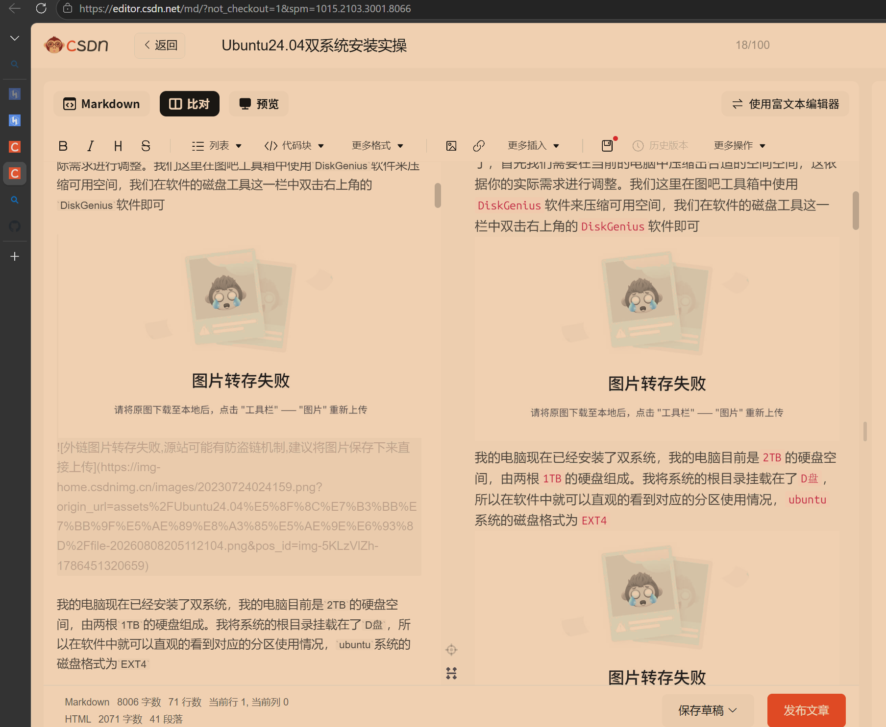
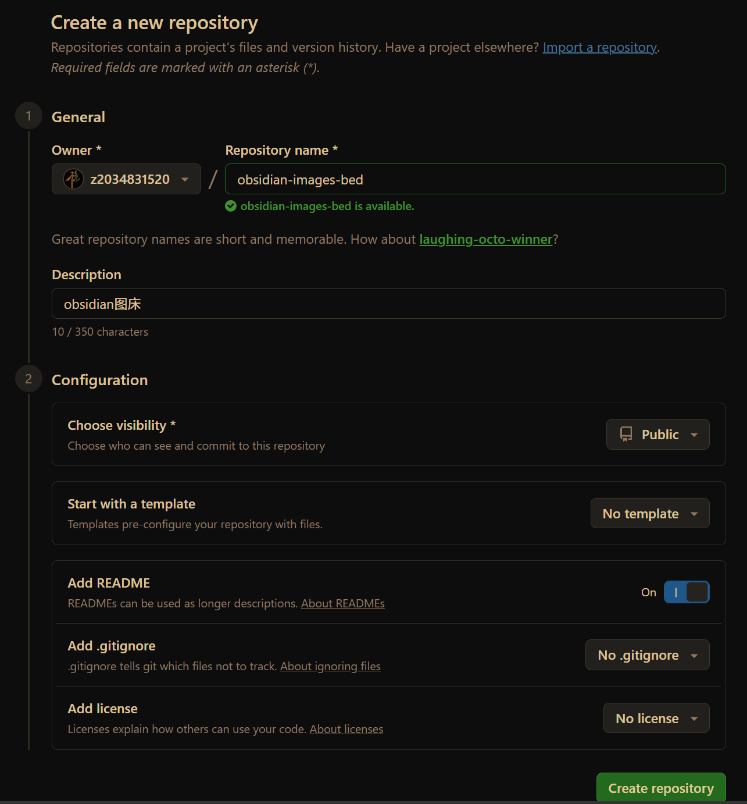
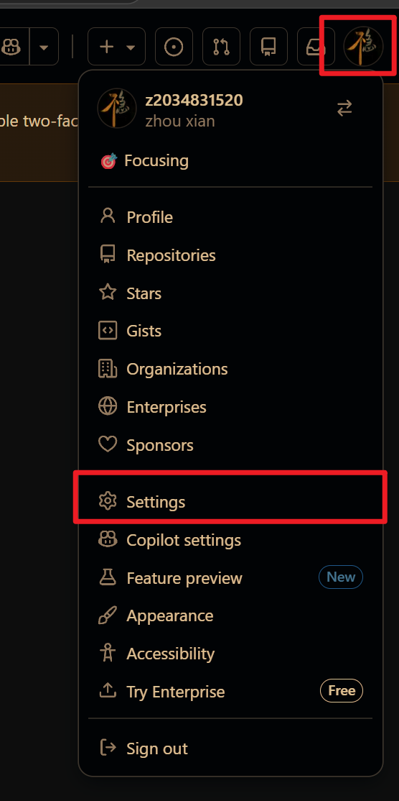
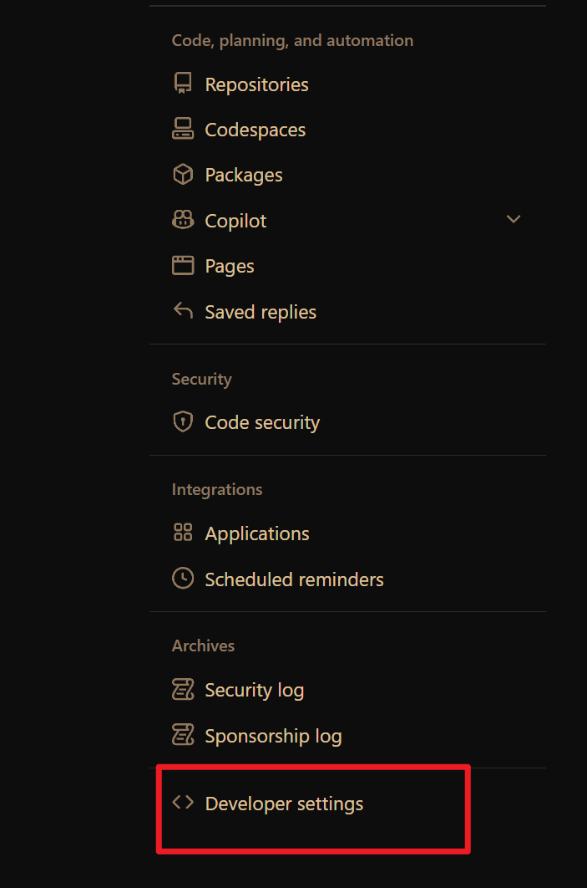
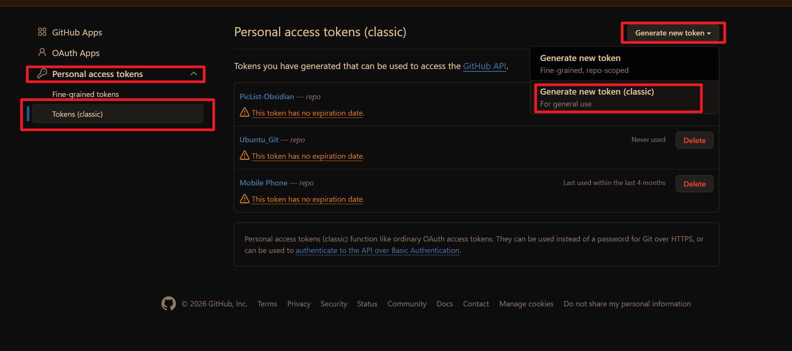
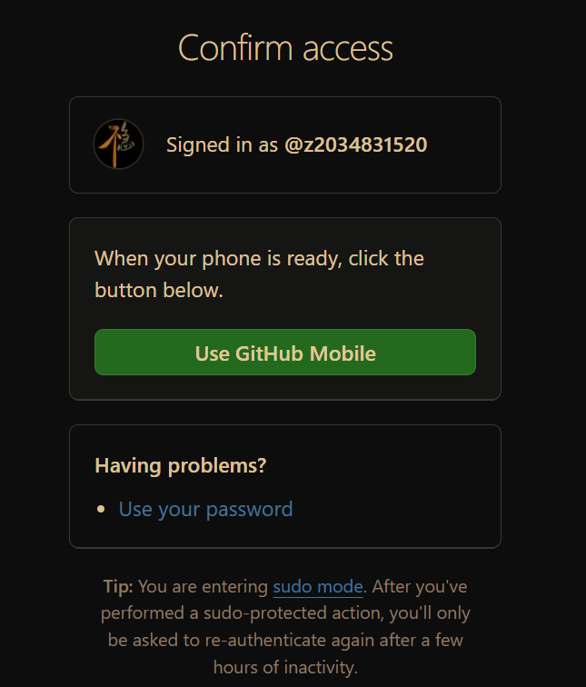
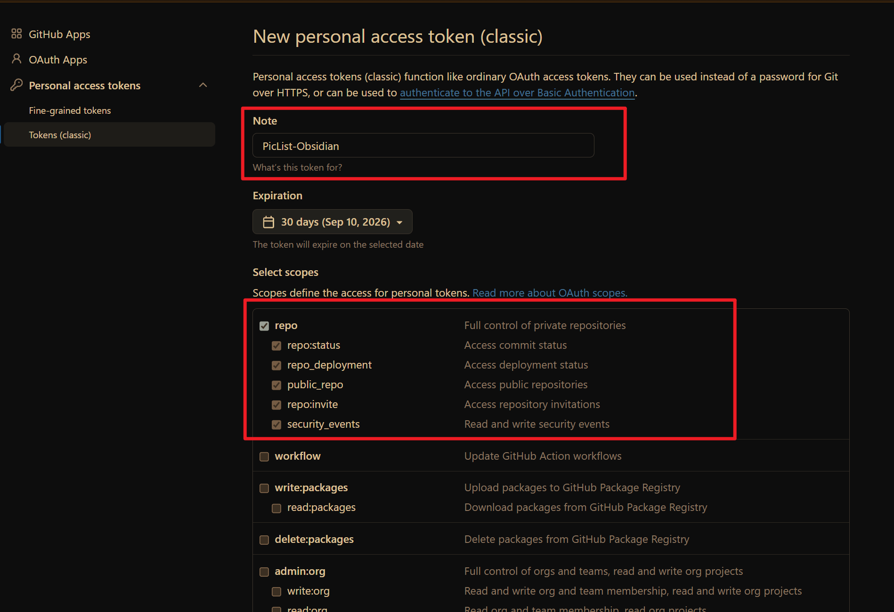
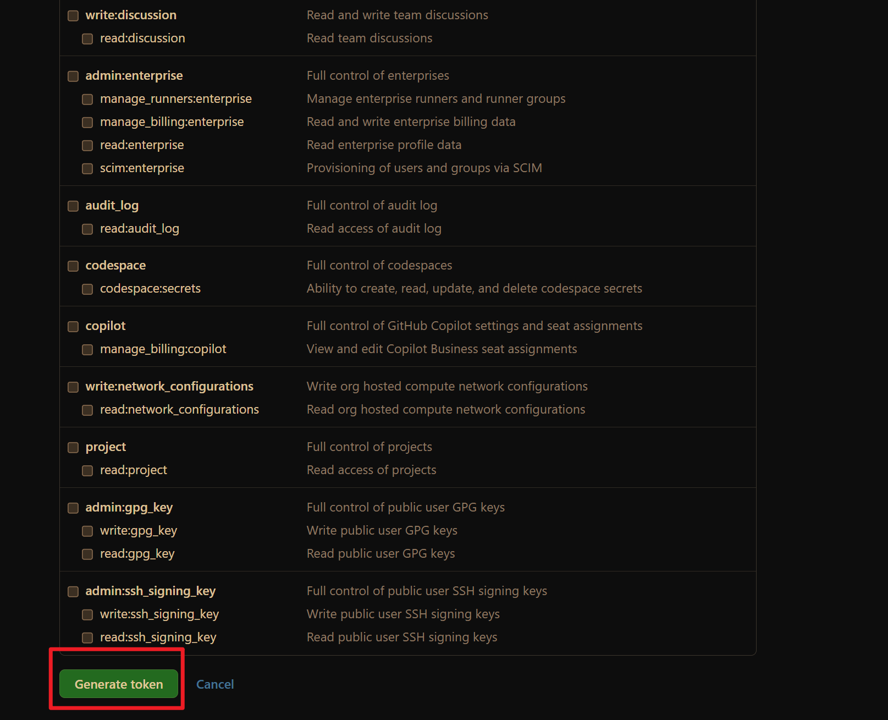
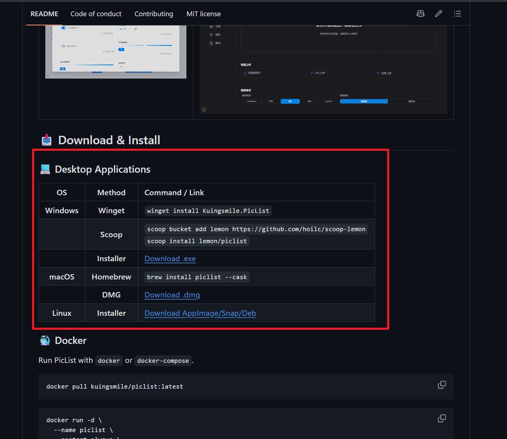
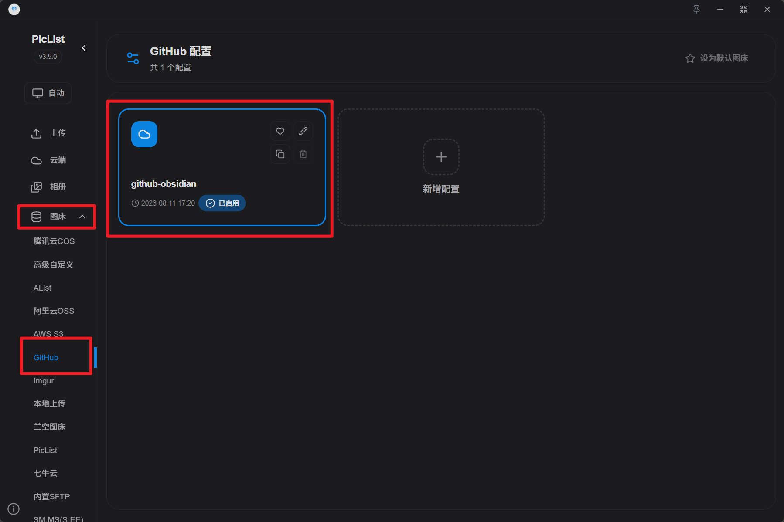

## 引言
不知道有没有像我一样经常写博客的同学：当我们花费一段时间写出了一篇还算满意的文章，准备把它发布到网页平台时，却发现本地文档中的图片全部无法正常显示，这里以 `CSDN` 为例。我们打开文章编写界面，切换到 Markdown 编辑器，然后把在本地写好的文章复制进去，图片位置却出现了“图片转存失败”，如下图所示：

为了让图片恢复正常，我们往往只能删除失败的图片链接，再把本地图片一张张复制到网页编辑器中。如果一篇文章中只有两三张插图那还可以接收，但是如果文章中有十几张插图那就让人比较红温了。显然，这并不是一个明智的解决方案。本篇文章将介绍如何更高效的解决这个问题

借助 `GitHub + PicList + jsDelivr + Obsidian`，把本地图片自动上传为网页可以访问的图片，并让 Markdown 中的本地路径自动替换为公网链接。

## 问题成因
首先需要搞明白一件事：为什么同一张图片在本地可以正常显示，复制到网页之后却无法显示？关键不在图片本身，而在 Markdown 中保存的图片地址。同一张图片在本地和网页中可能分别使用下面两种写法：
```markdown
<!-- 本地相对路径 -->


<!-- 公网图片链接 -->

```
第一种写法中的 `assets/...`是相对于当前笔记的本地路径。`Obsidian`可以根据这个路径在我们的电脑中找到图片，因此能够正常显示；但是把 `Markdown`复制到`CSDN`后，`CSDN`的服务器无法访问我们电脑上的文件夹，自然也就找不到这张图片。第二种写法使用的是公网链接，只要这个地址不需要登录、没有过期，并且能够在普通浏览器中直接打开，网页平台才能够读取并显示图片

所以我们解决问题的思路为：
1. 把本地图片上传到能够公开访问的存储位置，也就是通常所说的“图床”
2. 把 Markdown 中的本地相对路径替换成图床返回的公网链接

## 方案概览
本篇文章使用的完整链路如下：
```text
本地图片
   ↓
Obsidian 图片自动上传插件
   ↓
PicList 本地上传 API
   ↓
GitHub 公开仓库
   ↓
jsDelivr 公网访问地址
   ↓
Markdown 公网图片链接
   ↓
CSDN 等网页平台
```
其中各部分的职责如下：

- `GitHub`：保存图片文件
- `PicList`：接收图片、上传到`GitHub`，并生成公网链接
- `jsDelivr`：把`GitHub`文件转换为更适合网页访问的`CDN`链接
- `Obsidian` 图片自动上传插件：调用`PicList`，并自动替换笔记中的图片路径

## 实操

### 一、创建 GitHub 图床仓库
首先登录 GitHub，新建一个专门存放图片的仓库，仓库名随意，下面是一个参考：
```text
obsidian-images-bed
```
仓库需要设置为 `Public`。这是因为网页平台无法读取私有仓库中的图片。默认分支建议保持为 `main`，后续 `PicList`中填写的分支名必须与这里一致，参考配置如下图所示

建议让图片统一存放在仓库的 `images/`目录中，避免所有文件堆放在仓库根目录，那样会显得比较凌乱
### 二、创建 GitHub 访问令牌
`PicList`需要通过 `GitHub API`上传图片，因此需要创建一个密钥来授予相应的访问权限，创建的过程也很简单

1. 单击右上角的个人头像，在随后弹出的窗口中选择`Settings`：
	
2. 在新界面中下拉选择`Developer settings`：
	
3. 在新界面中选择`Personal access tokens`然后选择下方的`Tokens classic`，在新界面中点击生成新秘钥，然后选择下方的经典密钥：
	
4. 然后进行一下验证
	
5. 在`Token`配置界面中我们只需呀修改一下名称和权限，名称随意，权限只需要勾选红色方框中的`repo`即可
	
6. 然后点击底部的生成密钥即可
	
7. 接下来会弹出`Token`，复制之后保存下来，接下来要用

### 三、安装 PicList
`PicList`是一个开源的项目，目前托管在`Github`上，项目链接为：[项目链接，点击直达](https://github.com/Kuingsmile/PicList)在项目主页中我们可以看到多种下载方式，如果你想省事一点可以直接执行对应的安装指令进行一键下载。如果你想更改文件的下载路径那么你需要先下载对应的`.exe`安装程序，然后再进行下载，在下载的引导程序中我们可以选择软件的安装位置


### 四、配置 GitHub 图床
下载完成之后接下来我们需要对图床进行配置,打开软件侧边栏中的图床选项，然后在下面选择`Github`，如果是第一次打开可能会有一个默认配置，我们直接点击默认配置右上角的铅笔图标修改配置即可。或者你也可以新建一个配置



```text
配置名称：github-obsidian
仓库名：GitHub用户名/仓库名
分支名：main
存储路径：images/
Token：刚才生成的访问令牌
```

例如仓库地址是：

```text
https://github.com/yourname/obsidian-image-bed
```

那么仓库名应填写：

```text
yourname/obsidian-image-bed
```

保存配置后，将它设为默认图床。随后在 PicList 的上传页面选择一张测试图片，确认图片已经出现在 GitHub 仓库的 `images/` 目录中。

<!-- 截图建议：PicList 的 GitHub 图床配置界面，遮挡 Token -->

### 五、配置 jsDelivr 公网地址
如果 PicList 没有配置自定义域名，GitHub 图床通常会返回 `raw.githubusercontent.com` 地址。这个地址在部分网络环境中访问不稳定，CSDN 的服务器也可能无法抓取，从而出现：

```text
外链图片转存失败，源站可能有防盗链机制
```

这里的提示是网页平台给出的通用错误，并不一定表示 GitHub 真的开启了防盗链。更常见的情况是网页平台无法稳定访问 GitHub Raw 域名。

回到 PicList 的 GitHub 配置，在“自定义域名”中填写：

```text
https://cdn.jsdelivr.net/gh/GitHub用户名/仓库名@分支名/
```

例如：

```text
https://cdn.jsdelivr.net/gh/yourname/obsidian-image-bed@main/
```

最终生成的图片地址应类似于：

```text
https://cdn.jsdelivr.net/gh/yourname/obsidian-image-bed@main/images/20260811171040648.png
```

注意最后的 `/` 不要遗漏。修改后重新上传一张测试图片，把生成的链接粘贴到浏览器无痕窗口中。如果不登录 GitHub 也能正常显示，说明公网访问地址已经配置成功。

<!-- 截图建议：PicList 自定义域名字段与上传结果 -->

### 六、开启 PicList 上传 API
Obsidian 插件需要通过本地接口把图片交给 PicList。打开 PicList 的：

```text
设置 → 高级 → 上传 API 服务设置
```

开启上传 API，并使用下面的地址：

```text
http://127.0.0.1:36677/upload
```

如果“Web 服务设置”和“上传 API 服务设置”同时使用 `36677` 端口，可能出现端口冲突。这里只需要上传 API，因此建议关闭静态 Web 服务，避免请求被错误地当作本地文件路径处理。

PicList 关闭后，本地 API 也会停止。因此在 Obsidian 上传图片时，需要保证 PicList 正在运行，可以根据需要把它设置为开机启动或最小化到系统托盘。

<!-- 截图建议：关闭 Web 服务、开启上传 API 的设置界面 -->

### 七、配置 Obsidian 自动上传
打开 Obsidian 的第三方插件市场，搜索并安装图片自动上传插件，例如 `Image auto upload Plugin`。安装完成后启用插件，并在插件设置中填写 PicList 上传接口：

```text
http://127.0.0.1:36677/upload
```

不同版本的设置项名称可能略有不同，可以寻找 `PicGo Server`、`Upload Server` 或“上传接口”等字段。

配置完成后，新建一篇测试笔记，粘贴一张截图。正常情况下会发生下面几件事：

1. 图片先暂时保存到本地附件目录。
2. 插件把图片发送给 PicList。
3. PicList 将图片上传到 GitHub。
4. 图片链接自动替换成 jsDelivr URL。

替换后的 Markdown 应类似于：

```markdown

```

此时将这段 Markdown 复制到 CSDN，图片应当能够正常转存或显示。

<!-- 截图建议：Obsidian 插件设置，以及粘贴图片前后的 Markdown 对比 -->

## 处理已有笔记中的图片
上面的配置主要解决以后新粘贴的图片。对于已经存在的笔记，还需要区分两种情况。

### 情况一：笔记仍然使用本地路径
如果图片仍然是下面这样的本地链接：

```markdown

```

先备份笔记，然后打开 Obsidian 命令面板，搜索图片自动上传插件提供的“上传当前文件中的所有图片”或 `Upload all images` 命令。不同插件版本的命令名称可能略有区别。

执行后应逐张检查：

- GitHub 仓库中是否出现图片文件。
- 本地路径是否被替换为公网 URL。
- Obsidian 阅读视图中图片是否仍能正常显示。

不要一开始就在整个知识库中批量运行。建议先选一篇包含两三张图片的测试笔记，确认文件命名、上传目录和链接格式均正确后，再扩大处理范围。

### 情况二：笔记已经使用 GitHub Raw 链接
如果图片已经上传到 GitHub，但链接仍然使用：

```text
https://raw.githubusercontent.com/用户名/仓库名/main/
```

则不需要重新上传图片，只需把链接前缀替换为：

```text
https://cdn.jsdelivr.net/gh/用户名/仓库名@main/
```

图片文件在仓库中的后半段路径保持不变。例如：

```text
旧链接：
https://raw.githubusercontent.com/yourname/obsidian-image-bed/main/images/test.png

新链接：
https://cdn.jsdelivr.net/gh/yourname/obsidian-image-bed@main/images/test.png
```

替换前建议备份笔记，并先在单个文件中测试。确认新链接可以访问后，再使用查找替换功能批量处理。

### 重新导入网页平台
如果文章已经导入 CSDN，并被替换成“图片转存失败”的占位内容，仅修改 Obsidian 中的链接不会自动修复原来的 CSDN 草稿。

正确做法是：

1. 在 Obsidian 中完成图片上传和链接替换。
2. 确认每张图片都能在浏览器中直接打开。
3. 删除 CSDN 草稿中的失败占位内容，或重新建立一篇草稿。
4. 重新复制、粘贴或导入更新后的 Markdown。
5. 发布前切换到预览模式，逐张检查图片。

## 常见问题排查

### Obsidian 提示 `Request failed, status 404`
如果 PicList 主界面可以正常上传，但 Obsidian 插件提示 `404`，优先检查以下内容：

- 插件地址是否准确填写为 `http://127.0.0.1:36677/upload`。
- PicList 是否正在运行。
- PicList 上传 API 是否已经开启。
- 静态 Web 服务是否与上传 API 占用了同一个端口。

如果日志中出现类似：

```text
File not found: C:\Users\upload
```

说明 `/upload` 请求被静态 Web 服务当作本地文件路径处理了。关闭静态 Web 服务，只保留上传 API，然后重新测试。

### PicList 返回 `401` 或 `403`
这通常与 GitHub Token 有关：

- Token 已经过期或被删除。
- Token 没有选中正确的仓库。
- Fine-grained Token 的 `Contents` 只有读取权限，没有写入权限。
- Classic Token 没有 `public_repo` 权限。

重新创建 Token 后，只需要更新 PicList 配置，不需要重新建立仓库。

### 上传成功，但图片链接显示 `404`
依次核对：

- GitHub 仓库是否为公开仓库。
- 用户名和仓库名是否填写正确。
- 分支究竟是 `main` 还是其他名称。
- `images/` 等目录是否与实际文件路径一致。
- 自定义域名末尾是否保留了 `/`。

还可以直接进入 GitHub 仓库，确认目标文件确实已经提交成功。

### GitHub 中有图片，但 CSDN 仍然转存失败
先查看 Markdown 使用的是哪种域名。如果仍然是 `raw.githubusercontent.com`，改用前面配置的 jsDelivr 地址，并重新导入文章。

如果 jsDelivr 在当前网页平台中仍然无法访问，说明该平台或当前网络环境对这个域名也有限制。此时不应继续反复修改 Token，因为 Token 只负责上传，和网页读取图片不是同一个环节。可以改用腾讯云 COS、阿里云 OSS、七牛云等更适合公开静态资源的对象存储，或者直接使用网页平台自己的图片上传功能。

## 安全与维护建议
- GitHub Token 与密码同样敏感，不要写入笔记正文或公开截图。
- 为 Token 设置有效期，并只授权单个图床仓库和必要权限。
- 图床仓库是公开的，不要上传隐私图片。
- 不要随意重命名、移动或删除仓库中的图片，否则旧文章链接会失效。
- 建议保留本地原图或定期备份仓库，图床不能代替完整备份。
- 使用时间戳或随机字符串作为文件名，可以降低重名覆盖和 CDN 缓存混淆的风险。

## 总结
本地图片无法在网页中显示，是因为网页服务器无法访问我们电脑中的相对路径。解决问题的关键，是把图片上传到公开可访问的存储位置，并让 Markdown 使用稳定的公网 URL。

通过 `Obsidian + PicList + GitHub + jsDelivr`，我们可以把整个过程自动化：粘贴图片后由插件调用 PicList，PicList 将图片上传到 GitHub，再把笔记中的本地路径替换为 jsDelivr 链接。以后把文章复制到 CSDN 等网页平台时，就不需要再逐张手动上传图片了。

不过 GitHub 图床更适合个人笔记和访问量较小的技术文章。如果文章访问量较大、对国内访问稳定性要求较高，或者需要存储私密内容，腾讯云 COS、阿里云 OSS 等对象存储会是更加稳妥的长期方案。

## 参考资料
- [PicList 官方网站](https://piclist.cn/)
- [PicList GitHub 图床配置说明](https://piclist.cn/configure#github图床)
- [GitHub Personal Access Token 官方文档](https://docs.github.com/en/authentication/keeping-your-account-and-data-secure/managing-your-personal-access-tokens)