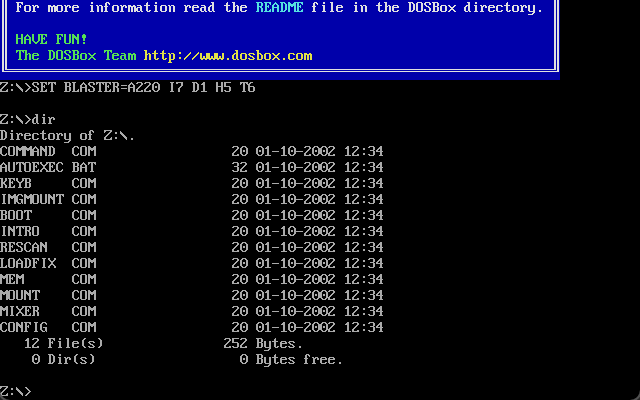
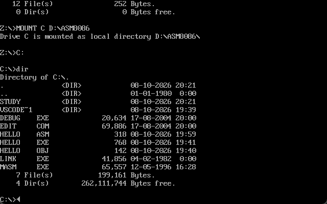
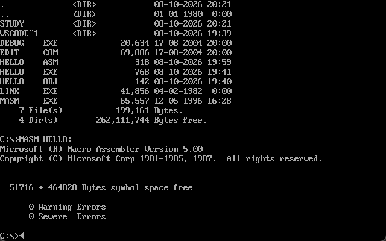
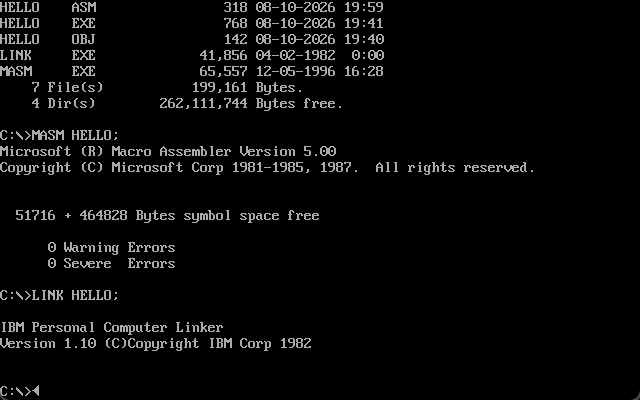
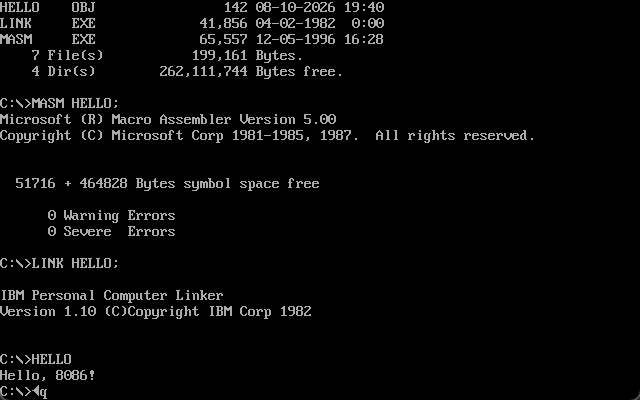
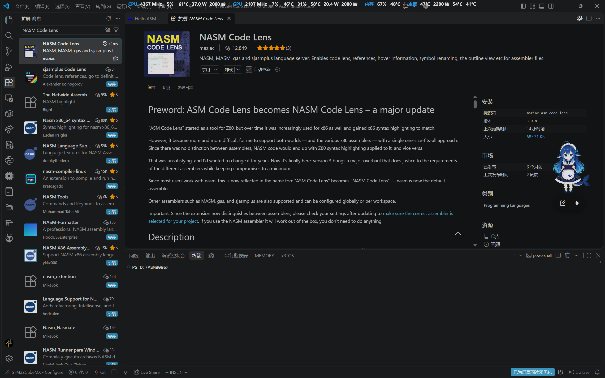
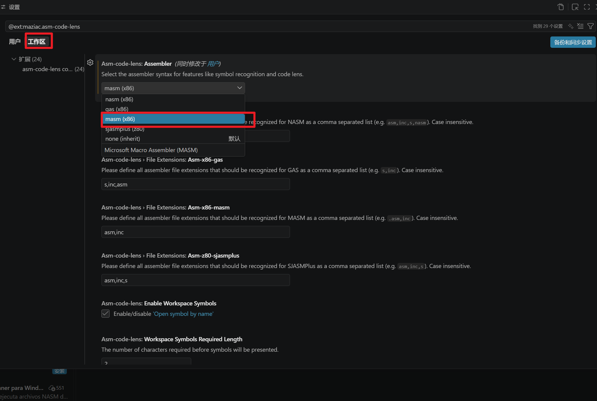

## 引言
在本学期我的专业有一门汇编原理专业课，其中涉及到了汇编语言的相关内容，早期课程只是单纯的介绍了一些理论知识，例如CPU的构成，常见的寄存器作用是什么。前阵子开始进入到了汇编程序设计的部分了，程序设计这部分内容说实话并不是很难，因为我已经接触过一些编程语言了，对一些基本的程序设计也有所了解。但是难受的是我发现我看不懂汇编语言的代码，这使得我在进行代码分析时无从下手，转而开始学习汇编语言的语法，在我们学校的课程中我学习的汇编语言是面向`Intel8086`的16位`x86`汇编

作为第一篇文章我会介绍一下如何搭建对应的编码环境，即用`MASM`语法编写`DOS`程序，并在`DOSBox`软件中运行

## 环境搭建
环境搭建的过程并不复杂，这里给大家准备了环境搭建时需要使用到的软件程序，大家可以点开链接自行下载
[资料链接](https://pan.baidu.com/s/1kIYC9MZNe86vZuRgAvdzfw?pwd=1234)
链接中主要是`DOSBox`软件的安装包，和对应的编译链接程序

### 工具介绍
接下来介绍一下提供的这几个工具各自的作用是什么，这样在后续的环境搭建过程中你就清晰的知道自己在干什么了

#### DOSbox
随着计算机架构的演进，现代的操作系统如`Windows`、`MacOS`等都是64位操作系统。我们需要编写的汇编语言需要运行在16位操作系统上，这里的主要是因为我们的程序依赖DOS提供的功能，例如我们在程序中使用`INT 21`来显示字符串时，对应的服务则会由`DOS`提供。而且学校提供的编译链接程序也都是在`DOS`环境下使用的

#### 汇编工具
在资料中的`MASM`压缩包中有着四个程序，它们的作用为：

| 程序        | 作用                                   |
| --------- | ------------------------------------ |
| edit.com  | DOS下的文本编辑器，用来编写、修改`.ASM`汇编文件         |
| MASM.EXE  | 汇编器：将`.ASM`汇编文件翻译成`.OBJ`目标文件，并报告汇编错误 |
| LINK.EXE  | 链接器：将`.OBJ`链接成可运行的`.EXE`可执行文件        |
| debug.exe | 调试器：查看指令、寄存器和内存，并单步执行程序              |

### 操作流程
首先我们需要双击`DOSBox`的安装程序，安装成功之后我们创建一个新的文件夹，注意不要在路径中出现中文，我这里选择在D盘下创建新的文件夹，对应的路径为`D:\ASM8086`，我们将压缩包解压后的四个程序全部都放入该文件夹下。然后在`vscode`中打开该文件夹，创建一个`demo`汇编文件，这里我创建了一个名为`HELLO.ASM`汇编文件。这里需要了解的是DOS文件名不区分大小写：`hello.ASM`、`HELLO.asm`和`Hello.asm`指向同一个文件

我们可以在汇编文件中编写汇编代码，下面是一段示例代码，可以复制到你的`demo`文件中
```asm
DATA SEGMENT

    MSG DB 'Hello, 8086!$'

DATA ENDS
  

STACK SEGMENT STACK

    DB 128 DUP(?)

STACK ENDS

  

CODE SEGMENT

    ASSUME CS:CODE, DS:DATA, SS:STACK

START:

    MOV AX, DATA

    MOV DS, AX

  

    MOV DX, OFFSET MSG

    MOV AH, 09H

    INT 21H

    MOV AX, 4C00H

    INT 21H

CODE ENDS

END START
```
代码编写完毕之后接下来我们就可以尝试进行编译运行了

#### 编译运行
如果你学习过C语言，那么你对汇编语言的编译运行流程应该不会感到陌生，还记得C语言中源代码是如何变成可执行文件的吗？
首先进行预处理，将源代码中的`#inlcude`等内容展开，得到`.i`文件，文件内容还是C语言文本
然后进行编译，得到`.s`文件，文件内容是汇编语言文本
接下来进行汇编，得到`.o`文件
最后进行链接得到最终的`.exe`可执行文件
```Plaintext
demo.c (C语言源文本)
           │
           │  [ 执行 gcc -E demo.c -o demo.i (预处理: 展开宏、包含头文件) ]
           ▼
       demo.i (预处理文件, 纯文本)
           │
           │  [ 执行 gcc -S demo.i -o demo.s (编译: 词法/语法分析、优化) ]
           ▼
       demo.s (汇编源文件)
           │
           │  [ 执行 gcc -c demo.s -o demo.o (汇编: 翻译为机器码) ]
           ▼
       demo.o (目标文件)
           │
           │  [ 执行 gcc demo.o -o demo.exe (链接: 合并CRT库、符号解析与重定位) ]
           ▼
       demo.exe (可执行文件)
           │
           │  [ 终端输入 demo 或在 GDB 下单步调试 ]
           ▼
       加载到内存运行
```

我们观察一下不难发现如果是汇编程序的话只要从汇编步骤直接开始就行了，可以直接跳过前面的预处理和编译流程，大致的流程如下：
```Plaintext
demo.asm (汇编源文本)
           │
           │  [ 执行 masm demo.asm; ]
           ▼
       demo.obj (目标文件, 含机器码与重定位表)
           │
           │  [ 执行 link demo.obj; ]
           ▼
       demo.exe (可执行文件, 含 MZ 头与可重定位机器码)
           │
           │  [ 输入 demo 或在 DEBUG 下单步跟踪 ]
           ▼
       加载到内存运行
```
了解了对应的流程之后接下来就是实操了，我们双击运行`DOSBox`软件，运行之后我们在程序的黑色命令行窗口中就可以执行对应的指令了

首先我们需要进行目录挂载操作，由于`DOSBox`提供的只是一个虚拟环境，在该环境中默认是没有我们需要的程序和刚才编写的汇编文件的，因此我们需要将`windows`下的文件夹映射到`DOSBox`的虚拟环境中，这里我们使用的命令是
```dos
MOUNT C D:\ASM8086
```
这条命令的作用就是将当前`windows`下的`D:\ASM8086`文件夹中的内容映射成`DOSBox`中的`C:`盘，操作之后我们之前在`D:\ASM8086`文件夹下存放的4个程序和编写的汇编文件都可以在`DOSBox`的虚拟环境中访问到，接下来执行
```dos
C:
```
切换驱动器，这样在`DOSBox`中我们就可以直接运行程序和编译文件了，否则会显示找不到目标文件或程序，如果不放心也可以执行`dir`指令来查看一下当前文件夹下的文件内容

如果列出了对应文件就说明操作正确

接下来我们就需要借助可执行文件`MASM`对程序进行汇编操作
```dos
MASM HELLO;
```
如果没有报错就说明汇编成功

接下来就再使用连接器进行链接，生成可执行文件
```dos
LINK HELLO;
```


最后运行可执行文件即可看到对应的运行结果


### VScode编码效果优化
我们后续学习都会选择在`VScode`中进行代码编写，但是默认情况下`VScode`是没有汇编语言的高亮显示和代码提示的，因此我们可以通过安装插件来提高开发体验，这里推荐安装的插件是`NASM Code Lens`插件


插件安装之后我们还需要再进行简单的配置


在插件的配置界面中我们点击工作区，切换到工作区界面，然后在第一行中选择`MASM(x86)`即可

## 总结
工欲善其事，必先利其器，相信看完本篇文章的你已经能够独立的配置一套可用的汇编语言学习环境了，这就为后续的语法学习扫清了障碍

