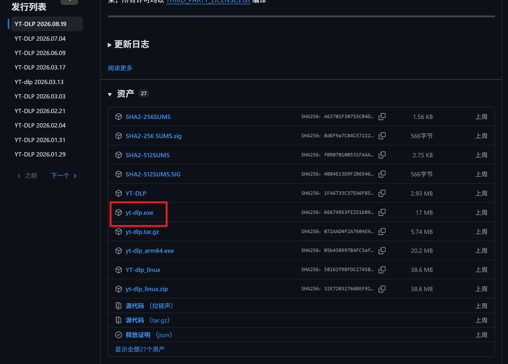
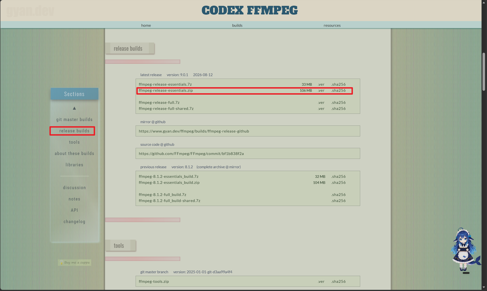
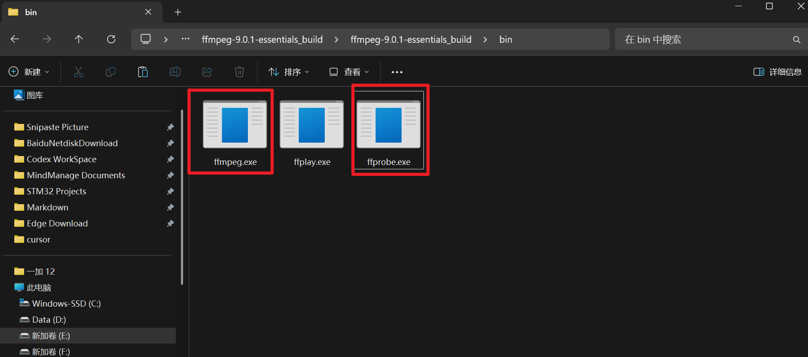
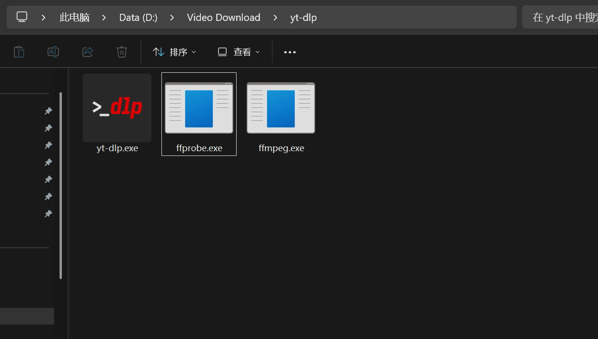
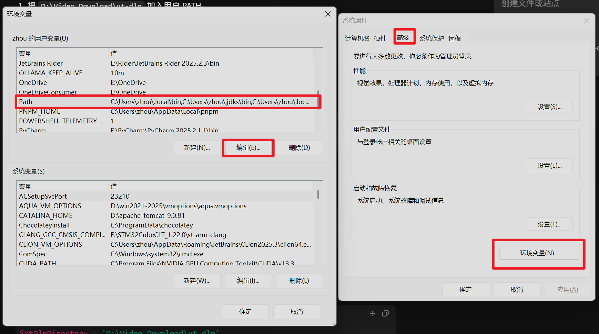
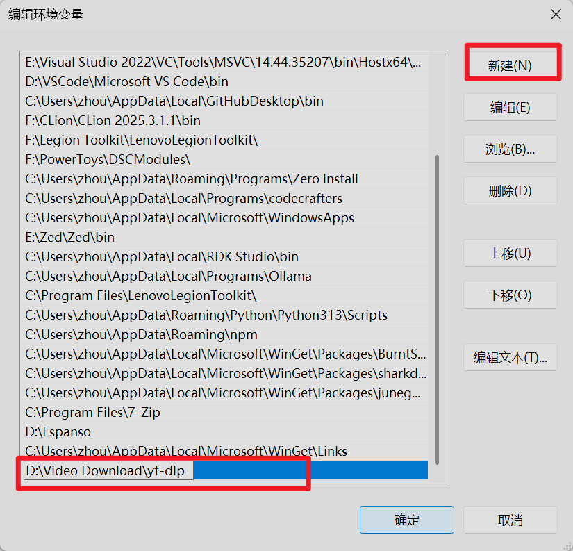
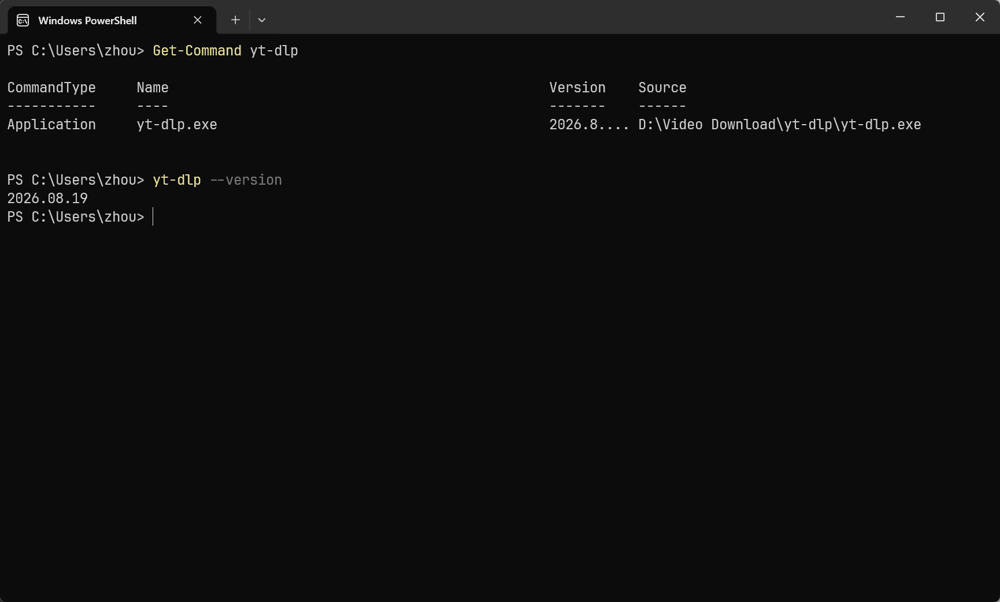
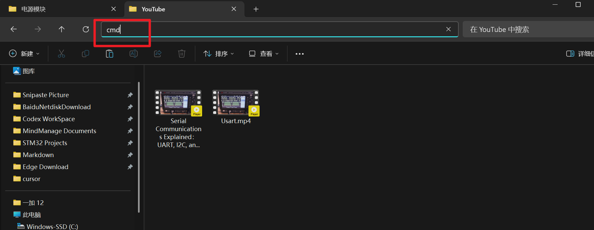

## 引言
当我们在一些平台上看到了不错的视频之后想要下载下来离线观看，往往只能通过软件中自带的下载功能，但是有些时候视频平台会有所限制，如果不充钱的话要么不让下，要么只能下载低清版本的视频，这就很不友好，因此接下来我就会分享一下如何借助`GitHub`上的一个开源工具来进行全平台视频的下载

## 工具介绍
接下来需要使用到的工具是`GitHub`上的一个开源项目，项目地址为:[项目链接，点击跳转](https://github.com/yt-dlp/yt-dlp)。该项目是一个非常功能非常强大的项目，几乎可以下载国内外所有主流视频网站中的视频，而且下载速度快、清晰度高

## 使用流程
接下来就以`Windows`系统作为示范，讲述一下如何使用该视频下载工具

### 程序配置
#### 源程序下载
首先我们需要下载对应的可执行文件，可执行文件的下载链接为：[下载链接，点击跳转](https://github.com/yt-dlp/yt-dlp/releases)
我们在下载界面中选择适合自己当前操作系统的版本

如果你也是`Windows`那么也可以选择下载红框中的`.exe`可执行文件

#### ffmpeg环境配置
由于默认情况下下载的视频格式并不是通用格式，因此在某些情况下我们可以在下载时指定下载视频的格式，这就需要用到视频格式转换程序`ffmpeg`，接下来我会简单的介绍一下如何配置`ffmpeg`

##### 下载压缩包
首先我们需要在`ffmpeg`官网下载对应的压缩包，下载链接为[下载链接，点击直达](https://www.gyan.dev/ffmpeg/builds/#release-builds)

在下载界面中我们点击左侧的`release builds`，然后下载红框中的版本即可，下载完成之后我们在压缩包中找到`bin`目录下的两个可执行文件，如红框中所示

#### 可执行文件放置
接下来我们可以自行选择一个目录，然后将我们下载好的`yt-dlp.exe`可执行文件和`ffmpeg`中的两个可执行文件放到同一个目录下

### 环境变量配置
接下来我们需要配置一下对应的全局变量，以实现可以在任意目录下使用并下载`yt-dlp.exe`，我们按下键盘上的`WIN + R`快捷键，然后在弹出的窗口中输入`sysdm.cpl`
在随后弹出的窗口中点击**高级**，然后点击**环境变量**，找到**用户环境变量**，点击`Path`，点击**编辑**

随后我们新建一个环境变量，并将之前存放可执行文件的路径填入其中即可

#### 环境验证
配置完上述这些之后我们还需要进行一下简单的验证，我们打开终端输入`Get-Command yt-dlp`和`yt-dlp -- version`，如果出现下图类似输出说明配置成功，可以正常使用

### 使用操作
配置完成之后使用起来就很简单了，我们在存放下载视频的文件夹下打开终端

打开终端之后即可