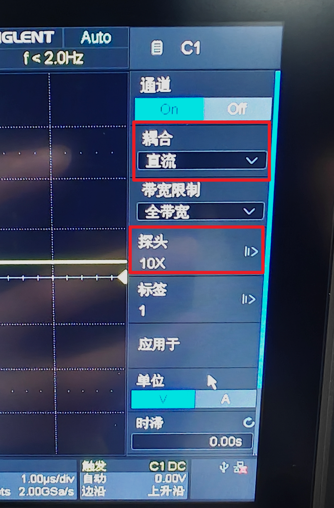
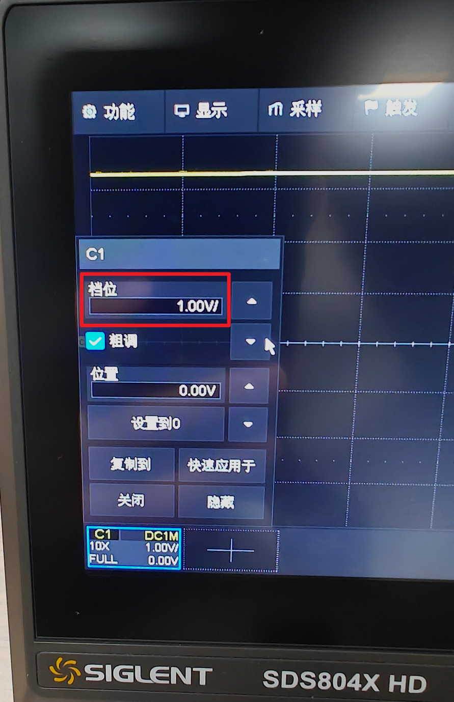
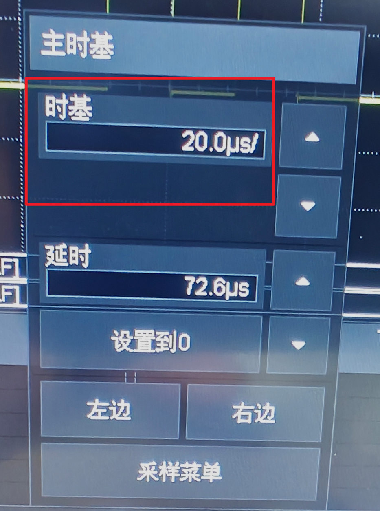
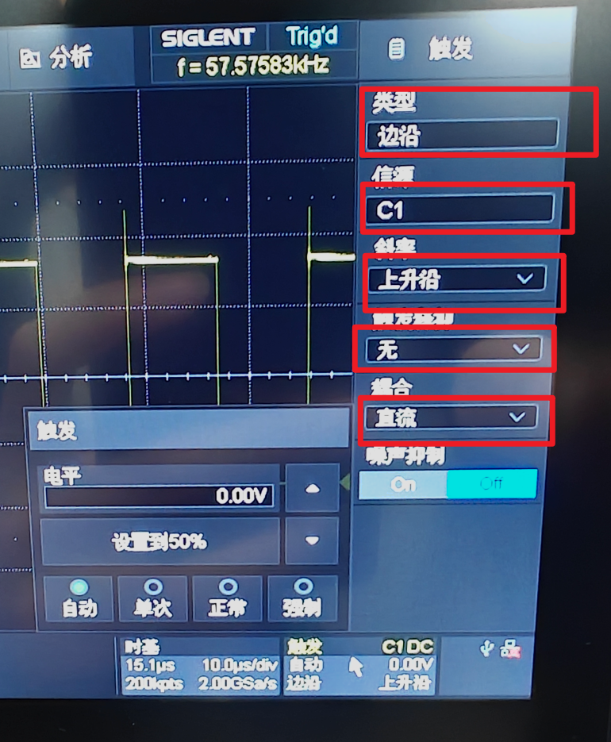

## 简介
本文主要介绍一下如何使用示波器采集单片机发送的串口信号，在后续的实验中我使用的示波器型号是鼎阳的`SDS804X HD`

如果你跟我使用的是同一个系列的示波器那么可以到官网上去查找对应的资料，[官网链接，点击直达](https://www.siglent.com/products-overview/sds800hd/)

## 实操流程
### 校准
#### 自校准
如果你的示波器是新买回来的，那么需要进行示波器的校准工作，我们需要点开主界面中左上角的功能选项，在弹出的选项中点击菜单

在菜单界面中选择维护

在维护界面中点击自校正，随后就会弹出信息提示窗口

此时我们需要将连接在示波器采样通道上的接口线都拔下来，并点击继续，3~5分钟之后自校准就会完成

#### 探头校准
对示波器进行自校准之后还要对探头进行校准，我们这里使用的是购买示波器赠送的探头

探头的型号是PP510，我们首先将探头的单位调整到乘10挡位

随后我们将探头的两个接口分别接到示波器下方的金属片上，鳄鱼夹接口接到圆形铁片上，主探头接口则接入到方形铁片上

随后我们在右侧的通道选择界面中选择探头接入的通道，这里探头接入的是通道1，因此我们就按下通道一对应的按键

选择之后我们还需要观察示波器上显示的探头倍率和实际倍率是否相等

点击探头选项，即可跳转到对应的探头参数配置界面

在当前界面中确保探头参数为`10:1`
然后点击右侧按键中的`AutoSetup`

在提示窗口中点击确认

随后我们就会在屏幕中看到对应的波形

一般情况下波形会有四种情况

当前显示的结果就表明当前探头处于过补偿状态，我们需要通过探头包装内赠送的螺丝刀进行校准

我们将螺丝刀插入对应的缺口中左右旋动螺丝，直至波形呈现水平状态

大致呈现如图所示状态就说明校准成功

## 测量操作
### 准备串口测试信号
想要测量信号我们首先需要产生信号，只要你的手里有空余的开发板就可以选取串口引脚来输出串口信号，我这里使用的是西门子工业嵌入式赛道官方开发板，通过代码控制串口一，即`PA9`和`PA10`每隔`100ms`输出一次字符`U`

### 连接线路
接下来我们需要将示波器的探头连接到`PA9`引脚，这里只需要连接一个`PA9`即可，因为只有`TX`引脚会输出对应的串口数据

### 参数设置
由于当前串口输出的直流电平信号，因此我们需要将对应的采样引脚设置为直流模式，首先按下右侧的通道对应实体按键，在弹出的参数配置界面中我们需要将耦合设置为直流模式，将探头的倍率设置为X10

设置完成之后我们点击屏幕左下角的`C1`框，在弹出的参数配置界面中将挡位配置为`1.0V`

这里挡位的作用是指一格代表多少`V`的电压，由于单片机引脚的高低电平分别为`0~3.3V`，所以我们选择`1V`一格刚好可以将上下的三格占满，这样测量的图形既不会超出屏幕又利于观察
设置完了垂直挡位之后接下来我们需要设置一下时间基准，简称时基，这个参数决定了X轴上每一格代表的时间长度，我们希望一个X轴长度和数据位的持续时间相等，如果不等那么就尝试加长时间基准，确保能够检测到完整的数据信息，这个参数需要结合单片机端的串口参数进行调整，计算的公式为
`T = 1 / 波特率`
这里我们使用的串口波特率是115200，带入公式可得
`T = 1 / 115200 = 8.68us`
这意味着波形每隔`8.68us`才能进入下一个数据位
因此我们在这里需要将时基设置为`10us`这样每个数据大约能够占据横向的一格。串口一帧数据包含
```txt
1位起始位
8位数据位
0位校验位
1位停止位
```
总共10位，所以一帧的时间为：
`T = 10 X 8.68 = 86.8us`
当前屏幕的横向格数为10格，为了留有余量，我们选择将时基设置为20

接下来我们开始进行触发设置，我们点击屏幕右下角的触发，在弹出的参数界面中将触发类型设置为**边沿触发**，将信号源选择为当前进行数据测量的信号源，触发方向我们选择**上升沿**，耦合信号选择**直流**

电平是指触发电平，这里我们为了保证能够正常进行触发，往往会取中间电平，