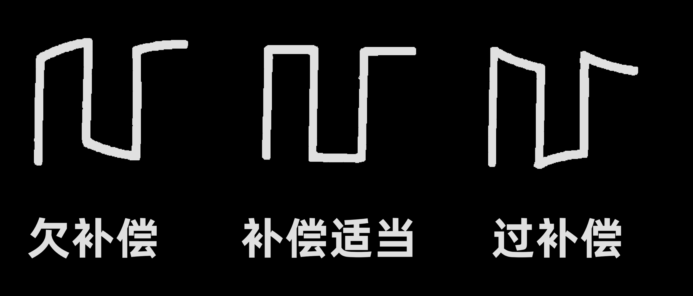
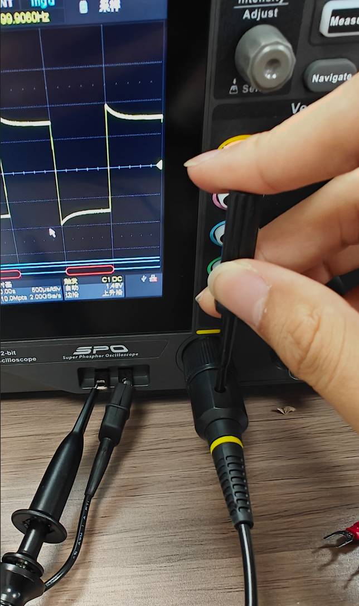

## 简介
本文主要介绍一下如何使用示波器采集单片机发送的串口信号，在后续的实验中我使用的示波器型号是鼎阳的`SDS804X HD`

如果你跟我使用的是同一个系列的示波器那么可以到官网上去查找对应的资料，[官网链接，点击直达](https://www.siglent.com/products-overview/sds800hd/)

## 实操流程
### 校准
#### 自校准
如果你的示波器是新买回来的，那么需要进行示波器的校准工作，我们需要点开主界面中左上角的功能选项，在弹出的选项中点击菜单

在菜单界面中选择维护

在维护界面中点击自校正，随后就会弹出信息提示窗口

此时我们需要将连接在示波器采样通道上的接口线都拔下来，并点击继续，3~5分钟之后自校准就会完成

#### 探头校准
对示波器进行自校准之后还要对探头进行校准，我们这里使用的是购买示波器赠送的探头

探头的型号是PP510，我们首先将探头的单位调整到乘10挡位

随后我们将探头的两个接口分别接到示波器下方的金属片上，鳄鱼夹接口接到圆形铁片上，主探头接口则接入到方形铁片上

随后我们在右侧的通道选择界面中选择探头接入的通道，这里探头接入的是通道1，因此我们就按下通道一对应的按键

选择之后我们还需要观察示波器上显示的探头倍率和实际倍率是否相等

点击探头选项，即可跳转到对应的探头参数配置界面

在当前界面中确保探头参数为`10:1`
然后点击右侧按键中的`AutoSetup`

在提示窗口中点击确认

随后我们就会在屏幕中看到对应的波形

一般情况下波形会有四种情况

当前显示的结果就表明当前探头处于过补偿状态，我们需要通过探头包装内赠送的螺丝刀进行校准

我们将螺丝刀
