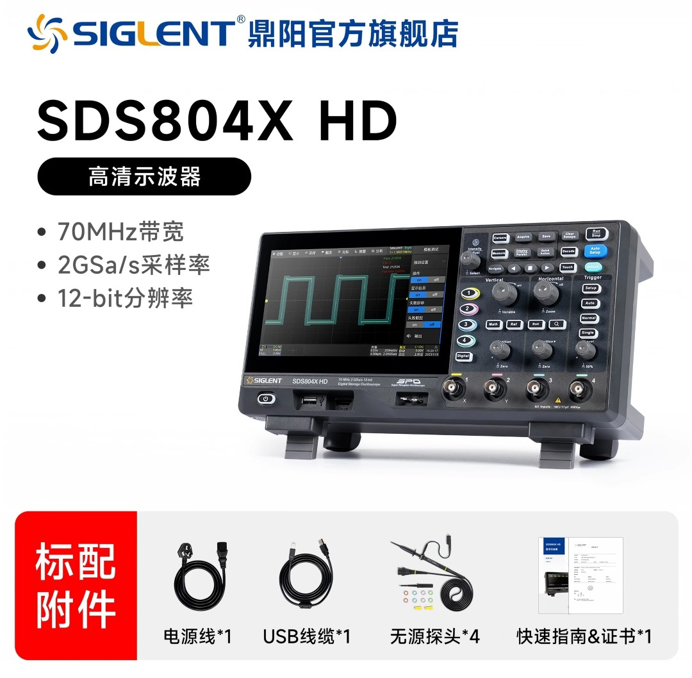

## 简介
本文主要介绍一下如何使用示波器采集单片机发送的串口信号，在后续的实验中我使用的示波器型号是鼎阳的`SDS804X HD`

如果你跟我使用的是同一个系列的示波器那么可以到官网上去查找对应的资料，[官网链接，点击直达](https://www.siglent.com/products-overview/sds800hd/)

## 实操流程
### 校准
如果你的示波器是新买回来的，那么需要进行示波器的校准工作，我们需要点开