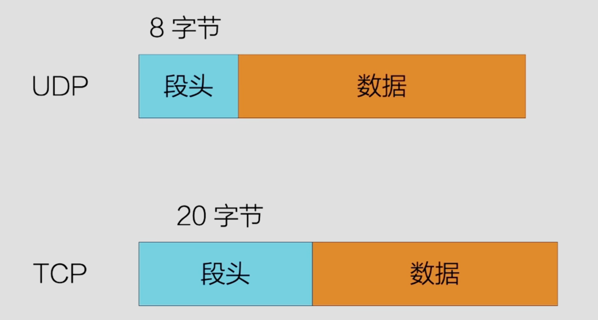
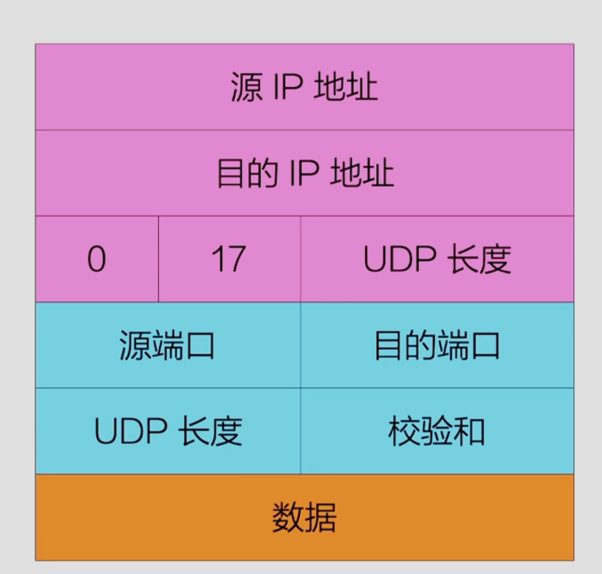
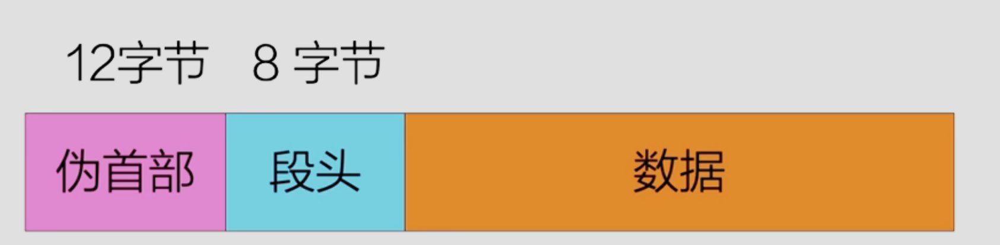
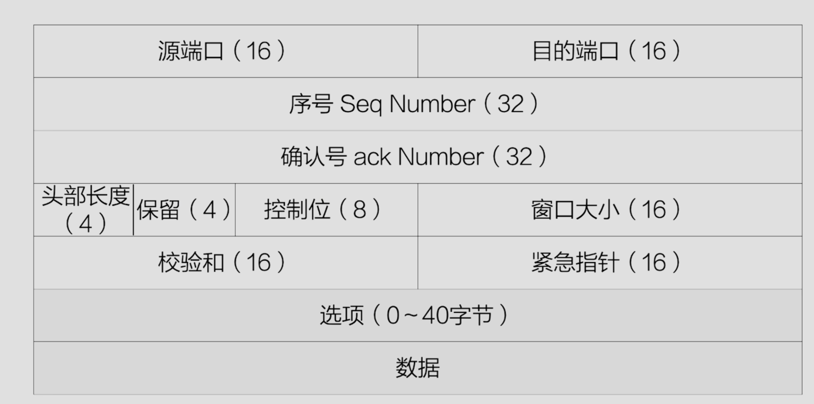
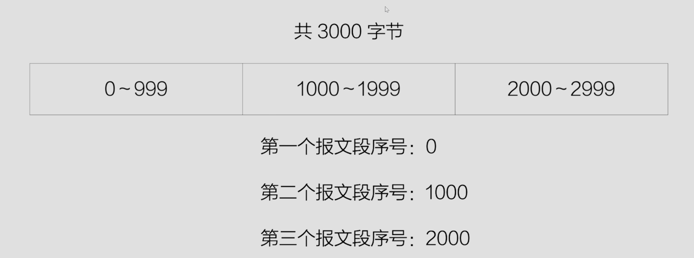
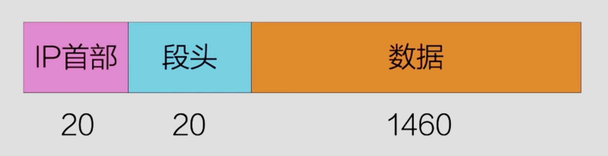

## 逻辑通信
传输层的协议未运行在不同主机上的应用程序提供了逻辑通信功能

### 端口
端口号长度未16位比特，取值范围是`0~65535`
端口号分为服务端口号和客户端端口号，其中服务端端口号又分为知名端口号(`0~1023`)和注册端口号(`1024~49151`)

常见的知名端口号为：

| 端口    | 协议      | 用途     |
| ----- | ------- | ------ |
| 20、21 | `FTP`   | 文件传输   |
| 22    | `SSH`   | 远程登录   |
| 25    | `SMTP`  | 电子邮件   |
| 80    | `HTTP`  | 万维网    |
| 110   | `POP-3` | 访问远程邮件 |
| 143   | `IMAP`  | 访问远程邮件 |
| 443   | `HTTPS` | 安全的Web |
| 543   | `RTSP`  | 媒体播放控制 |
| 631   | `IPP`   | 打印共享   |

## 传输层协议
传输层提供了两种协议，分别是`UDP`和`TCP`

| 用户数据报协议                                  | 传输控制协议                                  |
| ---------------------------------------- | --------------------------------------- |
| 提供无连接不可靠的传输服务                            | 提供面向连接的可靠传输服务                           |
| 发送数据前不需要提前建立连接，结束时也不需要释放连接               | 发送数据前需要建立连接，数据传输结束后，释放连接                |
| 提供**经历而为交付服务**，不确保报文段交付，不保证报文段中数据的顺序和完整性 | 为提供可靠的传输服务，`TCP`进行连接管理可靠传输、流量控制医院及拥塞控制等 |
| `UDP`支持一对一、一对多、多对一、多对多的通信方式              | `TCP`是一对一，不支持多播和广播                      |

### TCP与UDP

由图可以看出UDP的数据的段头长度为8字节
TCP的数据长度为20字节

#### UDP数据报
UDP数据报格式

| 源端口     | 目的端口     |
| ------- | -------- |
| `UDP`长度 | `UDP`校验和 |
|         |          |
`UDP`长度表示整个`UDP`报文的长度，包括8字节的`UDP`头部和`UDP`数据部分，单位是字节。取值范围最小为8(仅有头部无数据)，最大为`65535`(头部加数据)

校验和：通常是对“伪首部+ UDP头部+UDP数据”这一整段字节流按16位逐一累加求和后，取反的结果

不可靠性传输指的是可以丢弃数据，但是不能接收错误的数据

### TCP报文

#### 序号
指示**本报文段所携带数据的第一个字节**在该连接发送方的序列号，用于在接收端进行重组与排序，在三次握手时，通信双方各自选择一个随机初始序号，然后后续每发送一个字节，序号递增1

假设现在我需要传递3000字节长度的数据，但是由于长度限制，我一次只能传递1000字节，因此我需要分三次进行数据的传输，每段数据都有对应的序号，这样即便发送顺序出现错误，即第二段报文数据比第一段优先到达，接收方也能依据序号知道出现了错误

#### 确认号
只有当`ack`位为一的时候，该字段才有效，确认号表示期待接受的下一个字节的序号，如：接收方若接收到序号`1000`，下一次要接收的数据序号就是`1500`，于是接收方就向发送方ack确认号字段填`1500`

#### 头部长度
指明`TCP`头部占用的长度，以4字节为单位，最小值5，最大值15

#### 控制位

| 位     | 含义                      |
| ----- | ----------------------- |
| `URG` | 紧急指针字段有效，表示紧急数据         |
| `ACK` | 确认号字段有效，表明这是一个确认报文      |
| `PSH` | 表示接收端应尽快把数据交给应用，不用等待缓存满 |
| `RST` | 重置连接，用于强制结束异常连接或拒绝连接请求  |
| `SYN` | 用于连接请求和确认，，在三次握手时同步序号   |
| `FIN` | 用于连接关闭，表示数据发送结束，准备释放连接  |

- SYN=1：表示发起连接，请求同步序号
- ACK=1：表示确认号字段有效，常见于三次握手后和数据传输过程
- FIN=1：表示发送方无数据可发送，要求释放连接
- RST=1：表示出现严重错误或连接请求被拒绝，直接重置连接
- URG=1：告诉接收方紧急指针有效，报文中**紧急数据**需要优先处理
- PSH=1：告诉接收端把此报文段的所有数据立刻交给应用，而不要再缓存
#### 校验和
与`UDP`类似，，覆盖伪首部、`TCP`头部、以及`TCP`数据，用于差错检测

#### 紧急指针
仅当URG=1时该字段才有效，它表示**紧急数据**的末尾在本报文段中的偏移量

#### 选项
为`TCP`提供可扩展功能，比如设置最大报文长度(`MSS`)、窗口扩大因子(`Scale`)、时间戳(`Timestamp`)、选择确认(`Selective Acknowledgment`,`SACK`)等

最大报文长度(`Maximum Segment Size`, `MSS`)

### TCP全双工通信
#### TCP建立连接（三次握手）
在`TCP`协议中没有所谓的发送方和接收方，主机在进行TCP连接建立的时候二者会相互发送消息，这是一个你来我往的过程

#### 释放连接
终止一个连接有两种方式：非对称释放和对称释放
非对称释放：电话系统的工作方式，一方挂断，连接中断
对称释放：把连接看成是两个独立的单向连接，要求每一个单向连接被单独释放

