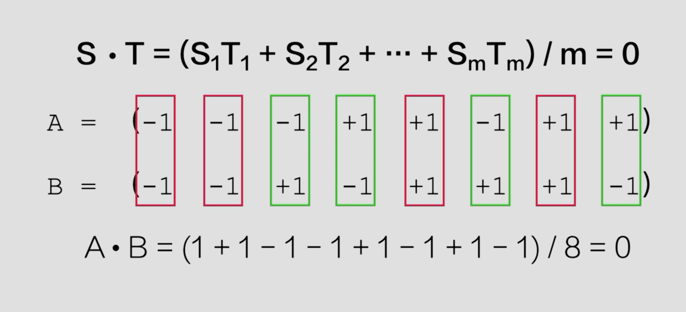
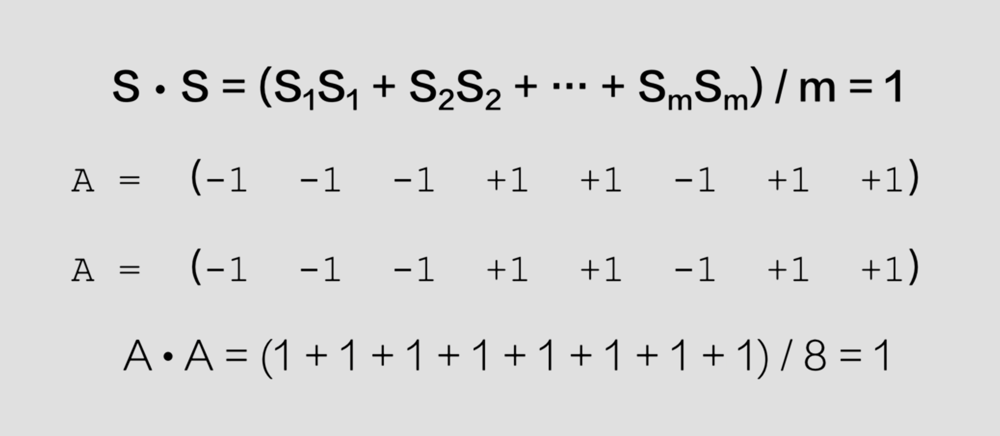

## 信道复用
信道复用是指在邮箱的物理信道资源上，通过不同方式让多个信号共享同一个信道，以提高资源利用率和通信效率，对物理信道进行复用主要有三种方法：频率、时间和编码

常见的信道复用技术有：**频分复用**、**时分复用**、**码分复用**，此外还有一种称为波分复用，本质上是频分复用的光学形式

## 频分复用
将可用带宽划分为多个频段，每个信号占用不同的频段进行传输

## 时分复用
多个信号按照时间片轮流占用整个信道，每个信号在不同的时间间隔内传输

## 码分复用
又称码分多址`CDMA`，所有用户在相同频率和时间共享信道，但每个用户使用不同的编码来区分信号

## 波分多路复用
类似`FDM`，但用于光纤通信，每个信号用不同波长的光进行传输

## 码分复用
码片：在`CDMA`中，一比特会被再细分成多个码片，码片是比比特更短的单位，每个比特由多个码片组成，通常情况下，一个比特被分为64或128个码片

计算机网络中每一个节点会被分配一个码片序列：
在计算机网络中，任意两个节点的码片序列是正交的，从而实现多用户共存且互不干扰，从数学角度看，所谓正交就是任意两个不同的码片归一化内积为0

任何码片与自身归一化内积一定为1

