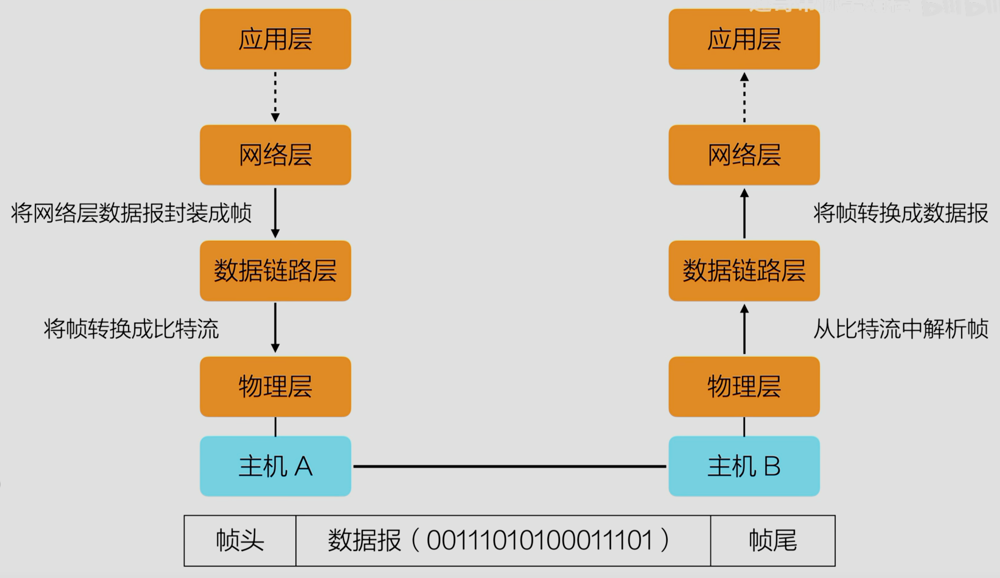

## 定义
数据链路层的核心任务是在物理层提供的比特流基础上，提供可靠的数据传输，并确保数据能正确的从一个设备发送到另一个设备

## 功能
向网络层提供一个定义良好的服务接口
将数据封装成帧/从比特流中解析帧
错误检测和纠正
调节数据流
介质访问控制

## 帧（Frame）
在数据链路层，数据以帧的形式进行传输，每一帧通常包含以下三部分：
- 帧头：包含地址信息（源地址、目的地址）、帧类型、控制信息等
- 数据：承载来自网络层的数据报文
- 帧尾：通常包含校验和用于检测数据传输错误

 网络层到数据链路层会将数据封装成帧
 数据链路层到物理层将帧转换为比特流

