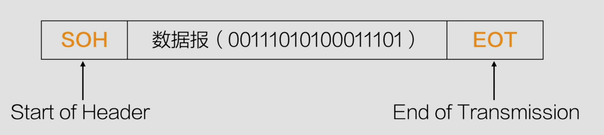

## 定义
数据链路层的核心任务是在物理层提供的比特流基础上，提供可靠的数据传输，并确保数据能正确的从一个设备发送到另一个设备

## 功能
向网络层提供一个定义良好的服务接口
将数据封装成帧/从比特流中解析帧
错误检测和纠正
调节数据流
介质访问控制

## 帧（Frame）
在数据链路层，数据以帧的形式进行传输，每一帧通常包含以下三部分：
- 帧头：包含地址信息（源地址、目的地址）、帧类型、控制信息等
- 数据：承载来自网络层的数据报文
- 帧尾：通常包含校验和用于检测数据传输错误

 网络层到数据链路层会将数据封装成帧
 数据链路层到物理层将帧转换为比特流

## 字节计数法
在帧的头部添加一个字段，指明该帧的字节数

### 优点
简单易实现，占用的额外开销少

### 缺点
如果计数字段的数据被传输错误，会导致数据同步错误，接收端可能会错误地解析数据

## 字符填充法
使用特殊字符（如`SOH`和`EOT`），并在数据部分中避免特殊字符的冲突

如果数据中包含了`SOH`或`EOT`，则用`ESC`来填充，避免误判

### 优点
解决了字节计数法的同步问题，适用于字符流
### 缺点
增加了额外的转义字符，可能会占用带宽

## 比特填充法
使用特定的比特模式作为帧的起始和终止标志，并在数据部分中避免比特模式的冲突，数据中如果连续出现5个1，则自动填充0

### 优点
适用于任何比特流，不局限于字符编码

### 缺点
需要额外的比特填充，稍微增加了传输开销

## 物理层编码法
数据报封装成帧之后，直接在物理层使用信号的变化来标识帧的起始和结束，而不依赖特定的比特模式

### 优点
不需要填充比特，不会增加额外的开销
### 缺点
依赖物理层的编码方式，不适用于所有链路层协议