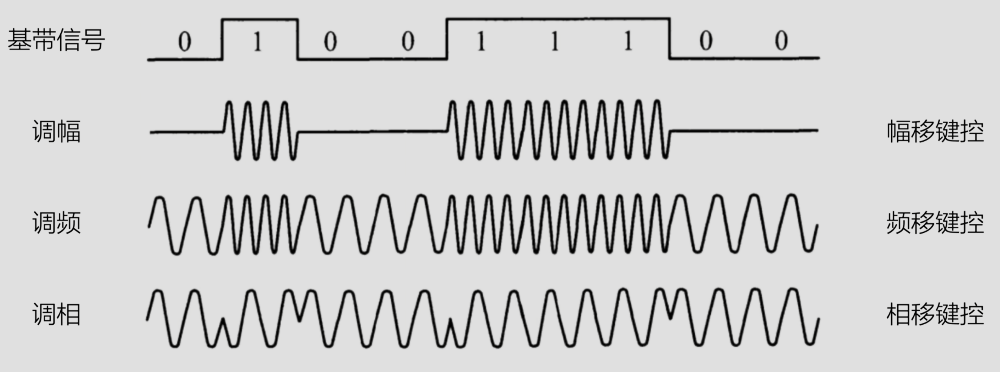

## 码元
码元就是数字调制过程中用来承载信息的基本信号单位，它通过特定的映射关系，将一组比特与一个独特的信号状态对应起来，从而实现数字信息的传输

## 波特率
单位时间内传输的码元个数，单位为`Baud`，可以表达信号传输速率

波特率关注的是物理信号的变化，即底层通信的速率
## 比特率
单位时间内传输的比特个数，单位为`bit`，可表达数据传输速率

比特率关注的是实际传输的数据量，即有用信息的速率

## 波特率和比特率的关系
B 波特率
C 比特率
N : 码元的离散状态数（每个码元所能表示的不同状态数量）

C = B$log{2}_(N)$

## 数字调制方法
将数字信号调制成模拟信号有**调幅**，**调频**和**调相**三种方式
 
## QAM(正交振幅调制)
正交振幅调制：在频率相同的前提下，将**调幅**和**调相**结合起来，形成叠加信号

B 波特率
C 比特数
M : 相位数
N : 振幅数

C = B$\log_{2}(N)$
C = B$log_{2}(MN)$

## 奈奎斯特定理
无噪声下的码元速率的极限值`B`与信道带宽`H`的关系：`B = 2H`
`H`为信道的带宽，即信道传输上、下限频率差值，单位为`Hz`
无噪声信道传输能力：C = B$log_{2}(N)$(b / s) 
C = 2H$log_{2}(N)$(b / s)
无噪声信道传输速率：C = 2H$log_{2}(N)$

## 香农公式
一条带宽为`H`，有噪声信道的最大传输速率为:
C = H$log_{2}(1+S/N)$
S : 信号功率
N : 噪声功率
S / N : 信噪比

## 信噪比与分贝
通常情况下并不直接使用信噪比，而是使用分贝，db = 10lg(S/N)

| 信噪比(S/N) | 分贝(dB)            |
| -------- | ----------------- |
| 10       | 10 lg(S/N) = 10dB |
| 100      | 10 lg(S/N) = 20dB |
| 1000     | 10 lg(S/N) = 30dB |

## 报文交换
### 简介
发送前无需建立连接，以报文作为数据传输单位
报文从源点传送到目的地采用“存储 - 转发”方式，在传送报文时，一个时刻仅占用一段通道。在交换节点中需要缓冲存储，报文需要排队，因此报文交换不能满足实时通信的要求

### 优点
1. 线路利用率高，提供多目标服务
2. 不用建立连接，动态分配线路
3. 提高了线路的可靠性和利用率

### 缺点
1. “存储-转发”实时性差
2. 对报文大小无限制，存储空间大
3. 发生错误时，请求重传，整个报文丢弃
## 分组交换
### 简介
与报文一样，也采用“存储-转发”方式
将大的报文分成小的分组，每个分组都携带源地址、目的地以及编号等信息，中间节点对分组进行存储转发，目标站点间接收到的分组根据编号重新组装成报文

### 优点
1. 存储空间开销小
2. 无效传输低
3. 传输延迟低

### 缺点
1. 分组乱序，各个分组可通过不同的路径达到目的站点
2. 通信效率低