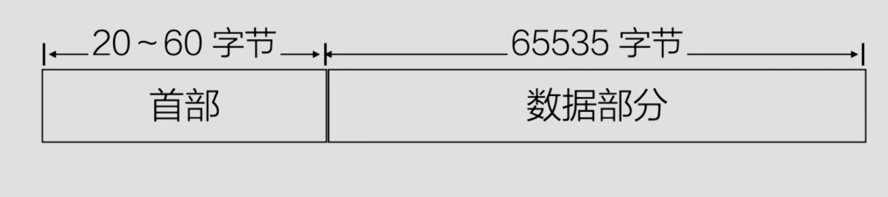
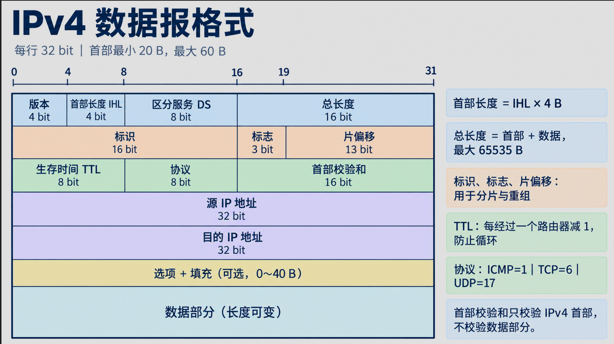

## 简介
网络层主要的作用是***将数据传输到目标地址**
目标地址可以是多个网络通过路由器连接而成的某个地址
该层负责**寻址**和**路由选择**

## 无连接服务
### 定义
每个数据包都是独立的，彼此之间没有任何关联。每个数据包携带了足够的信息，以便能够独立地从源地址传输到目的地址。事先没有建立连接，也不需要维护连接状态。在这样的环境中，数据包通常被称为数据报，这种网络通常被称为数据报网络

### 特点
无需建立连接：发送方和接收方之间不需要建立连接，数据包可以直接发送
每个数据包独立：每个数据爆都有完整的目的地址和路由信息，发送和接收的数据包之间没有任何关联
不保证可靠性：由于每个数据爆是独立的，网络层不保证数据包的可靠传输，数据包可能丢失、乱序或者重复

适用场景：适用于那些对实时性要求较高且可以容忍丢包的应用，如视频会议、实时游戏等

## 有连接服务
### 定义
发送方和接收方在数据传输之前需要通过网络建立一条虚拟的路径，所有数据包通过这条虚电路进行传输。虚电路在通信过程中始终存在，直到通信结束，这种网络称为虚电路网络

### 特点
建立连接：发送方和接收方在数据传输前必须进行连接建立，通过建立虚拟电路来保证数据能够按照特定的顺序到达接收方

可靠传输：在虚电路网络中，数据包的顺序和完整性都能得到保证，网络层会对数据包进行确认和重传

固定路径：所有的数据包都会沿着同一路径传输，这样便于提供高效的流量控制和错误检测

适用场景：适用于可靠性高、数据顺序需要保证的应用，如文件传输、电子邮件等

## 路由与转发
### 路由
指的是在网络层选择数据包从源到目的地的最佳路径的过程。路由设计到路由表的维护和更新，通常由路由协议动态计算

### 转发
是指在路由选择已经完成之后，设备将数据包从一个接口转发到另一个接口的过程。转发的速度要求非常高，因为它直接影响到数据包的传输效率

### 跳帧算法
跳帧算法是数据包从源节点传送到目的节点的过程中，每一跳由各个路由器决定下一跳路由器的转发行为。这种转发行为基于路由表中的信息，每个路由器仅根据目标地址和自己的路由表做出转发决策。它不需要全局网络信息，只需要 局部的信息

## 路由算法

### 静态路由算法
#### 定义
静态路由是由网络管理员手动配置的固定路由。路由器的路由表不会根据网络状态的变化而调整，需要手动修改配置

#### 优点
简单：配置容易，适用于小型、简单的网络
控制性强：管理员可以精确控制数据包的路由路径

#### 缺点
不灵活：如果网络拓扑发生变化，必须手动配置
扩展性差：随着网络规模的增大，静态路由配置变得难以维护
对网络故障的应对能力差：如果某条路由失效，管理员必须手动修改路由表

### 动态路由算法
####  定义
动态路由是通过路由协议自动计算并更新路由表的方式。路由器通过与其它路由器交换信息来学习和选择最佳路径，动态调整路由

#### 优点
自动化：动态路由协议能够根据网络拓扑变化自动调整路由，减少人工干预
适应性强：适合中大型网络，能够根据网络状态变化调整路由
故障恢复能力强：当某条路发生故障时，路由协议能够快速计算出新的路径

#### 缺点
配置复杂：需要配置和管理路由器协议，可能涉及较复杂的路由策略

网络负载：动态路由协议会定期交换路由信息，这可能增加网络负载

可能会发生路由环路等问题，需要谨慎配置

#### 距离向量路由算法
##### 简介
每个路由器节点维护一个路由表，路由表中有到达其它路由器的最短路径以及到达那里使用的链路。通过定期与邻居交换路由表信息，更新自己的路由信息，最终每台路由器都了解到达目的地的最佳链路

##### 工作过程
- 初始化：每个路由器只知道直连网络的距离为1，其它都为“不可达”
- 周期性广播：定期将自己的路由表发送给所有邻居
- 路由表更新：接收到邻居的路由信息之后，更新自己的路由表
- 收敛：经过若干轮交换，最终每个路由器都知道到达所有目标的最短路径

#### 链路状态路由算法
##### 简介
每个路由通过“广播”与自己邻居的链路状态（如带宽、延迟）给全网
所有路由器最终都构建出相同的网络拓扑图
每个路由器用Dijkstra算法的最短路径->路由表

##### 工作流程
- 邻居发现
- 测量链路状态
- 生成链路状态数据包
- 泛洪数据包给全网
	- 将每一个进来的数据包发送给除了该数据包到达的那个线路以外的每一条输出线路上
	- 让路由器跟踪已泛洪过的数据包，从而避免第二次发送。可以让源路由器在接收到来自主机的每一个数据包中放置一个序号，通过记录序号避免再泛洪出去
- 本地运行Dijkstra算法构建最短路径树，生成路由表
	- 当一台路由器收到了全部的链路状态数据包之后，就可以构造完整的网络图，路由器本地运行`Dijkstra`算法，从而构造出从本地出发到所有可能目标的最短路径
	- 算法的结果信息保存到路由表中，根据这个信息，路由器就可以知道数据包使用哪条链路可以尽快的到达目的地
	- 与距离向量路由算法相比，链路状态路由算法需要更多的内存和计算量，对于大型网络而言，仍然是一个问题，不过链路状态不再受慢收敛的问题的影响

## IP数据报
### 格式
IP数据报包含首部和数据部分

上图展示了IP数据报的基本格式，下面我们来详细分析一下首部的数据组成，下图所示是首部的详细数据格式，我们在这里主要分析一下前20个字节的内容。如图所示横向的一行是`32bit`，每`8bit`是一个字节，一行也就代表4个字节。我们将首部拆分为主要的5行，刚好加起来就是20个字节

#### 版本号
版本号一共有`4bit`，它规定了数据报的`IP`协议版本，通过版本号，路由器能确定如何解释`IP`数据报的剩余部分

#### 首部长度
表示`IP`数据报首部长度（以4字节为单位）。该字段取值范围5~15(0101~1111)，大多数`IP`数据报不包含选项，所以一般`IP`数据报首部是20字节

#### 数据报长度
整个`IP`数据报（头部+数据）的长度，单位为字节。`IP`数据报理论最大长度是65535字节，但很少有超过1500字节的

#### 标识
唯一标识一个原始数据报，用于分片与重组，当一个大的数据报被分片后，各分片都带相同的标识值，一边目的端正确重组

#### 标志
- 第一位：保留位，必须为0
- 第二位：`DF`（不分片），置1为不分片
- 第三位：MF（后续还有分片），除最火一片外的所有分片，MF=1
- 最后一片MF=0
