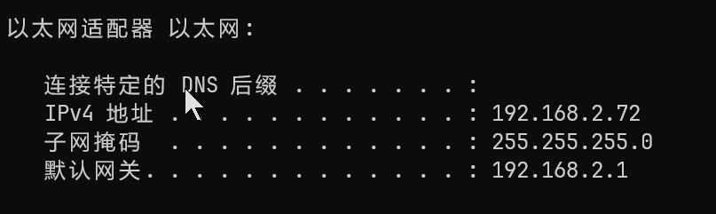
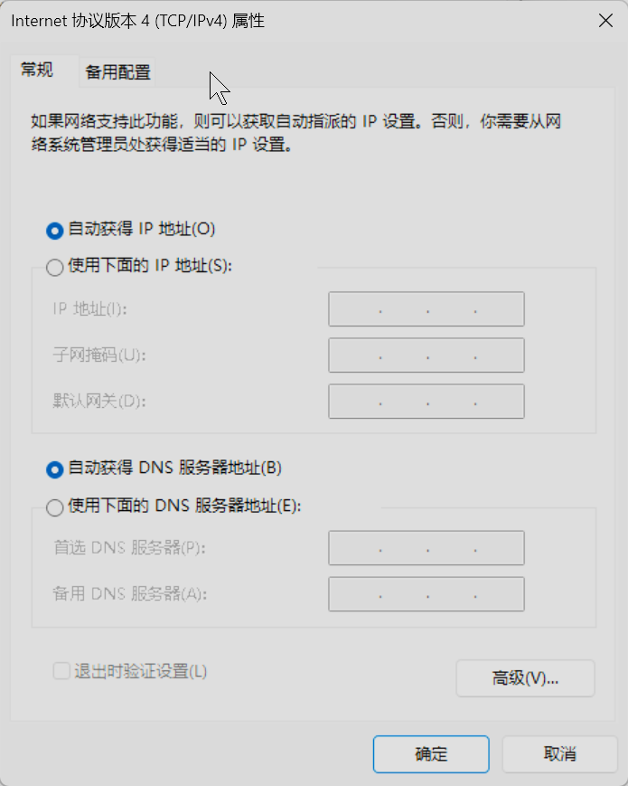
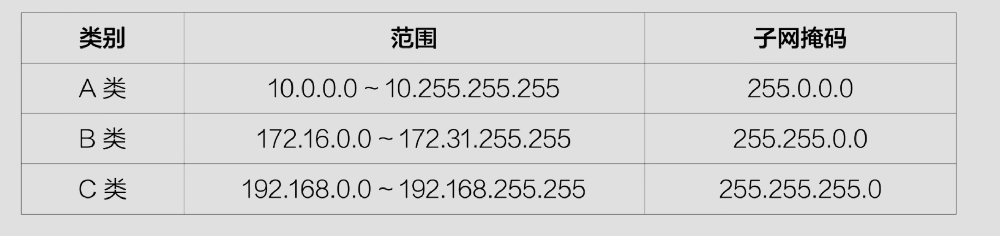

## 简介
网络层主要的作用是***将数据传输到目标地址**
目标地址可以是多个网络通过路由器连接而成的某个地址
该层负责**寻址**和**路由选择**

## 无连接服务
### 定义
每个数据包都是独立的，彼此之间没有任何关联。每个数据包携带了足够的信息，以便能够独立地从源地址传输到目的地址。事先没有建立连接，也不需要维护连接状态。在这样的环境中，数据包通常被称为数据报，这种网络通常被称为数据报网络

### 特点
无需建立连接：发送方和接收方之间不需要建立连接，数据包可以直接发送
每个数据包独立：每个数据爆都有完整的目的地址和路由信息，发送和接收的数据包之间没有任何关联
不保证可靠性：由于每个数据爆是独立的，网络层不保证数据包的可靠传输，数据包可能丢失、乱序或者重复

适用场景：适用于那些对实时性要求较高且可以容忍丢包的应用，如视频会议、实时游戏等

## 有连接服务
### 定义
发送方和接收方在数据传输之前需要通过网络建立一条虚拟的路径，所有数据包通过这条虚电路进行传输。虚电路在通信过程中始终存在，直到通信结束，这种网络称为虚电路网络

### 特点
建立连接：发送方和接收方在数据传输前必须进行连接建立，通过建立虚拟电路来保证数据能够按照特定的顺序到达接收方

可靠传输：在虚电路网络中，数据包的顺序和完整性都能得到保证，网络层会对数据包进行确认和重传

固定路径：所有的数据包都会沿着同一路径传输，这样便于提供高效的流量控制和错误检测

适用场景：适用于可靠性高、数据顺序需要保证的应用，如文件传输、电子邮件等

## 路由与转发
### 路由
指的是在网络层选择数据包从源到目的地的最佳路径的过程。路由设计到路由表的维护和更新，通常由路由协议动态计算

### 转发
是指在路由选择已经完成之后，设备将数据包从一个接口转发到另一个接口的过程。转发的速度要求非常高，因为它直接影响到数据包的传输效率

### 跳帧算法
跳帧算法是数据包从源节点传送到目的节点的过程中，每一跳由各个路由器决定下一跳路由器的转发行为。这种转发行为基于路由表中的信息，每个路由器仅根据目标地址和自己的路由表做出转发决策。它不需要全局网络信息，只需要局部的信息

## 路由算法

### 静态路由算法
#### 定义
静态路由是由网络管理员手动配置的固定路由。路由器的路由表不会根据网络状态的变化而调整，需要手动修改配置

#### 优点
简单：配置容易，适用于小型、简单的网络
控制性强：管理员可以精确控制数据包的路由路径

#### 缺点
不灵活：如果网络拓扑发生变化，必须手动配置
扩展性差：随着网络规模的增大，静态路由配置变得难以维护
对网络故障的应对能力差：如果某条路由失效，管理员必须手动修改路由表

### 动态路由算法
####  定义
动态路由是通过路由协议自动计算并更新路由表的方式。路由器通过与其它路由器交换信息来学习和选择最佳路径，动态调整路由

#### 优点
自动化：动态路由协议能够根据网络拓扑变化自动调整路由，减少人工干预
适应性强：适合中大型网络，能够根据网络状态变化调整路由
故障恢复能力强：当某条路发生故障时，路由协议能够快速计算出新的路径

#### 缺点
配置复杂：需要配置和管理路由器协议，可能涉及较复杂的路由策略

网络负载：动态路由协议会定期交换路由信息，这可能增加网络负载

可能会发生路由环路等问题，需要谨慎配置

#### 距离向量路由算法
##### 简介
每个路由器节点维护一个路由表，路由表中有到达其它路由器的最短路径以及到达那里使用的链路。通过定期与邻居交换路由表信息，更新自己的路由信息，最终每台路由器都了解到达目的地的最佳链路

##### 工作过程
- 初始化：每个路由器只知道直连网络的距离为1，其它都为“不可达”
- 周期性广播：定期将自己的路由表发送给所有邻居
- 路由表更新：接收到邻居的路由信息之后，更新自己的路由表
- 收敛：经过若干轮交换，最终每个路由器都知道到达所有目标的最短路径

#### 链路状态路由算法
##### 简介
每个路由通过“广播”与自己邻居的链路状态（如带宽、延迟）给全网
所有路由器最终都构建出相同的网络拓扑图
每个路由器用Dijkstra算法的最短路径->路由表

##### 工作流程

- **发现邻居**
  - 路由器通过Hello等机制发现与自己直接相连的其他路由器，并建立邻接关系

- **确定链路状态和开销**
  - 路由器获取各接口的链路状态，并根据带宽、时延或管理员配置等因素确定链路开销

- **生成链路状态分组**
  - 每台路由器生成自己的链路状态分组（`LSP`），其中通常包含路由器标识、邻居信息、链路开销、序列号和生存时间等内容

- **可靠泛洪链路状态分组**
  - 路由器将新生成的链路状态分组发送给所有邻居
  - 路由器收到更新的链路状态分组后，先将其保存到链路状态数据库，再转发给除接收方向之外的其他邻居
  - 路由器通过序列号判断分组的新旧，丢弃重复或过期的分组；生存时间用于清除失效信息
  - 这里的序列号属于路由器生成的链路状态分组，不是普通主机发送的数据报

- **建立链路状态数据库**
  - 泛洪过程收敛后，同一区域内的路由器通常拥有一致的链路状态数据库，并据此构建网络拓扑图

- **运行Dijkstra算法**
  - 每台路由器以自己为根节点，在本地运行Dijkstra算法，计算到各个目的网络的最短路径，并生成一棵最短路径树
  - 路由器根据计算结果确定到达各目的网络的下一跳、出接口和路径开销，再将相应信息写入路由表

- **响应网络拓扑变化**
  - 当链路状态发生变化时，相关路由器会生成新的链路状态分组并触发泛洪
  - 其他路由器更新链路状态数据库后，重新运行Dijkstra算法并更新路由表

- **算法特点**
  - 与距离向量算法相比，链路状态算法需要保存较完整的拓扑信息，因此会消耗更多内存和计算资源
  - 链路状态算法通常收敛得更快、更可预测，但仍然存在收敛时间，也可能在拓扑变化期间出现短暂的路由不一致
## IP数据报
### 格式
IP数据报包含首部和数据部分

上图展示了IP数据报的基本格式，下面我们来详细分析一下首部的数据组成，下图所示是首部的详细数据格式，我们在这里主要分析一下前20个字节的内容。如图所示横向的一行是`32bit`，每`8bit`是一个字节，一行也就代表4个字节。我们将首部拆分为主要的5行，刚好加起来就是20个字节


#### 版本号
版本号一共有`4bit`，它规定了数据报的`IP`协议版本，通过版本号，路由器能确定如何解释`IP`数据报的剩余部分

#### 首部长度
表示`IP`数据报首部长度（以4字节为单位）。该字段取值范围5~15(0101~1111)，大多数`IP`数据报不包含选项，所以一般`IP`数据报首部是20字节

#### 数据报长度
整个`IP`数据报（头部+数据）的长度，单位为字节。`IP`数据报理论最大长度是65535字节，但很少有超过1500字节的

#### 标识
唯一标识一个原始数据报，用于分片与重组，当一个大的数据报被分片后，各分片都带相同的标识值，一边目的端正确重组

#### 标志
- 第一位：保留位，必须为0
- 第二位：`DF`（不分片），置1为不分片
- 第三位：`MF`（后续还有分片），除最火一片外的所有分片，`MF`=1
- 最后一片`MF`=0

#### 片偏移量
当前分片在原始数据报中的位置，单位为8字节，重组时，目的端根据偏移地址把各片按正确顺序拼回原始数据

#### 生存时间
用于限制数据报生存时间的计数器，最初是以秒计数，最大生存时间为255s，现在是跳计数器，每经过一个路由器，计数器就减1，当减到0时，数据报被丢弃。这样做的意义在于防止循环转发导致数据报在网络中**无限存活**

#### 首部校验和
用来检验数据报的首部，不包括数据部分，接收端验证头部在传输过程中是否出错，若不匹配则丢弃数据报

## IP地址
`IP`地址是网络中每台设备的唯一标识符，类似于一个门牌号，它由32位二进制数组成，网络中每一台主机和路由器都有一个`IP`地址，一个`IP`地址并不是指向一台主机，而是一个网络接口

绝大多数主机都在一个网络中，所以只有一个`IP`地址，而多个路由器有多个接口，所以有多个`IP`地址

### IP地址分类


#### A类地址
- 网络号位数：8
- 主机号位数：24
- 网络号范围：0000 0001 ~ 0111 1110(1~126)
- 网络号：0000 0000 表示网络地址、本机网络或默认路由 0111 1111 特殊用途
- 网络号数量：2^7 - 2
- 单个网络最大主机数：2^24 - 2(去除全0和全1)


#### B类地址
- 网络号位数：16
- 主机号位数：16
- 网络号范围：1000 0000 0000 0001 ~ 1011 1111 1111 1111（`128.1.x.x` ~ `191.255.x.x`)
- 网络号：1000 0000 0000 0000 (128.0)
- 网络号数量：2^14 - 1
- 单个网络最大主机数：2 ^ 16 - 2(去除全0和全1)


#### C类地址
- 网络号位数：24
- 主机号位数：8
- 网络号范围：1100 0000 0000 0000 0000 0001 ~ 1101 1111 1111 1111 1111 1111（`192.0.1 ~ 223.255.255`）
- 网络号：1100 0000 0000 0000 0000 （`192.0`）早期/考试不可分配
- 网络号数量：2^21 - 1
- 单个网络最大主机数： 2^8 - 2(去除全0和全1)


#### 特殊IP地址
- 在本地网络中表示网络地址、本机地址，在路由表中表示默认路由(`0.0.0.0`)
- 通常在`LAN`中进行广播，使用该地址表示网络中的所有主机(`255.255.255.255`)
- 在发送方不知道主机号的情况下，用于本地软件回环测试，称为回环地址(`127.x.x.x`)

#### 私有地址
有一部分地址保留用于内部网络，称为私有地址。这部分地址不会被公共互联网分配，不会与公共地址重复。这些地址无法在公共互联网使用，因为路由器不对目标地址是私有地址的分组进行转发


## 子网划分
### 简介
将一个地址块划分成几部分，将一个大的网络分割成多个小的子网，供多个内部网络使用，但对于外部世界仍然像单个网络一样，这样可以更好的管理和利用地址空间，避免浪费

通过分割子网，可以限制广播域的范围，减少网络中的广播流量，提升效率
通过将不同的部门或区域划分到不同的子网，可以更好的控制流量，减少潜在的安全风险


## CIDR
翻译成中文就是无分类域间路由选择
`CIDR`是一种新的IP地址划分方法，是一种更灵活的`IP`地址分配法，它打破了传统的`A`、`B`、`C`类`IP`地址的限制，`CIDR`使用一个**斜杠跟网络前缀长度**来表示IP地址和网络的关系


## 子网掩码
### 常见的3类IP地址子网掩码
网络中的主机被分配IP地址的同时，还会制定子网掩码
通过将IP地址和子网掩码两者进行**按位与**操作，可以得到IP地址所属的网络地址（网络号）


### CIDR无分类编址子网掩码
上图演示的是三类`IP`地址对应的子网掩码，除了常见的三类`IP`地址之外我们还会遇到现代`CIDR`无分类编址，该类型的子网掩码相对于前面三种更为直观，一般会直接写在`IP`地址后面

形如`192.24.12.0/22`，这就是一个`CIDR`无分类编址子网掩码，其子网掩码的位数为`22`位
## 判断路由能否匹配当前IP地址
在进行网络数据传送时当数据在面临多个路由器时应该如何选择下一条的路由和后续的路由地址？
对应的判断公式为：
```txt
目的IP & 该路由器的子网掩码 = 该路由的网络地址
```
如果计算出来的结果相等，这就说明这条路由能够匹配目的的`IP`

## 网络前缀
网络前缀是指IP地址前的若干位，由`/n`指定长度，用于路由匹配，例如：`192.168.1.130/26`，这表示前26位是网络前缀，后六位是主机部分。其中网络前缀是指前26位，网络地址是`192.168.1.128`，主机部分是后6位

在这里还有一个类似的概念需要辨析，那就是网络号，网络号指的是一个网络的编号或者标识。在`CIDR`中，网络号通常就是指网络前缀所标识的值，所以在很多情况下这两个概念会被混用。但是网络前缀还强调了长度，例如
```txt
192.168.1.0/24
192.168.1.0/25
```
虽然前面的十进制数相同，但是前缀长度不同，表示的网络范围也不同
## 路由选择
路由选择是指主机或者路由器根据数据报的IP地址，从路由表中选择一条合适的路径，并确定下一跳的路由器和数据报发送接口，它解决的问题是：
当目的主机不在当前网络中时，数据接下来应该交给谁

一台路由器通常只决定”下一跳“，不会一次规划数据报经过的全部路由器


## 路由聚合
### 简介
路由聚合也叫路由汇总，是指：
将多个连续、具有相同高位前缀的小网络，合并成一个更大范围的`CIDR`网络，并用一条汇总路由表示

例如下面四条路由：
```txt
192.24.12.0/24
192.24.13.0/24
192.24.14.0/24
192.24.15.0/24
```
可以聚合成`192.24.12.0/22`
于是子路由不必分别保存或通告四条路由，只需要使用一条汇总路由

### 原理
路由聚合的核心是：找出多个网络地址在二进制形势下共同的连续前缀
将四个网络地址的第三个字节转换为二进制：
```txt
12 = 00001100
13 = 00001101
14 = 00001110
15 = 00001111
```
排列在一起：
```txt
192.24.00001100.00000000
192.24.00001101.00000000
192.24.00001110.00000000
192.24.00001111.00000000
       └──────┘
       公共前缀
```
第三个字节中前6位相同：
`0000 11`
前两个字节已有16位相同，所以共同前缀长度为：22位。将公共前缀之后的位全部置零，得到：
`192.24.12.0/22`

### 特性
`CIDR`往往更适合路由聚合，这是因为`CIDR`可以明确携带的前缀长度，因此路由器能够更准确的知道聚合地址块的范围

## 最长匹配前缀
### 简介
最长路由匹配前缀是路由器查询路由表时使用的基本规则：
如果一个目的`IP`地址同时匹配多条路由，就选网络前缀最长，地址范围最具体的那一条，例如：
```txt
/24 的前缀比 /22长
/22 的前缀比 /16长
/16 的前缀比 /0长
```
因此当出现多条路由同时匹配路径时：
```txt
/24 优先于 /22
/22 优先于 /16
/16 优先于 /0
```

### 示例
假设路由表中同时有：
```txt
192.24.12.0/22
192.24.15.0/24
0.0.0.0/0
```
这几个网络的范围是：

| 路由               | 表示范围                          |
| ---------------- | ----------------------------- |
| `192.24.12.0/22` | `192.24.12.0`~`192.24.15.255` |
| `192.24.15.0/24` | `192.24.15.0`~`192.24.15.255` |
| `0.0.0.0/0`      | 所有`IPv4`地址                    |
|                  |                               |
他们是一层套一层的关系
```txt
0.0.0.0/0
└── 192.24.12.0/22
    └── 192.24.15.0/24
```
所以目的地址`192.24.15.2`同时处于这三个范围内
为什么我们会优先选择24？
因为`/24`的范围更小，描述的更加精确
```txt
/0  ：中国
/22 ：某个城市
/24 ：某条街道
```
如果我们知道了一个人位于某条街道，那么我们就没必要到全中国的各个角落去找他

## ICMP
`ICMP`（`Internet Control Message Protocol`）全称为网络控制消息协议
当路由器正在处理一个数据报的过程中有意外事情发生时，可以通过`ICMP`向发送方报告

场景举例：
目标主机不可达：客户端访问服务器超时，却不知到底是目的主机挂掉还是路由断链？
`TTL`超时：数据包在网络环路中陷入“无限转发”？
路径探测：如何知道数据包经过了哪些中间路由？

### ping
发送`ECHO`到目的地址，判断目的地址的设备是否还活着，如果目的地址回复`ECHO REPLY`，说明还"活着"

### traceroute
给目标发送一系列的数据包，分别将`TTL`设置为1，2，3，这些数据包的`TTL`数值沿着路径在后续的路由器上到达0，这些路由器各自送回一个超时信息给主机，利用这种技巧，可以确定沿途路由器的`IP`地址

## DHCP
### 简介
`DHCP`(Dynamic Host Configuration Protocol)动态主机配置协议

`DHCP`让设备接入网络之后，自动获取通信所需的配置，它分配的不止是IP地址，还包括子网掩码、默认网关、DNS服务等，例如：
```txt
IP 地址：  192.168.1.10
子网掩码：255.255.255.0
默认网关：192.168.1.1
DNS：     192.168.1.1
```
这些内容如果想要查看的话也非常简单，如果你是`windows`操作系统的电脑那么可以打开终端，然后在终端中输入`ipconfig`命令，随后我们就能看到当前电脑的IP配置了


如果大家有过手动配置IP地址的经历那么对DHCP的功能应该就不会感到陌生，假设我们现在通过网线将电脑和其它联网设备进行连接，那么我们往往就需要为该设备手动配置对应的网络参数，配置界面如下

设想一下如果没有DHCP服务，那么每当有新的设备接入当前的网络时我们都需要为其手动配置对应的网络信息，这样不仅操作繁琐，还极容易引发IP地址重复冲突

### 工作流程
简单介绍了一下`DHCP`的功能和作用之后接下来让我们看看`DHCP`的工作流程，了解一下`DHCP`服务是如何为每一台接入网络的设备分配对应的网络信息的

#### discover
每当一台新的设备接入网络之后就会进行广播，查询当前网络中是否有`DHCP`服务，表明自己需要一个`IP`

#### offer
路由器内的DHCP服务接收到之后就会从预设的IP地址池中挑选一个空闲的IP地址，然后回应新设备的请求

#### Request
新设备在接收到`DHCP`的`IP`之后会再次进行广播，表明自己将会使用`DHCP`服务提供的私有`IP`地址

#### ACK
路由器或者`DHCP`服务将新设备的配置信息保存下来并完成最终确认，网卡会为该设备绑定对应`IP`
## 私有地址
### 简介
有一部分地址保留用于内部网络，称为私有地址，这部分地址不会被公共互联网分配，不会与公共地址重复，这些地址无法在公共互联网使用，因为路由器不对目标地址是私有的分组进行转发
对应的私有IP地址范围如下图所示


### 作用
私有IP地址主要解决的是`IPv4`地址枯竭的问题，`IPv4`地址总共只有42.9亿个。现在地球上的联网电子设备的数量早就超过了这个数目，如果按照早期的设想：为每一台联网的设备都分配一个独立的IP地址的话，那么这些IP地址早就耗尽了。因此人们想到了可以将部分`IP`地址进行复用，即私有IP地址，这些IP地址无法在公网使用。这打破了IP地址的唯一性，家用路由器的网段得以重复，同一套IP地址可以被复用亿万次。这就把数十亿设备对IP的需求直接消化在了本地的局域网内，不需要去消耗公网IP

## ARP协议
### 简介
`ARP`(`Address Resolution Protocol`)地址解析协议
背景：以太网中，网络层用`IP`地址找到主机，但链路需要`MAC`地址才能发送帧
作用：该协议是TCP/IP协议栈中用于实现网络层逻辑地址到数据链路层物理地址解析映射的和信心协议

### 协议工作流程
假设现在主机`A`需要向处在同一网段的主机`B`发送数据

1. 查询本地`ARP`缓存表
	主机A首先检索自己操作系统的`ARP`缓存，如果已经存在`192.168.1.20`对应的`MAC`地址，则直接使用并封装帧；如果没有命中那么发起`ARP`解析
2. 广播发送ARP请求
	- 主机A会发送一个`ARP`请求报文，内容为：谁的IP地址是`192.168.1.20`？请把你的`MAC`地址发送给`192.168.1.10`
	- 在二层以太网封装中，目的IP地址填为全网广播地址`FF:FF:FF:FF:FF:FF`
	- 局域网内同一广播域的所有主机与交换机端口都会收到对应请求
3. 各主机与过滤与目标主机匹配
	- 局域网内其它主机（如`192.168.1.30`）收到该帧之后解析`ARP`报文，发现目标`IP`地址不是自己，直接丢弃该数据
	- 主机B检测发现自己的IP就是目标IP，于是先将主机A的IP与MAC映射记录更新到本地的ARP缓存中
4. 单播发送ARP应答
	- 主机B组装应答报文：“我是`192.168.1.20`，我的`MAC`地址是`MAC_B`
	- 因为主机`B`已经明确知道主机`A`的`MAC`地址，因此`ARP`应答以单播的方式直接发回主机`A`
5. 主机A缓存并正式开始通信
	- 主机A收到应答后将`192.168.1.20`->`MAC_B`写入本机`ARP`缓存，并立刻将原本挂起的实际网络数据帧完成二层封装并发出

### 本质解析
看完了上面的内容不知道你有没有一种似曾相识的感觉，`ARP`底层的数据结构和之前学习过的哈希表很类似，`ARP`也是通过`IP`地址来获取对应的`MAC`地址，哈希表中也是通过键来寻找对应的值。其实你的猜想完全正确，操作系统底层就是通过一张哈希表（或查找表）来实现`ARP`的核心功能的，不过更准确的区分是：`ARP`是一个动态维护这张表的**协议机制**，而记录具体对应关系的数据实体叫`ARP`缓存表
这张表的内容会随着网络环境的变化进行实时更新
### 网关
网关(`Gateway`)是计算机网络中连接两个或多个不同网络、不同子网甚至不同协议体系的节点设备或逻辑实体
如果把局域网比作办公楼内部的房间，各个主机之间的通信就像是在走廊里串门，而网关就是这栋楼的门卫，所有想要离开本楼发往外部网络的数据都必须要经过网关的核验、转换与中继